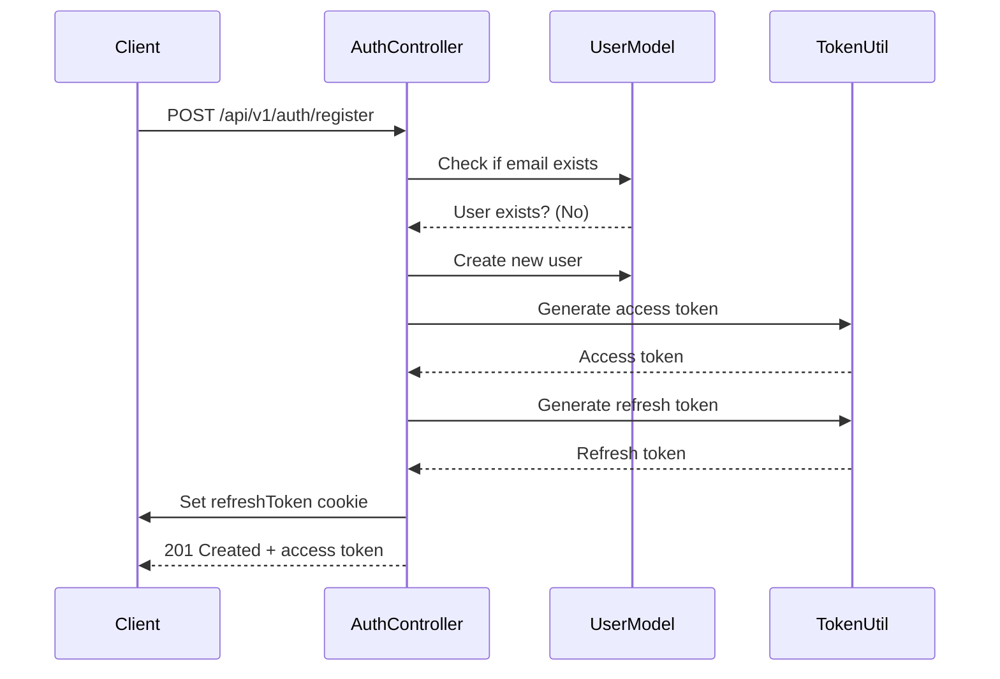
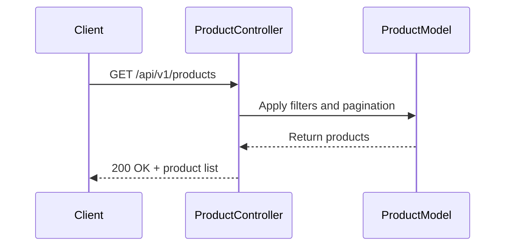
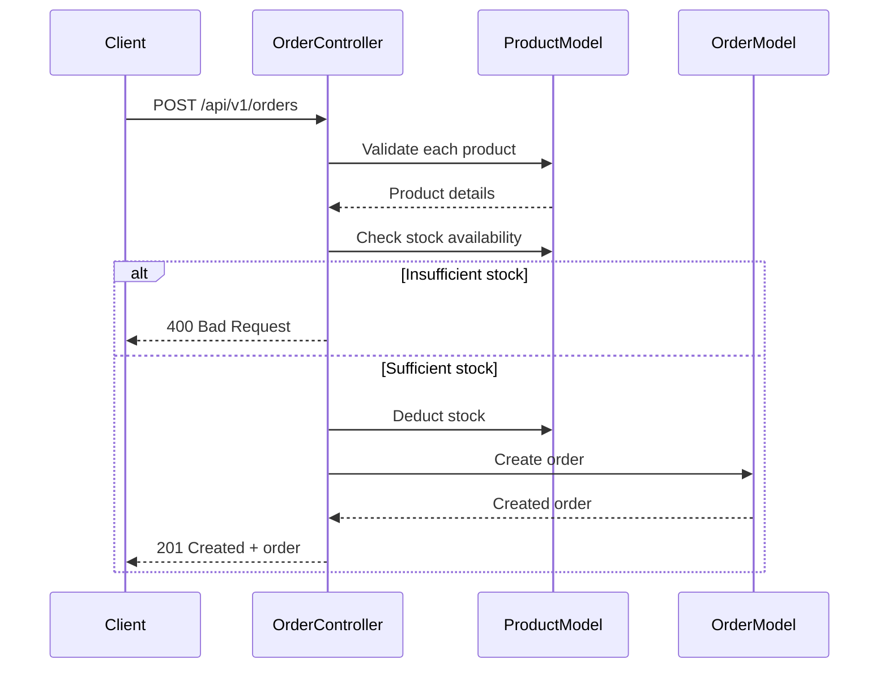

# API Reference

<cite>
**Referenced Files in This Document**   
- [Auth.routes.js](file://server/src/routes/Auth.routes.js)
- [Product.routes.js](file://server/src/routes/Product.routes.js)
- [Order.routes.js](file://server/src/routes/Order.routes.js)
- [Wishlist.routes.js](file://server/src/routes/Wishlist.routes.js)
- [User.routes.js](file://server/src/routes/User.routes.js)
- [Auth.controller.js](file://server/src/controllers/Auth.controller.js)
- [Product.controller.js](file://server/src/controllers/Product.controller.js)
- [Order.controller.js](file://server/src/controllers/Order.controller.js)
- [Wishlist.controller.js](file://server/src/controllers/Wishlist.controller.js)
- [Auth.middleware.js](file://server/src/middleware/Auth.middleware.js)
</cite>

## Table of Contents
1. [Introduction](#introduction)
2. [Authentication](#authentication)
3. [API Groups](#api-groups)
   - [Auth API](#auth-api)
   - [Product API](#product-api)
   - [Order API](#order-api)
   - [Wishlist API](#wishlist-api)
   - [User API](#user-api)
4. [Error Responses](#error-responses)
5. [Examples](#examples)
6. [Security and Validation](#security-and-validation)
7. [Sequence Diagrams](#sequence-diagrams)

## Introduction
This document provides comprehensive reference documentation for all RESTful endpoints in the VnV24 application. The API is organized into logical groups: Auth, Product, Order, Wishlist, and User. All endpoints follow consistent response formats and security practices, including JWT-based authentication and role-based access control.

## Authentication
The VnV24 API uses JWT tokens for authentication. Users must first register or log in to obtain an access token. The access token must be included in the `Authorization` header as a Bearer token for protected routes. Additionally, a refresh token is stored in an HTTP-only cookie for session persistence.

### Token Management
- **Access Token**: Sent in `Authorization: Bearer <token>` header
- **Refresh Token**: Stored in HTTP-only cookie (`refreshToken`)
- **Token Expiry**: Access tokens expire after 15 minutes; refresh tokens after 7 days
- **Token Refresh**: POST to `/api/v1/auth/refresh` to get a new access token

**Section sources**
- [Auth.controller.js](file://server/src/controllers/Auth.controller.js#L1-L66)
- [Auth.middleware.js](file://server/src/middleware/Auth.middleware.js#L1-L25)

## API Groups

### Auth API
Handles user registration, login, logout, and token refresh.

#### POST /api/v1/auth/register
Registers a new user.
- **Authentication**: None
- **Request Body**:
  ```json
  {
    "name": "string",
    "email": "string (valid email)",
    "password": "string (min 6 characters)"
  }
  ```
- **Response (201)**:
  ```json
  {
    "token": "string (JWT access token)",
    "user": {
      "id": "string",
      "name": "string",
      "email": "string"
    }
  }
  ```

#### POST /api/v1/auth/login
Authenticates a user and returns a JWT.
- **Authentication**: None
- **Request Body**:
  ```json
  {
    "email": "string",
    "password": "string"
  }
  ```
- **Response (200)**:
  ```json
  {
    "token": "string",
    "user": {
      "id": "string",
      "name": "string",
      "email": "string"
    }
  }
  ```

#### POST /api/v1/auth/refresh
Generates a new access token using the refresh token cookie.
- **Authentication**: Requires valid refresh token in cookie
- **Response (200)**:
  ```json
  {
    "token": "string (new access token)"
  }
  ```

#### POST /api/v1/auth/logout
Clears the refresh token cookie.
- **Authentication**: Bearer token required
- **Response (200)**:
  ```json
  {
    "message": "Logged out successfully"
  }
  ```

**Section sources**
- [Auth.routes.js](file://server/src/routes/Auth.routes.js#L1-L20)
- [Auth.controller.js](file://server/src/controllers/Auth.controller.js#L1-L66)

### Product API
Manages product catalog operations.

#### GET /api/v1/products
Retrieves a paginated list of products with optional filtering.
- **Authentication**: None
- **Query Parameters**:
  - `page`: integer (default: 1)
  - `limit`: integer (default: 10)
  - `category`: string
  - `price_min`: number
  - `price_max`: number
  - `sort`: string (field name)
- **Response (200)**:
  ```json
  {
    "success": true,
    "page": 1,
    "pages": 5,
    "total": 50,
    "data": [/* array of products */]
  }
  ```

#### GET /api/v1/products/:id
Retrieves a single product by ID.
- **Authentication**: None
- **Response (200)**:
  ```json
  {
    "success": true,
    "data": { /* product object */ }
  }
  ```

#### POST /api/v1/products
Creates a new product (admin only).
- **Authentication**: Bearer token + admin role
- **Request Body**:
  ```json
  {
    "name": "string",
    "description": "string",
    "price": "number",
    "images": ["string"],
    "category": "string",
    "fragranceNotes": ["string"],
    "stock": "number"
  }
  ```
- **Response (201)**:
  ```json
  {
    "success": true,
    "data": { /* created product */ }
  }
  ```

#### PUT /api/v1/products/:id
Updates a product (admin only).
- **Authentication**: Bearer token + admin role
- **Request Body**: Partial product object
- **Response (200)**:
  ```json
  {
    "success": true,
    "data": { /* updated product */ }
  }
  ```

#### DELETE /api/v1/products/:id
Deletes a product (admin only).
- **Authentication**: Bearer token + admin role
- **Response (200)**:
  ```json
  {
    "success": true,
    "message": "Product removed"
  }
  ```

**Section sources**
- [Product.routes.js](file://server/src/routes/Product.routes.js#L1-L23)
- [Product.controller.js](file://server/src/controllers/Product.controller.js#L1-L109)

### Order API
Handles order placement and management.

#### POST /api/v1/orders
Places a new order for the authenticated user.
- **Authentication**: Bearer token
- **Request Body**:
  ```json
  {
    "orderItems": [
      {
        "product": "string (product ID)",
        "qty": "number"
      }
    ],
    "shippingAddress": { /* address object */ },
    "billingAddress": { /* address object */ },
    "paymentMethod": "string"
  }
  ```
- **Validation**: Checks product availability and stock
- **Response (201)**:
  ```json
  {
    "success": true,
    "data": { /* created order */ }
  }
  ```

#### GET /api/v1/orders/myorders
Retrieves all orders for the authenticated user.
- **Authentication**: Bearer token
- **Response (200)**:
  ```json
  {
    "success": true,
    "data": [/* array of user's orders */]
  }
  ```

#### GET /api/v1/orders/:id
Retrieves a specific order by ID (user or admin).
- **Authentication**: Bearer token
- **Response (200)**:
  ```json
  {
    "success": true,
    "data": { /* order object with user populated */ }
  }
  ```

#### GET /api/v1/orders
Retrieves all orders (admin only).
- **Authentication**: Bearer token + admin role
- **Response (200)**:
  ```json
  {
    "success": true,
    "data": [/* array of all orders */]
  }
  ```

#### PUT /api/v1/orders/:id/status
Updates the status of an order (admin only).
- **Authentication**: Bearer token + admin role
- **Request Body**:
  ```json
  {
    "status": "string (e.g., 'processing', 'shipped', 'delivered')"
  }
  ```
- **Response (200)**:
  ```json
  {
    "success": true,
    "data": { /* updated order */ }
  }
  ```

**Section sources**
- [Order.routes.js](file://server/src/routes/Order.routes.js#L1-L22)
- [Order.controller.js](file://server/src/controllers/Order.controller.js#L1-L108)

### Wishlist API
Manages user wishlists.

#### GET /api/v1/wishlist
Retrieves the authenticated user's wishlist.
- **Authentication**: Bearer token
- **Response (200)**:
  ```json
  {
    "success": true,
    "data": {
      "products": [/* array of product objects */]
    }
  }
  ```

#### POST /api/v1/wishlist
Adds a product to the user's wishlist.
- **Authentication**: Bearer token
- **Request Body**:
  ```json
  {
    "productId": "string"
  }
  ```
- **Response (201)**:
  ```json
  {
    "success": true,
    "data": { /* updated wishlist */ }
  }
  ```

#### DELETE /api/v1/wishlist/:productId
Removes a product from the user's wishlist.
- **Authentication**: Bearer token
- **Response (200)**:
  ```json
  {
    "success": true,
    "data": { /* updated wishlist */ }
  }
  ```

**Section sources**
- [Wishlist.routes.js](file://server/src/routes/Wishlist.routes.js#L1-L15)
- [Wishlist.controller.js](file://server/src/controllers/Wishlist.controller.js#L1-L57)

### User API
Retrieves user profile information.

#### GET /api/v1/user/me
Retrieves the authenticated user's profile.
- **Authentication**: Bearer token
- **Response (200)**:
  ```json
  {
    "id": "string",
    "name": "string",
    "email": "string",
    "role": "string"
  }
  ```

**Section sources**
- [User.routes.js](file://server/src/routes/User.routes.js#L1-L15)

## Error Responses
All error responses follow a consistent format:
```json
{
  "message": "Descriptive error message"
}
```

| Status Code | Description |
|-----------|-------------|
| 400 | Bad Request - Invalid input data |
| 401 | Unauthorized - Missing or invalid token |
| 403 | Forbidden - Insufficient permissions |
| 404 | Not Found - Resource not found |
| 500 | Internal Server Error |

**Section sources**
- [Auth.controller.js](file://server/src/controllers/Auth.controller.js#L1-L66)
- [Product.controller.js](file://server/src/controllers/Product.controller.js#L1-L109)
- [Order.controller.js](file://server/src/controllers/Order.controller.js#L1-L108)

## Examples

### Register User (curl)
```bash
curl -X POST http://localhost:5000/api/v1/auth/register \
  -H "Content-Type: application/json" \
  -d '{"name":"John Doe","email":"john@example.com","password":"password123"}'
```

### Login (JavaScript)
```javascript
fetch('/api/v1/auth/login', {
  method: 'POST',
  headers: { 'Content-Type': 'application/json' },
  body: JSON.stringify({
    email: 'john@example.com',
    password: 'password123'
  })
})
.then(response => response.json())
.then(data => {
  localStorage.setItem('token', data.token);
});
```

### Get Products with Filter
```bash
curl "http://localhost:5000/api/v1/products?category=perfume&price_min=50&price_max=100"
```

### Place Order
```javascript
fetch('/api/v1/orders', {
  method: 'POST',
  headers: {
    'Content-Type': 'application/json',
    'Authorization': 'Bearer ' + token
  },
  body: JSON.stringify({
    orderItems: [{ product: '60d21b6a9b1e8e4b5c8d9e0a', qty: 1 }],
    shippingAddress: { /* address */ },
    billingAddress: { /* address */ },
    paymentMethod: 'credit_card'
  })
});
```

**Section sources**
- [Auth.controller.js](file://server/src/controllers/Auth.controller.js#L1-L66)
- [Product.controller.js](file://server/src/controllers/Product.controller.js#L1-L109)
- [Order.controller.js](file://server/src/controllers/Order.controller.js#L1-L108)

## Security and Validation
The API implements several security and validation measures:

### Authentication Flow
- JWT tokens are used for stateless authentication
- Passwords are hashed using bcrypt
- Refresh tokens are stored in HTTP-only cookies to prevent XSS attacks
- Admin routes are protected by role-based middleware

### Data Validation
- Email format validation during registration
- Password strength requirements (min 6 characters)
- Stock availability checks during order placement
- Input sanitization to prevent injection attacks

### Rate Limiting
The API should implement rate limiting in production (not shown in current code):
- 100 requests per hour per IP for public endpoints
- 1000 requests per hour per user for authenticated endpoints

### API Versioning
The API uses URL-based versioning:
- Base URL: `/api/v1/`
- Future versions will be `/api/v2/`, etc.

**Section sources**
- [Auth.middleware.js](file://server/src/middleware/Auth.middleware.js#L1-L25)
- [Auth.controller.js](file://server/src/controllers/Auth.controller.js#L1-L66)

## Sequence Diagrams

### User Registration Flow


**Diagram sources**
- [Auth.controller.js](file://server/src/controllers/Auth.controller.js#L1-L66)
- [Auth.routes.js](file://server/src/routes/Auth.routes.js#L1-L20)

### Product Listing Flow


**Diagram sources**
- [Product.controller.js](file://server/src/controllers/Product.controller.js#L1-L109)
- [Product.routes.js](file://server/src/routes/Product.routes.js#L1-L23)

### Order Placement Flow


**Diagram sources**
- [Order.controller.js](file://server/src/controllers/Order.controller.js#L1-L108)
- [Order.routes.js](file://server/src/routes/Order.routes.js#L1-L22)