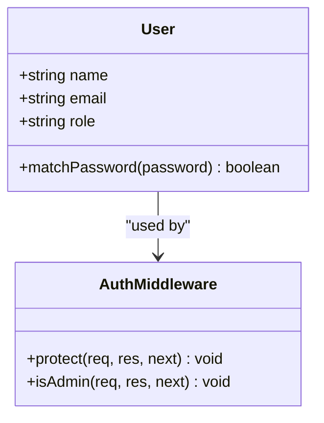
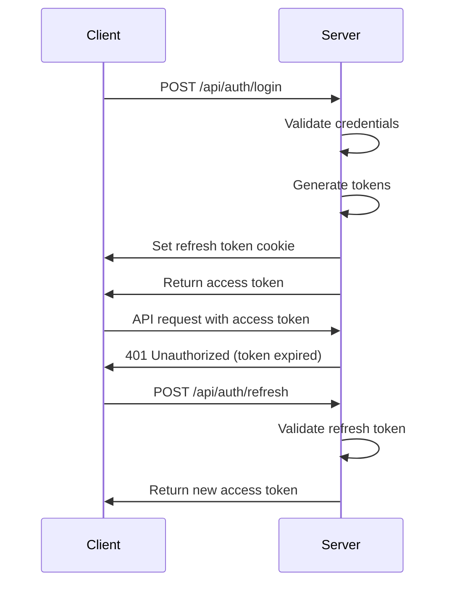
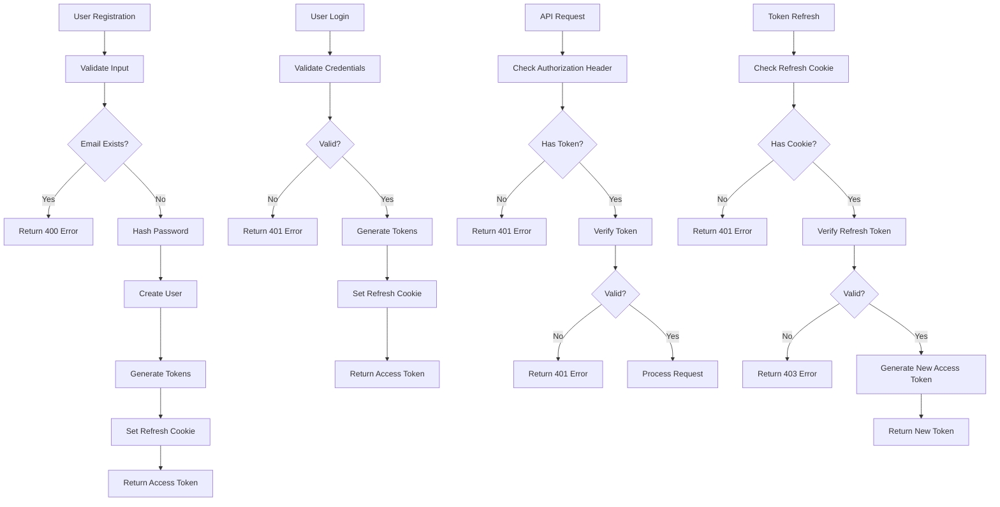

# Authentication API

<cite>
**Referenced Files in This Document**   
- [Auth.controller.js](file://server/src/controllers/Auth.controller.js)
- [Auth.middleware.js](file://server/src/middleware/Auth.middleware.js)
- [Auth.routes.js](file://server/src/routes/Auth.routes.js)
- [User.model.js](file://server/src/models/User.model.js)
- [token.js](file://server/src/utils/token.js)
</cite>

## Table of Contents
1. [Introduction](#introduction)
2. [Authentication Endpoints](#authentication-endpoints)
3. [Request and Response Formats](#request-and-response-formats)
4. [Role-Based Access Control](#role-based-access-control)
5. [Error Responses](#error-responses)
6. [Token Refresh Mechanism](#token-refresh-mechanism)
7. [Security Considerations](#security-considerations)
8. [Code Examples](#code-examples)
9. [Authentication Flow](#authentication-flow)

## Introduction

The Authentication API provides secure user authentication and authorization functionality for the VnV24 application. It implements JWT-based authentication with refresh tokens stored in HTTP-only cookies for enhanced security. The system supports user registration, login, token refresh, and logout operations, with role-based access control for admin and customer roles. Passwords are securely hashed using bcryptjs, and access to protected routes is enforced through middleware validation of JWT tokens in the Authorization header.

**Section sources**
- [Auth.controller.js](file://server/src/controllers/Auth.controller.js)
- [Auth.middleware.js](file://server/src/middleware/Auth.middleware.js)
- [Auth.routes.js](file://server/src/routes/Auth.routes.js)
- [User.model.js](file://server/src/models/User.model.js)
- [token.js](file://server/src/utils/token.js)

## Authentication Endpoints

The Authentication API exposes the following endpoints for user authentication:

| HTTP Method | Endpoint | Description | Authentication Required |
|-------------|---------|-------------|-------------------------|
| POST | /api/auth/register | Register a new user with name, email, and password | No |
| POST | /api/auth/login | Authenticate user with email and password | No |
| POST | /api/auth/refresh | Generate new access token using refresh token cookie | No (uses cookie) |
| POST | /api/auth/logout | Remove refresh token cookie and end session | Yes |

The endpoints are defined in the Auth.routes.js file and implemented in the Auth.controller.js file. The register and login endpoints create JWT access tokens and set refresh tokens in HTTP-only cookies. The refresh endpoint validates the refresh token from cookies and issues a new access token. The logout endpoint clears the refresh token cookie.

```mermaid
graph TB
A[Client] --> B[/api/auth/register]
A --> C[/api/auth/login]
A --> D[/api/auth/refresh]
A --> E[/api/auth/logout]
B --> F[Auth.controller.js]
C --> F
D --> F
E --> F
F --> G[User.model.js]
F --> H[token.js]
```

**Diagram sources**
- [Auth.routes.js](file://server/src/routes/Auth.routes.js)
- [Auth.controller.js](file://server/src/controllers/Auth.controller.js)
- [User.model.js](file://server/src/models/User.model.js)
- [token.js](file://server/src/utils/token.js)

**Section sources**
- [Auth.routes.js](file://server/src/routes/Auth.routes.js#L1-L20)
- [Auth.controller.js](file://server/src/controllers/Auth.controller.js#L1-L66)

## Request and Response Formats

### Registration Request
**URL**: POST /api/auth/register
**Headers**: Content-Type: application/json
**Request Body**:
```json
{
  "name": "string",
  "email": "string",
  "password": "string"
}
```

### Registration Response (Success)
**Status**: 201 Created
```json
{
  "token": "jwt_access_token",
  "user": {
    "id": "user_id",
    "name": "string",
    "email": "string"
  }
}
```

### Login Request
**URL**: POST /api/auth/login
**Headers**: Content-Type: application/json
**Request Body**:
```json
{
  "email": "string",
  "password": "string"
}
```

### Login Response (Success)
**Status**: 200 OK
```json
{
  "token": "jwt_access_token",
  "user": {
    "id": "user_id",
    "name": "string",
    "email": "string"
  }
}
```

### Protected Route Access
For accessing protected routes, include the JWT access token in the Authorization header:
```
Authorization: Bearer <access_token>
```

**Section sources**
- [Auth.controller.js](file://server/src/controllers/Auth.controller.js#L12-L42)
- [User.model.js](file://server/src/models/User.model.js#L14-L16)

## Role-Based Access Control

The system implements role-based access control with two roles: "customer" (default) and "admin". The User model includes a role field with these enum values. The Auth.middleware.js file contains the isAdmin middleware function that checks if the authenticated user has admin privileges.

When a request is made to an admin-protected route, the isAdmin middleware verifies that req.user.role equals "admin". If the user does not have admin privileges, a 403 Forbidden response is returned with the message "Access denied: Admin only".



**Diagram sources**
- [User.model.js](file://server/src/models/User.model.js#L14-L16)
- [Auth.middleware.js](file://server/src/middleware/Auth.middleware.js#L3-L25)

**Section sources**
- [User.model.js](file://server/src/models/User.model.js#L14-L16)
- [Auth.middleware.js](file://server/src/middleware/Auth.middleware.js#L20-L25)

## Error Responses

The Authentication API returns standardized error responses with appropriate HTTP status codes:

| Status Code | Error Message | Scenario |
|------------|---------------|---------|
| 400 | "User already exists" | Email already registered during registration |
| 401 | "Invalid credentials" | Incorrect email or password during login |
| 401 | "Not authorized" | Missing or invalid JWT token in Authorization header |
| 401 | "No refresh token" | Missing refresh token cookie during refresh |
| 403 | "Invalid or expired token" | Expired or malformed JWT token |
| 403 | "Access denied: Admin only" | Customer attempting to access admin-only route |
| 409 | "User already exists" | Duplicate email during registration |

Error responses follow the format:
```json
{
  "message": "error_description"
}
```

**Section sources**
- [Auth.controller.js](file://server/src/controllers/Auth.controller.js#L18-L19)
- [Auth.controller.js](file://server/src/controllers/Auth.controller.js#L33-L34)
- [Auth.middleware.js](file://server/src/middleware/Auth.middleware.js#L15-L16)

## Token Refresh Mechanism

The authentication system implements a token refresh mechanism to maintain user sessions without requiring frequent logins. When a user successfully registers or logs in, two tokens are generated:

1. **Access Token**: Short-lived JWT (15 minutes) sent in the response for immediate use
2. **Refresh Token**: Long-lived JWT (7 days) stored in an HTTP-only cookie

When the access token expires, the client can call the /api/auth/refresh endpoint. This endpoint reads the refresh token from the HTTP-only cookie, validates it, and returns a new access token if valid. This approach enhances security by keeping refresh tokens inaccessible to JavaScript (due to HTTP-only flag) while allowing access tokens to be used in the Authorization header.

The refresh token validation occurs in the refreshToken controller method, which uses jwt.verify with the JWT_REFRESH_SECRET environment variable.



**Diagram sources**
- [Auth.controller.js](file://server/src/controllers/Auth.controller.js#L46-L57)
- [token.js](file://server/src/utils/token.js#L6-L8)

**Section sources**
- [Auth.controller.js](file://server/src/controllers/Auth.controller.js#L46-L57)
- [token.js](file://server/src/utils/token.js#L6-L8)

## Security Considerations

The authentication system implements several security measures:

1. **Password Hashing**: Passwords are hashed using bcryptjs with a salt round of 10 before storage in the database. This occurs in the pre-save hook in the User model.

2. **HTTP-only Cookies**: Refresh tokens are stored in HTTP-only cookies to prevent access via JavaScript, mitigating XSS attacks.

3. **Secure Cookies**: In production, cookies are marked as secure, ensuring they are only sent over HTTPS connections.

4. **Token Expiration**: Access tokens expire after 15 minutes, limiting the window of opportunity for token theft.

5. **Environment Variables**: JWT secrets are stored in environment variables (JWT_SECRET and JWT_REFRESH_SECRET) rather than in code.

6. **Input Validation**: Email uniqueness is enforced at the database level, and basic input validation occurs in the controllers.

The password hashing implementation uses a pre-save middleware in the User model that automatically hashes passwords when they are modified.

**Section sources**
- [User.model.js](file://server/src/models/User.model.js#L48-L52)
- [Auth.controller.js](file://server/src/controllers/Auth.controller.js#L10-L11)
- [token.js](file://server/src/utils/token.js#L2-L8)

## Code Examples

### User Registration (curl)
```bash
curl -X POST https://api.vnv24.com/api/auth/register \
  -H "Content-Type: application/json" \
  -d '{
    "name": "John Doe",
    "email": "john@example.com",
    "password": "securepassword123"
  }'
```

### User Registration (JavaScript)
```javascript
fetch('/api/auth/register', {
  method: 'POST',
  headers: {
    'Content-Type': 'application/json',
  },
  body: JSON.stringify({
    name: 'John Doe',
    name: 'John Doe',
    email: 'john@example.com',
    password: 'securepassword123'
  })
})
.then(response => response.json())
.then(data => {
  // Store access token
  localStorage.setItem('token', data.token);
});
```

### User Login (curl)
```bash
curl -X POST https://api.vnv24.com/api/auth/login \
  -H "Content-Type: application/json" \
  -d '{
    "email": "john@example.com",
    "password": "securepassword123"
  }'
```

### Accessing Protected Route (curl)
```bash
curl -X GET https://api.vnv24.com/api/protected \
  -H "Authorization: Bearer <access_token>"
```

**Section sources**
- [Auth.controller.js](file://server/src/controllers/Auth.controller.js#L12-L42)

## Authentication Flow

The complete authentication flow from registration to accessing protected resources:



**Diagram sources**
- [Auth.controller.js](file://server/src/controllers/Auth.controller.js)
- [Auth.middleware.js](file://server/src/middleware/Auth.middleware.js)
- [User.model.js](file://server/src/models/User.model.js)

**Section sources**
- [Auth.controller.js](file://server/src/controllers/Auth.controller.js)
- [Auth.middleware.js](file://server/src/middleware/Auth.middleware.js)
- [User.model.js](file://server/src/models/User.model.js)