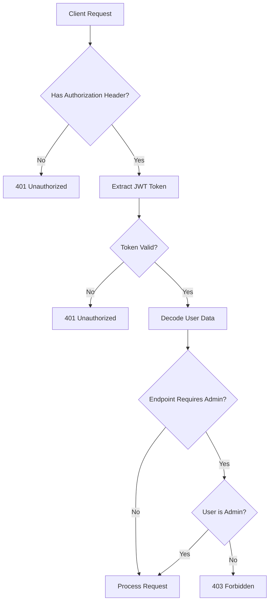
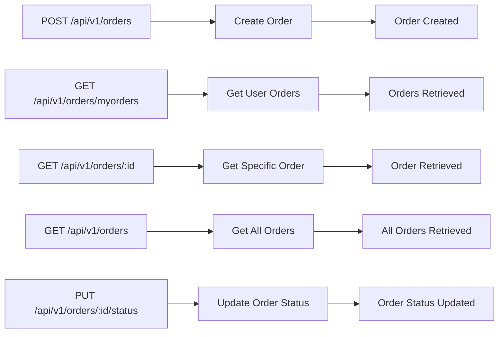
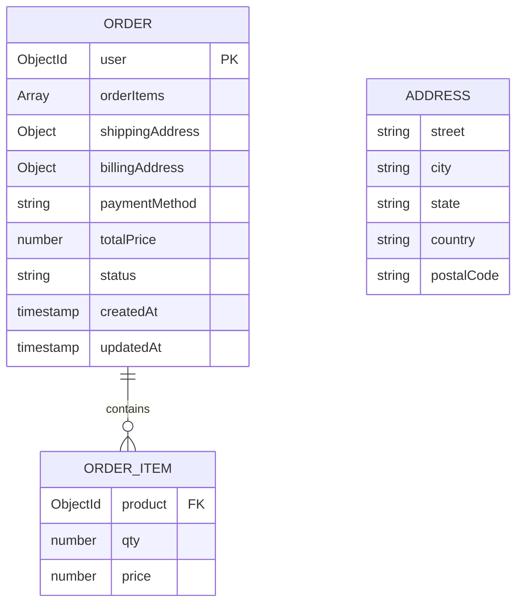
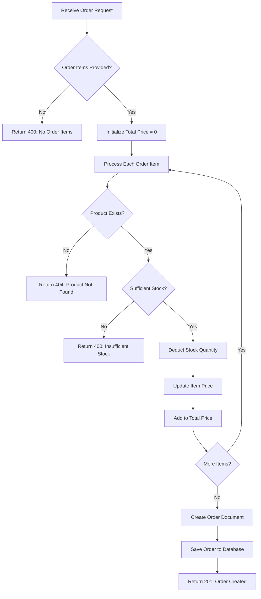
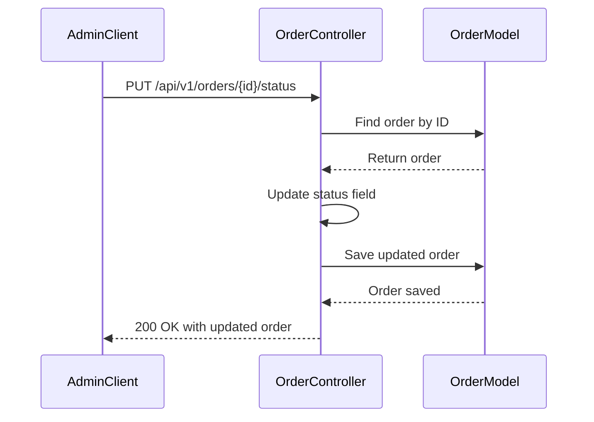

# Order API

<cite>
**Referenced Files in This Document**   
- [Order.controller.js](file://server/src/controllers/Order.controller.js)
- [Order.routes.js](file://server/src/routes/Order.routes.js)
- [Order.model.js](file://server/src/models/Order.model.js)
- [Auth.middleware.js](file://server/src/middleware/Auth.middleware.js)
- [Product.model.js](file://server/src/models/Product.model.js)
</cite>

## Table of Contents
1. [Introduction](#introduction)
2. [Authentication and Authorization](#authentication-and-authorization)
3. [Order Endpoints](#order-endpoints)
4. [Request and Response Formats](#request-and-response-formats)
5. [Order Creation Flow](#order-creation-flow)
6. [Error Handling](#error-handling)
7. [Code Examples](#code-examples)
8. [Sequence Diagrams](#sequence-diagrams)

## Introduction

The Order API provides comprehensive functionality for managing customer orders within the VnV24 application. This API enables users to create new orders, retrieve order history, and allows administrators to manage all orders across the system. The API implements robust inventory management by validating stock availability during order creation and automatically deducting stock quantities upon successful order placement.

The Order API follows RESTful principles with clear endpoint patterns and standardized response formats. All endpoints require authentication via JWT tokens, with role-based access control ensuring that customers can only access their own orders while administrators have full visibility across the system.

**Section sources**
- [Order.controller.js](file://server/src/controllers/Order.controller.js#L1-L108)
- [Order.routes.js](file://server/src/routes/Order.routes.js#L1-L22)

## Authentication and Authorization

The Order API requires authentication for all endpoints using JWT (JSON Web Tokens). Clients must include a valid JWT token in the Authorization header using the Bearer scheme.

```http
Authorization: Bearer <your-jwt-token>
```

The API implements role-based access control through middleware functions that verify user roles:

- **protect middleware**: Ensures the user is authenticated by validating the JWT token and attaching the user object to the request
- **isAdmin middleware**: Restricts access to admin users only by checking the user's role property

Customers can access their own orders and create new orders, while administrators have additional privileges to view all orders and update order statuses system-wide.



**Diagram sources**
- [Auth.middleware.js](file://server/src/middleware/Auth.middleware.js#L1-L25)
- [Order.routes.js](file://server/src/routes/Order.routes.js#L1-L22)

**Section sources**
- [Auth.middleware.js](file://server/src/middleware/Auth.middleware.js#L1-L25)
- [Order.routes.js](file://server/src/routes/Order.routes.js#L1-L22)

## Order Endpoints

The Order API provides the following endpoints for order management:

### POST /api/v1/orders - Create Order
Creates a new order for the authenticated user. Requires authentication.

### GET /api/v1/orders/myorders - Get User's Orders
Retrieves all orders for the authenticated user. Requires authentication.

### GET /api/v1/orders/:id - Get Specific Order
Retrieves a specific order by ID. Requires authentication and ownership (or admin privileges).

### GET /api/v1/orders - Get All Orders
Retrieves all orders in the system. Requires authentication and admin privileges.

### PUT /api/v1/orders/:id/status - Update Order Status
Updates the status of a specific order. Requires authentication and admin privileges.



**Diagram sources**
- [Order.routes.js](file://server/src/routes/Order.routes.js#L1-L22)
- [Order.controller.js](file://server/src/controllers/Order.controller.js#L1-L108)

**Section sources**
- [Order.routes.js](file://server/src/routes/Order.routes.js#L1-L22)
- [Order.controller.js](file://server/src/controllers/Order.controller.js#L1-L108)

## Request and Response Formats

### Request Body for Order Creation

The request body for creating an order must include the following structure:

```json
{
  "orderItems": [
    {
      "product": "product-id",
      "qty": 2
    }
  ],
  "shippingAddress": {
    "street": "123 Main St",
    "city": "Anytown",
    "state": "CA",
    "country": "USA",
    "postalCode": "12345"
  },
  "billingAddress": {
    "street": "123 Main St",
    "city": "Anytown",
    "state": "CA",
    "country": "USA",
    "postalCode": "12345"
  },
  "paymentMethod": "credit-card"
}
```

### Response Format

All successful responses follow the standardized format:

```json
{
  "success": true,
  "data": { /* response data */ }
}
```

Error responses follow the format:

```json
{
  "success": false,
  "message": "Error description"
}
```

### Order Data Model

The Order model includes the following fields:

- **user**: Reference to the User model (required)
- **orderItems**: Array of order items containing product reference, quantity, and price
- **shippingAddress**: Address schema with street, city, state, country, and postal code
- **billingAddress**: Same structure as shipping address
- **paymentMethod**: String indicating the payment method used
- **totalPrice**: Numeric value of the total order price
- **status**: Order status with enum values: pending, processing, shipped, delivered, cancelled (default: pending)



**Diagram sources**
- [Order.model.js](file://server/src/models/Order.model.js#L1-L38)
- [Order.controller.js](file://server/src/controllers/Order.controller.js#L1-L108)

**Section sources**
- [Order.model.js](file://server/src/models/Order.model.js#L1-L38)
- [Order.controller.js](file://server/src/controllers/Order.controller.js#L1-L108)

## Order Creation Flow

The order creation process involves multiple validation steps and inventory management operations:

1. Validate that order items are provided and not empty
2. For each order item:
   - Verify the product exists in the database
   - Check that sufficient stock is available
   - Deduct the ordered quantity from product stock
   - Calculate item price based on current product price
3. Calculate the total order price
4. Create and save the new order document
5. Return the created order to the client

The system ensures data consistency by performing stock validation and deduction within the same transaction as order creation. This prevents race conditions where multiple orders could be placed for the same limited inventory.



**Diagram sources**
- [Order.controller.js](file://server/src/controllers/Order.controller.js#L6-L46)
- [Product.model.js](file://server/src/models/Product.model.js#L1-L17)

**Section sources**
- [Order.controller.js](file://server/src/controllers/Order.controller.js#L6-L46)
- [Product.model.js](file://server/src/models/Product.model.js#L1-L17)

## Error Handling

The Order API implements comprehensive error handling with appropriate HTTP status codes and descriptive error messages:

### 400 Bad Request
- No order items provided in the request
- Insufficient stock for one or more products in the order
- Invalid data format in the request body

### 401 Unauthorized
- Missing or invalid JWT token in the Authorization header
- Expired token

### 403 Forbidden
- User attempting to access an order they don't own
- Non-admin user attempting to access all orders endpoint
- Non-admin user attempting to update order status

### 404 Not Found
- Requested order ID does not exist
- Product referenced in order items does not exist

### 500 Internal Server Error
- Database connection issues
- Unexpected server-side errors

Error responses follow the standardized format with a success flag set to false and a descriptive message explaining the error condition.

**Section sources**
- [Order.controller.js](file://server/src/controllers/Order.controller.js#L6-L108)
- [Auth.middleware.js](file://server/src/middleware/Auth.middleware.js#L1-L25)

## Code Examples

### Placing an Order with curl

```bash
curl -X POST https://api.vnv24.com/api/v1/orders \
  -H "Authorization: Bearer your-jwt-token" \
  -H "Content-Type: application/json" \
  -d '{
    "orderItems": [
      {
        "product": "60d5ec9e7b5f8e2c98b1e2a1",
        "qty": 2
      }
    ],
    "shippingAddress": {
      "street": "123 Main St",
      "city": "Anytown",
      "state": "CA",
      "country": "USA",
      "postalCode": "12345"
    },
    "billingAddress": {
      "street": "123 Main St",
      "city": "Anytown",
      "state": "CA",
      "country": "USA",
      "postalCode": "12345"
    },
    "paymentMethod": "credit-card"
  }'
```

### Placing an Order with JavaScript Fetch

```javascript
async function placeOrder() {
  const response = await fetch('https://api.vnv24.com/api/v1/orders', {
    method: 'POST',
    headers: {
      'Authorization': `Bearer ${localStorage.getItem('token')}`,
      'Content-Type': 'application/json',
    },
    body: JSON.stringify({
      orderItems: [
        {
          product: '60d5ec9e7b5f8e2c98b1e2a1',
          qty: 2
        }
      ],
      shippingAddress: {
        street: '123 Main St',
        city: 'Anytown',
        state: 'CA',
        country: 'USA',
        postalCode: '12345'
      },
      billingAddress: {
        street: '123 Main St',
        city: 'Anytown',
        state: 'CA',
        country: 'USA',
        postalCode: '12345'
      },
      paymentMethod: 'credit-card'
    })
  });

  const data = await response.json();
  if (data.success) {
    console.log('Order placed successfully:', data.data);
  } else {
    console.error('Order failed:', data.message);
  }
}
```

### Retrieving Order History

```javascript
async function getOrderHistory() {
  const response = await fetch('https://api.vnv24.com/api/v1/orders/myorders', {
    headers: {
      'Authorization': `Bearer ${localStorage.getItem('token')}`
    }
  });

  const data = await response.json();
  if (data.success) {
    console.log('Your orders:', data.data);
  } else {
    console.error('Failed to retrieve orders:', data.message);
  }
}
```

**Section sources**
- [Order.controller.js](file://server/src/controllers/Order.controller.js#L6-L46)
- [Order.routes.js](file://server/src/routes/Order.routes.js#L1-L22)

## Sequence Diagrams

### Order Placement Flow

```mermaid
sequenceDiagram
participant Client
participant OrderController
participant ProductModel
participant OrderModel
Client->>OrderController : POST /api/v1/orders
OrderController->>OrderController : Validate order items
loop For each order item
OrderController->>ProductModel : Find product by ID
ProductModel-->>OrderController : Return product
OrderController->>OrderController : Check stock availability
alt Sufficient stock
OrderController->>ProductModel : Update product stock
ProductModel-->>OrderController : Stock updated
OrderController->>OrderController : Calculate item price
else Insufficient stock
OrderController-->>Client : 400 Bad Request
return
end
end
OrderController->>OrderController : Calculate total price
OrderController->>OrderModel : Create new order
OrderModel-->>OrderController : Order saved
OrderController-->>Client : 201 Created with order data
```

**Diagram sources**
- [Order.controller.js](file://server/src/controllers/Order.controller.js#L6-L46)
- [Product.model.js](file://server/src/models/Product.model.js#L1-L17)
- [Order.model.js](file://server/src/models/Order.model.js#L1-L38)

### Order Status Update Flow



**Diagram sources**
- [Order.controller.js](file://server/src/controllers/Order.controller.js#L94-L107)
- [Order.model.js](file://server/src/models/Order.model.js#L1-L38)