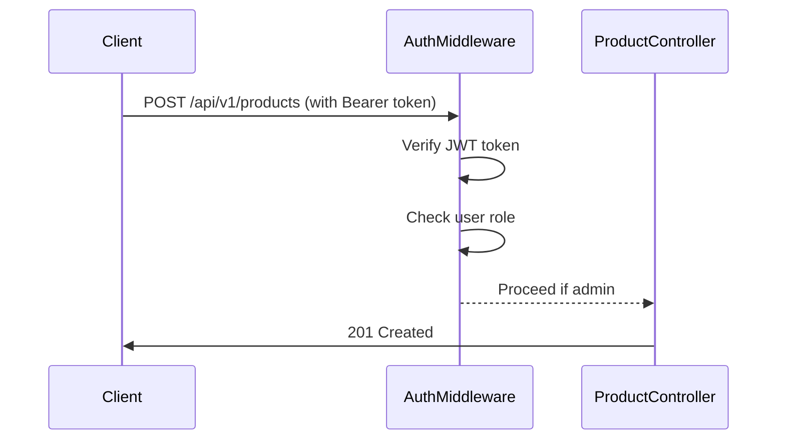
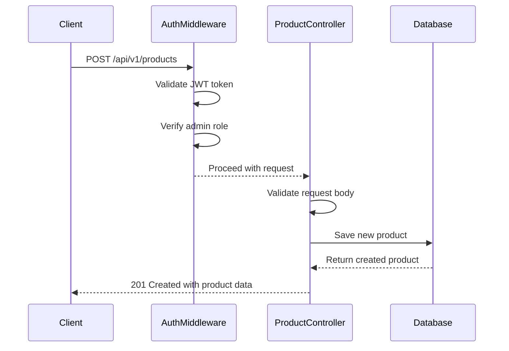
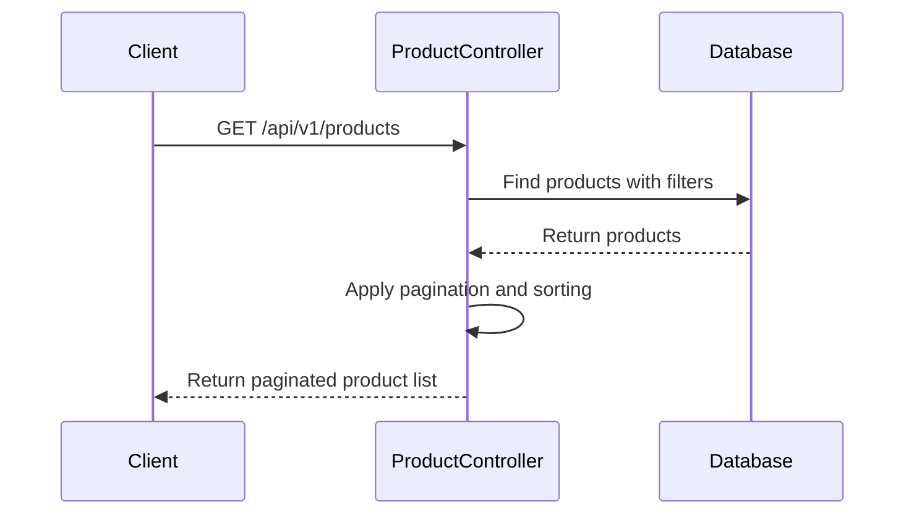

# Product API

<cite>
**Referenced Files in This Document**   
- [Product.controller.js](file://server/src/controllers/Product.controller.js)
- [Product.routes.js](file://server/src/routes/Product.routes.js)
- [Product.model.js](file://server/src/models/Product.model.js)
- [Auth.middleware.js](file://server/src/middleware/Auth.middleware.js)
- [token.js](file://server/src/utils/token.js)
</cite>

## Table of Contents
1. [Introduction](#introduction)
2. [API Endpoints](#api-endpoints)
3. [Request and Response Formats](#request-and-response-formats)
4. [Authentication and Authorization](#authentication-and-authorization)
5. [Query Parameters](#query-parameters)
6. [Error Handling](#error-handling)
7. [Code Examples](#code-examples)
8. [Sequence Diagrams](#sequence-diagrams)
9. [Data Validation and Image Handling](#data-validation-and-image-handling)

## Introduction
The Product API in the VnV24 application provides a comprehensive interface for managing product data. It supports full CRUD operations (Create, Read, Update, Delete) with robust filtering, sorting, and pagination capabilities. The API is designed to be RESTful, using standard HTTP methods and status codes. All write operations require administrative privileges authenticated via JWT tokens. The API integrates with Cloudinary for image handling and uses MongoDB for persistent storage.

**Section sources**
- [Product.controller.js](file://server/src/controllers/Product.controller.js#L5-L109)
- [Product.routes.js](file://server/src/routes/Product.routes.js#L1-L24)

## API Endpoints
The Product API exposes the following endpoints for product management:

### GET /api/v1/products
Retrieves a paginated list of products with optional filtering and sorting.

### GET /api/v1/products/:id
Retrieves a specific product by its unique identifier.

### POST /api/v1/products
Creates a new product. Requires admin authentication.

### PUT /api/v1/products/:id
Updates an existing product. Requires admin authentication.

### DELETE /api/v1/products/:id
Deletes a product. Requires admin authentication.

**Section sources**
- [Product.routes.js](file://server/src/routes/Product.routes.js#L1-L24)
- [Product.controller.js](file://server/src/controllers/Product.controller.js#L5-L109)

## Request and Response Formats
### Request Body Schema (POST/PUT)
```json
{
  "name": "string",
  "description": "string",
  "price": "number",
  "images": ["string"],
  "category": "string",
  "fragranceNotes": ["string"],
  "stock": "number"
}
```

### Response Format (GET)
```json
{
  "success": "boolean",
  "page": "number",
  "pages": "number",
  "total": "number",
  "data": [
    {
      "_id": "string",
      "name": "string",
      "description": "string",
      "price": "number",
      "images": ["string"],
      "category": "string",
      "fragranceNotes": ["string"],
      "stock": "number",
      "isFeatured": "boolean",
      "createdAt": "string",
      "updatedAt": "string"
    }
  ]
}
```

**Section sources**
- [Product.model.js](file://server/src/models/Product.model.js#L1-L18)
- [Product.controller.js](file://server/src/controllers/Product.controller.js#L5-L36)

## Authentication and Authorization
All write operations (POST, PUT, DELETE) require authentication and admin privileges. The API uses JWT-based authentication with the following flow:

1. Clients must include a Bearer token in the Authorization header
2. The token is validated by the `protect` middleware
3. Admin status is verified by the `isAdmin` middleware
4. Only users with the "admin" role can perform write operations

Read operations (GET) are publicly accessible.



**Diagram sources**
- [Auth.middleware.js](file://server/src/middleware/Auth.middleware.js#L1-L26)
- [Product.routes.js](file://server/src/routes/Product.routes.js#L1-L24)

**Section sources**
- [Auth.middleware.js](file://server/src/middleware/Auth.middleware.js#L1-L26)
- [token.js](file://server/src/utils/token.js#L1-L10)

## Query Parameters
The GET /api/v1/products endpoint supports the following query parameters:

| Parameter | Type | Description |
|---------|------|-------------|
| page | number | Page number for pagination (default: 1) |
| limit | number | Number of items per page (default: 10) |
| category | string | Filter products by category |
| price_min | number | Filter products with price greater than or equal to this value |
| price_max | number | Filter products with price less than or equal to this value |
| sort | string | Field to sort by (default: createdAt, descending) |

**Section sources**
- [Product.controller.js](file://server/src/controllers/Product.controller.js#L5-L36)

## Error Handling
The API returns appropriate HTTP status codes and error messages:

| Status Code | Error Type | Description |
|-----------|----------|-------------|
| 400 | Bad Request | Invalid request parameters |
| 401 | Unauthorized | Missing or invalid authentication token |
| 403 | Forbidden | User lacks required permissions |
| 404 | Not Found | Requested resource does not exist |
| 500 | Internal Server Error | Unexpected server error |

Error responses follow the format:
```json
{
  "success": false,
  "message": "Error description"
}
```

**Section sources**
- [Product.controller.js](file://server/src/controllers/Product.controller.js#L5-L109)
- [Auth.middleware.js](file://server/src/middleware/Auth.middleware.js#L1-L26)

## Code Examples
### Retrieving Product Listings
```bash
curl -X GET "http://localhost:5000/api/v1/products?page=1&limit=10&category=perfume&price_min=50&price_max=200&sort=price"
```

```javascript
fetch('/api/v1/products?page=1&limit=10&category=perfume')
  .then(response => response.json())
  .then(data => console.log(data));
```

### Creating a New Product
```bash
curl -X POST "http://localhost:5000/api/v1/products" \
  -H "Authorization: Bearer <admin_token>" \
  -H "Content-Type: application/json" \
  -d '{
    "name": "Luxury Perfume",
    "description": "Premium fragrance with long-lasting scent",
    "price": 150,
    "images": ["https://example.com/image1.jpg"],
    "category": "perfume",
    "fragranceNotes": ["floral", "woody"],
    "stock": 50
  }'
```

```javascript
fetch('/api/v1/products', {
  method: 'POST',
  headers: {
    'Authorization': `Bearer ${adminToken}`,
    'Content-Type': 'application/json'
  },
  body: JSON.stringify({
    name: 'Luxury Perfume',
    description: 'Premium fragrance with long-lasting scent',
    price: 150,
    images: ['https://example.com/image1.jpg'],
    category: 'perfume',
    fragranceNotes: ['floral', 'woody'],
    stock: 50
  })
})
.then(response => response.json())
.then(data => console.log(data));
```

**Section sources**
- [Product.controller.js](file://server/src/controllers/Product.controller.js#L54-L73)
- [Product.routes.js](file://server/src/routes/Product.routes.js#L1-L24)

## Sequence Diagrams
### Product Creation Flow


**Diagram sources**
- [Product.controller.js](file://server/src/controllers/Product.controller.js#L54-L73)
- [Auth.middleware.js](file://server/src/middleware/Auth.middleware.js#L1-L26)

### Product Retrieval Flow


**Diagram sources**
- [Product.controller.js](file://server/src/controllers/Product.controller.js#L5-L36)

## Data Validation and Image Handling
The API enforces strict data validation through the Mongoose schema:

- **name**: Required string
- **price**: Required number
- **category**: Required string
- **images**: Array of strings (URLs)
- **stock**: Number with default 0
- **isFeatured**: Boolean with default false

Image uploads are handled through Cloudinary integration. The API expects image URLs in the request body, which should point to images hosted on Cloudinary. The images array can contain multiple image URLs for product galleries.

**Section sources**
- [Product.model.js](file://server/src/models/Product.model.js#L1-L18)
- [Product.controller.js](file://server/src/controllers/Product.controller.js#L54-L73)