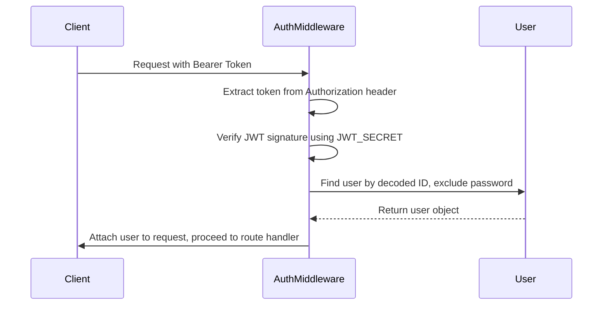
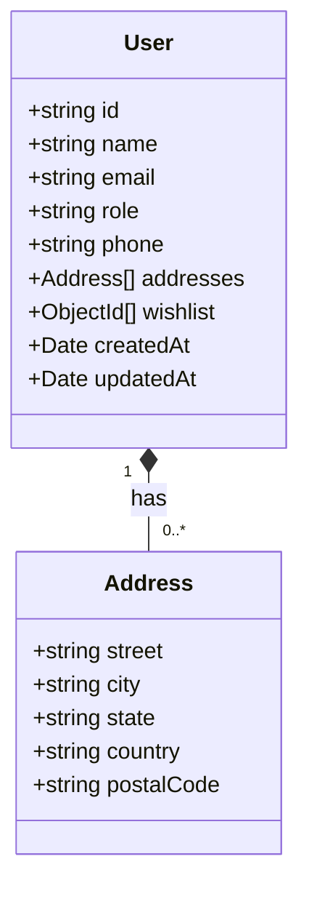
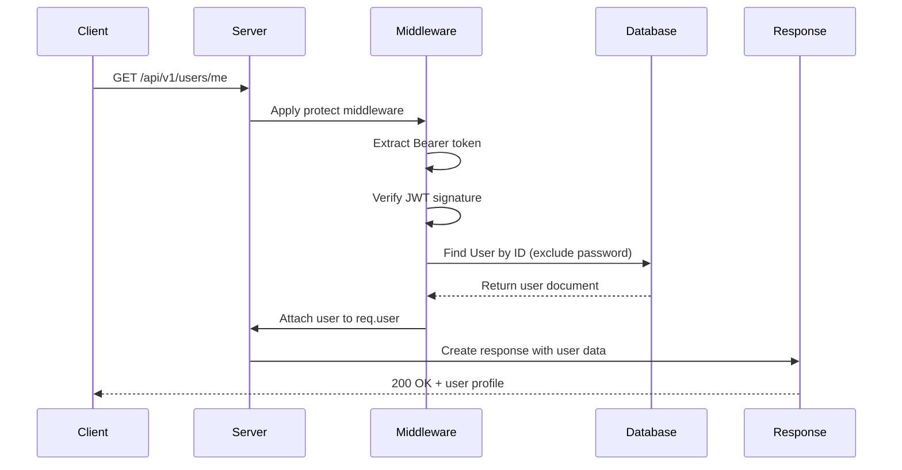

# User API

<cite>
**Referenced Files in This Document**   
- [User.routes.js](file://server/src/routes/User.routes.js)
- [Auth.middleware.js](file://server/src/middleware/Auth.middleware.js)
- [User.model.js](file://server/src/models/User.model.js)
- [Auth.controller.js](file://server/src/controllers/Auth.controller.js)
</cite>

## Table of Contents
1. [Introduction](#introduction)
2. [Authentication and Authorization](#authentication-and-authorization)
3. [User Profile Retrieval](#user-profile-retrieval)
4. [User Profile Update](#user-profile-update)
5. [User Data Structure](#user-data-structure)
6. [Error Responses](#error-responses)
7. [Code Examples](#code-examples)
8. [Sequence Diagrams](#sequence-diagrams)
9. [Data Validation Rules](#data-validation-rules)
10. [Security Considerations](#security-considerations)

## Introduction
This document provides comprehensive API documentation for user profile management endpoints in the VnV24 application. It details the available endpoints for retrieving and updating user profile information, including authentication requirements, request/response formats, error handling, and security considerations.

**Section sources**
- [User.routes.js](file://server/src/routes/User.routes.js#L1-L15)

## Authentication and Authorization
All user profile endpoints require authentication via JWT tokens. The `protect` middleware validates the Bearer token in the Authorization header and attaches the authenticated user to the request object.

Users can access their own profile information, while administrative actions are restricted by role-based authorization. The system uses JWT access tokens for authentication and refresh tokens stored in HTTP-only cookies for token renewal.



**Diagram sources**
- [Auth.middleware.js](file://server/src/middleware/Auth.middleware.js#L3-L17)

**Section sources**
- [Auth.middleware.js](file://server/src/middleware/Auth.middleware.js#L3-L25)

## User Profile Retrieval
Retrieves the authenticated user's profile information.

- **HTTP Method**: GET
- **URL Pattern**: `/api/v1/users/me`
- **Authentication**: Required (JWT Bearer Token)
- **Authorization**: Users can only access their own profile

### Request
No request parameters or body required.

### Response
Returns user profile information in JSON format.

**Success Response (200 OK)**
```json
{
  "id": "string",
  "name": "string",
  "email": "string",
  "role": "string"
}
```

**Section sources**
- [User.routes.js](file://server/src/routes/User.routes.js#L5-L12)

## User Profile Update
The User API currently does not implement a PUT endpoint for profile updates. Profile modification functionality would need to be implemented in the backend to allow users to update their personal information such as name, email, and address details.

This endpoint would typically:
- Accept a JSON request body with user fields to update
- Validate input data according to defined rules
- Update the user document in the database
- Return the updated user profile

**Section sources**
- [User.routes.js](file://server/src/routes/User.routes.js#L1-L15)

## User Data Structure
The user data model defines the structure of user documents in the database, including personal information, contact details, and preferences.

### User Object Properties
| Property | Type | Required | Description |
|---------|------|----------|-------------|
| id | string | Yes | Unique identifier for the user |
| name | string | Yes | Full name of the user |
| email | string | Yes | Email address (unique, lowercase) |
| role | string | Yes | User role ("customer" or "admin") |
| phone | string | No | Contact phone number |
| addresses | array | No | Array of address objects |
| wishlist | array | No | Array of product references |

### Address Object Properties
| Property | Type | Description |
|---------|------|-------------|
| street | string | Street address |
| city | string | City name |
| state | string | State or province |
| country | string | Country name |
| postalCode | string | Postal or ZIP code |



**Diagram sources**
- [User.model.js](file://server/src/models/User.model.js#L10-L44)

**Section sources**
- [User.model.js](file://server/src/models/User.model.js#L10-L44)

## Error Responses
The API returns standardized error responses with appropriate HTTP status codes and JSON-formatted error messages.

| Status Code | Error Type | Message | Description |
|------------|-----------|---------|-------------|
| 400 | Bad Request | "User already exists" | Email is already registered |
| 401 | Unauthorized | "Not authorized" | Missing or invalid authentication token |
| 401 | Unauthorized | "Invalid or expired token" | Token verification failed |
| 403 | Forbidden | "Access denied: Admin only" | Insufficient permissions for the operation |
| 404 | Not Found | "User not found" | Requested user does not exist |

Error Response Format:
```json
{
  "message": "string"
}
```

**Section sources**
- [Auth.controller.js](file://server/src/controllers/Auth.controller.js#L20-L65)
- [Auth.middleware.js](file://server/src/middleware/Auth.middleware.js#L14-L25)

## Code Examples
### JavaScript Fetch Example for Profile Retrieval
```javascript
fetch('/api/v1/users/me', {
  method: 'GET',
  headers: {
    'Authorization': `Bearer ${accessToken}`,
    'Content-Type': 'application/json'
  }
})
.then(response => response.json())
.then(data => console.log('User profile:', data))
.catch(error => console.error('Error:', error));
```

### cURL Example for Profile Retrieval
```bash
curl -X GET "http://localhost:3000/api/v1/users/me" \
  -H "Authorization: Bearer YOUR_ACCESS_TOKEN" \
  -H "Content-Type: application/json"
```

**Section sources**
- [User.routes.js](file://server/src/routes/User.routes.js#L5-L12)

## Sequence Diagrams
### User Profile Retrieval Sequence


**Diagram sources**
- [User.routes.js](file://server/src/routes/User.routes.js#L5-L12)
- [Auth.middleware.js](file://server/src/middleware/Auth.middleware.js#L3-L17)

## Data Validation Rules
The system enforces the following validation rules for user data:

- **Name**: Required field, no specific format restrictions
- **Email**: Required, must be unique across users, automatically converted to lowercase
- **Password**: Required, hashed using bcrypt before storage
- **Role**: Enum with values "customer" or "admin", defaults to "customer"
- **Addresses**: Array of address objects with street, city, state, country, and postalCode fields

Data validation occurs at the model level through Mongoose schema definitions and custom pre-save hooks that hash passwords before storing them in the database.

**Section sources**
- [User.model.js](file://server/src/models/User.model.js#L10-L44)

## Security Considerations
The User API implements several security measures to protect user data:

1. **Authentication**: JWT-based authentication with Bearer tokens
2. **Password Security**: Passwords are hashed using bcrypt with salt
3. **Token Protection**: Refresh tokens are stored in HTTP-only, secure cookies
4. **Data Exposure**: Password fields are explicitly excluded from responses
5. **Input Validation**: Schema-level validation for all user data
6. **Rate Limiting**: Not explicitly shown but recommended for production

Sensitive operations require valid authentication tokens, and the system follows the principle of least privilege by only exposing necessary user information in API responses.

**Section sources**
- [User.model.js](file://server/src/models/User.model.js#L46-L65)
- [Auth.middleware.js](file://server/src/middleware/Auth.middleware.js#L3-L25)
- [Auth.controller.js](file://server/src/controllers/Auth.controller.js#L2-L65)