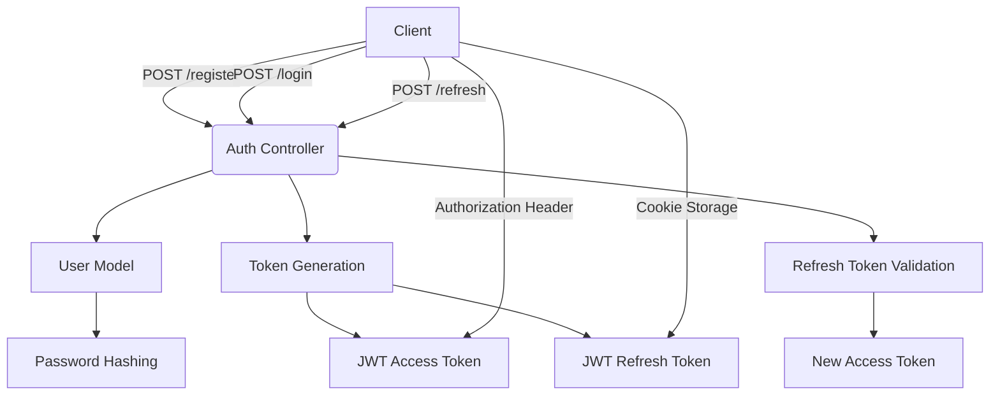
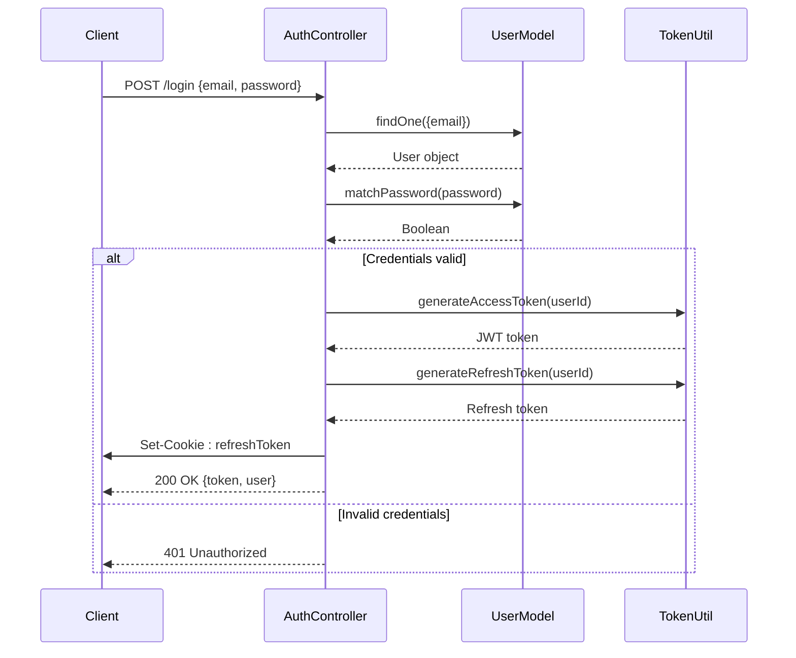
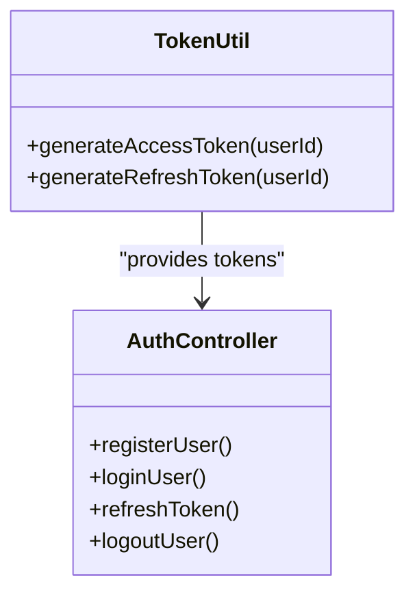
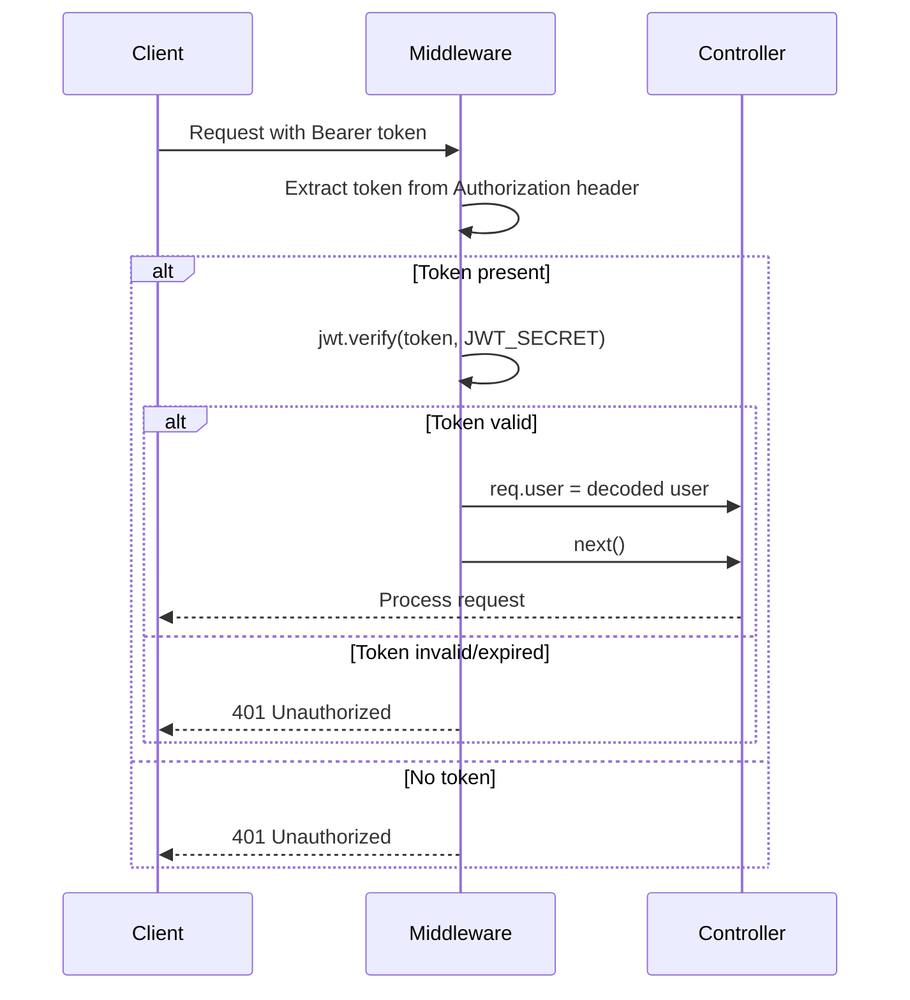
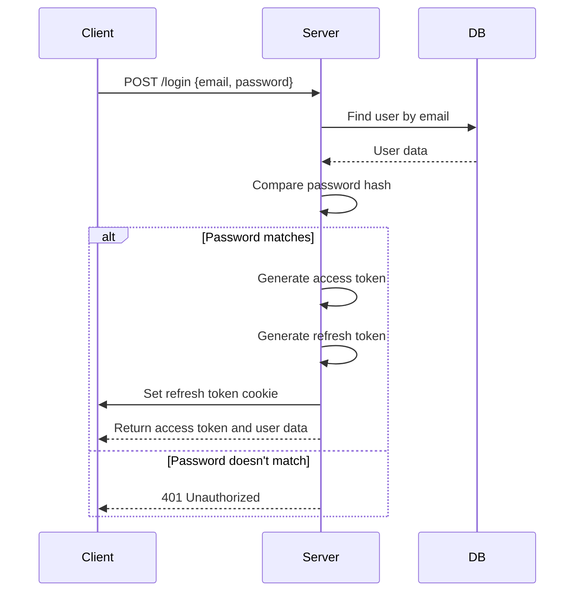
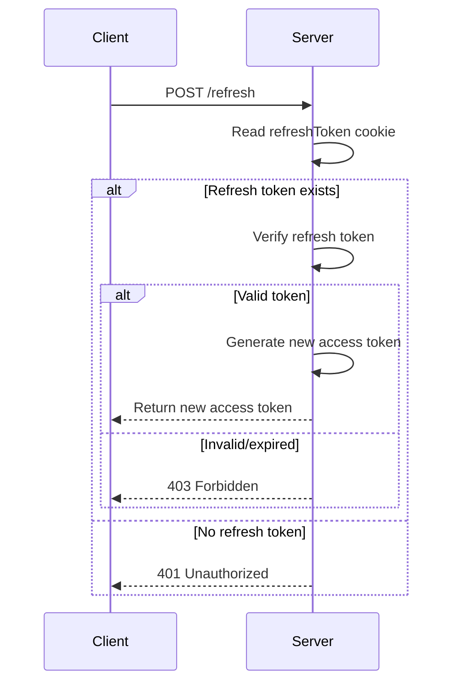
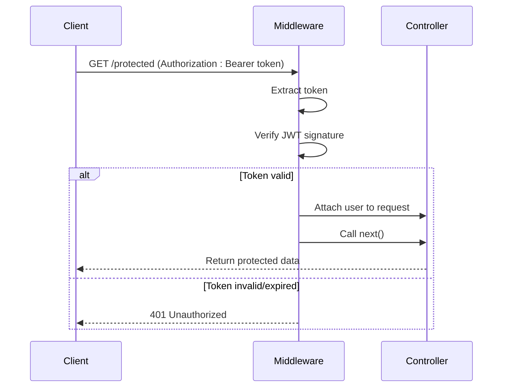

# Authentication Flow

<cite>
**Referenced Files in This Document**   
- [Auth.controller.js](file://server/src/controllers/Auth.controller.js)
- [Auth.middleware.js](file://server/src/middleware/Auth.middleware.js)
- [token.js](file://server/src/utils/token.js)
- [Auth.routes.js](file://server/src/routes/Auth.routes.js)
- [User.model.js](file://server/src/models/User.model.js)
</cite>

## Table of Contents
1. [Introduction](#introduction)
2. [Authentication Overview](#authentication-overview)
3. [User Registration Flow](#user-registration-flow)
4. [User Login Flow](#user-login-flow)
5. [JWT Token Structure and Management](#jwt-token-structure-and-management)
6. [Refresh Token Mechanism](#refresh-token-mechanism)
7. [Route Protection and Authorization](#route-protection-and-authorization)
8. [Client-Side Token Management](#client-side-token-management)
9. [Security Considerations](#security-considerations)
10. [Sequence Diagrams](#sequence-diagrams)

## Introduction

The VnV24 application implements a secure JWT-based authentication system that supports user registration, login, token refresh, and role-based access control. This document details the complete authentication flow, token management strategies, and security mechanisms implemented across the backend services.

**Section sources**
- [Auth.controller.js](file://server/src/controllers/Auth.controller.js#L1-L65)
- [Auth.middleware.js](file://server/src/middleware/Auth.middleware.js#L1-L25)

## Authentication Overview

The authentication system in VnV24 is built on JSON Web Tokens (JWT) with a dual-token strategy combining access and refresh tokens. The system uses bcryptjs for secure password hashing and implements HTTP-only cookies for safe refresh token storage. All protected routes are secured using middleware that validates JWT tokens and enforces role-based access.

**Diagram sources**
- [Auth.controller.js](file://server/src/controllers/Auth.controller.js#L12-L65)
- [User.model.js](file://server/src/models/User.model.js#L1-L65)
- [token.js](file://server/src/utils/token.js#L1-L9)

## User Registration Flow

The user registration process begins with a POST request to the `/register` endpoint. The system checks for existing users by email, creates a new user with securely hashed password, and returns an access token while storing the refresh token in an HTTP-only cookie.

**Section sources**
- [Auth.controller.js](file://server/src/controllers/Auth.controller.js#L12-L27)
- [User.model.js](file://server/src/models/User.model.js#L45-L50)

## User Login Flow

During login, the system verifies user credentials by comparing the provided password with the bcrypt-hashed password stored in the database. Upon successful authentication, it generates both access and refresh tokens, returning the access token in the response and setting the refresh token in an HTTP-only cookie.

**Diagram sources**
- [Auth.controller.js](file://server/src/controllers/Auth.controller.js#L29-L42)
- [User.model.js](file://server/src/models/User.model.js#L52-L54)

**Section sources**
- [Auth.controller.js](file://server/src/controllers/Auth.controller.js#L29-L42)
- [User.model.js](file://server/src/models/User.model.js#L52-L54)

## JWT Token Structure and Management

The JWT implementation uses two separate secrets for access and refresh tokens. Access tokens are short-lived (15 minutes), while refresh tokens have a longer lifespan (7 days). The token utility module handles JWT signing using HS256 algorithm with environment-specific secrets.

**Diagram sources**
- [token.js](file://server/src/utils/token.js#L1-L9)
- [Auth.controller.js](file://server/src/controllers/Auth.controller.js#L1-L65)

**Section sources**
- [token.js](file://server/src/utils/token.js#L1-L9)

## Refresh Token Mechanism

The refresh token mechanism allows users to obtain new access tokens without re-authenticating. Refresh tokens are stored in the user document with SHA-256 hashed values for security. The system validates refresh tokens from HTTP-only cookies and rotates them according to security best practices.

**Section sources**
- [Auth.controller.js](file://server/src/controllers/Auth.controller.js#L46-L57)
- [User.model.js](file://server/src/models/User.model.js#L35-L43)

## Route Protection and Authorization

Route protection is implemented through middleware that extracts and verifies JWT tokens from authorization headers. The system supports role-based access control, with specific middleware to restrict endpoints to admin users only.

**Diagram sources**
- [Auth.middleware.js](file://server/src/middleware/Auth.middleware.js#L3-L17)

**Section sources**
- [Auth.middleware.js](file://server/src/middleware/Auth.middleware.js#L3-L25)

## Client-Side Token Management

Access tokens are sent in the Authorization header as Bearer tokens for API requests, while refresh tokens are automatically managed by the browser through HTTP-only cookies. This approach prevents XSS attacks from accessing refresh tokens while allowing seamless token refresh operations.

**Section sources**
- [Auth.controller.js](file://server/src/controllers/Auth.controller.js#L19-L20)
- [Auth.controller.js](file://server/src/controllers/Auth.controller.js#L37-L38)

## Security Considerations

The authentication system implements multiple security measures:
- Passwords are hashed using bcryptjs with salt rounds
- Refresh tokens are stored as SHA-256 hashes in the database
- HTTP-only cookies prevent client-side script access
- Access tokens have short expiration times
- Separate secrets for access and refresh tokens
- Role-based access control for privileged operations

**Section sources**
- [User.model.js](file://server/src/models/User.model.js#L45-L50)
- [Auth.middleware.js](file://server/src/middleware/Auth.middleware.js#L20-L25)
- [token.js](file://server/src/utils/token.js#L1-L9)

## Sequence Diagrams

### Login Flow

**Diagram sources**
- [Auth.controller.js](file://server/src/controllers/Auth.controller.js#L29-L42)

### Token Refresh Flow

**Diagram sources**
- [Auth.controller.js](file://server/src/controllers/Auth.controller.js#L46-L57)

### Protected API Call Flow

**Diagram sources**
- [Auth.middleware.js](file://server/src/middleware/Auth.middleware.js#L3-L17)