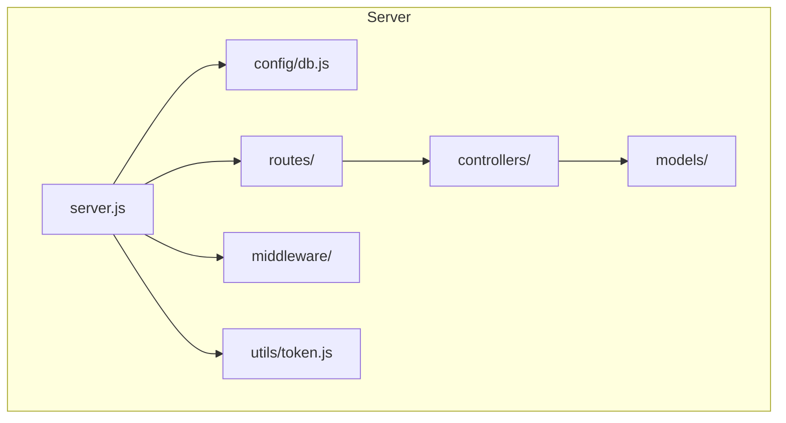
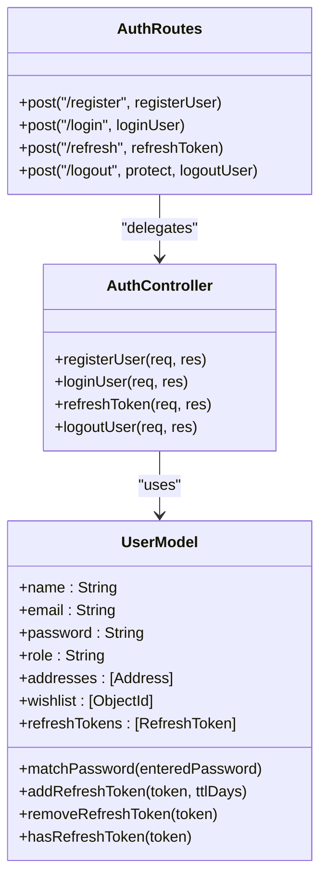
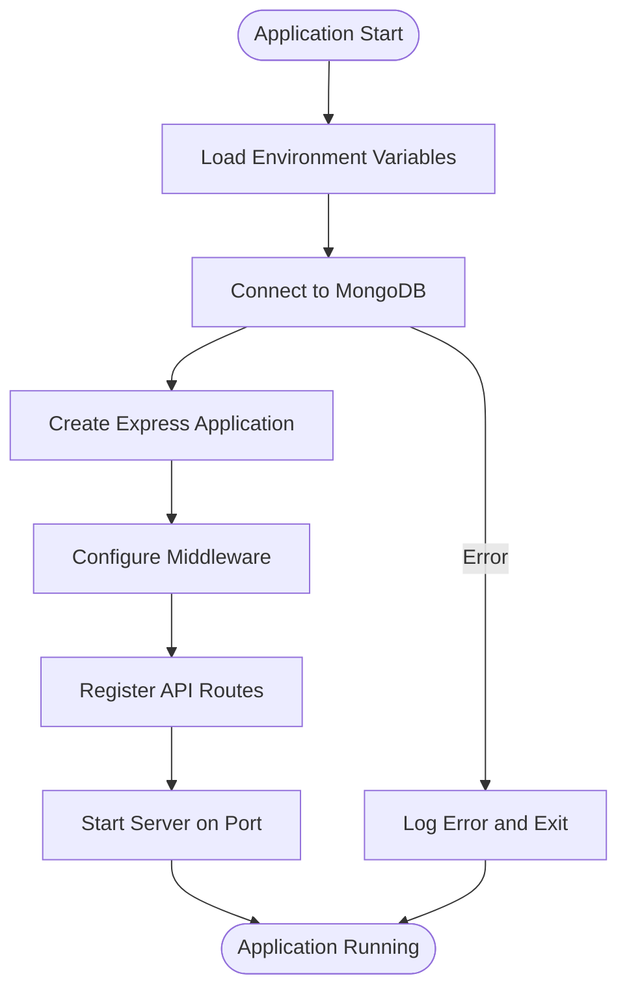
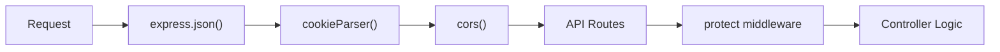
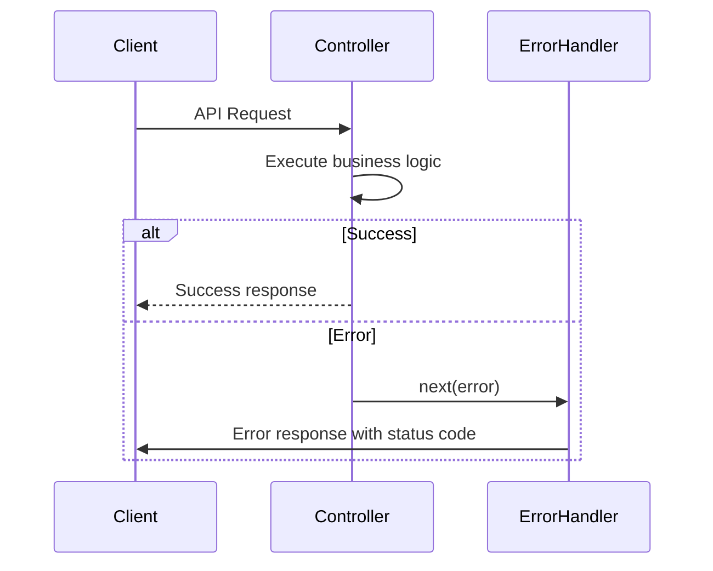
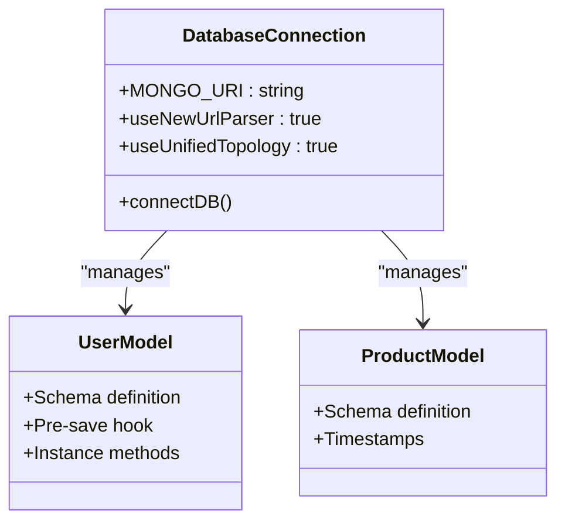
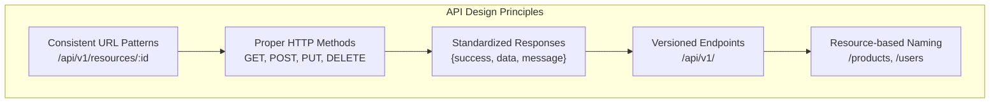
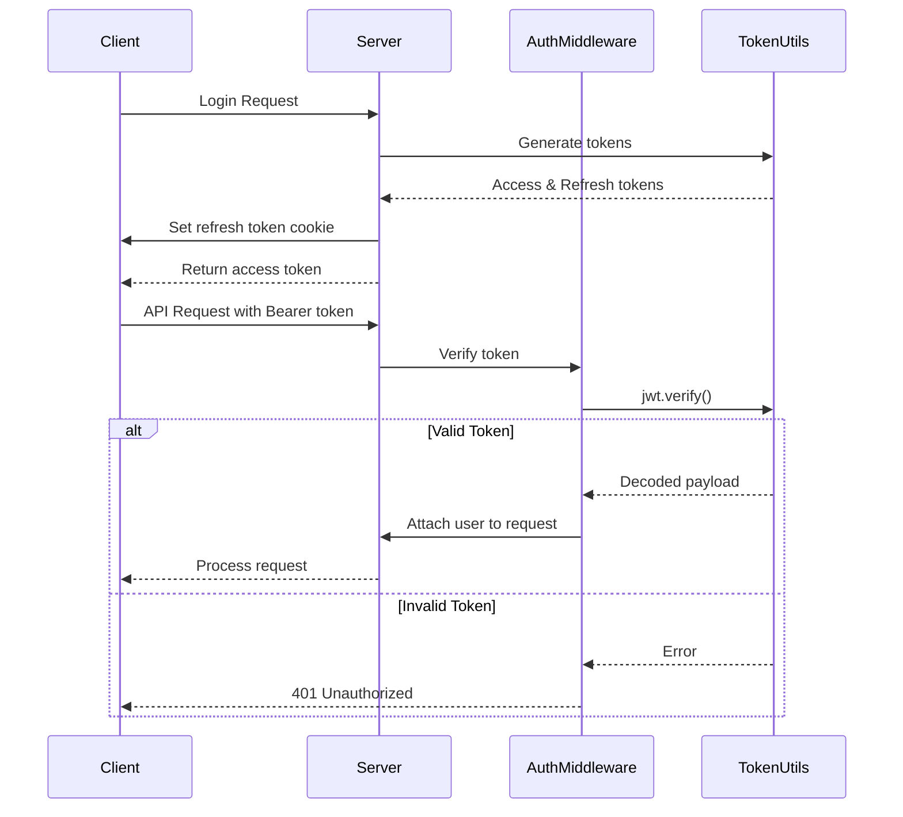

# Backend Architecture

<cite>
**Referenced Files in This Document**   
- [server.js](file://server/src/server.js)
- [db.js](file://server/src/config/db.js)
- [Auth.controller.js](file://server/src/controllers/Auth.controller.js)
- [Product.controller.js](file://server/src/controllers/Product.controller.js)
- [User.model.js](file://server/src/models/User.model.js)
- [Product.model.js](file://server/src/models/Product.model.js)
- [Auth.middleware.js](file://server/src/middleware/Auth.middleware.js)
- [Auth.routes.js](file://server/src/routes/Auth.routes.js)
- [User.routes.js](file://server/src/routes/User.routes.js)
- [token.js](file://server/src/utils/token.js)
</cite>

## Table of Contents
1. [Introduction](#introduction)
2. [Project Structure](#project-structure)
3. [MVC Architecture Implementation](#mvc-architecture-implementation)
4. [Server Initialization Process](#server-initialization-process)
5. [Middleware Stack Configuration](#middleware-stack-configuration)
6. [Error Handling Mechanisms](#error-handling-mechanisms)
7. [Database Connection Strategy](#database-connection-strategy)
8. [RESTful API Design Principles](#restful-api-design-principles)
9. [Security Architecture](#security-architecture)
10. [Logging Strategy and Monitoring Considerations](#logging-strategy-and-monitoring-considerations)
11. [Environment Configuration System](#environment-configuration-system)

## Introduction
This document provides comprehensive architectural documentation for the Express.js backend application. The system follows the Model-View-Controller (MVC) pattern with clear separation between routes, controllers, and models. The backend serves as an API server for an e-commerce platform, handling user authentication, product management, order processing, and wishlist functionality. The architecture emphasizes security, scalability, and maintainability through proper middleware usage, error handling, and environment configuration.

## Project Structure
The backend application is organized in a feature-based directory structure under the `server/src` directory. The main components are separated into distinct folders: `controllers` for business logic, `models` for data structures and database interactions, `routes` for API endpoint definitions, `middleware` for reusable request processing functions, and `utils` for helper functions. This organization promotes separation of concerns and makes the codebase easier to navigate and maintain.

**Diagram sources**
- [server.js](file://server/src/server.js#L1-L34)
- [db.js](file://server/src/config/db.js#L1-L18)

**Section sources**
- [server.js](file://server/src/server.js#L1-L34)
- [db.js](file://server/src/config/db.js#L1-L18)

## MVC Architecture Implementation
The application implements the MVC pattern with a clear separation between routes, controllers, and models. Routes define the API endpoints and map HTTP requests to controller methods. Controllers contain the business logic and interact with models to perform data operations. Models define the data structure and handle database interactions through Mongoose.

The route files import controller functions and attach them to specific endpoints using Express Router. Controllers import the relevant models and perform operations such as creating, reading, updating, and deleting documents. Models define the schema for MongoDB collections and include methods for data validation and transformation.

**Diagram sources**
- [Auth.routes.js](file://server/src/routes/Auth.routes.js#L1-L21)
- [Auth.controller.js](file://server/src/controllers/Auth.controller.js#L1-L67)
- [User.model.js](file://server/src/models/User.model.js#L1-L66)

**Section sources**
- [Auth.routes.js](file://server/src/routes/Auth.routes.js#L1-L21)
- [Auth.controller.js](file://server/src/controllers/Auth.controller.js#L1-L67)
- [User.model.js](file://server/src/models/User.model.js#L1-L66)

## Server Initialization Process
The server initialization process begins in the `server.js` file, which serves as the entry point for the application. The process follows a sequential flow: environment variables are loaded using dotenv, the database connection is established, the Express application is configured with necessary middleware, routes are registered, and finally the server starts listening on the specified port.

The initialization ensures that the database connection is established before the server starts accepting requests, preventing potential errors during application startup. The use of async/await in the database connection function ensures proper error handling during the connection process.

**Diagram sources**
- [server.js](file://server/src/server.js#L1-L34)
- [db.js](file://server/src/config/db.js#L1-L18)

**Section sources**
- [server.js](file://server/src/server.js#L1-L34)
- [db.js](file://server/src/config/db.js#L1-L18)

## Middleware Stack Configuration
The application utilizes a comprehensive middleware stack to handle various aspects of request processing. The middleware stack includes built-in Express middleware for JSON parsing and cookie handling, third-party middleware for CORS configuration, and custom middleware for authentication and authorization.

The middleware configuration ensures that requests are properly parsed, security policies are enforced, and authentication is performed before accessing protected routes. The order of middleware application is crucial for proper functionality, with parsing middleware applied first, followed by security middleware, and finally route handlers.

**Diagram sources**
- [server.js](file://server/src/server.js#L1-L34)
- [Auth.middleware.js](file://server/src/middleware/Auth.middleware.js#L1-L26)

**Section sources**
- [server.js](file://server/src/server.js#L1-L34)
- [Auth.middleware.js](file://server/src/middleware/Auth.middleware.js#L1-L26)

## Error Handling Mechanisms
The application implements a robust error handling mechanism through the use of Express error-handling middleware and proper error propagation from controller methods. Controller functions wrap their logic in try-catch blocks and pass errors to the next middleware using the `next()` function, allowing for centralized error handling.

The error handling approach ensures that all errors are caught and processed consistently, with appropriate HTTP status codes and error messages returned to the client. This prevents unhandled exceptions from crashing the server and provides meaningful feedback to API consumers.

**Diagram sources**
- [Product.controller.js](file://server/src/controllers/Product.controller.js#L1-L110)
- [server.js](file://server/src/server.js#L1-L34)

**Section sources**
- [Product.controller.js](file://server/src/controllers/Product.controller.js#L1-L110)

## Database Connection Strategy
The application uses MongoDB as its primary database, connected through Mongoose ODM. The database connection strategy involves establishing a single connection pool at application startup, which is then reused for all database operations throughout the application's lifecycle.

The connection is configured with modern Mongoose options such as `useNewUrlParser` and `useUnifiedTopology` to ensure compatibility with current MongoDB server versions. Error handling is implemented to log connection errors and terminate the process if the database cannot be reached, preventing the application from running in a degraded state.

**Diagram sources**
- [db.js](file://server/src/config/db.js#L1-L18)
- [User.model.js](file://server/src/models/User.model.js#L1-L66)
- [Product.model.js](file://server/src/models/Product.model.js#L1-L18)

**Section sources**
- [db.js](file://server/src/config/db.js#L1-L18)
- [User.model.js](file://server/src/models/User.model.js#L1-L66)
- [Product.model.js](file://server/src/models/Product.model.js#L1-L18)

## RESTful API Design Principles
The application follows RESTful API design principles with consistent URL patterns, proper HTTP method usage, and standardized response formats. API endpoints are organized under versioned routes (`/api/v1/`) to facilitate future API evolution without breaking existing clients.

Resources are represented by plural nouns in the URL path, and standard HTTP methods are used for CRUD operations: GET for retrieval, POST for creation, PUT for updates, and DELETE for removal. Response formats include a consistent structure with success status, data payload, and additional metadata such as pagination information for list endpoints.

**Diagram sources**
- [Auth.routes.js](file://server/src/routes/Auth.routes.js#L1-L21)
- [Product.controller.js](file://server/src/controllers/Product.controller.js#L1-L110)
- [User.routes.js](file://server/src/routes/User.routes.js#L1-L16)

**Section sources**
- [Auth.routes.js](file://server/src/routes/Auth.routes.js#L1-L21)
- [Product.controller.js](file://server/src/controllers/Product.controller.js#L1-L110)
- [User.routes.js](file://server/src/routes/User.routes.js#L1-L16)

## Security Architecture
The application implements a multi-layered security architecture that includes CORS configuration, authentication, authorization, and input validation. CORS is configured to allow requests only from trusted origins, preventing cross-site request forgery attacks.

Authentication is implemented using JWT tokens with access and refresh token rotation. Access tokens are short-lived (15 minutes) and sent in the Authorization header, while refresh tokens are long-lived (7 days) and stored in HTTP-only cookies to prevent XSS attacks. The `protect` middleware validates access tokens and attaches user information to the request object for subsequent handlers.

**Diagram sources**
- [Auth.controller.js](file://server/src/controllers/Auth.controller.js#L1-L67)
- [Auth.middleware.js](file://server/src/middleware/Auth.middleware.js#L1-L26)
- [token.js](file://server/src/utils/token.js#L1-L10)

**Section sources**
- [Auth.controller.js](file://server/src/controllers/Auth.controller.js#L1-L67)
- [Auth.middleware.js](file://server/src/middleware/Auth.middleware.js#L1-L26)
- [token.js](file://server/src/utils/token.js#L1-L10)

## Logging Strategy and Monitoring Considerations
The application includes basic logging for critical operations such as database connection status and error conditions. The database connection function logs a success message when connected and an error message if the connection fails. Error handling in controllers ensures that errors are propagated and can be logged by middleware.

For production deployment, the logging strategy should be enhanced with structured logging, request/response logging, and integration with monitoring services. Additional considerations include log rotation, sensitive data filtering, and integration with centralized logging solutions for easier troubleshooting and performance analysis.

**Section sources**
- [db.js](file://server/src/config/db.js#L1-L18)
- [Product.controller.js](file://server/src/controllers/Product.controller.js#L1-L110)

## Environment Configuration System
The application uses an environment configuration system based on the dotenv package to manage configuration variables across different deployment stages. Environment variables are loaded from a `.env` file and made available through `process.env`.

The configuration system supports different settings for development and production environments, such as cookie security settings and CORS origins. This allows the application to adapt its behavior based on the deployment context without code changes, enhancing security and flexibility across different environments.

**Section sources**
- [server.js](file://server/src/server.js#L1-L34)
- [Auth.controller.js](file://server/src/controllers/Auth.controller.js#L1-L67)
- [token.js](file://server/src/utils/token.js#L1-L10)