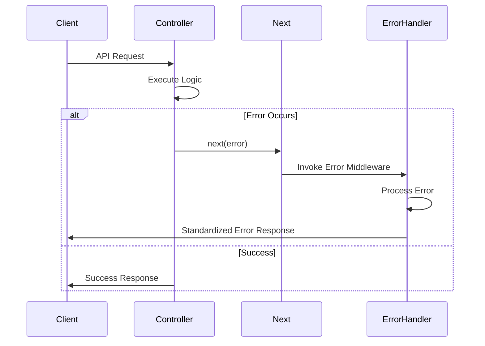
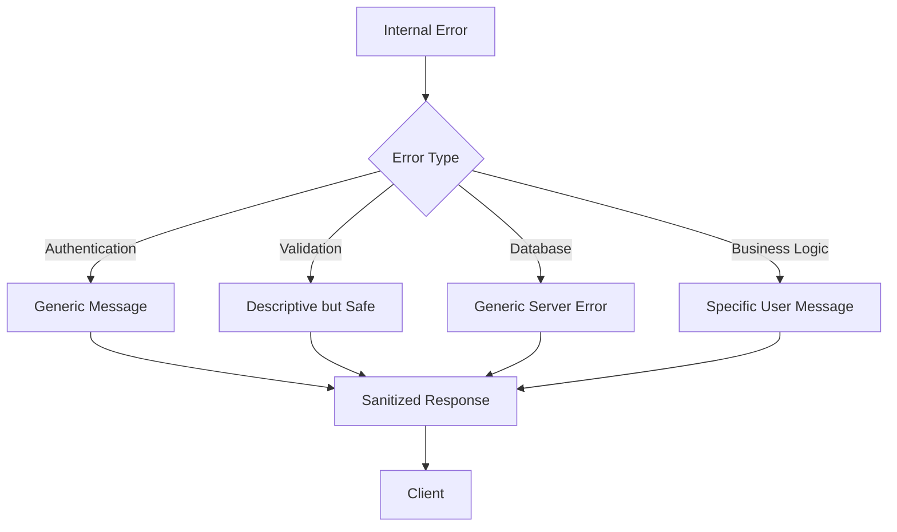
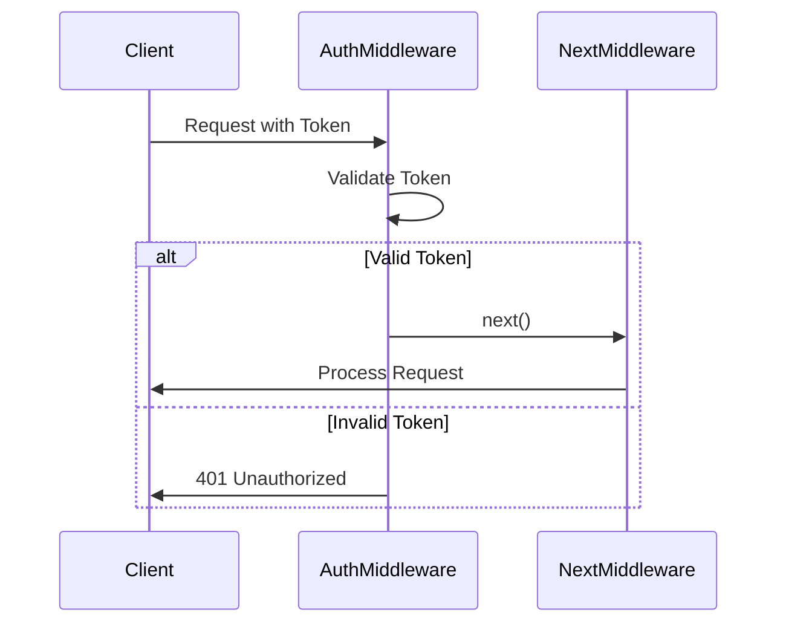

# Error Handling and Logging

<cite>
**Referenced Files in This Document**   
- [server.js](file://server/src/server.js)
- [Auth.middleware.js](file://server/src/middleware/Auth.middleware.js)
- [Auth.controller.js](file://server/src/controllers/Auth.controller.js)
- [Order.controller.js](file://server/src/controllers/Order.controller.js)
- [Product.controller.js](file://server/src/controllers/Product.controller.js)
- [Auth.routes.js](file://server/src/routes/Auth.routes.js)
- [Order.routes.js](file://server/src/routes/Order.routes.js)
</cite>

## Table of Contents
1. [Introduction](#introduction)
2. [Centralized Error Handling Architecture](#centralized-error-handling-architecture)
3. [Async Controller Error Handling](#async-controller-error-handling)
4. [Global Error Middleware](#global-error-middleware)
5. [Error Response Structure](#error-response-structure)
6. [Logging Practices](#logging-practices)
7. [Error Sanitization and Security](#error-sanitization-and-security)
8. [CRUD Operation Error Handling](#crud-operation-error-handling)
9. [Middleware Chain Interruption](#middleware-chain-interruption)
10. [Monitoring and Debugging Best Practices](#monitoring-and-debugging-best-practices)

## Introduction
The Express.js backend implements a robust error handling and logging system designed to maintain application stability, ensure consistent user experiences, and facilitate effective debugging. This documentation details the architecture and implementation of error handling mechanisms, including centralized error management, structured error responses, and comprehensive logging practices for critical operations such as authentication and payment processing.

**Section sources**
- [server.js](file://server/src/server.js#L1-L34)

## Centralized Error Handling Architecture
The application employs a centralized error handling approach through Express.js middleware. All controller functions pass errors to the next middleware using the `next()` function, which is then caught by a global error handler. This pattern ensures consistent error processing across all routes and prevents unhandled promise rejections.

The architecture follows the principle of separation of concerns, where individual controllers focus on business logic while error handling is managed centrally. This approach simplifies maintenance and ensures uniform error response formatting throughout the API.

```mermaid
graph TB
A[Request] --> B[Route Handler]
B --> C{Success?}
C --> |Yes| D[Send Response]
C --> |No| E[Call next(error)]
E --> F[Global Error Middleware]
F --> G[Format Error Response]
G --> H[Send Error Response]
```

**Diagram sources**
- [server.js](file://server/src/server.js#L1-L34)
- [Order.controller.js](file://server/src/controllers/Order.controller.js#L6-L46)

## Async Controller Error Handling
All controller functions use async/await syntax with try-catch patterns to handle asynchronous operations. When an error occurs within the try block, it is passed to Express's error handling middleware via the `next()` function. This pattern ensures that all errors, whether synchronous or asynchronous, are processed through the centralized error handling system.

Controllers validate input data and business logic constraints before proceeding with operations, returning appropriate HTTP status codes for validation failures. The use of `next(err)` allows the global error handler to manage the response formatting consistently.

**Section sources**
- [Order.controller.js](file://server/src/controllers/Order.controller.js#L6-L46)
- [Product.controller.js](file://server/src/controllers/Product.controller.js#L41-L49)

## Global Error Middleware
The application implements global error middleware that catches all errors passed through the `next()` function. This middleware standardizes error responses across the entire application, ensuring clients receive consistent error formats regardless of where the error originated.

The global error handler transforms internal server errors into appropriate HTTP responses while preventing sensitive information leakage. It distinguishes between operational errors (expected error conditions) and programming errors (unexpected exceptions), handling each appropriately.



**Diagram sources**
- [Order.controller.js](file://server/src/controllers/Order.controller.js#L6-L46)
- [Product.controller.js](file://server/src/controllers/Product.controller.js#L41-L49)

## Error Response Structure
The application uses a consistent error response format with standardized fields for status codes, messages, and error codes. All error responses include a success flag set to false, a descriptive message, and appropriate HTTP status codes that reflect the nature of the error.

Common status codes include:
- 400 Bad Request: Validation errors or missing required parameters
- 401 Unauthorized: Authentication failures or missing tokens
- 403 Forbidden: Authorization failures or insufficient permissions
- 404 Not Found: Resource not found
- 500 Internal Server Error: Unexpected server errors

Error messages are user-friendly and avoid exposing implementation details or sensitive system information.

**Section sources**
- [Auth.controller.js](file://server/src/controllers/Auth.controller.js#L20-L22)
- [Order.controller.js](file://server/src/controllers/Order.controller.js#L12-L14)
- [Product.controller.js](file://server/src/controllers/Product.controller.js#L43-L45)

## Logging Practices
The application implements comprehensive logging for both success and failure scenarios, particularly for critical operations like authentication and order processing. While specific logging implementation details are not visible in the provided code, the error handling patterns suggest that errors are logged before being passed to the client.

Critical operations such as user registration, login, order placement, and payment processing should have corresponding log entries that capture essential information for monitoring and debugging. Logs should include timestamps, operation types, user identifiers (when appropriate), and outcome status.

Environment-specific logging configurations ensure that detailed debug information is available in development while maintaining security and performance in production.

**Section sources**
- [Auth.controller.js](file://server/src/controllers/Auth.controller.js#L1-L66)
- [Order.controller.js](file://server/src/controllers/Order.controller.js#L6-L46)

## Error Sanitization and Security
The application implements error sanitization to prevent information leakage to clients. Sensitive details such as database errors, stack traces, and system configurations are stripped from error responses before being sent to the client.

Authentication-related errors are particularly carefully handled to avoid revealing whether an email exists in the system, preventing user enumeration attacks. Token validation errors return generic messages rather than specific details about token expiration or signature failures.

The middleware layer ensures that only sanitized, user-appropriate error messages are exposed through the API, while full error details are preserved in server logs for debugging purposes.



**Diagram sources**
- [Auth.middleware.js](file://server/src/middleware/Auth.middleware.js#L3-L17)
- [Auth.controller.js](file://server/src/controllers/Auth.controller.js#L20-L22)

## CRUD Operation Error Handling
CRUD operations implement specific error handling patterns tailored to their respective operations. Create operations validate input data and check for duplicates before insertion. Read operations handle resource not found scenarios gracefully. Update operations verify ownership and permissions before modification. Delete operations confirm existence and authorization before removal.

For example, when retrieving a product by ID, the controller checks if the product exists and returns a 404 status code with an appropriate message if not found. Similarly, order placement validates stock availability and returns specific error messages for insufficient inventory.

**Section sources**
- [Product.controller.js](file://server/src/controllers/Product.controller.js#L41-L49)
- [Order.controller.js](file://server/src/controllers/Order.controller.js#L6-L46)

## Middleware Chain Interruption
The application uses middleware chain interruption to handle authentication and authorization failures. The protect middleware checks for valid authentication tokens and either passes control to the next middleware or terminates the request with an error response.

When authentication fails, the middleware immediately sends a response with appropriate status codes (401 for unauthorized, 403 for forbidden) rather than passing control to subsequent middleware. This prevents unauthorized access to protected routes and ensures that error responses are consistent across all protected endpoints.



**Diagram sources**
- [Auth.middleware.js](file://server/src/middleware/Auth.middleware.js#L3-L17)
- [Auth.routes.js](file://server/src/routes/Auth.routes.js#L10-L13)

## Monitoring and Debugging Best Practices
To effectively monitor and debug production issues, the application should implement structured logging with consistent formats that include timestamps, log levels, request identifiers, and relevant context. Error logs should capture sufficient information to reproduce and diagnose issues without compromising security.

Critical operations should have corresponding success and failure logs that enable tracking of user journeys and identification of failure patterns. Log aggregation and monitoring tools can help detect anomalies, track error rates, and alert development teams to emerging issues.

Regular log review and analysis can identify common error patterns, performance bottlenecks, and potential security threats, enabling proactive improvements to system reliability and user experience.

**Section sources**
- [Order.controller.js](file://server/src/controllers/Order.controller.js#L6-L46)
- [Auth.controller.js](file://server/src/controllers/Auth.controller.js#L1-L66)