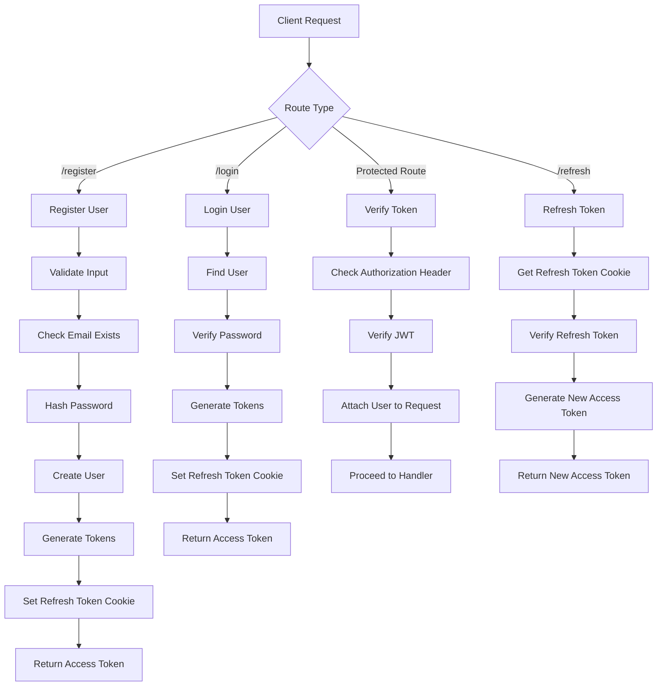
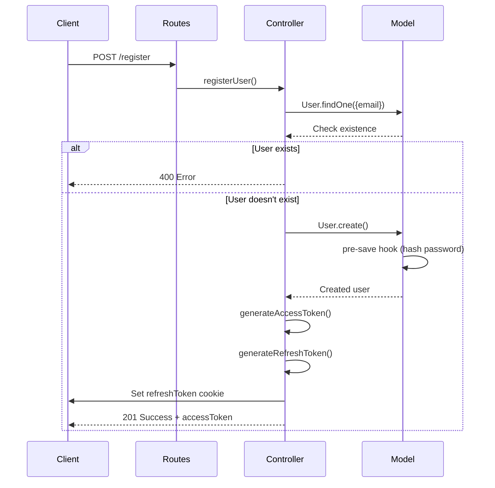
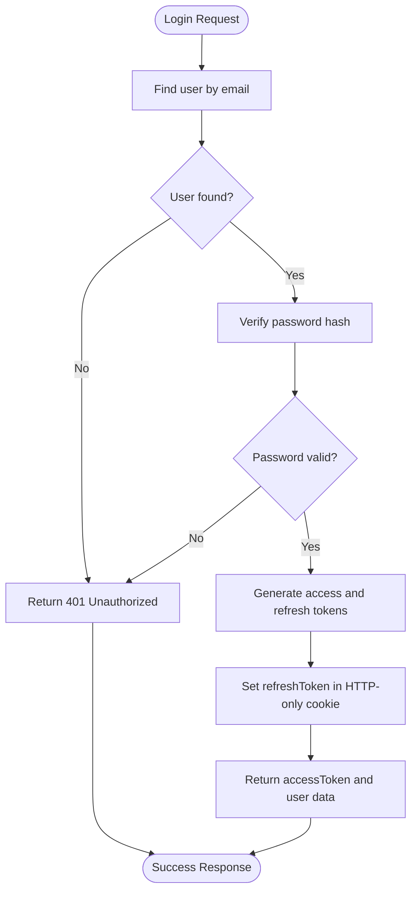
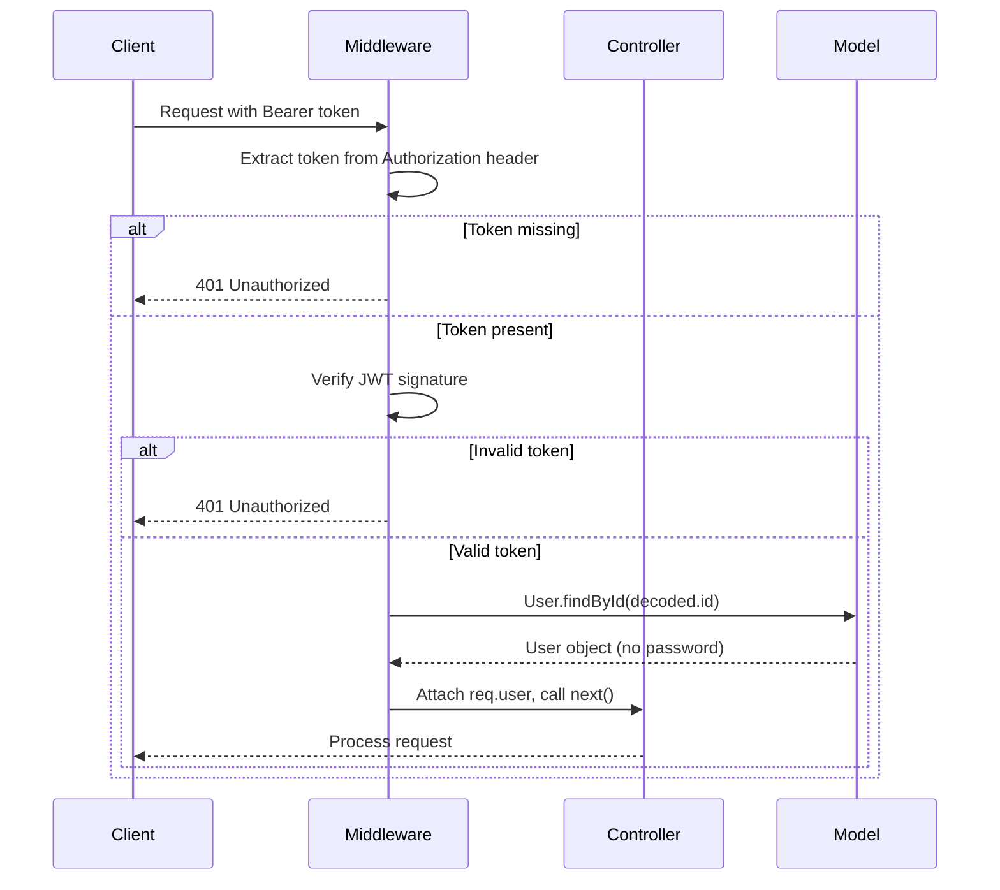

# Authentication Module

<cite>
**Referenced Files in This Document**   
- [Auth.routes.js](file://server/src/routes/Auth.routes.js)
- [Auth.controller.js](file://server/src/controllers/Auth.controller.js)
- [User.model.js](file://server/src/models/User.model.js)
- [Auth.middleware.js](file://server/src/middleware/Auth.middleware.js)
</cite>

## Table of Contents
1. [Introduction](#introduction)
2. [Authentication Flow Overview](#authentication-flow-overview)
3. [Core Components](#core-components)
4. [Registration Process](#registration-process)
5. [Login and Token Management](#login-and-token-management)
6. [Route Protection and Authorization](#route-protection-and-authorization)
7. [Security Implementation](#security-implementation)
8. [Error Handling](#error-handling)
9. [Integration with Frontend](#integration-with-frontend)
10. [Best Practices and Recommendations](#best-practices-and-recommendations)

## Introduction

The authentication module provides a comprehensive solution for user authentication, authorization, and session management in the application. It implements a secure JWT-based authentication system with refresh token rotation, password hashing, and role-based access control. The module follows a clean separation of concerns through the MVC pattern, with distinct components handling routes, business logic, data modeling, and middleware operations.

**Section sources**
- [Auth.routes.js](file://server/src/routes/Auth.routes.js#L1-L21)
- [Auth.controller.js](file://server/src/controllers/Auth.controller.js#L1-L67)
- [User.model.js](file://server/src/models/User.model.js#L1-L66)
- [Auth.middleware.js](file://server/src/middleware/Auth.middleware.js#L1-L26)

## Authentication Flow Overview

**Diagram sources**
- [Auth.routes.js](file://server/src/routes/Auth.routes.js#L1-L21)
- [Auth.controller.js](file://server/src/controllers/Auth.controller.js#L12-L65)
- [Auth.middleware.js](file://server/src/middleware/Auth.middleware.js#L3-L26)

## Core Components

The authentication system is composed of four main components that work together to provide secure user authentication:

1. **Auth.routes.js**: Defines the API endpoints for authentication operations
2. **Auth.controller.js**: Contains the business logic for authentication operations
3. **User.model.js**: Manages user data and provides password hashing functionality
4. **Auth.middleware.js**: Handles authentication verification for protected routes

These components follow the MVC pattern, ensuring separation of concerns and maintainability.

**Section sources**
- [Auth.routes.js](file://server/src/routes/Auth.routes.js#L1-L21)
- [Auth.controller.js](file://server/src/controllers/Auth.controller.js#L1-L67)
- [User.model.js](file://server/src/models/User.model.js#L1-L66)
- [Auth.middleware.js](file://server/src/middleware/Auth.middleware.js#L1-L26)

## Registration Process

The user registration process follows a secure flow to create new user accounts:

1. Client sends registration request with name, email, and password
2. System checks if email already exists in the database
3. If email is unique, password is hashed using bcrypt
4. New user is created with hashed password
5. Access and refresh tokens are generated
6. Refresh token is stored in an HTTP-only cookie
7. Access token and user data are returned to client

The process includes validation to prevent duplicate accounts and ensures passwords are never stored in plain text.

**Diagram sources**
- [Auth.routes.js](file://server/src/routes/Auth.routes.js#L9-L11)
- [Auth.controller.js](file://server/src/controllers/Auth.controller.js#L12-L27)
- [User.model.js](file://server/src/models/User.model.js#L30-L38)

## Login and Token Management

The login process authenticates existing users and manages JWT tokens for session persistence:

1. Client sends login credentials (email and password)
2. System finds user by email
3. Provided password is compared with stored hash
4. If valid, new access and refresh tokens are generated
5. Refresh token is stored in HTTP-only cookie
6. Access token is returned in response

The module implements a refresh token mechanism that allows users to obtain new access tokens without re-entering credentials, while maintaining security through token expiration and rotation.

**Diagram sources**
- [Auth.controller.js](file://server/src/controllers/Auth.controller.js#L29-L42)
- [User.model.js](file://server/src/models/User.model.js#L40-L43)

## Route Protection and Authorization

The authentication middleware provides two layers of protection for API routes:

1. **protect middleware**: Verifies JWT access tokens and attaches user information to requests
2. **isAdmin middleware**: Checks user role to enforce admin-only access

The protect middleware extracts the JWT from the Authorization header, verifies its signature, decodes the payload to obtain the user ID, and retrieves the user from the database (excluding the password field). This user object is then attached to the request for use in subsequent handlers.

**Diagram sources**
- [Auth.middleware.js](file://server/src/middleware/Auth.middleware.js#L3-L26)
- [Auth.routes.js](file://server/src/routes/Auth.routes.js#L14-L15)

## Security Implementation

The authentication module implements several security best practices:

- **Password hashing**: Uses bcrypt with salt to securely store passwords
- **HTTP-only cookies**: Stores refresh tokens in HTTP-only cookies to prevent XSS attacks
- **Token expiration**: Implements short-lived access tokens and longer-lived refresh tokens
- **Secure cookies**: Sets secure flag in production to ensure cookies are only sent over HTTPS
- **Input validation**: Validates email uniqueness during registration
- **Role-based access**: Supports different user roles with admin privileges

The User model includes a pre-save hook that automatically hashes passwords before storing them in the database, ensuring plain text passwords are never persisted.

**Section sources**
- [User.model.js](file://server/src/models/User.model.js#L30-L38)
- [Auth.controller.js](file://server/src/controllers/Auth.controller.js#L12-L42)
- [Auth.middleware.js](file://server/src/middleware/Auth.middleware.js#L3-L26)

## Error Handling

The authentication module provides comprehensive error handling for various scenarios:

- **400 Bad Request**: When attempting to register with an existing email
- **401 Unauthorized**: For invalid credentials or missing/invalid tokens
- **403 Forbidden**: When admin privileges are required but not granted

Error responses include descriptive messages to help clients understand the cause of failure while avoiding information leakage that could aid attackers.

**Section sources**
- [Auth.controller.js](file://server/src/controllers/Auth.controller.js#L18-L19)
- [Auth.controller.js](file://server/src/controllers/Auth.controller.js#L33-L34)
- [Auth.middleware.js](file://server/src/middleware/Auth.middleware.js#L10-L11)

## Integration with Frontend

The authentication module integrates with the frontend application through REST API endpoints:

- **Registration**: POST /api/auth/register with user data
- **Login**: POST /api/auth/login with credentials
- **Token refresh**: POST /api/auth/refresh (uses cookie)
- **Logout**: POST /api/auth/logout (clears cookie)
- **Protected routes**: Include Bearer token in Authorization header

The frontend should store the access token in memory (not localStorage) for security and include it in the Authorization header for protected API calls. The refresh token is automatically managed through HTTP-only cookies.

**Section sources**
- [Auth.routes.js](file://server/src/routes/Auth.routes.js#L9-L15)

## Best Practices and Recommendations

1. **Always use HTTPS** in production to protect token transmission
2. **Implement rate limiting** on authentication endpoints to prevent brute force attacks
3. **Consider multi-factor authentication** for admin accounts
4. **Rotate refresh tokens** on each use to detect token theft
5. **Implement proper token revocation** mechanisms
6. **Monitor authentication attempts** for suspicious activity
7. **Use strong password policies** and consider implementing password strength validation
8. **Regularly update dependencies** to address security vulnerabilities

The current implementation provides a solid foundation for authentication security, but these additional measures can further enhance the system's resilience against attacks.

**Section sources**
- [Auth.controller.js](file://server/src/controllers/Auth.controller.js#L1-L67)
- [Auth.middleware.js](file://server/src/middleware/Auth.middleware.js#L1-L26)