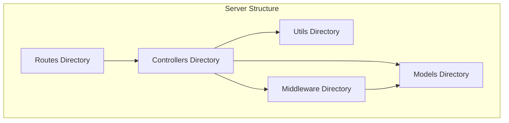
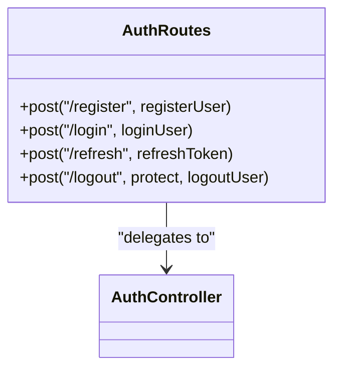
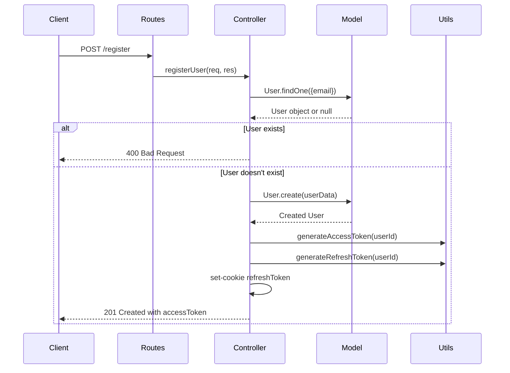
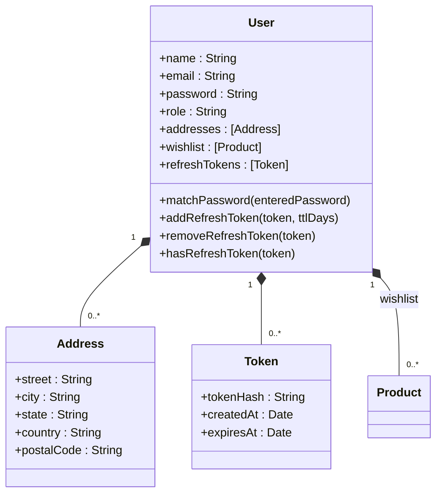
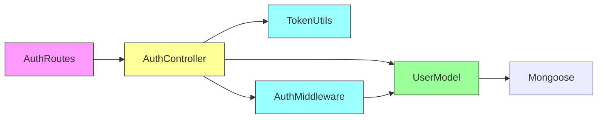

# MVC Architecture Implementation

<cite>
**Referenced Files in This Document**  
- [Auth.routes.js](file://server/src/routes/Auth.routes.js)
- [Auth.controller.js](file://server/src/controllers/Auth.controller.js)
- [User.model.js](file://server/src/models/User.model.js)
- [Auth.middleware.js](file://server/src/middleware/Auth.middleware.js)
- [token.js](file://server/src/utils/token.js)
</cite>

## Table of Contents
1. [Introduction](#introduction)
2. [Project Structure](#project-structure)
3. [Core Components](#core-components)
4. [Architecture Overview](#architecture-overview)
5. [Detailed Component Analysis](#detailed-component-analysis)
6. [Dependency Analysis](#dependency-analysis)
7. [Performance Considerations](#performance-considerations)
8. [Troubleshooting Guide](#troubleshooting-guide)
9. [Conclusion](#conclusion)

## Introduction
This document provides comprehensive documentation for the Model-View-Controller (MVC) pattern implementation in the backend of the VnV24 application. The architecture follows a clear separation of concerns between routes (handling HTTP requests), controllers (implementing business logic), and models (managing data and database interactions). The authentication module serves as the primary example to illustrate the complete flow from route definition to controller action to model operation. The documentation covers naming conventions, file organization, import patterns, request validation, and error propagation across layers.

## Project Structure
The backend follows a clean, modular structure with distinct directories for each MVC component. The `routes` directory contains route definitions that map HTTP endpoints to controller functions. The `controllers` directory houses business logic implementations that process requests and interact with models. The `models` directory manages data structures and database operations through Mongoose schemas. Utility functions and middleware are organized in separate directories to maintain separation of concerns.



**Diagram sources**
- [Auth.routes.js](file://server/src/routes/Auth.routes.js)
- [Auth.controller.js](file://server/src/controllers/Auth.controller.js)
- [User.model.js](file://server/src/models/User.model.js)

**Section sources**
- [Auth.routes.js](file://server/src/routes/Auth.routes.js)
- [Auth.controller.js](file://server/src/controllers/Auth.controller.js)
- [User.model.js](file://server/src/models/User.model.js)

## Core Components
The MVC implementation consists of three primary components: routes handle HTTP request routing, controllers implement business logic and coordinate between routes and models, and models manage data persistence and validation. This separation enables maintainable, testable, and scalable code. The authentication flow demonstrates how these components work together - routes receive HTTP requests, controllers process the business logic, and models handle user data operations.

**Section sources**
- [Auth.routes.js](file://server/src/routes/Auth.routes.js)
- [Auth.controller.js](file://server/src/controllers/Auth.controller.js)
- [User.model.js](file://server/src/models/User.model.js)

## Architecture Overview
The MVC architecture implements a clear separation of concerns with well-defined boundaries between layers. Routes act as the entry point, receiving HTTP requests and delegating to appropriate controllers. Controllers contain the business logic, validating input, coordinating operations, and interacting with models. Models manage data persistence, validation, and database operations through Mongoose schemas. Middleware components provide cross-cutting concerns like authentication and input sanitization.

```mermaid
graph TB
Client[HTTP Client] --> |POST /register| Routes
Routes --> |registerUser| Controllers
Controllers --> |User.create()| Models
Models --> |MongoDB| Database[(Database)]
Models --> |success| Controllers
Controllers --> |set-cookie| Routes
Routes --> |201 Created| Client
style Client fill:#f9f,stroke:#333
style Database fill:#bbf,stroke:#333
```

**Diagram sources**
- [Auth.routes.js](file://server/src/routes/Auth.routes.js#L1-L20)
- [Auth.controller.js](file://server/src/controllers/Auth.controller.js#L12-L27)
- [User.model.js](file://server/src/models/User.model.js#L30-L35)

## Detailed Component Analysis

### Authentication Flow Analysis
The authentication module exemplifies the MVC pattern through its implementation of user registration and login functionality. The flow begins with route definitions that map HTTP endpoints to controller functions, continues with controllers implementing business logic, and concludes with models handling data operations.

#### Route Definitions
The route layer defines the HTTP endpoints and maps them to controller functions. This layer is responsible for request routing and does not contain business logic. The authentication routes are defined using Express Router, with each endpoint mapped to a specific controller function.



**Diagram sources**
- [Auth.routes.js](file://server/src/routes/Auth.routes.js#L1-L20)

**Section sources**
- [Auth.routes.js](file://server/src/routes/Auth.routes.js#L1-L20)

#### Controller Implementation
The controller layer implements the business logic for authentication operations. Controllers receive request data, validate inputs, interact with models, and prepare responses. The authentication controller handles user registration, login, token refresh, and logout operations, coordinating between the route layer and model layer.



**Diagram sources**
- [Auth.controller.js](file://server/src/controllers/Auth.controller.js#L12-L27)
- [User.model.js](file://server/src/models/User.model.js#L30-L35)
- [token.js](file://server/src/utils/token.js#L2-L8)

**Section sources**
- [Auth.controller.js](file://server/src/controllers/Auth.controller.js#L12-L65)

#### Model Operations
The model layer manages data persistence and validation through Mongoose schemas. The User model defines the data structure, enforces validation rules, and implements data access methods. It handles password hashing, token management, and database operations while maintaining data integrity.



**Diagram sources**
- [User.model.js](file://server/src/models/User.model.js#L12-L64)

**Section sources**
- [User.model.js](file://server/src/models/User.model.js#L12-L64)

## Dependency Analysis
The MVC components maintain clean boundaries through explicit import patterns and dependency management. Routes import controllers, controllers import models and utility functions, and models have minimal external dependencies. This dependency hierarchy ensures loose coupling and high cohesion within the architecture.



**Diagram sources**
- [Auth.routes.js](file://server/src/routes/Auth.routes.js)
- [Auth.controller.js](file://server/src/controllers/Auth.controller.js)
- [User.model.js](file://server/src/models/User.model.js)
- [token.js](file://server/src/utils/token.js)
- [Auth.middleware.js](file://server/src/middleware/Auth.middleware.js)

**Section sources**
- [Auth.routes.js](file://server/src/routes/Auth.routes.js)
- [Auth.controller.js](file://server/src/controllers/Auth.controller.js)
- [User.model.js](file://server/src/models/User.model.js)
- [token.js](file://server/src/utils/token.js)
- [Auth.middleware.js](file://server/src/middleware/Auth.middleware.js)

## Performance Considerations
The MVC architecture supports performance optimization through caching, database indexing, and efficient request handling. The separation of concerns enables targeted optimizations at each layer. Controllers can implement response caching, models can leverage database indexes, and routes can implement rate limiting. The authentication flow benefits from token-based authentication, reducing database queries for authenticated requests.

## Troubleshooting Guide
Common issues in the MVC implementation typically involve route-controller mismatches, controller-model interface errors, or model validation failures. When debugging authentication issues, check the request flow from route to controller to model, verify input validation, and ensure proper error propagation. The layered architecture simplifies troubleshooting by isolating concerns to specific components.

**Section sources**
- [Auth.routes.js](file://server/src/routes/Auth.routes.js)
- [Auth.controller.js](file://server/src/controllers/Auth.controller.js)
- [User.model.js](file://server/src/models/User.model.js)

## Conclusion
The MVC architecture implementation provides a robust foundation for the backend application, enabling maintainability, testability, and scalability. The clear separation of concerns between routes, controllers, and models allows for independent development and testing of components. The authentication module demonstrates how the pattern facilitates clean, organized code that is easy to understand and modify. This architectural approach supports the long-term evolution of the application while maintaining code quality and developer productivity.