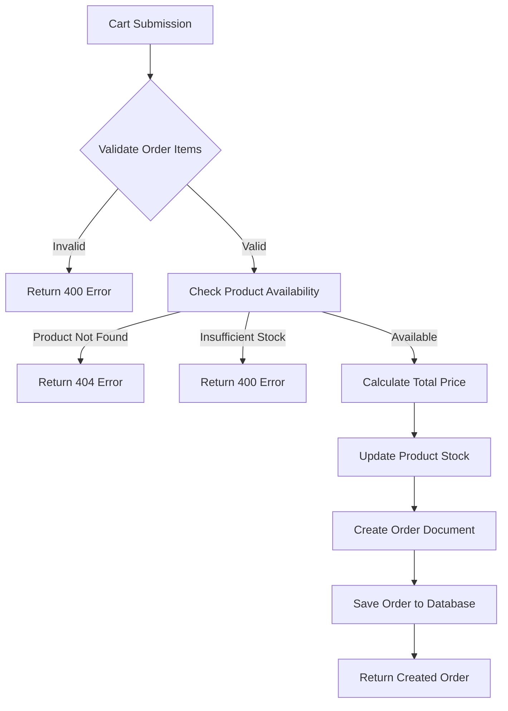
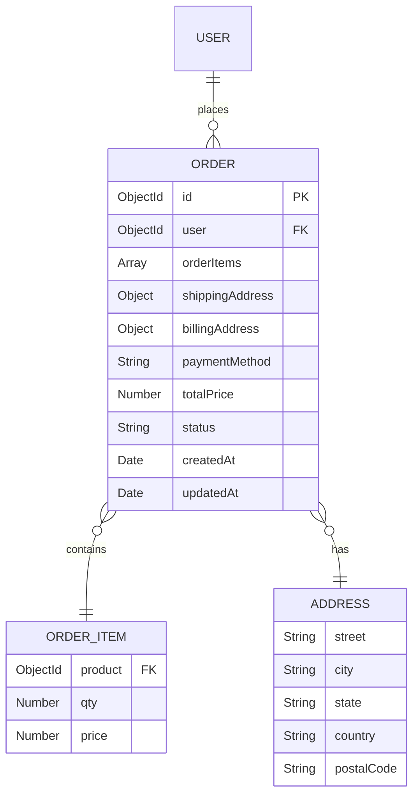
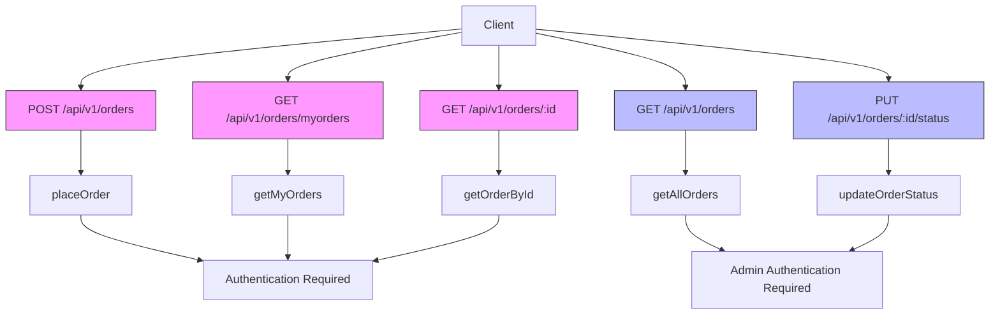
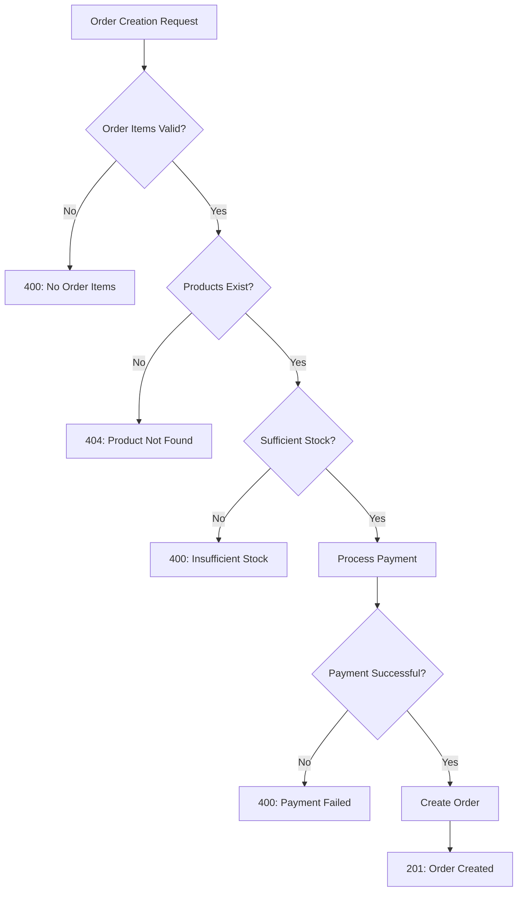

# Order Processing Module

<cite>
**Referenced Files in This Document**   
- [Order.controller.js](file://server/src/controllers/Order.controller.js)
- [Order.model.js](file://server/src/models/Order.model.js)
- [Order.routes.js](file://server/src/routes/Order.routes.js)
- [Product.model.js](file://server/src/models/Product.model.js)
- [User.model.js](file://server/src/models/User.model.js)
</cite>

## Table of Contents
1. [Order Processing Flow](#order-processing-flow)
2. [Order Schema Structure](#order-schema-structure)
3. [API Endpoints](#api-endpoints)
4. [Request and Response Examples](#request-and-response-examples)
5. [Payment Integration](#payment-integration)
6. [Error Handling](#error-handling)

## Order Processing Flow

The order processing flow begins when a user submits their cart from the checkout page. The request is handled by the `placeOrder` function in Order.controller.js, which performs several critical operations in sequence. First, it validates that order items exist and are not empty. Then, for each item in the order, the system retrieves the corresponding product from the database using Product.findById() to verify its existence and check stock availability. If any product is not found or has insufficient stock, the process terminates with an appropriate error response.

When inventory validation passes, the system calculates the total price by multiplying each product's price by its quantity. The product stock levels are decremented accordingly and saved back to the database. An order document is then created with references to the user, order items, shipping and billing addresses, payment method, and calculated total price. The order status is automatically set to "pending" by default. Finally, the order is saved to the database and returned to the client with a 201 Created status.

**Diagram sources**
- [Order.controller.js](file://server/src/controllers/Order.controller.js#L6-L46)

**Section sources**
- [Order.controller.js](file://server/src/controllers/Order.controller.js#L6-L46)
- [Product.model.js](file://server/src/models/Product.model.js#L1-L18)

## Order Schema Structure

The order data structure is defined in Order.model.js and consists of several key components. The schema includes a reference to the user who placed the order, an array of order items, shipping and billing addresses, payment method, total price, and order status with timestamp tracking. Each order item contains a reference to the product, quantity ordered, and price at the time of purchase (captured to maintain pricing history).

The address fields use a nested schema that includes street, city, state, country, and postal code. The order status field is an enumeration with predefined values: "pending", "processing", "shipped", "delivered", and "cancelled", with "pending" as the default state. The schema also includes automatic timestamp fields (createdAt and updatedAt) through the { timestamps: true } option.

**Diagram sources**
- [Order.model.js](file://server/src/models/Order.model.js#L2-L35)

**Section sources**
- [Order.model.js](file://server/src/models/Order.model.js#L2-L35)
- [User.model.js](file://server/src/models/User.model.js#L2-L65)
- [Product.model.js](file://server/src/models/Product.model.js#L1-L18)

## API Endpoints

The order processing module exposes several RESTful endpoints through Order.routes.js, each protected by authentication middleware. The POST /api/v1/orders endpoint creates a new order and is accessible only to authenticated users. Users can retrieve their own orders through GET /api/v1/orders/myorders, while the GET /api/v1/orders/:id endpoint allows users to fetch specific order details (accessible only to the order owner or admin users).

Administrative functionality is provided through two admin-only endpoints. The GET /api/v1/orders endpoint returns all orders in the system with populated user information, enabling admin users to view the complete order history. The PUT /api/v1/orders/:id/status endpoint allows admin users to update the status of any order, facilitating order management and fulfillment tracking.

**Diagram sources**
- [Order.routes.js](file://server/src/routes/Order.routes.js#L1-L22)
- [Order.controller.js](file://server/src/controllers/Order.controller.js#L6-L107)

**Section sources**
- [Order.routes.js](file://server/src/routes/Order.routes.js#L1-L22)
- [Order.controller.js](file://server/src/controllers/Order.controller.js#L6-L107)

## Request and Response Examples

The checkout page sends a POST request to /api/v1/orders with a JSON payload containing order items, shipping and billing addresses, and payment method. A typical request includes an array of order items, each with a product ID and quantity. The response contains the created order document with a success flag and the complete order details including the generated order ID, timestamps, and current status.

For order retrieval, authenticated users receive different responses based on their role and the endpoint accessed. Regular users can view their own order history through /myorders, while admin users can access all orders in the system. The getOrderById endpoint returns detailed information about a specific order, including populated user data. When updating order status, admins send a PUT request with the new status value, receiving the updated order object in response.

**Section sources**
- [Order.controller.js](file://server/src/controllers/Order.controller.js#L6-L107)
- [Order.model.js](file://server/src/models/Order.model.js#L2-L35)

## Payment Integration

While the current implementation captures the payment method in the order record, the actual payment processing integration with gateways like Stripe or Razorpay would extend this functionality. The order creation process would be modified to first authorize payment through the chosen gateway before proceeding with inventory updates and order creation. This ensures that orders are only created for successfully processed payments.

The payment integration would involve adding service functions to handle communication with payment APIs, managing payment intents, and processing webhooks for payment confirmation. Upon successful payment authorization, the system would proceed with the existing order creation logic. Failed payments would be captured in the order record with an appropriate status, allowing for retry mechanisms or customer notification.

**Section sources**
- [Order.controller.js](file://server/src/controllers/Order.controller.js#L6-L46)

## Error Handling

The order processing module implements comprehensive error handling for various failure scenarios. For inventory-related issues, the system checks both product existence and stock availability before proceeding with order creation. If a requested product is not found, a 404 Not Found response is returned. When stock is insufficient for any item, a 400 Bad Request response with a descriptive message is sent to the client.

Other validation errors include checking for empty order items, which triggers a 400 response if no items are provided. Authentication and authorization errors are handled by the middleware layer, returning 401 Unauthorized for unauthenticated requests and 403 Forbidden for unauthorized access attempts (such as a regular user trying to access another user's order or update order status without admin privileges). The controller uses a try-catch block to handle unexpected errors, passing them to the error-handling middleware.

**Diagram sources**
- [Order.controller.js](file://server/src/controllers/Order.controller.js#L6-L46)

**Section sources**
- [Order.controller.js](file://server/src/controllers/Order.controller.js#L6-L46)
- [Auth.middleware.js](file://server/src/middleware/Auth.middleware.js)