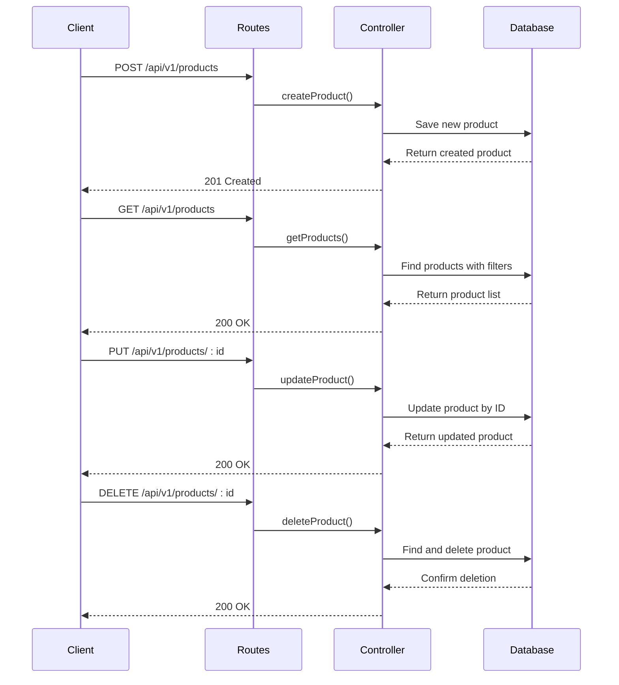
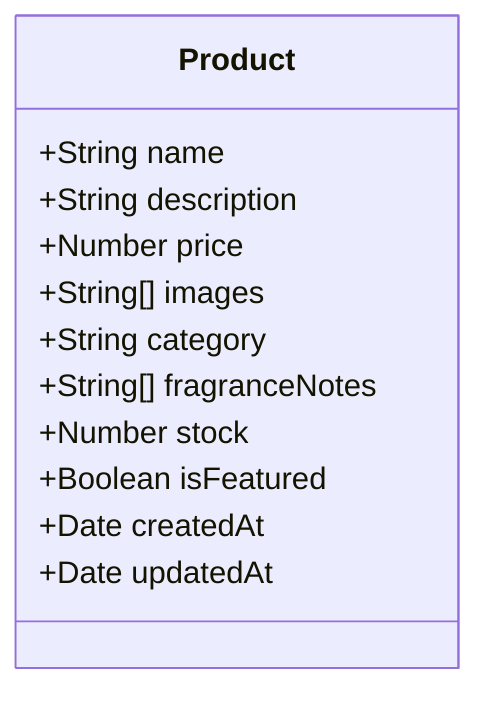
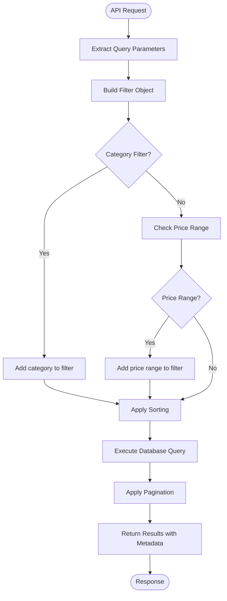
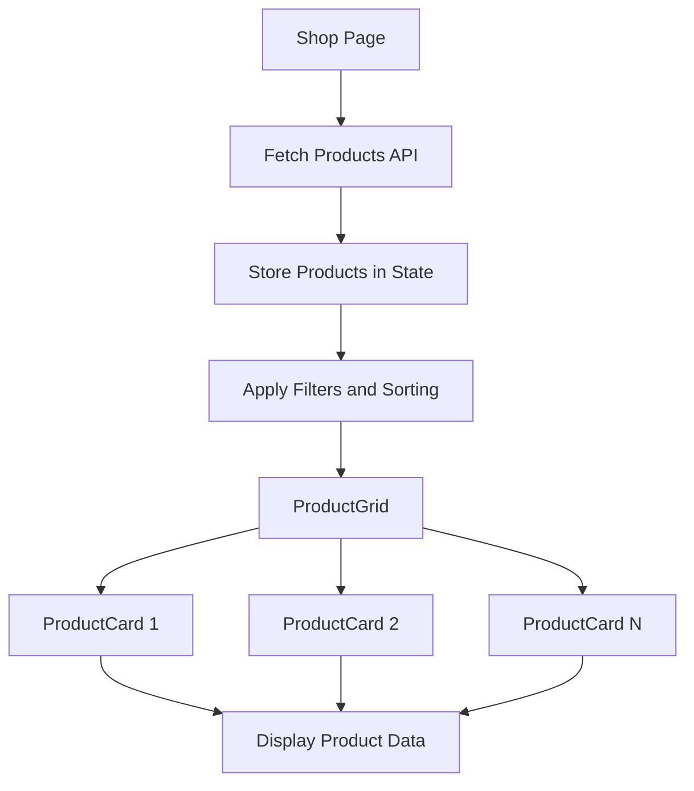

# Product Management Module

<cite>
**Referenced Files in This Document**   
- [Product.routes.js](file://server/src/routes/Product.routes.js)
- [Product.controller.js](file://server/src/controllers/Product.controller.js)
- [Product.model.js](file://server/src/models/Product.model.js)
- [ProductCard.js](file://client/app/components/shared/ProductCard.js)
- [ProductGrid.js](file://client/app/components/Shop/ProductGrid.js)
- [SortDropdown.js](file://client/app/components/Shop/SortDropdown.js)
- [shop/page.js](file://client/app/shop/page.js)
- [shop/[productId]/page.js](file://client/app/shop/[productId]/page.js)
</cite>

## Table of Contents
1. [Introduction](#introduction)
2. [CRUD Operations Implementation](#crud-operations-implementation)
3. [Product Model Schema](#product-model-schema)
4. [Filtering, Sorting, and Searching](#filtering-sorting-and-searching)
5. [API Request/Response Examples](#api-requestresponse-examples)
6. [Frontend Integration](#frontend-integration)
7. [Validation and Error Handling](#validation-and-error-handling)
8. [Performance Considerations](#performance-considerations)
9. [Extensibility and Future Enhancements](#extensibility-and-future-enhancements)

## Introduction
The Product Management Module provides a comprehensive system for managing product data in an e-commerce application. It includes backend API endpoints for CRUD operations, a well-defined data model, and frontend integration for product display and interaction. The module supports essential e-commerce features including product categorization, pricing, inventory management, and media handling through Cloudinary integration.

**Section sources**
- [Product.routes.js](file://server/src/routes/Product.routes.js)
- [Product.controller.js](file://server/src/controllers/Product.controller.js)
- [Product.model.js](file://server/src/models/Product.model.js)

## CRUD Operations Implementation

The product management system implements standard CRUD (Create, Read, Update, Delete) operations through a well-structured API. The routing is defined in `Product.routes.js` which maps HTTP methods to corresponding controller actions in `Product.controller.js`.

### Create Operation
The create operation allows administrators to add new products to the catalog. The endpoint accepts a POST request with product data in the request body. The controller validates the input and creates a new product document in the database.

### Read Operations
Two read operations are implemented:
- **Get all products**: Retrieves a paginated list of products with optional filtering and sorting
- **Get product by ID**: Retrieves a specific product by its unique identifier

### Update Operation
The update operation allows administrators to modify existing product information. The system implements partial updates, meaning only the fields provided in the request body are updated.

### Delete Operation
The delete operation removes a product from the catalog. The system first verifies the product exists before performing the deletion.



**Diagram sources**
- [Product.routes.js](file://server/src/routes/Product.routes.js)
- [Product.controller.js](file://server/src/controllers/Product.controller.js)

**Section sources**
- [Product.routes.js](file://server/src/routes/Product.routes.js#L1-L23)
- [Product.controller.js](file://server/src/controllers/Product.controller.js#L51-L108)

## Product Model Schema

The product data structure is defined in the `Product.model.js` file using Mongoose schema. The schema includes essential fields for e-commerce functionality with appropriate data types and validation rules.

### Core Fields
- **name**: String, required - Product name
- **description**: String - Product description
- **price**: Number, required - Product price in INR
- **images**: Array of Strings - URLs of product images stored in Cloudinary
- **category**: String, required - Product category
- **fragranceNotes**: Array of Strings - Specific to fragrance products
- **stock**: Number, default: 0 - Inventory count
- **isFeatured**: Boolean, default: false - Featured product status

### Timestamps
The schema includes automatic timestamp generation with `createdAt` and `updatedAt` fields, providing audit trail capabilities for product records.



**Diagram sources**
- [Product.model.js](file://server/src/models/Product.model.js#L1-L18)

**Section sources**
- [Product.model.js](file://server/src/models/Product.model.js#L1-L18)

## Filtering, Sorting, and Searching

The product API supports comprehensive filtering, sorting, and pagination capabilities to enhance the user experience and optimize data retrieval.

### Filtering
Products can be filtered by:
- **Category**: Exact match filtering
- **Price range**: Using `price_min` and `price_max` query parameters
- **Pagination**: Using `page` and `limit` parameters

### Sorting
The API supports sorting by any field, with a default sort by creation date (newest first). The frontend implements client-side sorting for price-based ordering.

### Search Implementation
While not explicitly implemented in the current API, the filtering system provides the foundation for search functionality that could be extended to include text-based search across product names and descriptions.



**Diagram sources**
- [Product.controller.js](file://server/src/controllers/Product.controller.js#L5-L36)

**Section sources**
- [Product.controller.js](file://server/src/controllers/Product.controller.js#L5-L36)
- [SortDropdown.js](file://client/app/components/Shop/SortDropdown.js)

## API Request/Response Examples

### Get All Products
**Request**
```
GET /api/v1/products?category=Perfumes&price_min=5000&price_max=8000&page=1&limit=10&sort=price
```

**Response**
```json
{
  "success": true,
  "page": 1,
  "pages": 3,
  "total": 25,
  "data": [
    {
      "_id": "60d5ec49f1a62f2d8c9d8b1a",
      "name": "Classic Oud",
      "description": "Luxurious oud fragrance with rich woody notes",
      "price": 7999,
      "images": [
        "https://res.cloudinary.com/demo/image/upload/v1/classic-oud.jpg"
      ],
      "category": "Perfumes",
      "fragranceNotes": ["Oud", "Sandalwood", "Amber"],
      "stock": 15,
      "isFeatured": true,
      "createdAt": "2023-06-25T10:30:00.000Z",
      "updatedAt": "2023-06-25T10:30:00.000Z"
    }
  ]
}
```

### Get Product by ID
**Request**
```
GET /api/v1/products/60d5ec49f1a62f2d8c9d8b1a
```

**Response**
```json
{
  "success": true,
  "data": {
    "_id": "60d5ec49f1a62f2d8c9d8b1a",
    "name": "Classic Oud",
    "description": "Luxurious oud fragrance with rich woody notes",
    "price": 7999,
    "images": [
      "https://res.cloudinary.com/demo/image/upload/v1/classic-oud.jpg"
    ],
    "category": "Perfumes",
    "fragranceNotes": ["Oud", "Sandalwood", "Amber"],
    "stock": 15,
    "isFeatured": true,
    "createdAt": "2023-06-25T10:30:00.000Z",
    "updatedAt": "2023-06-25T10:30:00.000Z"
  }
}
```

**Section sources**
- [Product.controller.js](file://server/src/controllers/Product.controller.js#L5-L49)

## Frontend Integration

The product data is integrated with the frontend shop pages through a component-based architecture that ensures consistent display and interaction patterns.

### Component Hierarchy
- **Shop Page**: Main product listing page with filtering and sorting controls
- **ProductGrid**: Grid layout component that displays multiple products
- **ProductCard**: Individual product display component with image, name, price, and category
- **SortDropdown**: UI component for sorting options

### Data Flow
The frontend fetches product data from the API and passes it through the component hierarchy for display. The shop page manages state for filtering and sorting, while individual components handle their specific display logic.



**Diagram sources**
- [shop/page.js](file://client/app/shop/page.js)
- [ProductGrid.js](file://client/app/components/Shop/ProductGrid.js)
- [ProductCard.js](file://client/app/components/shared/ProductCard.js)

**Section sources**
- [shop/page.js](file://client/app/shop/page.js)
- [ProductGrid.js](file://client/app/components/Shop/ProductGrid.js)
- [ProductCard.js](file://client/app/components/shared/ProductCard.js)

## Validation and Error Handling

The product management system implements robust validation and error handling to ensure data integrity and provide meaningful feedback to users.

### Input Validation
- Required fields validation (name, price, category)
- Data type validation (numeric prices, string fields)
- Range validation for price filtering
- Authentication and authorization checks for admin operations

### Error Handling
- **404 Not Found**: When attempting to access a non-existent product
- **400 Bad Request**: For invalid input data
- **500 Internal Server Error**: For unexpected server errors
- Comprehensive error logging for debugging purposes

### Out-of-Stock Handling
The system tracks stock levels and can be extended to implement out-of-stock indicators or prevent purchases when inventory is depleted. The current implementation includes stock as a field but does not enforce business rules around stock availability.

**Section sources**
- [Product.controller.js](file://server/src/controllers/Product.controller.js)
- [Product.model.js](file://server/src/models/Product.model.js)

## Performance Considerations

The product catalog queries are optimized for performance through several strategies:

### Database Optimization
- **Indexing**: Fields used in filtering (category, price) should be indexed
- **Pagination**: Limits the number of records returned in a single request
- **Projection**: Returns only necessary fields to reduce payload size

### Query Optimization
- Efficient filtering using MongoDB's query operators
- Sorting at the database level to leverage indexes
- Count queries for pagination metadata

### Caching Strategy
While not explicitly implemented, the architecture supports caching at multiple levels:
- API response caching
- Database query result caching
- CDN caching for product images

### Scalability
The current implementation can handle moderate product catalogs. For larger catalogs, additional optimizations could include:
- Database sharding
- Read replicas for high-traffic scenarios
- Advanced caching layers
- Asynchronous processing for heavy operations

**Section sources**
- [Product.controller.js](file://server/src/controllers/Product.controller.js#L5-L36)

## Extensibility and Future Enhancements

The product model and API are designed to be extensible, allowing for future enhancements and additional product attributes.

### Adding New Attributes
New fields can be added to the product schema to support additional product information:
- Weight and dimensions for shipping calculations
- Brand information
- Supplier details
- Custom product attributes

### Product Variants
The system can be extended to support product variants (different sizes, colors, etc.) by:
- Creating a nested variants array within the product document
- Implementing a separate variants collection with references to products
- Adding variant-specific pricing and inventory tracking

### Enhanced Media Management
Future improvements could include:
- Multiple image galleries with thumbnails
- Video content for product demonstrations
- 360-degree product views
- User-generated content integration

### Advanced Features
Potential enhancements include:
- Product recommendations engine
- Dynamic pricing rules
- Inventory management workflows
- Integration with external product data sources

**Section sources**
- [Product.model.js](file://server/src/models/Product.model.js)
- [Product.controller.js](file://server/src/controllers/Product.controller.js)