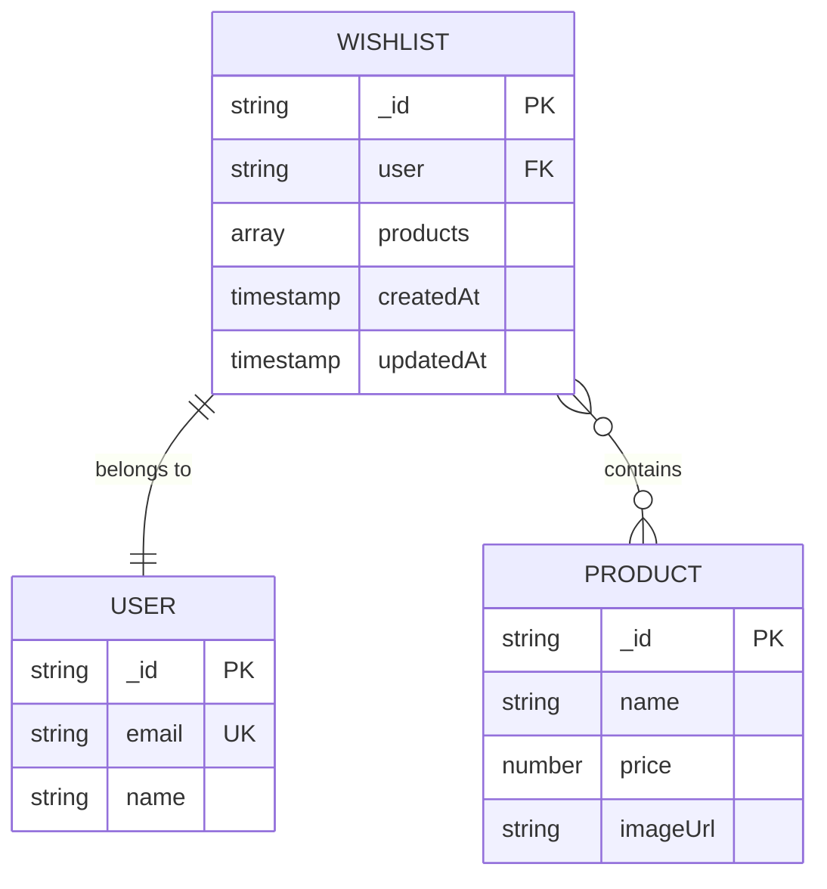
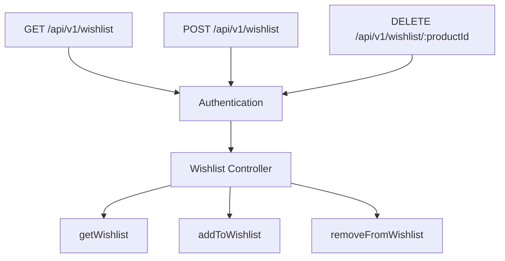
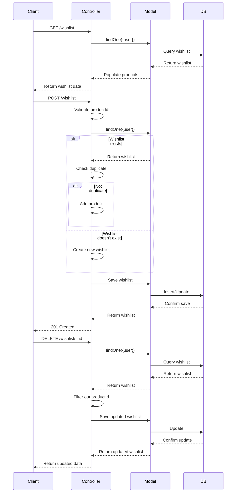
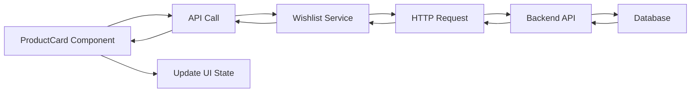
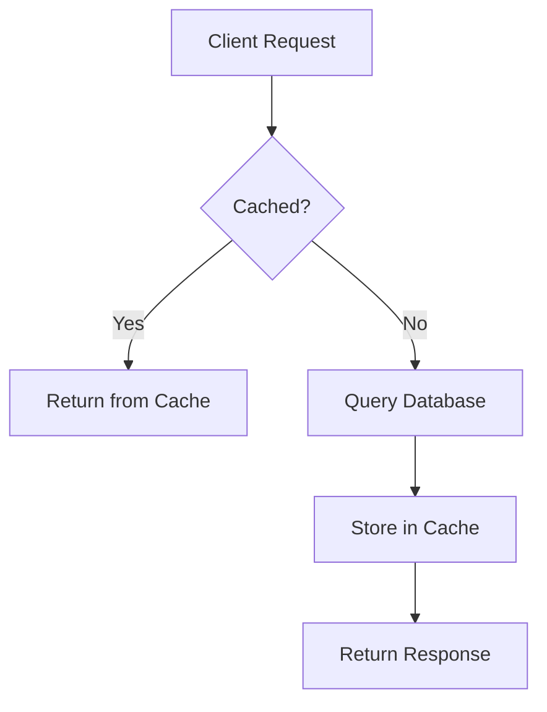

# Wishlist Module

<cite>
**Referenced Files in This Document**   
- [Wishlist.model.js](file://server/src/models/Wishlist.model.js)
- [Wishlist.controller.js](file://server/src/controllers/Wishlist.controller.js)
- [Wishlist.routes.js](file://server/src/routes/Wishlist.routes.js)
- [User.model.js](file://server/src/models/User.model.js)
- [ProductCard.js](file://client/app/components/shared/ProductCard.js)
</cite>

## Table of Contents
1. [Introduction](#introduction)
2. [Wishlist Model Schema Design](#wishlist-model-schema-design)
3. [Wishlist Routes and API Endpoints](#wishlist-routes-and-api-endpoints)
4. [Controller Business Logic](#controller-business-logic)
5. [API Contract and Error Handling](#api-contract-and-error-handling)
6. [Frontend Integration and State Synchronization](#frontend-integration-and-state-synchronization)
7. [Persistent Storage and Session Management](#persistent-storage-and-session-management)
8. [Integration with Product Model Validation](#integration-with-product-model-validation)
9. [Performance Considerations and Caching Strategies](#performance-considerations-and-caching-strategies)
10. [Conclusion](#conclusion)

## Introduction
The Wishlist module enables authenticated users to manage a personalized collection of products they wish to purchase later. It provides a RESTful API for adding, removing, and retrieving wishlist items, backed by persistent storage using MongoDB. The module integrates with user authentication, product validation, and frontend components to deliver a seamless user experience. This document details the implementation of the model, controller, and routes, along with API contracts, frontend integration patterns, and performance optimization strategies.

## Wishlist Model Schema Design
The Wishlist model defines a dedicated collection for storing user-specific product wishlists, establishing a one-to-one relationship between users and their wishlists.

**Diagram sources**  
- [Wishlist.model.js](file://server/src/models/Wishlist.model.js#L3-L10)
- [User.model.js](file://server/src/models/User.model.js#L25-L44)

The schema includes:
- `user`: Required reference to the User model, ensuring each wishlist is tied to a specific user
- `products`: Array of Product model ObjectIds, enabling efficient population of product details
- `timestamps`: Automatic creation and update timestamps for audit and caching purposes

This design centralizes wishlist data in a separate collection, improving query performance and scalability compared to embedding wishlist data within the User model.

**Section sources**  
- [Wishlist.model.js](file://server/src/models/Wishlist.model.js#L1-L12)

## Wishlist Routes and API Endpoints
The Wishlist routes define a clean RESTful interface for managing wishlist data, with proper authentication enforcement.

**Diagram sources**  
- [Wishlist.routes.js](file://server/src/routes/Wishlist.routes.js#L7-L14)

The module exposes three endpoints:
- `GET /api/v1/wishlist`: Retrieves the authenticated user's wishlist with populated product details
- `POST /api/v1/wishlist`: Adds a product to the user's wishlist, creating the wishlist if it doesn't exist
- `DELETE /api/v1/wishlist/:productId`: Removes a specific product from the user's wishlist

All routes are protected by the `protect` middleware, ensuring only authenticated users can access wishlist functionality. The routes follow REST conventions with appropriate HTTP methods and status codes.

**Section sources**  
- [Wishlist.routes.js](file://server/src/routes/Wishlist.routes.js#L1-L16)

## Controller Business Logic
The Wishlist controller implements the core business logic for managing wishlist operations, handling edge cases and data consistency.

**Diagram sources**  
- [Wishlist.controller.js](file://server/src/controllers/Wishlist.controller.js#L7-L56)

The controller functions handle the following logic:
- `getWishlist`: Finds the user's wishlist and populates product details, returning an empty products array if no wishlist exists
- `addToWishlist`: Validates the productId, creates a new wishlist if none exists, and adds the product only if it's not already present
- `removeFromWishlist`: Finds the user's wishlist and removes the specified product using array filtering

The implementation ensures data consistency by checking for existing wishlists and preventing duplicate entries.

**Section sources**  
- [Wishlist.controller.js](file://server/src/controllers/Wishlist.controller.js#L1-L58)

## API Contract and Error Handling
The Wishlist API follows a consistent contract with standardized request/response formats and error conditions.

### API Endpoints Specification

| Endpoint | Method | Authentication | Request Body | Response Status | Response Format |
|---------|--------|----------------|--------------|-----------------|-----------------|
| `/api/v1/wishlist` | GET | Required | None | 200 OK | `{success: true, data: {products: []}}` |
| `/api/v1/wishlist` | POST | Required | `{productId: string}` | 201 Created | `{success: true, data: wishlist}` |
| `/api/v1/wishlist/:productId` | DELETE | Required | None | 200 OK | `{success: true, data: wishlist}` |

### Error Conditions
- **400 Bad Request**: Missing productId in request body for POST requests
- **401 Unauthorized**: Missing or invalid authentication token
- **404 Not Found**: User's wishlist not found during DELETE operation
- **500 Internal Server Error**: Database or server-side errors

The API returns consistent JSON responses with a `success` flag, `data` payload, and optional `message` for error conditions. The POST endpoint returns a 201 status code to indicate successful resource creation.

**Section sources**  
- [Wishlist.controller.js](file://server/src/controllers/Wishlist.controller.js#L19-L36)
- [Wishlist.controller.js](file://server/src/controllers/Wishlist.controller.js#L41-L56)

## Frontend Integration and State Synchronization
The frontend integrates with the Wishlist API to provide a seamless user experience, synchronizing wishlist state between client and server.

**Diagram sources**  
- [ProductCard.js](file://client/app/components/shared/ProductCard.js#L1-L41)
- [Wishlist.controller.js](file://server/src/controllers/Wishlist.controller.js#L7-L56)

The `ProductCard` component demonstrates how wishlist functionality is integrated into the UI:
- Each product card includes a mechanism to add/remove items from the wishlist
- Clicking the wishlist action triggers an API call to the corresponding endpoint
- Upon successful response, the UI state is updated to reflect the current wishlist status
- The component can display wishlist state (e.g., filled vs. empty heart icon) based on whether the product is in the user's wishlist

State synchronization occurs through:
1. Initial loading of wishlist data when the user logs in
2. Real-time updates after each add/remove operation
3. Periodic refreshes to ensure consistency between client and server state

**Section sources**  
- [ProductCard.js](file://client/app/components/shared/ProductCard.js#L1-L41)

## Persistent Storage and Session Management
The Wishlist module ensures persistent storage of user preferences across sessions through database persistence and authentication integration.

The wishlist data is stored in MongoDB with the following persistence characteristics:
- **Durability**: Data is written to the database on every modification
- **Consistency**: Transactions ensure atomic updates to the wishlist
- **Availability**: The wishlist is accessible whenever the user is authenticated

Session management is handled through:
- Authentication tokens that identify the user across requests
- User ID references in the wishlist document that link to the authenticated user
- Automatic creation of wishlists for new users upon first addition

When a user logs in from any device, their wishlist is retrieved from the database, ensuring a consistent experience across devices and sessions. The timestamps field enables tracking of when items were added, which can be used for features like "recently added" sorting.

**Section sources**  
- [Wishlist.model.js](file://server/src/models/Wishlist.model.js#L3-L10)
- [Wishlist.controller.js](file://server/src/controllers/Wishlist.controller.js#L19-L36)

## Integration with Product Model Validation
The Wishlist module integrates with the Product model to ensure data integrity and prevent invalid references.

The integration occurs through:
- **Reference Validation**: The `products` array in the Wishlist model references the Product model, ensuring only valid product IDs can be stored
- **Population**: The `getWishlist` controller method uses Mongoose's `populate()` to replace product IDs with actual product data from the Product model
- **Data Consistency**: If a product is deleted from the Product collection, it remains in the wishlist but will not be populated, maintaining historical data while indicating the product is no longer available

This approach ensures that:
- Users can only add existing products to their wishlist
- Product details displayed in the wishlist are always up-to-date
- The system gracefully handles product deletions without breaking the wishlist functionality

The integration leverages Mongoose's built-in reference and population features, reducing the need for manual validation and joins.

**Section sources**  
- [Wishlist.model.js](file://server/src/models/Wishlist.model.js#L6)
- [Wishlist.controller.js](file://server/src/controllers/Wishlist.controller.js#L8)

## Performance Considerations and Caching Strategies
The Wishlist module implements several performance optimizations to ensure responsive user experiences.

### Performance Analysis
- **Database Queries**: Each operation requires at most two database queries (find + save)
- **Indexing**: The `user` field should be indexed for fast lookups
- **Population Overhead**: Populating product details adds query time but reduces client-server round trips

### Recommended Caching Strategies

**Diagram sources**  
- [Wishlist.controller.js](file://server/src/controllers/Wishlist.controller.js#L7-L14)

Recommended caching approaches:
- **Client-Side Caching**: Store wishlist data in browser storage (localStorage or sessionStorage) to reduce API calls
- **Server-Side Caching**: Implement Redis or similar in-memory store to cache frequently accessed wishlists
- **Cache Invalidation**: Invalidate cache on add/remove operations to ensure data consistency
- **Time-to-Live (TTL)**: Set appropriate TTL for cached data to balance freshness and performance

Additional optimizations:
- **Indexing**: Create a MongoDB index on the `user` field in the Wishlist collection
- **Projection**: Use field selection to retrieve only necessary data when full population is not required
- **Batch Operations**: Consider implementing batch add/remove endpoints for improved performance when managing multiple items

These strategies ensure the wishlist remains performant even as the user's collection grows.

**Section sources**  
- [Wishlist.controller.js](file://server/src/controllers/Wishlist.controller.js#L7-L56)
- [Wishlist.model.js](file://server/src/models/Wishlist.model.js#L3-L10)