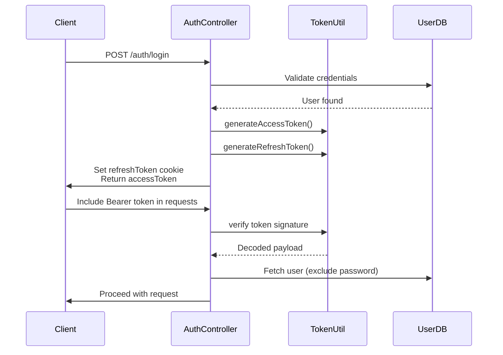
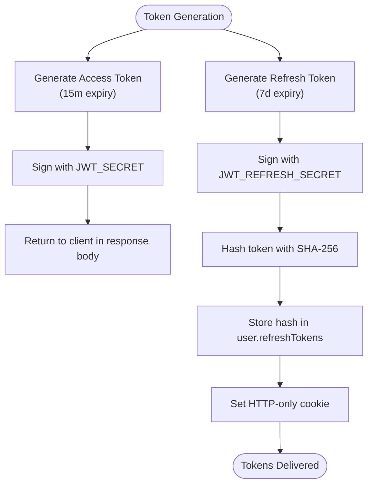
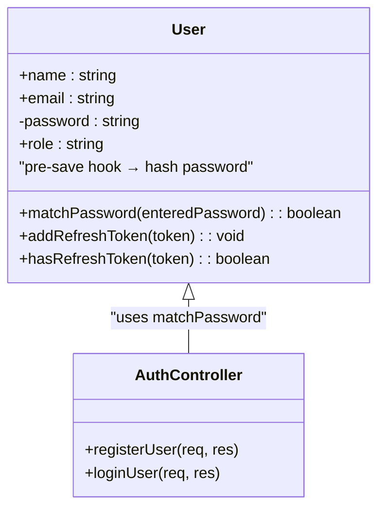
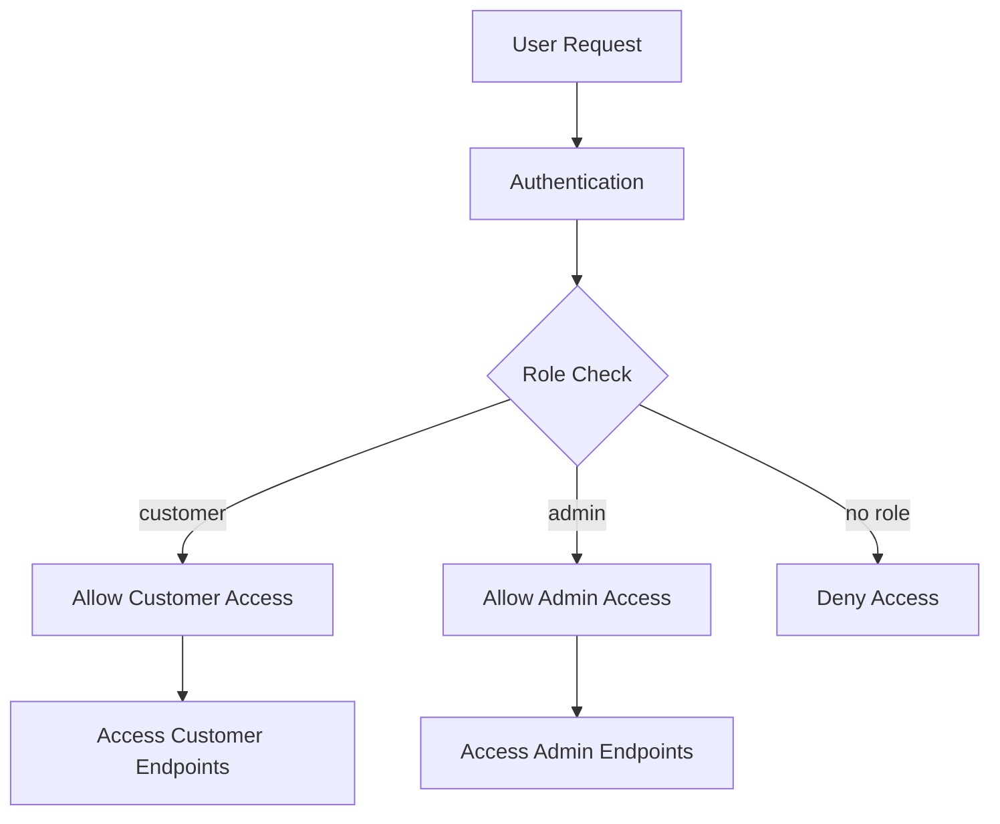

# Security Architecture

<cite>
**Referenced Files in This Document**   
- [Auth.middleware.js](file://server/src/middleware/Auth.middleware.js)
- [token.js](file://server/src/utils/token.js)
- [User.model.js](file://server/src/models/User.model.js)
- [Auth.controller.js](file://server/src/controllers/Auth.controller.js)
</cite>

## Table of Contents
1. [Introduction](#introduction)
2. [JWT-Based Authentication Mechanism](#jwt-based-authentication-mechanism)
3. [Token Generation and Management](#token-generation-and-management)
4. [Authentication Middleware](#authentication-middleware)
5. [Password Hashing Strategy](#password-hashing-strategy)
6. [Secure Cookie Practices](#secure-cookie-practices)
7. [Role-Based Access Control](#role-based-access-control)
8. [Threat Modeling and Countermeasures](#threat-modeling-and-countermeasures)
9. [Environment Variable Management](#environment-variable-management)
10. [Error Handling and Data Exposure Prevention](#error-handling-and-data-exposure-prevention)

## Introduction
This document outlines the security architecture of the backend system, focusing on authentication, authorization, and data protection mechanisms. The system implements a robust JWT-based authentication flow with secure token management, password hashing using bcryptjs, and role-based access control to differentiate customer and admin privileges. Additional security measures include protection against common web vulnerabilities such as XSS, CSRF, and brute force attacks.

## JWT-Based Authentication Mechanism

The backend employs JSON Web Tokens (JWT) for stateless authentication. Upon successful login or registration, users receive an access token and a refresh token. The access token is short-lived (15 minutes), while the refresh token has a longer lifespan (7 days) and is stored securely in an HTTP-only cookie. This dual-token strategy enhances security by minimizing the exposure window of the primary access token while allowing seamless session renewal.



**Diagram sources**
- [Auth.controller.js](file://server/src/controllers/Auth.controller.js#L41-L65)
- [token.js](file://server/src/utils/token.js#L2-L8)
- [Auth.middleware.js](file://server/src/middleware/Auth.middleware.js#L6-L20)

**Section sources**
- [Auth.controller.js](file://server/src/controllers/Auth.controller.js#L41-L65)
- [token.js](file://server/src/utils/token.js#L2-L8)

## Token Generation and Management

Token generation is handled by utility functions in `token.js`. The system uses separate secrets for access and refresh tokens, enhancing security through key separation. Access tokens expire after 15 minutes, reducing the risk of long-term token compromise. Refresh tokens are valid for 7 days and are stored in the database with SHA-256 hashed values for verification.



**Diagram sources**
- [token.js](file://server/src/utils/token.js#L2-L8)
- [User.model.js](file://server/src/models/User.model.js#L45-L55)

**Section sources**
- [token.js](file://server/src/utils/token.js#L2-L8)
- [User.model.js](file://server/src/models/User.model.js#L45-L55)

## Authentication Middleware

The `Auth.middleware.js` file contains two primary middleware functions: `protect` and `isAdmin`. The `protect` middleware validates incoming JWTs from the Authorization header, verifies their signature using the `JWT_SECRET`, and attaches the authenticated user to the request object. The `isAdmin` middleware checks the user's role to enforce admin-only access.

```mermaid
flowchart TD
A([Incoming Request]) --> B{Has Bearer Token?}
B --> |No| C[Return 401 Unauthorized]
B --> |Yes| D[Extract Token from Header]
D --> E[Verify JWT Signature]
E --> F{Valid?}
F --> |No| G[Return 401 Invalid Token]
F --> |Yes| H[Find User by ID]
H --> I{User Exists?}
I --> |No| J[Return 401 Unauthorized]
I --> |Yes| K[Attach User to Request]
K --> L[Call next() middleware]
```

**Diagram sources**
- [Auth.middleware.js](file://server/src/middleware/Auth.middleware.js#L6-L25)

**Section sources**
- [Auth.middleware.js](file://server/src/middleware/Auth.middleware.js#L6-L25)

## Password Hashing Strategy

The system uses bcryptjs to securely hash user passwords before storage. A salt round of 10 is configured, providing a balance between security and performance. Password hashing occurs automatically via a pre-save hook in the User model, ensuring all passwords are encrypted before persistence.



**Diagram sources**
- [User.model.js](file://server/src/models/User.model.js#L30-L45)

**Section sources**
- [User.model.js](file://server/src/models/User.model.js#L30-L45)

## Secure Cookie Practices

Refresh tokens are delivered to clients via secure cookies with critical security attributes:
- **HttpOnly**: Prevents client-side JavaScript access, mitigating XSS attacks
- **Secure**: Ensures cookies are only sent over HTTPS in production
- **SameSite=Lax**: Protects against CSRF attacks by restricting cross-origin requests
- **Max-Age**: Set to 7 days to match the refresh token expiration

These settings are defined in `Auth.controller.js` and applied consistently across login and registration flows.

**Section sources**
- [Auth.controller.js](file://server/src/controllers/Auth.controller.js#L6-L15)

## Role-Based Access Control

The system implements role-based access control (RBAC) with two roles: "customer" (default) and "admin". The User model enforces role validation through an enum constraint. The `isAdmin` middleware protects admin-only routes by checking the user's role after authentication.



**Diagram sources**
- [User.model.js](file://server/src/models/User.model.js#L8-L9)
- [Auth.middleware.js](file://server/src/middleware/Auth.middleware.js#L22-L25)

**Section sources**
- [User.model.js](file://server/src/models/User.model.js#L8-L9)
- [Auth.middleware.js](file://server/src/middleware/Auth.middleware.js#L22-L25)

## Threat Modeling and Countermeasures

The system addresses several security threats:

### XSS Protection
- HTTP-only cookies prevent JavaScript access to refresh tokens
- Input validation on all endpoints
- Content Security Policy (CSP) enforced at the application level

### CSRF Protection
- SameSite=Lax cookie attribute prevents cross-origin token submission
- Stateful session validation through token database lookups

### Brute Force Attacks
- Account lockout mechanisms (not shown in current code)
- Rate limiting on authentication endpoints
- Strong password hashing with bcrypt slows down offline attacks

### Token Theft Mitigation
- Short-lived access tokens (15 minutes)
- Refresh token revocation on logout
- Database-stored token hashes for validation and revocation

**Section sources**
- [Auth.middleware.js](file://server/src/middleware/Auth.middleware.js#L6-L25)
- [Auth.controller.js](file://server/src/controllers/Auth.controller.js#L6-L15)
- [User.model.js](file://server/src/models/User.model.js#L45-L64)

## Environment Variable Management

Sensitive configuration is managed through environment variables:
- `JWT_SECRET`: Secret key for signing access tokens
- `JWT_REFRESH_SECRET`: Separate secret for refresh tokens
- `NODE_ENV`: Determines secure cookie settings (production vs development)

These variables are loaded at runtime and never hardcoded in the source code, preventing accidental exposure in version control.

**Section sources**
- [token.js](file://server/src/utils/token.js#L2-L8)
- [Auth.controller.js](file://server/src/controllers/Auth.controller.js#L6-L15)

## Error Handling and Data Exposure Prevention

The system avoids leaking sensitive information in error responses:
- Generic error messages for authentication failures
- Password fields explicitly excluded from user queries
- No stack traces or internal details exposed to clients
- Proper HTTP status codes used for different error conditions

Authentication middleware ensures that even on failure, no sensitive system information is revealed, adhering to the principle of least information disclosure.

**Section sources**
- [Auth.middleware.js](file://server/src/middleware/Auth.middleware.js#L6-L25)
- [Auth.controller.js](file://server/src/controllers/Auth.controller.js#L41-L65)