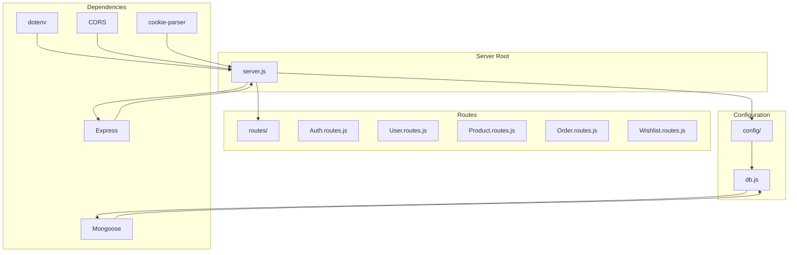
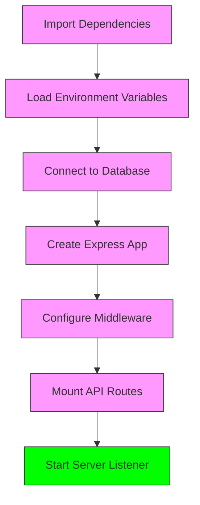
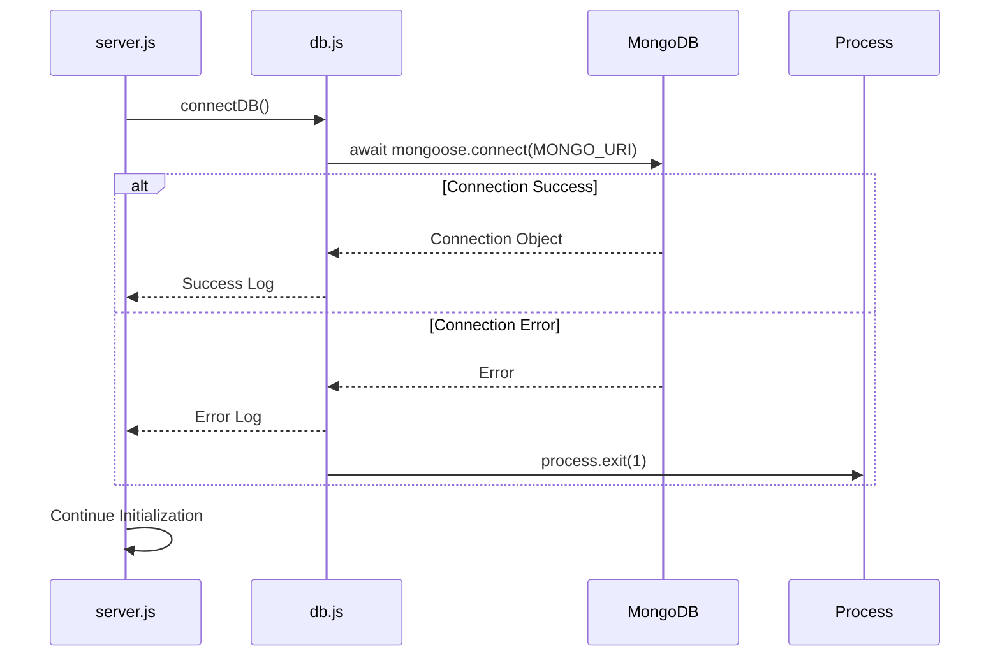
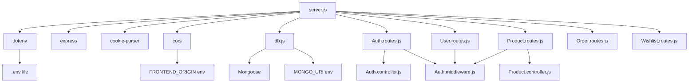

# Server Initialization

<cite>
**Referenced Files in This Document**   
- [server.js](file://server/src/server.js)
- [db.js](file://server/src/config/db.js)
- [Auth.routes.js](file://server/src/routes/Auth.routes.js)
- [Product.routes.js](file://server/src/routes/Product.routes.js)
- [User.routes.js](file://server/src/routes/User.routes.js)
</cite>

## Table of Contents
1. [Introduction](#introduction)
2. [Project Structure](#project-structure)
3. [Core Components](#core-components)
4. [Architecture Overview](#architecture-overview)
5. [Detailed Component Analysis](#detailed-component-analysis)
6. [Dependency Analysis](#dependency-analysis)
7. [Performance Considerations](#performance-considerations)
8. [Troubleshooting Guide](#troubleshooting-guide)
9. [Conclusion](#conclusion)

## Introduction
This document provides comprehensive architectural documentation for the Express.js server initialization process in the VnV24 e-commerce application. It details the sequence of operations during server startup, including environment configuration, database connectivity, middleware setup, and API routing. The documentation explains how the server bootstraps its components in a specific order to ensure proper functionality and error handling. Special attention is given to configuration dependencies, failure points, and common startup issues to provide a complete understanding of the server initialization lifecycle.

## Project Structure
The server component of the VnV24 application follows a modular structure organized under the `server/src` directory. The architecture separates concerns into distinct folders: `config` for configuration utilities, `controllers` for business logic, `middleware` for request processing functions, `models` for database schema definitions, `routes` for API endpoint definitions, and `utils` for helper functions. The entry point `server.js` orchestrates the initialization process by importing and configuring these components in a specific sequence. This clean separation of concerns enables maintainable code and clear dependency management during the server startup process.



**Diagram sources**
- [server.js](file://server/src/server.js#L1-L34)
- [db.js](file://server/src/config/db.js#L1-L18)

**Section sources**
- [server.js](file://server/src/server.js#L1-L34)
- [db.js](file://server/src/config/db.js#L1-L18)

## Core Components
The server initialization process relies on several core components that work together to create a functional Express.js application. The `dotenv` package loads environment variables from a `.env` file into `process.env`, providing configuration values for the application. The `connectDB` function establishes a connection to the MongoDB database using Mongoose, with proper error handling to terminate the process if the connection fails. Express.js serves as the web application framework, providing the foundation for handling HTTP requests and responses. Middleware components like `express.json()`, `cookie-parser`, and `cors` are configured to handle JSON parsing, cookie management, and cross-origin resource sharing respectively. These components are imported and configured in a specific sequence to ensure proper dependency resolution and application stability.

**Section sources**
- [server.js](file://server/src/server.js#L1-L34)
- [db.js](file://server/src/config/db.js#L1-L18)

## Architecture Overview
The server initialization architecture follows a sequential bootstrapping process that ensures all dependencies are properly configured before the server begins listening for requests. The process begins with importing essential packages and configuration utilities, followed by loading environment variables and establishing the database connection. Once the database is connected, the Express application is configured with necessary middleware and API routes are mounted under versioned endpoints. Finally, the server binds to a specified port and starts accepting connections. This architecture prioritizes failure detection early in the startup process, ensuring that the server only becomes active when all critical components are functioning properly.



**Diagram sources**
- [server.js](file://server/src/server.js#L1-L34)
- [db.js](file://server/src/config/db.js#L1-L18)

## Detailed Component Analysis

### Server Entry Point Analysis
The `server.js` file serves as the entry point for the application and orchestrates the entire initialization process. It begins by importing essential packages including Express.js for the web framework, dotenv for environment variable management, cookie-parser for cookie handling, and CORS for cross-origin resource sharing configuration. The file then imports the database connection function and all route modules. After loading environment variables and establishing the database connection, it creates an Express application instance and configures middleware for JSON parsing, cookie handling, and CORS protection. Finally, it mounts all API routes under versioned paths and starts the server listener on the specified port.

**Section sources**
- [server.js](file://server/src/server.js#L1-L34)

### Database Connection Analysis
The database connection process is handled by the `connectDB` function in `db.js`. This asynchronous function attempts to connect to MongoDB using the Mongoose ODM with the connection string provided in the `MONGO_URI` environment variable. It includes comprehensive error handling that logs connection success or failure messages to the console. If the connection fails, the function terminates the Node.js process with exit code 1, preventing the server from starting with an unstable database connection. The function uses Mongoose connection options `useNewUrlParser` and `useUnifiedTopology` for compatibility with modern MongoDB drivers.



**Diagram sources**
- [db.js](file://server/src/config/db.js#L3-L14)

**Section sources**
- [db.js](file://server/src/config/db.js#L3-L14)

### Middleware Configuration Analysis
The middleware configuration in the server initialization process includes three essential components: JSON parsing, cookie handling, and CORS protection. The `express.json()` middleware parses incoming JSON payloads and makes them available on the `req.body` object. The `cookie-parser` middleware parses HTTP cookies and populates `req.cookies` with an object keyed by cookie names. The CORS middleware is configured with specific options including the origin whitelist from the `FRONTEND_ORIGIN` environment variable (with a default fallback) and credential support enabled. This configuration ensures that the server can properly handle requests from the frontend application while maintaining security.

**Section sources**
- [server.js](file://server/src/server.js#L8-L18)

### API Routing Analysis
The API routing system mounts various route modules under versioned endpoints to provide a structured API interface. The authentication routes are mounted under `/api/v1/auth`, user routes under `/api/v1/users`, order routes under `/api/v1/orders`, and wishlist routes under `/api/v1/wishlist`. Each route module defines specific endpoints for CRUD operations and other business logic, with proper middleware applied for authentication and authorization where needed. This versioned approach allows for future API evolution while maintaining backward compatibility.

```mermaid
flowchart TD
A[API Root] --> B[/api/v1/auth]
A --> C[/api/v1/users]
A --> D[/api/v1/orders]
A --> E[/api/v1/wishlist]
A --> F[/api/v1/products]
B --> B1[/register]
B --> B2[/login]
B --> B3[/refresh]
B --> B4[/logout]
C --> C1[/me]
D --> D1[/]
D --> D2[/:id]
E --> E1[/]
E --> E2[/:id]
F --> F1[/]
F --> F2[/:id]
F --> F3[/create]
F --> F4[/:id/update]
F --> F5[/:id/delete]
```

**Diagram sources**
- [Auth.routes.js](file://server/src/routes/Auth.routes.js#L1-L21)
- [User.routes.js](file://server/src/routes/User.routes.js#L1-L16)
- [Product.routes.js](file://server/src/routes/Product.routes.js#L1-L24)

**Section sources**
- [server.js](file://server/src/server.js#L19-L27)

## Dependency Analysis
The server initialization process has a clear dependency hierarchy that must be respected for proper operation. The entry point `server.js` depends on the `db.js` configuration module for database connectivity, which in turn depends on the Mongoose package and the `MONGO_URI` environment variable. The route modules depend on their respective controller and middleware modules, which may have additional dependencies on the database models. The middleware configuration depends on environment variables for CORS origin settings. This dependency chain ensures that components are initialized in the correct order, with configuration and connectivity established before request handling capabilities are enabled.



**Diagram sources**
- [server.js](file://server/src/server.js#L1-L34)
- [db.js](file://server/src/config/db.js#L1-L18)

**Section sources**
- [server.js](file://server/src/server.js#L1-L34)
- [db.js](file://server/src/config/db.js#L1-L18)

## Performance Considerations
The server initialization process includes several performance considerations that impact startup time and runtime efficiency. The database connection is established synchronously during startup, which means the server will not begin accepting requests until the database is available. This prevents runtime errors but increases startup time. The middleware configuration is minimal, including only essential components, which reduces request processing overhead. The use of environment variables for configuration allows for quick adjustments without code changes. The versioned API routes enable caching strategies and reduce the need for complex routing logic. These considerations balance startup reliability with runtime performance.

## Troubleshooting Guide
Common issues during server initialization typically fall into three categories: configuration problems, connectivity issues, and port conflicts. For configuration problems, ensure that the `.env` file exists and contains all required variables including `MONGO_URI`, `FRONTEND_ORIGIN`, and `PORT`. For database connectivity issues, verify that the MongoDB service is running and that the connection string is correct. Network connectivity between the server and database should also be confirmed. For port conflicts, check if another process is already using the specified port (default 5000) and either terminate the conflicting process or change the `PORT` environment variable. When the database connection fails, the server will log an error message and terminate, preventing operation with an unstable data store.

**Section sources**
- [server.js](file://server/src/server.js#L1-L34)
- [db.js](file://server/src/config/db.js#L3-L14)

## Conclusion
The Express.js server initialization process in the VnV24 application follows a well-structured sequence that prioritizes reliability and maintainability. By loading configuration, establishing database connectivity, configuring middleware, and mounting routes in a specific order, the server ensures that all critical components are operational before accepting requests. The use of environment variables, modular routing, and comprehensive error handling creates a robust foundation for the application. Understanding this initialization process is essential for developers working on the backend, as it provides insight into the application's architecture, dependency management, and failure handling strategies. This documentation serves as a comprehensive reference for maintaining and extending the server functionality.