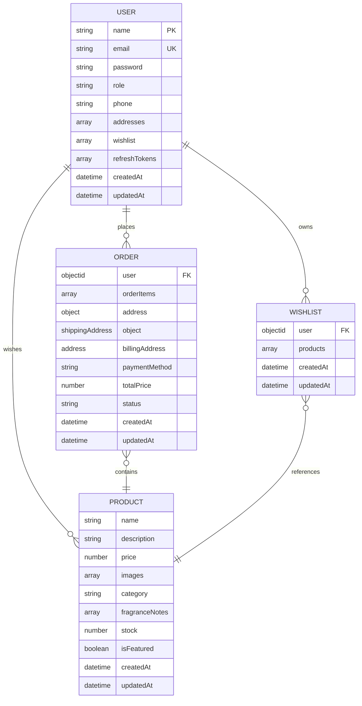

# Data Models

<cite>
**Referenced Files in This Document**   
- [User.model.js](file://server/src/models/User.model.js)
- [Product.model.js](file://server/src/models/Product.model.js)
- [Order.model.js](file://server/src/models/Order.model.js)
- [Wishlist.model.js](file://server/src/models/Wishlist.model.js)
</cite>

## Table of Contents
1. [Introduction](#introduction)
2. [Entity Relationships](#entity-relationships)
3. [User Model](#user-model)
4. [Product Model](#product-model)
5. [Order Model](#order-model)
6. [Wishlist Model](#wishlist-model)
7. [Indexing Strategy](#indexing-strategy)
8. [Data Lifecycle Management](#data-lifecycle-management)
9. [Data Integrity and Business Rules](#data-integrity-and-business-rules)
10. [Population Strategies](#population-strategies)

## Introduction
This document provides comprehensive documentation for all MongoDB collections in the VnV24 application. It details the data models for User, Product, Order, and Wishlist entities, including field definitions, data types, validation rules, default values, and relationships between models. The documentation also covers indexing strategies, data lifecycle management, integrity constraints, and population patterns used in queries.

## Entity Relationships
The VnV24 application implements a relational data model using MongoDB references to maintain data integrity and enable efficient querying. The core entities are interconnected through well-defined relationships that support the e-commerce functionality.

**Diagram sources**
- [User.model.js](file://server/src/models/User.model.js#L12-L32)
- [Product.model.js](file://server/src/models/Product.model.js#L2-L14)
- [Order.model.js](file://server/src/models/Order.model.js#L20-L35)
- [Wishlist.model.js](file://server/src/models/Wishlist.model.js#L2-L8)

## User Model
The User model represents application users with authentication credentials, personal information, and preferences. It serves as the central identity for all user activities within the system.

**Section sources**
- [User.model.js](file://server/src/models/User.model.js#L12-L32)

### Field Definitions
| Field | Type | Required | Default | Validation/Notes |
|-------|------|----------|---------|------------------|
| name | String | Yes | - | User's full name |
| email | String | Yes | - | Unique, lowercase, required |
| password | String | Yes | - | Hashed using bcrypt before storage |
| role | String | No | "customer" | Enum: ["customer", "admin"] |
| phone | String | No | - | Contact phone number |
| addresses | Array | No | [] | Array of address objects |
| wishlist | Array | No | [] | References to Product documents |
| refreshTokens | Array | No | [] | Array of token objects with hash, creation, and expiration dates |

### Address Subdocument
The addressSchema embedded within the User model contains the following fields:
- street: String
- city: String
- state: String
- country: String
- postalCode: String

### Refresh Token Management
The refreshTokens array stores hashed refresh tokens with metadata:
- tokenHash: String (SHA-256 hash of the token)
- createdAt: Date (with default value of current timestamp)
- expiresAt: Date (calculated expiration time)

### Data Lifecycle
The User model includes automatic timestamp management with createdAt and updatedAt fields provided by the { timestamps: true } option.

### Business Rules
- Email addresses are enforced as unique across the collection
- Passwords are automatically hashed using bcrypt before saving
- The matchPassword method enables secure password verification
- Refresh token management methods handle token creation, removal, and validation

## Product Model
The Product model represents items available for purchase in the VnV24 e-commerce platform. It contains comprehensive product information and inventory tracking.

**Section sources**
- [Product.model.js](file://server/src/models/Product.model.js#L2-L14)

### Field Definitions
| Field | Type | Required | Default | Validation/Notes |
|-------|------|----------|---------|------------------|
| name | String | Yes | - | Product name |
| description | String | No | - | Detailed product description |
| price | Number | Yes | - | Price in base currency units |
| images | Array | No | [] | Array of image URLs |
| category | String | Yes | - | Product category classification |
| fragranceNotes | Array | No | [] | Array of fragrance note strings |
| stock | Number | No | 0 | Current inventory level |
| isFeatured | Boolean | No | false | Flag for featured products |

### Data Lifecycle
The Product model includes automatic timestamp management with createdAt and updatedAt fields provided by the { timestamps: true } option.

### Business Rules
- Products must have a name and price
- Category is required to support filtering and organization
- Stock levels are updated during order processing
- Featured products can be highlighted in the user interface

## Order Model
The Order model represents customer purchases with detailed order information, pricing, and fulfillment status.

**Section sources**
- [Order.model.js](file://server/src/models/Order.model.js#L20-L35)

### Field Definitions
| Field | Type | Required | Default | Validation/Notes |
|-------|------|----------|---------|------------------|
| user | ObjectId | Yes | - | Reference to User document |
| orderItems | Array | Yes | - | Array of order item subdocuments |
| shippingAddress | Object | Yes | - | Address object for shipping |
| billingAddress | Object | Yes | - | Address object for billing |
| paymentMethod | String | Yes | - | Payment method used |
| totalPrice | Number | Yes | - | Calculated total price |
| status | String | No | "pending" | Enum: ["pending", "processing", "shipped", "delivered", "cancelled"] |

### Order Item Subdocument
The orderItemSchema embedded within the Order model contains:
- product: ObjectId reference to Product document (required)
- qty: Number (required) - quantity ordered
- price: Number (required) - price at time of purchase

### Address Subdocument
The addressSchema used for both shipping and billing addresses contains:
- street: String
- city: String
- state: String
- country: String
- postalCode: String

### Data Lifecycle
The Order model includes automatic timestamp management with createdAt and updatedAt fields provided by the { timestamps: true } option.

### Business Rules
- Orders must have at least one order item
- Total price is calculated based on product prices and quantities
- Inventory is decremented when orders are placed
- Order status follows a defined workflow from pending to final state
- Only the order owner or admin can access order details

## Wishlist Model
The Wishlist model represents a user's collection of favorite products for future consideration or purchase.

**Section sources**
- [Wishlist.model.js](file://server/src/models/Wishlist.model.js#L2-L8)

### Field Definitions
| Field | Type | Required | Default | Validation/Notes |
|-------|------|----------|---------|------------------|
| user | ObjectId | Yes | - | Reference to User document (unique) |
| products | Array | No | [] | Array of Product document references |

### Data Lifecycle
The Wishlist model includes automatic timestamp management with createdAt and updatedAt fields provided by the { timestamps: true } option.

### Business Rules
- Each user can have only one wishlist
- Products are added to the wishlist by reference
- Duplicate products are prevented in the wishlist
- Users can add or remove products from their wishlist

## Indexing Strategy
The VnV24 application implements strategic indexing to optimize query performance across all collections.

### User Collection Indexes
- **email**: Unique index to enforce email uniqueness and accelerate login/authentication queries
- **createdAt**: Index to support time-based queries and sorting
- **role**: Index to optimize admin-specific queries

### Product Collection Indexes
- **category**: Index to accelerate category-based filtering
- **price**: Index to support price range queries
- **isFeatured**: Index to optimize queries for featured products
- **createdAt**: Index for chronological sorting

### Order Collection Indexes
- **user**: Index to accelerate user-specific order retrieval
- **status**: Index to support order status filtering and management
- **createdAt**: Index for chronological sorting and date-range queries

### Wishlist Collection Indexes
- **user**: Unique index to ensure each user has only one wishlist
- **products**: Index to optimize product lookup within wishlists

These indexes balance query performance with write efficiency, ensuring optimal database operations for common application workflows.

## Data Lifecycle Management
The VnV24 application implements comprehensive data lifecycle management through various mechanisms.

### Creation and Update Tracking
All models utilize Mongoose's { timestamps: true } option, which automatically manages:
- createdAt: Timestamp when the document is first created
- updatedAt: Timestamp when the document is last modified

This provides complete audit trail capabilities for all data changes.

### Soft Delete Patterns
While the application primarily uses hard deletes, certain operations implement soft delete patterns:
- Orders are retained for historical and reporting purposes
- User accounts are preserved to maintain order history integrity
- Product deletion removes the item from inventory but preserves order records

### Data Retention
The application maintains data for:
- User accounts: Indefinitely, with periodic cleanup of inactive accounts
- Orders: Permanently for legal and business purposes
- Products: Until explicitly removed from inventory
- Wishlists: As long as the user account exists

## Data Integrity and Business Rules
The VnV24 application enforces data integrity through model-level constraints and business rules.

### Referential Integrity
- User references in Order and Wishlist ensure valid user associations
- Product references in Order and Wishlist maintain valid product links
- Cascade operations are handled at the application level

### Validation Rules
- Required fields are enforced at the schema level
- Data types are strictly validated
- Enumerated values are constrained to defined options
- Unique constraints prevent duplicate entries

### Business Logic Enforcement
- Passwords are automatically hashed before storage
- Inventory levels are validated during order placement
- Order totals are calculated based on current product prices
- User roles determine access to specific functionality
- Refresh tokens are securely stored and validated

## Population Strategies
The VnV24 application uses strategic population to optimize data retrieval and minimize database queries.

### Selective Population
- Order retrieval populates user information (name, email) but excludes sensitive data like passwords
- Wishlist retrieval populates full product details for display
- User queries exclude password and refresh token data by default

### Performance Implications
- Population is used judiciously to avoid excessive data transfer
- Deep population is limited to necessary fields
- Query optimization balances data completeness with performance
- Caching strategies complement population to reduce database load

### Implementation Examples
- GET /api/v1/orders/:id populates user information
- GET /api/v1/wishlist populates full product details
- Admin order listings populate user information for management purposes

These population strategies ensure efficient data retrieval while maintaining optimal application performance.