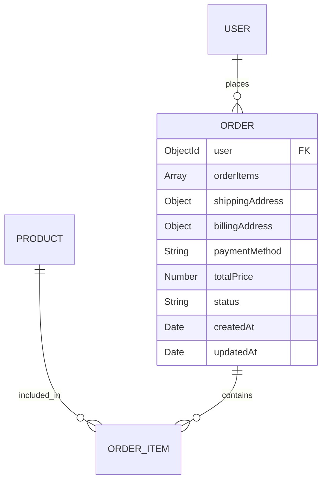
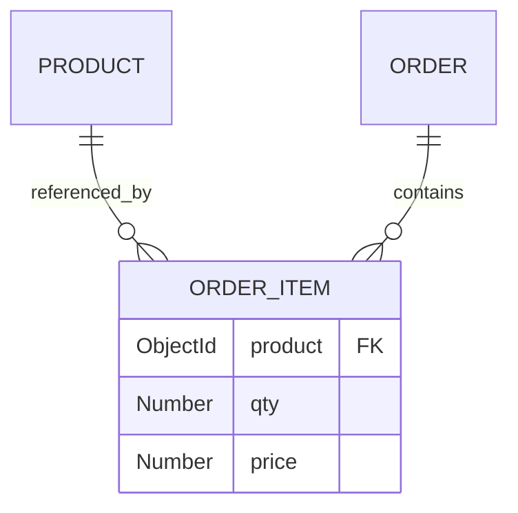
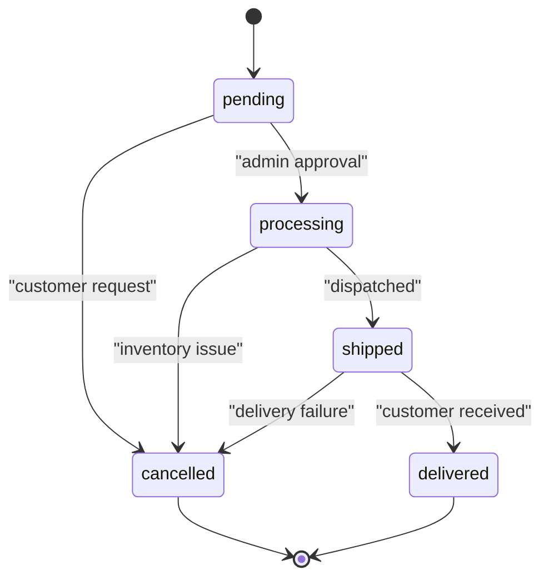
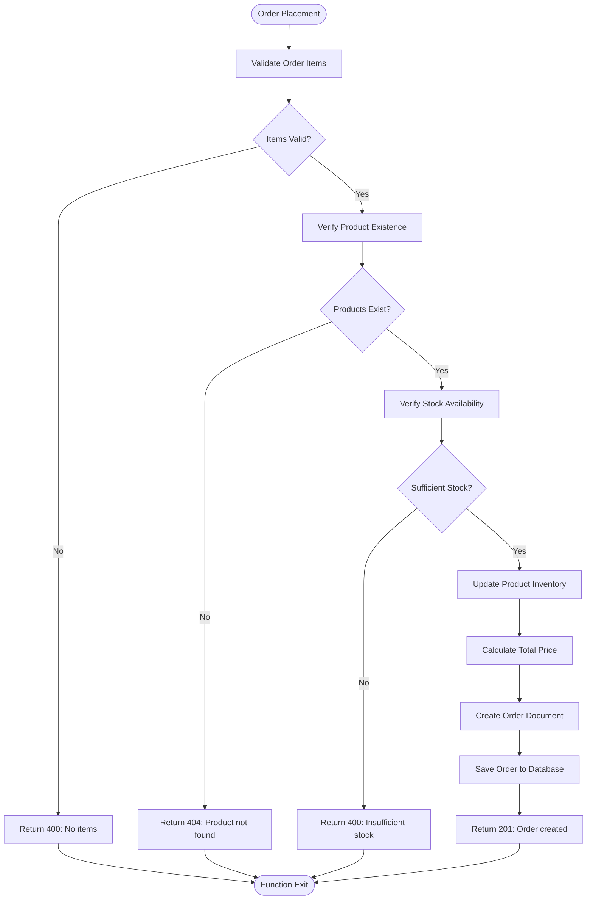
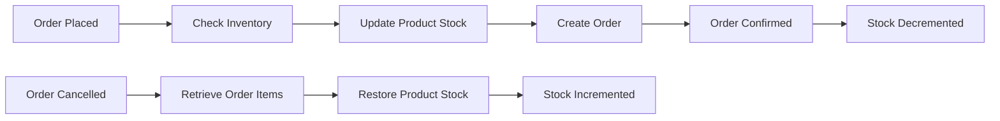
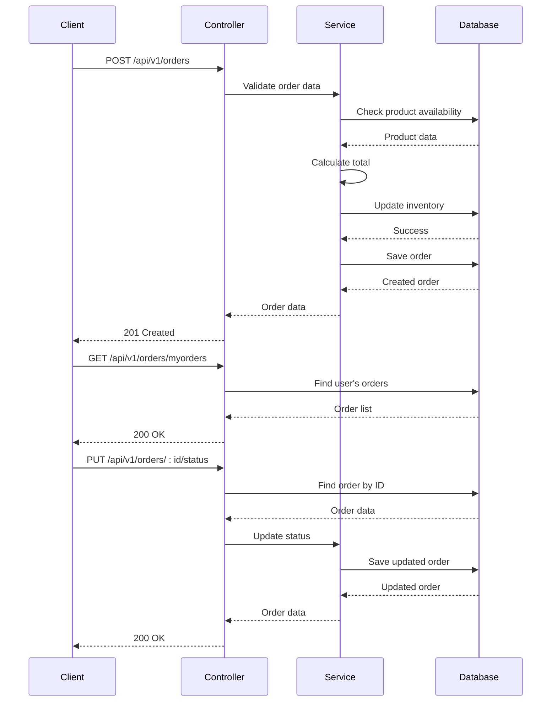

# Order Model

<cite>
**Referenced Files in This Document**   
- [Order.model.js](file://server/src/models/Order.model.js)
- [Order.controller.js](file://server/src/controllers/Order.controller.js)
- [Product.model.js](file://server/src/models/Product.model.js)
- [User.model.js](file://server/src/models/User.model.js)
</cite>

## Table of Contents
1. [Introduction](#introduction)
2. [Data Model Structure](#data-model-structure)
3. [Embedded Order Items](#embedded-order-items)
4. [Order Status and Transitions](#order-status-and-transitions)
5. [Business Logic in Order Processing](#business-logic-in-order-processing)
6. [Indexing Strategy](#indexing-strategy)
7. [Sample Order Document](#sample-order-document)
8. [Inventory Management](#inventory-management)
9. [Data Integrity and Error Handling](#data-integrity-and-error-handling)
10. [API Endpoints](#api-endpoints)

## Introduction
The Order model in the VnV24 application represents a complete purchase transaction, capturing all necessary details from product selection to delivery. This document provides comprehensive documentation of the order data model, including its structure, relationships, business logic, and operational constraints. The model is designed to preserve historical data integrity while enabling efficient querying and administration.

**Section sources**
- [Order.model.js](file://server/src/models/Order.model.js#L1-L38)

## Data Model Structure
The Order model contains comprehensive information about a customer's purchase, including user reference, order items, shipping and billing details, payment information, and order status. The schema is implemented using Mongoose for MongoDB.



**Diagram sources**
- [Order.model.js](file://server/src/models/Order.model.js#L20-L35)

### Core Fields
- **user**: Reference to the User model (required)
- **orderItems**: Array of embedded order items (required)
- **shippingAddress**: Object containing street, city, state, country, and postalCode
- **billingAddress**: Object with same structure as shippingAddress
- **paymentMethod**: String indicating payment provider (required)
- **totalPrice**: Numeric value of the total order amount (required)
- **status**: Current order status with defined enum values
- **timestamps**: Automatically managed createdAt and updatedAt fields

**Section sources**
- [Order.model.js](file://server/src/models/Order.model.js#L20-L35)

## Embedded Order Items
Order items are stored as embedded documents within the order to preserve historical pricing and product data at the time of purchase. This approach ensures data integrity even if product details change in the future.



**Diagram sources**
- [Order.model.js](file://server/src/models/Order.model.js#L2-L10)

### Order Item Schema
Each order item contains:
- **product**: Reference to the Product model (required)
- **qty**: Quantity ordered (required)
- **price**: Price per unit at time of purchase (required)

The embedded document structure captures the product's price at the time of purchase, preventing discrepancies if product prices are later updated. This design ensures accurate historical records for order fulfillment and financial reporting.

**Section sources**
- [Order.model.js](file://server/src/models/Order.model.js#L2-L10)
- [Order.controller.js](file://server/src/controllers/Order.controller.js#L32-L39)

## Order Status and Transitions
The order status field implements a state machine pattern with defined values that represent the lifecycle of an order from creation to completion or cancellation.

### Status Values
- **pending**: Order created but not yet processed
- **processing**: Order is being prepared for shipment
- **shipped**: Order has been dispatched to customer
- **delivered**: Order has been delivered to customer
- **cancelled**: Order has been cancelled

The default status is "pending" when a new order is created. Status transitions are managed through the admin interface, allowing authorized personnel to update the order status as it progresses through the fulfillment pipeline.



**Diagram sources**
- [Order.model.js](file://server/src/models/Order.model.js#L30-L34)
- [Order.controller.js](file://server/src/controllers/Order.controller.js#L94-L107)

**Section sources**
- [Order.model.js](file://server/src/models/Order.model.js#L30-L34)
- [Order.controller.js](file://server/src/controllers/Order.controller.js#L94-L107)

## Business Logic in Order Processing
The order creation process implements several critical business rules to ensure data integrity and proper inventory management.

### Order Placement Workflow
When a new order is placed, the system performs the following operations:
1. Validates the presence of order items
2. Verifies product availability by checking stock levels
3. Calculates the total price based on current product prices
4. Updates product inventory by decrementing stock
5. Creates the order with historical pricing information



**Diagram sources**
- [Order.controller.js](file://server/src/controllers/Order.controller.js#L6-L46)

**Section sources**
- [Order.controller.js](file://server/src/controllers/Order.controller.js#L6-L46)

## Indexing Strategy
The Order model implements strategic indexing to optimize query performance for common access patterns.

### Database Indexes
- **user field**: Index to support efficient retrieval of order history for individual users
- **status field**: Index to enable quick filtering of orders by status for administrative operations
- **createdAt field**: Index (provided by timestamps) to support chronological sorting and date-based queries

These indexes ensure optimal performance for:
- Customer order history queries
- Admin dashboard filtering by order status
- Time-based reporting and analytics
- Pagination of order lists

The indexing strategy balances query performance with write efficiency, avoiding over-indexing that could impact order creation speed.

**Section sources**
- [Order.model.js](file://server/src/models/Order.model.js#L20-L35)

## Sample Order Document
The following example demonstrates a completed purchase with multiple items and payment confirmation:

```json
{
  "_id": "64a1b2c3d4e5f6a7b8c9d0e1",
  "user": "64a1b2c3d4e5f6a7b8c9d0e2",
  "orderItems": [
    {
      "product": "64a1b2c3d4e5f6a7b8c9d0e3",
      "qty": 2,
      "price": 49.99
    },
    {
      "product": "64a1b2c3d4e5f6a7b8c9d0e4",
      "qty": 1,
      "price": 89.99
    }
  ],
  "shippingAddress": {
    "street": "123 Main St",
    "city": "Anytown",
    "state": "CA",
    "country": "USA",
    "postalCode": "12345"
  },
  "billingAddress": {
    "street": "123 Main St",
    "city": "Anytown",
    "state": "CA",
    "country": "USA",
    "postalCode": "12345"
  },
  "paymentMethod": "Stripe",
  "totalPrice": 189.97,
  "status": "delivered",
  "createdAt": "2023-07-01T10:30:00.000Z",
  "updatedAt": "2023-07-05T14:45:00.000Z"
}
```

This sample shows an order with two different products, preserved pricing information, complete address details, Stripe payment method, and a "delivered" status.

**Section sources**
- [Order.model.js](file://server/src/models/Order.model.js#L20-L35)
- [Order.controller.js](file://server/src/controllers/Order.controller.js#L41-L42)

## Inventory Management
The system implements real-time inventory management as part of the order processing workflow.

### Inventory Decrement on Confirmation
When an order is placed and confirmed:
1. The system checks current stock levels for each ordered product
2. If sufficient stock is available, the ordered quantity is deducted from inventory
3. The inventory update is saved to the database before order creation

This ensures that inventory levels are accurately maintained and prevents overselling of products.

### Inventory Restoration on Cancellation
When an order is cancelled:
1. The system retrieves the original order details
2. The quantities from each order item are added back to the product's stock
3. The updated inventory is saved to the database

This restoration process maintains inventory accuracy and makes products available for future orders.



**Diagram sources**
- [Order.controller.js](file://server/src/controllers/Order.controller.js#L6-L46)
- [Order.controller.js](file://server/src/controllers/Order.controller.js#L94-L107)

**Section sources**
- [Order.controller.js](file://server/src/controllers/Order.controller.js#L6-L46)
- [Product.model.js](file://server/src/models/Product.model.js#L10-L10)

## Data Integrity and Error Handling
The order system implements several mechanisms to ensure data integrity and handle potential failures.

### Duplicate Order Prevention
The system prevents duplicate orders through:
- Validation of order items before processing
- Unique constraints on critical fields
- Transactional operations where possible
- Client-side prevention through UI state management

### Partial Failure Handling
The system addresses partial failures through:
- Atomic operations for inventory updates and order creation
- Error handling middleware that rolls back operations on failure
- Comprehensive validation before processing begins
- Detailed error responses to inform clients of specific issues

### Atomic Updates
During order processing, the system ensures atomicity by:
1. Performing all validation checks first
2. Updating inventory within the same transactional context as order creation
3. Using database-level operations to ensure consistency
4. Implementing proper error handling to prevent data corruption

The combination of server-side validation, database constraints, and transactional operations ensures that the system maintains data integrity even under high load or error conditions.

**Section sources**
- [Order.controller.js](file://server/src/controllers/Order.controller.js#L6-L46)
- [Order.controller.js](file://server/src/controllers/Order.controller.js#L51-L65)

## API Endpoints
The Order controller provides several endpoints for order management:



**Diagram sources**
- [Order.controller.js](file://server/src/controllers/Order.controller.js#L6-L46)
- [Order.controller.js](file://server/src/controllers/Order.controller.js#L70-L77)
- [Order.controller.js](file://server/src/controllers/Order.controller.js#L94-L107)

**Section sources**
- [Order.controller.js](file://server/src/controllers/Order.controller.js#L6-L107)