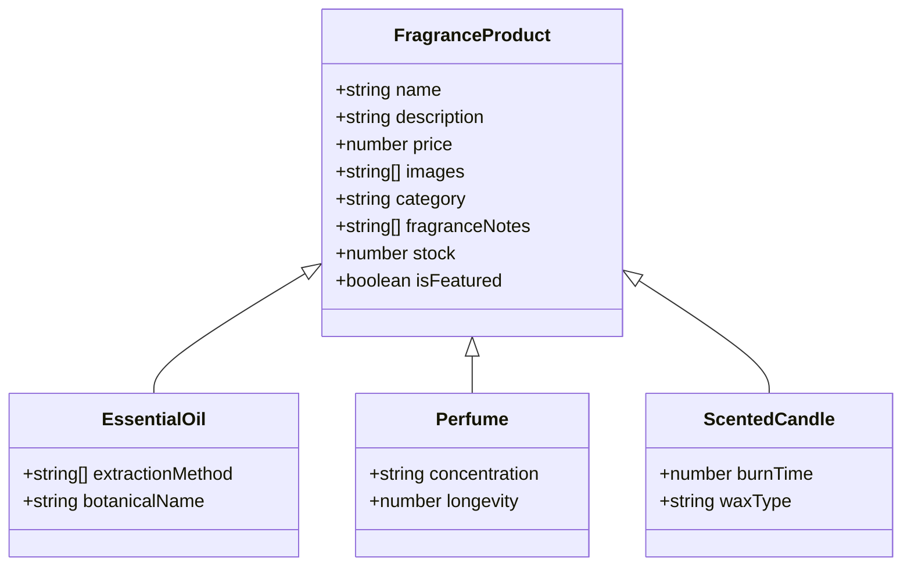
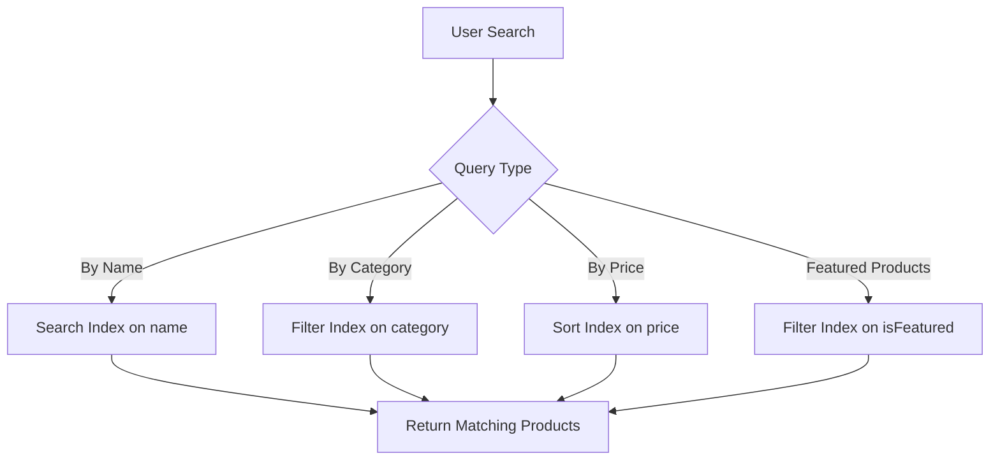
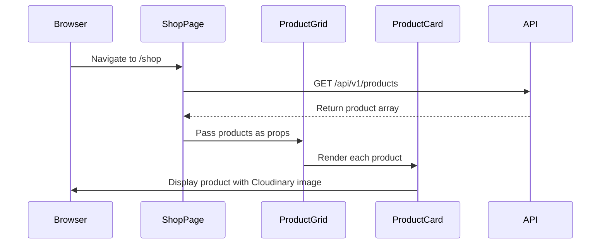
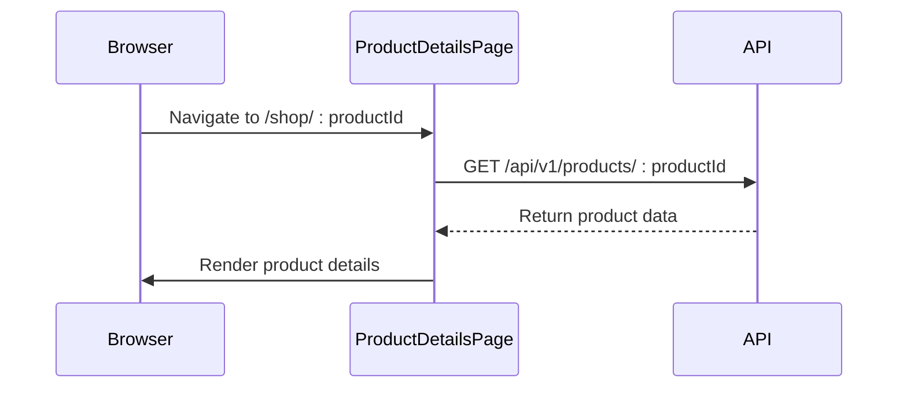

# Product Model

<cite>
**Referenced Files in This Document**   
- [Product.model.js](file://server/src/models/Product.model.js)
- [Product.controller.js](file://server/src/controllers/Product.controller.js)
- [ProductCard.js](file://client/app/components/shared/ProductCard.js)
- [ProductGrid.js](file://client/app/components/Shop/ProductGrid.js)
- [shop/page.js](file://client/app/shop/page.js)
- [shop/[productId]/page.js](file://client/app/shop/[productId]/page.js)
</cite>

## Table of Contents
1. [Introduction](#introduction)
2. [Product Schema Definition](#product-schema-definition)
3. [Field Specifications](#field-specifications)
4. [Fragrance-Specific Attributes](#fragrance-specific-attributes)
5. [Validation Rules](#validation-rules)
6. [Indexing Strategy](#indexing-strategy)
7. [Sample Product Document](#sample-product-document)
8. [Frontend Integration](#frontend-integration)
9. [Performance Considerations](#performance-considerations)
10. [Conclusion](#conclusion)

## Introduction
The Product model serves as the core data structure for the VnV24 e-commerce platform, designed specifically to support a fragrance-focused product catalog. This document provides comprehensive documentation of the Product model, detailing its schema, validation rules, indexing strategy, and integration with frontend components. The model is optimized for fragrance products such as essential oils, perfumes, and diffusers, with specialized fields to capture scent characteristics and product attributes.

**Section sources**
- [Product.model.js](file://server/src/models/Product.model.js#L1-L18)

## Product Schema Definition
The Product model is implemented using Mongoose and defines the structure for all products in the VnV24 catalog. The schema includes both standard e-commerce fields and fragrance-specific attributes to support the platform's specialized product offerings.

```mermaid
erDiagram
PRODUCT {
string id PK
string name NOT NULL
string description
number price NOT NULL
string[] images
string category NOT NULL
string[] fragranceNotes
number stock DEFAULT 0
boolean isFeatured DEFAULT false
timestamp createdAt
timestamp updatedAt
}
```

**Diagram sources**
- [Product.model.js](file://server/src/models/Product.model.js#L1-L18)

**Section sources**
- [Product.model.js](file://server/src/models/Product.model.js#L1-L18)

## Field Specifications
The Product model contains the following fields with their respective data types, default values, and requirements:

| Field | Data Type | Required | Default Value | Description |
|-------|-----------|----------|---------------|-------------|
| name | String | Yes | None | Product name (e.g., "Saffron Bliss") |
| description | String | No | None | Detailed product description |
| price | Number | Yes | None | Product price in INR |
| images | Array of Strings | No | Empty array | Cloudinary URLs for product images |
| category | String | Yes | None | Product category (e.g., "Oils", "Perfumes") |
| fragranceNotes | Array of Strings | No | Empty array | Scent notes for fragrance products |
| stock | Number | No | 0 | Available stock quantity |
| isFeatured | Boolean | No | false | Featured product status for homepage display |

**Section sources**
- [Product.model.js](file://server/src/models/Product.model.js#L1-L18)

## Fragrance-Specific Attributes
The Product model includes specialized fields to support fragrance products, particularly essential oils, perfumes, and diffusers:

- **fragranceNotes**: An array of strings that captures the scent profile of fragrance products, including top, middle, and base notes
- **category**: Supports fragrance-specific product types including "Essential Oil", "Eau de Parfum", "Scented Candle", and "Room Spray"
- The combination of these fields enables detailed product filtering and search capabilities based on scent characteristics



**Diagram sources**
- [Product.model.js](file://server/src/models/Product.model.js#L1-L18)

**Section sources**
- [Product.model.js](file://server/src/models/Product.model.js#L1-L18)

## Validation Rules
The Product model enforces the following validation rules to ensure data integrity:

- **name**: Required field with no minimum length requirement
- **price**: Required field with validation to ensure value > 0
- **category**: Required field to ensure proper product classification
- **stock**: Defaults to 0 for new products with no validation on minimum/maximum values
- **isFeatured**: Boolean flag that defaults to false
- **images**: Array of strings containing Cloudinary URLs, with no size restrictions

The validation is implemented at the schema level in Mongoose, ensuring data consistency before persistence.

**Section sources**
- [Product.model.js](file://server/src/models/Product.model.js#L1-L18)

## Indexing Strategy
The Product model implements strategic indexing to optimize query performance for common operations:

- **name**: Indexed for efficient product search and autocomplete functionality
- **category**: Indexed to support fast filtering by product type
- **price**: Indexed to enable efficient sorting and range queries
- **isFeatured**: Indexed to quickly retrieve featured products for homepage display

These indexes support the platform's search, filtering, and sorting capabilities, particularly on the Shop page where users can filter by category and sort by price.



**Diagram sources**
- [Product.model.js](file://server/src/models/Product.model.js#L1-L18)
- [shop/page.js](file://client/app/shop/page.js#L20-L50)

**Section sources**
- [Product.model.js](file://server/src/models/Product.model.js#L1-L18)

## Sample Product Document
The following is a sample product document for a premium essential oil:

```json
{
  "id": "saffron-bliss",
  "name": "Saffron Bliss",
  "description": "A luxurious essential oil blend featuring premium saffron extract known for its rich, earthy aroma and mood-enhancing properties.",
  "price": 2499,
  "images": [
    "https://res.cloudinary.com/vnv24/image/upload/v1/products/saffron-bliss-1.jpg",
    "https://res.cloudinary.com/vnv24/image/upload/v1/products/saffron-bliss-2.jpg",
    "https://res.cloudinary.com/vnv24/image/upload/v1/products/saffron-bliss-3.jpg"
  ],
  "category": "Essential Oil",
  "fragranceNotes": ["saffron", "amber", "vanilla", "sandalwood"],
  "stock": 15,
  "isFeatured": true,
  "createdAt": "2025-01-15T10:30:00.000Z",
  "updatedAt": "2025-01-15T10:30:00.000Z"
}
```

This sample demonstrates a featured essential oil with multiple Cloudinary-hosted images and a detailed scent profile.

**Section sources**
- [Product.model.js](file://server/src/models/Product.model.js#L1-L18)
- [ProductCard.js](file://client/app/components/shared/ProductCard.js#L5-L40)

## Frontend Integration
The Product model integrates with the frontend Shop and Product Detail pages through the following components:

### Shop Page Integration
The Shop page displays products using the ProductGrid and ProductCard components, which consume product data from the API:



### Product Detail Page
The Product Detail page uses the product ID parameter to display specific product information:



The ProductCard component renders product images by accessing the Cloudinary URLs stored in the images array, ensuring high-quality image delivery with responsive loading.

**Diagram sources**
- [ProductGrid.js](file://client/app/components/Shop/ProductGrid.js#L2-L15)
- [ProductCard.js](file://client/app/components/shared/ProductCard.js#L5-L40)
- [shop/[productId]/page.js](file://client/app/shop/[productId]/page.js#L1-L7)

**Section sources**
- [ProductGrid.js](file://client/app/components/Shop/ProductGrid.js#L2-L15)
- [ProductCard.js](file://client/app/components/shared/ProductCard.js#L5-L40)
- [shop/page.js](file://client/app/shop/page.js#L7-L16)
- [shop/[productId]/page.js](file://client/app/shop/[productId]/page.js#L1-L7)

## Performance Considerations
For large product catalogs, the following performance strategies are recommended:

### Pagination
Implement cursor-based pagination for the product API endpoints to handle large datasets efficiently:

```javascript
// Example API endpoint with pagination
GET /api/v1/products?page=2&limit=20&cursor=abc123
```

### Caching
- Implement Redis caching for frequently accessed product data
- Cache featured products and category listings with a TTL of 15 minutes
- Use Cloudinary's built-in CDN for image delivery optimization

### Client-Side Optimization
- Implement virtual scrolling for product grids with large result sets
- Lazy load product images below the fold
- Cache product data in the browser using localStorage or IndexedDB

### Database Optimization
- Ensure proper indexing on frequently queried fields (name, category, price)
- Consider sharding for very large product catalogs
- Implement query optimization for complex filtering operations

These strategies ensure optimal performance even with extensive product catalogs.

**Section sources**
- [Product.model.js](file://server/src/models/Product.model.js#L1-L18)
- [shop/page.js](file://client/app/shop/page.js#L20-L50)

## Conclusion
The Product model for the VnV24 e-commerce platform provides a robust foundation for managing fragrance products with specialized attributes for scent notes and product types. The schema balances flexibility with data integrity through comprehensive validation rules and strategic indexing. Integration with frontend components enables a seamless user experience, while performance considerations ensure scalability for growing product catalogs. The model's design supports the platform's focus on premium fragrance products while maintaining the flexibility to accommodate future product categories.