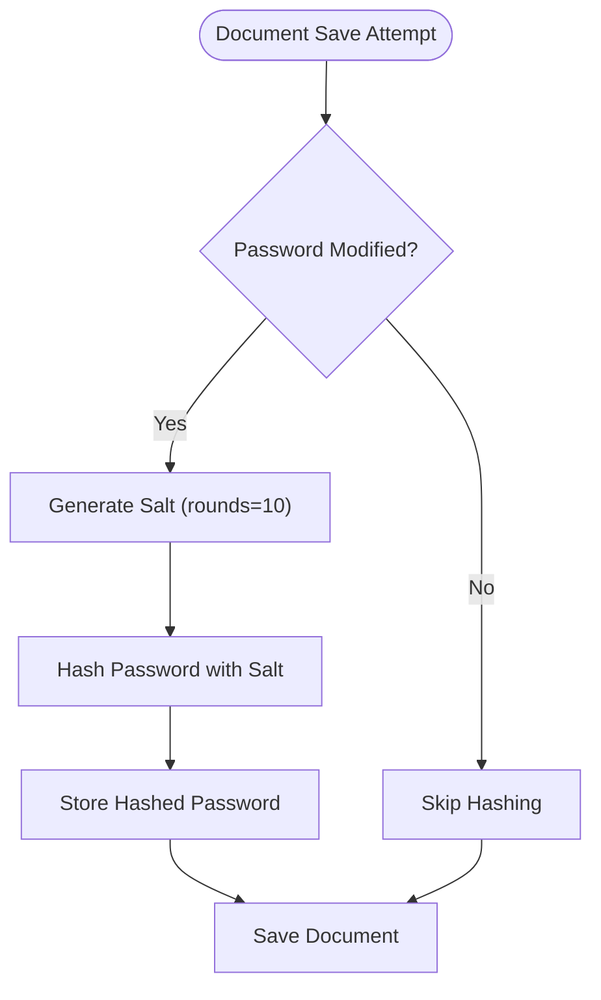
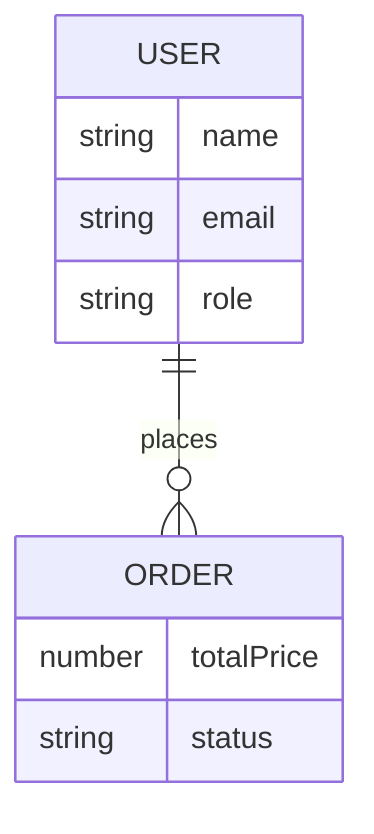
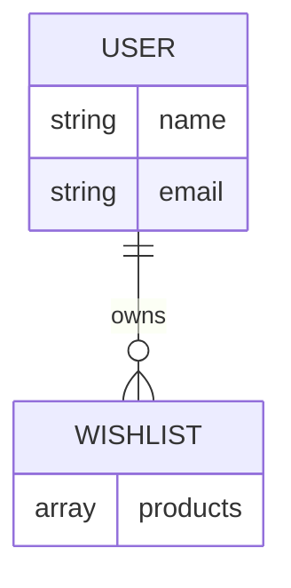
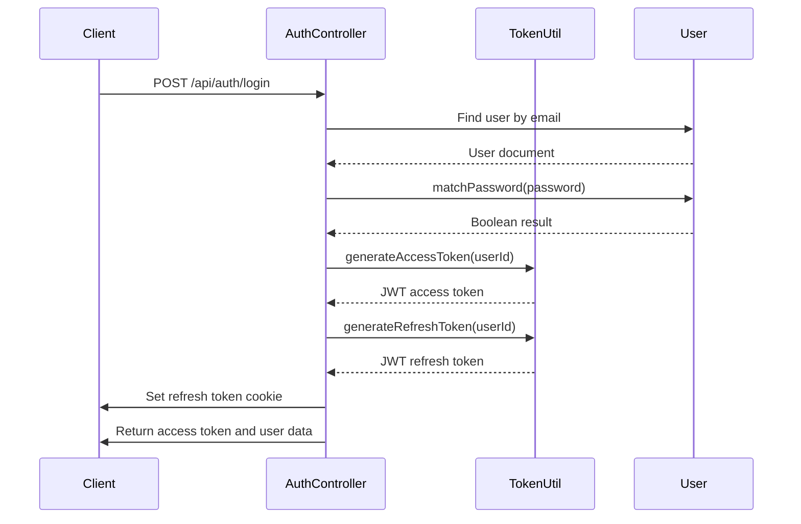

# User Model

<cite>
**Referenced Files in This Document**   
- [User.model.js](file://server/src/models/User.model.js)
- [Auth.controller.js](file://server/src/controllers/Auth.controller.js)
- [token.js](file://server/src/utils/token.js)
- [Order.model.js](file://server/src/models/Order.model.js)
- [Wishlist.model.js](file://server/src/models/Wishlist.model.js)
</cite>

## Table of Contents
1. [Introduction](#introduction)
2. [Core Fields](#core-fields)
3. [Schema Validations](#schema-validations)
4. [Password Hashing Mechanism](#password-hashing-mechanism)
5. [Relationships with Other Models](#relationships-with-other-models)
6. [Indexing Strategy](#indexing-strategy)
7. [Sample User Document](#sample-user-document)
8. [JWT Token Generation and Authorization](#jwt-token-generation-and-authorization)
9. [Security Considerations](#security-considerations)

## Introduction
The User model in the VnV24 application serves as the central entity for managing user accounts, authentication, and authorization. It encapsulates essential user information, security metadata, and relationships with other domain entities such as orders and wishlists. This document provides a comprehensive overview of the model's structure, behavior, and integration points within the application's security and data architecture.

**Section sources**
- [User.model.js](file://server/src/models/User.model.js#L1-L10)

## Core Fields
The User model defines the following core fields:

- **name**: String, required field representing the user's full name
- **email**: String, required and unique field stored in lowercase format for consistent querying
- **password**: String, required field that stores the bcrypt-hashed password
- **role**: String, enum field with values "customer" or "admin", defaulting to "customer"
- **phone**: Optional string field for user contact information
- **addresses**: Array of address objects, each containing street, city, state, country, and postalCode fields
- **wishlist**: Array of ObjectIds referencing Product documents
- **refreshTokens**: Array of refresh token objects containing tokenHash, createdAt, and expiresAt fields
- **createdAt**: Timestamp automatically added by Mongoose
- **updatedAt**: Timestamp automatically added by Mongoose

The model uses Mongoose's timestamps option to automatically manage creation and update timestamps.

**Section sources**
- [User.model.js](file://server/src/models/User.model.js#L12-L32)

## Schema Validations
The User model implements several schema-level validations to ensure data integrity:

- **Email format**: The email field is automatically converted to lowercase and must be unique across all users
- **Required fields**: name, email, and password fields are required and cannot be null
- **Role validation**: The role field accepts only "customer" or "admin" values
- **Unique constraint**: A unique index is enforced on the email field to prevent duplicate accounts

These validations are enforced at the database level through Mongoose schema definitions, providing a robust first line of defense against invalid data.

**Section sources**
- [User.model.js](file://server/src/models/User.model.js#L14-L16)

## Password Hashing Mechanism
The User model implements a secure password hashing mechanism using bcryptjs through a pre-save middleware hook:



**Diagram sources**
- [User.model.js](file://server/src/models/User.model.js#L34-L40)

The pre-save hook checks if the password field has been modified using `this.isModified("password")`. If modified, it generates a salt with 10 rounds and hashes the password before saving. This ensures that existing hashes remain unchanged while new passwords are properly secured.

**Section sources**
- [User.model.js](file://server/src/models/User.model.js#L34-L40)

## Relationships with Other Models
The User model maintains relationships with other models in the application:

### One-to-Many with Order
Each user can have multiple orders, established through the user field in the Order model:



**Diagram sources**
- [User.model.js](file://server/src/models/User.model.js#L1-L65)
- [Order.model.js](file://server/src/models/Order.model.js#L20-L22)

### One-to-Many with Wishlist
Each user has exactly one wishlist, with the relationship defined in the Wishlist model:



**Diagram sources**
- [User.model.js](file://server/src/models/User.model.js#L1-L65)
- [Wishlist.model.js](file://server/src/models/Wishlist.model.js#L5-L7)

The User model directly references products in the wishlist array, creating a direct relationship between users and their saved products.

**Section sources**
- [User.model.js](file://server/src/models/User.model.js#L20-L22)
- [Wishlist.model.js](file://server/src/models/Wishlist.model.js#L5-L7)
- [Order.model.js](file://server/src/models/Order.model.js#L20-L22)

## Indexing Strategy
The User model employs an indexing strategy to optimize query performance:

- **Email index**: A unique index on the email field enables fast lookups during authentication
- **Role index**: An index on the role field facilitates efficient filtering of admin users
- **Compound indexes**: Potential for compound indexes on frequently queried field combinations

These indexes ensure that authentication and user lookup operations remain performant even as the user base grows.

**Section sources**
- [User.model.js](file://server/src/models/User.model.js#L15-L16)

## Sample User Document
The following is a sample user document representing a registered customer with multiple addresses and role-based access:

```json
{
  "_id": "60d5ecf3e5f3c3b8f4c8a9b1",
  "name": "John Doe",
  "email": "john.doe@example.com",
  "role": "customer",
  "phone": "+1234567890",
  "addresses": [
    {
      "street": "123 Main St",
      "city": "New York",
      "state": "NY",
      "country": "USA",
      "postalCode": "10001"
    },
    {
      "street": "456 Oak Ave",
      "city": "Boston",
      "state": "MA",
      "country": "USA",
      "postalCode": "02101"
    }
  ],
  "wishlist": [
    "60d5ecf3e5f3c3b8f4c8a9b2",
    "60d5ecf3e5f3c3b8f4c8a9b3"
  ],
  "refreshTokens": [
    {
      "tokenHash": "a1b2c3d4e5f6...",
      "createdAt": "2024-01-15T10:30:00.000Z",
      "expiresAt": "2024-01-22T10:30:00.000Z"
    }
  ],
  "createdAt": "2024-01-15T10:00:00.000Z",
  "updatedAt": "2024-01-15T10:30:00.000Z"
}
```

**Section sources**
- [User.model.js](file://server/src/models/User.model.js#L12-L32)

## JWT Token Generation and Authorization
The application implements a JWT-based authentication system that generates tokens based on user identity and role:



**Diagram sources**
- [Auth.controller.js](file://server/src/controllers/Auth.controller.js#L20-L27)
- [token.js](file://server/src/utils/token.js#L2-L8)

The authorization flow works as follows:
1. Upon successful authentication, the system generates an access token with a 15-minute expiration and a refresh token with a 7-day expiration
2. The refresh token is stored in an HTTP-only cookie for security
3. The access token is included in the response for immediate API access
4. When the access token expires, the client uses the refresh token to obtain a new one
5. The user's role is encoded in the authentication context, enabling role-based access control throughout the application

**Section sources**
- [Auth.controller.js](file://server/src/controllers/Auth.controller.js#L20-L27)
- [token.js](file://server/src/utils/token.js#L2-L8)

## Security Considerations
The User model implementation addresses several critical security aspects:

### Password Encryption
All passwords are hashed using bcrypt with a salt round of 10, providing strong protection against brute force attacks and rainbow table lookups. The pre-save hook ensures that passwords are never stored in plain text.

### Role Privilege Escalation Prevention
The role field is strictly validated to accept only "customer" or "admin" values, preventing unauthorized privilege escalation. Role-based access control is enforced at the application level, ensuring that admin functionality is only accessible to users with the appropriate role.

### Session Management
The application uses a refresh token-based session management system:
- Refresh tokens are stored with SHA-256 hashed values in the database
- Tokens have a 7-day expiration period
- Users can have multiple active refresh tokens simultaneously
- Tokens can be explicitly revoked through logout or security operations

This approach provides a balance between user convenience and security, allowing for long-lived sessions while maintaining the ability to invalidate compromised tokens.

### Additional Security Measures
- Email addresses are stored in lowercase to prevent case-based duplication
- Unique constraints prevent multiple accounts with the same email
- HTTP-only cookies protect refresh tokens from XSS attacks
- Secure flag on cookies ensures transmission only over HTTPS in production

**Section sources**
- [User.model.js](file://server/src/models/User.model.js#L34-L64)
- [Auth.controller.js](file://server/src/controllers/Auth.controller.js#L8-L10)
- [token.js](file://server/src/utils/token.js#L2-L8)