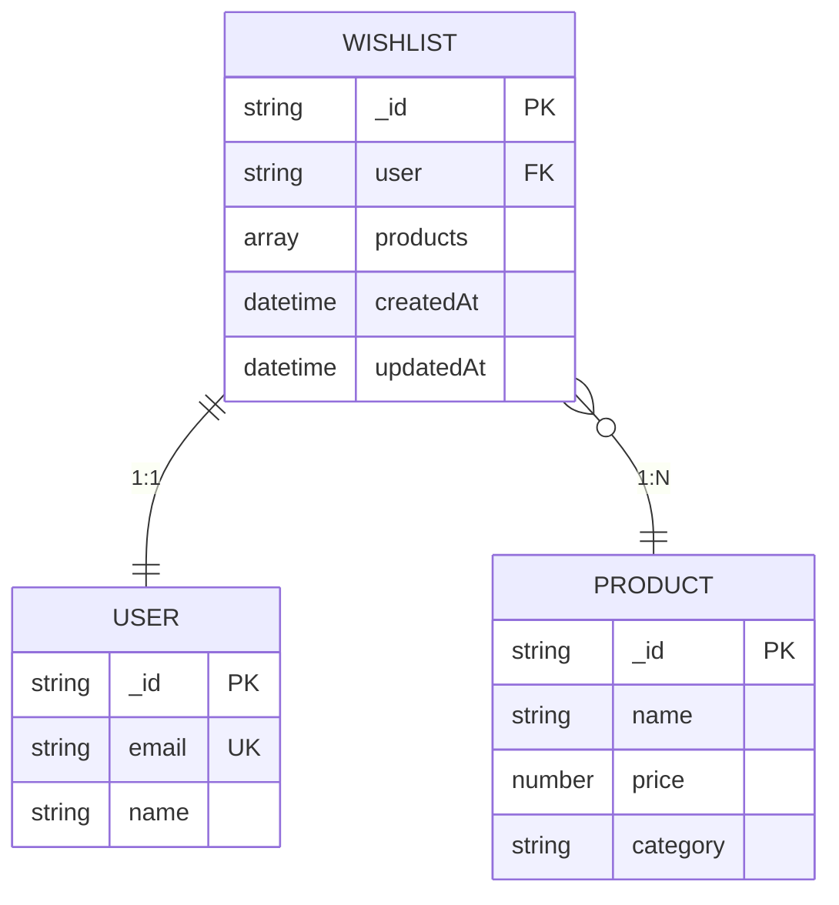
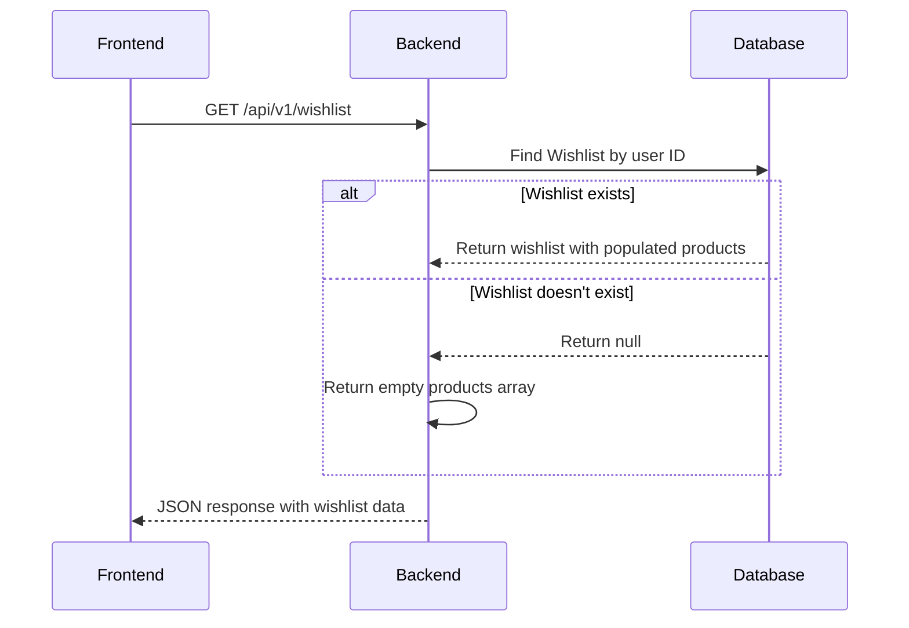
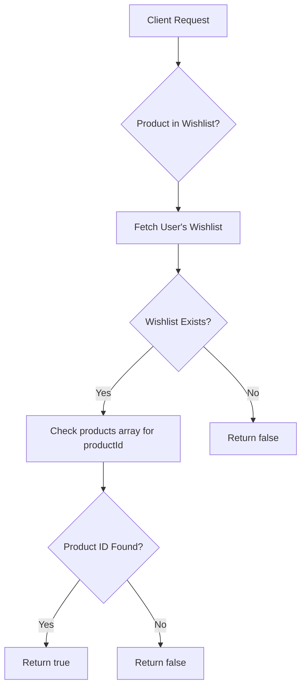
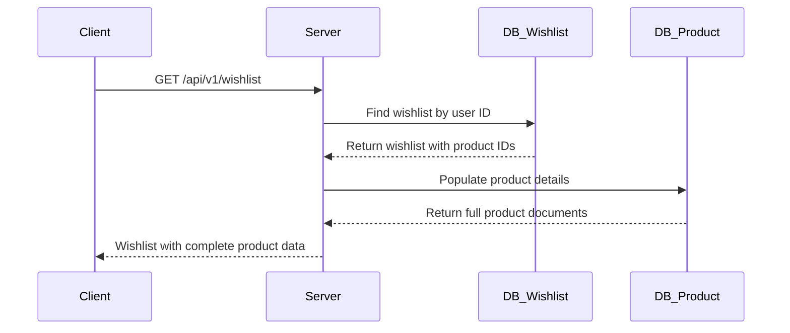
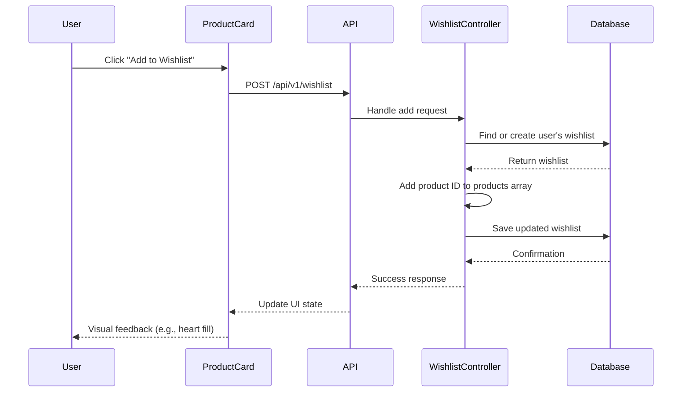
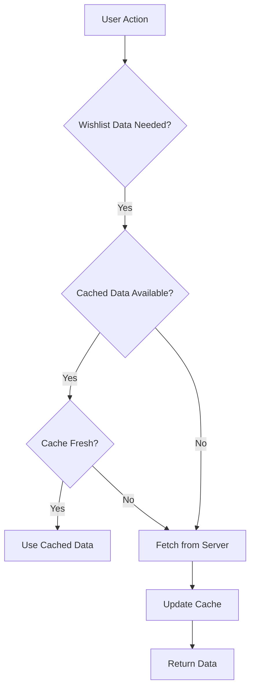

# Wishlist Model

<cite>
**Referenced Files in This Document**   
- [Wishlist.model.js](file://server/src/models/Wishlist.model.js)
- [Wishlist.controller.js](file://server/src/controllers/Wishlist.controller.js)
- [ProductCard.js](file://client/app/components/shared/ProductCard.js)
- [User.model.js](file://server/src/models/User.model.js)
- [Wishlist.routes.js](file://server/src/routes/Wishlist.routes.js)
</cite>

## Table of Contents
1. [Introduction](#introduction)
2. [Schema Definition](#schema-definition)
3. [One-to-One Relationship with User](#one-to-one-relationship-with-user)
4. [Core Fields](#core-fields)
5. [Data Persistence Across Sessions](#data-persistence-across-sessions)
6. [Query Patterns](#query-patterns)
7. [Sample Wishlist Document](#sample-wishlist-document)
8. [Frontend Integration](#frontend-integration)
9. [Performance Considerations](#performance-considerations)
10. [Edge Cases and Synchronization](#edge-cases-and-synchronization)

## Introduction
The Wishlist model in the VnV24 application enables users to save their favorite fragrance products for future reference. This document details the model's structure, relationships, functionality, and integration points. The model supports persistent storage of user-favorite items across sessions through server-side storage in MongoDB, with client-side synchronization via API calls.

**Section sources**
- [Wishlist.model.js](file://server/src/models/Wishlist.model.js#L2-L10)

## Schema Definition
The Wishlist model is defined using Mongoose with a structured schema that ensures data integrity and proper relationships. It follows MongoDB best practices for referencing related documents and includes automatic timestamp tracking.



**Diagram sources**
- [Wishlist.model.js](file://server/src/models/Wishlist.model.js#L2-L8)
- [User.model.js](file://server/src/models/User.model.js#L20-L20)

**Section sources**
- [Wishlist.model.js](file://server/src/models/Wishlist.model.js#L2-L8)

## One-to-One Relationship with User
The Wishlist model maintains a strict one-to-one relationship with the User model. Each user has exactly one wishlist, established through a required reference field that points to the User document. This design ensures data consistency and prevents orphaned wishlist records.

When a user accesses their wishlist, the system queries for a wishlist document where the user field matches the authenticated user's ID. If no wishlist exists, the system creates one upon the first addition, ensuring every user eventually has a wishlist record.



**Diagram sources**
- [Wishlist.controller.js](file://server/src/controllers/Wishlist.controller.js#L7-L14)
- [Wishlist.model.js](file://server/src/models/Wishlist.model.js#L4-L4)

**Section sources**
- [Wishlist.controller.js](file://server/src/controllers/Wishlist.controller.js#L7-L14)
- [Wishlist.model.js](file://server/src/models/Wishlist.model.js#L4-L4)

## Core Fields
The Wishlist model consists of several key fields that define its structure and behavior:

- **user**: Required reference to the User document, ensuring each wishlist belongs to exactly one user
- **products**: Array of Product document references, storing the user's favorite items
- **createdAt**: Timestamp automatically generated when the wishlist is created
- **updatedAt**: Timestamp automatically updated whenever the wishlist is modified

The products array contains ObjectIds that reference Product documents in the database, allowing for efficient population of full product details when retrieving the wishlist.

**Section sources**
- [Wishlist.model.js](file://server/src/models/Wishlist.model.js#L4-L5)

## Data Persistence Across Sessions
The Wishlist model enables persistent storage of user-favorite items across sessions through server-side storage in MongoDB. Unlike client-side storage mechanisms such as localStorage or cookies, this approach ensures that wishlist data persists even when users switch devices or clear their browser data.

When a user logs in, the frontend automatically fetches their wishlist from the server, synchronizing the client state with the server-stored data. This ensures consistency across all devices where the user logs in, providing a seamless experience regardless of the access point.

**Section sources**
- [Wishlist.controller.js](file://server/src/controllers/Wishlist.controller.js#L7-L14)

## Query Patterns
The application implements several key query patterns for interacting with the Wishlist model:

### Checking Product Presence
To determine if a product is in a user's wishlist, the system first retrieves the user's wishlist and then checks if the product ID exists in the products array:



**Diagram sources**
- [Wishlist.controller.js](file://server/src/controllers/Wishlist.controller.js#L9-L10)

### Populating Product Details
When retrieving a wishlist, the system uses Mongoose's populate feature to replace Product IDs with full product document data:



**Diagram sources**
- [Wishlist.controller.js](file://server/src/controllers/Wishlist.controller.js#L9-L10)

**Section sources**
- [Wishlist.controller.js](file://server/src/controllers/Wishlist.controller.js#L9-L10)

## Sample Wishlist Document
The following example shows a typical wishlist document as stored in MongoDB:

```json
{
  "_id": "64a1b2c3d4e5f6a7b8c9d0e1",
  "user": "64a1b2c3d4e5f6a7b8c9d0e0",
  "products": [
    "64a1b2c3d4e5f6a7b8c9d1f1",
    "64a1b2c3d4e5f6a7b8c9d1f2",
    "64a1b2c3d4e5f6a7b8c9d1f3"
  ],
  "createdAt": "2024-06-15T10:30:00.000Z",
  "updatedAt": "2024-06-20T14:45:00.000Z"
}
```

When retrieved via the API with population, the response includes full product details:

```json
{
  "success": true,
  "data": {
    "products": [
      {
        "_id": "64a1b2c3d4e5f6a7b8c9d1f1",
        "name": "Midnight Jasmine",
        "price": 8999,
        "category": "fragrance",
        "imageUrl": "/images/midnight-jasmine.jpg"
      },
      {
        "_id": "64a1b2c3d4e5f6a7b8c9d1f2",
        "name": "Ocean Breeze",
        "price": 7500,
        "category": "fragrance",
        "imageUrl": "/images/ocean-breeze.jpg"
      }
    ]
  }
}
```

**Section sources**
- [Wishlist.controller.js](file://server/src/controllers/Wishlist.controller.js#L9-L10)

## Frontend Integration
The Wishlist model integrates with the frontend UI through the ProductCard component, which provides the "Add to Wishlist" functionality.

### Add to Wishlist Button Behavior
The ProductCard component currently displays an "Add to Cart" button but will be extended to include wishlist functionality. When implemented, clicking the wishlist button will trigger an API call to add the product to the user's wishlist.



**Diagram sources**
- [ProductCard.js](file://client/app/components/shared/ProductCard.js#L1-L40)
- [Wishlist.controller.js](file://server/src/controllers/Wishlist.controller.js#L19-L36)

### Wishlist Persistence After Login
When a user logs in, the application automatically synchronizes their wishlist state:

1. Authentication completes successfully
2. Frontend requests wishlist data from /api/v1/wishlist endpoint
3. Server returns current wishlist with populated products
4. Frontend updates UI to reflect saved items across all product listings

This ensures that users see their saved items immediately after logging in, regardless of which device they're using.

**Section sources**
- [Wishlist.controller.js](file://server/src/controllers/Wishlist.controller.js#L7-L14)
- [ProductCard.js](file://client/app/components/shared/ProductCard.js#L1-L40)

## Performance Considerations
The Wishlist model implementation includes several performance optimizations for handling large wishlists:

### Large Wishlist Management
For users with extensive wishlists, the current implementation retrieves all products in a single query. While this works well for moderate-sized wishlists (under 100 items), it may impact performance for users with very large collections.

Potential optimizations include:
- Implementing pagination for wishlist retrieval
- Adding client-side caching to reduce server requests
- Using selective population to load only essential product fields

### Client-Side Caching Strategies
The application can enhance performance through client-side caching:



Client-side caching would reduce API calls and improve responsiveness, especially during navigation between product pages.

**Section sources**
- [Wishlist.controller.js](file://server/src/controllers/Wishlist.controller.js#L9-L10)

## Edge Cases and Synchronization
The Wishlist model must handle several edge cases to ensure data integrity and provide a consistent user experience across devices.

### Handling Deleted Products
When a product is removed from the catalog, it may still exist in users' wishlists. The current implementation does not automatically clean up these references, which could lead to:

- Display issues when trying to show deleted products
- Inconsistent user experience when accessing wishlist items
- Potential errors in product detail retrieval

Recommended solutions include:
- Soft deletion of products instead of hard deletion
- Periodic cleanup jobs to remove references to deleted products
- Frontend handling of missing product references with appropriate messaging

### Synchronization Across Devices
The server-based storage model inherently supports synchronization across devices. When a user adds a product to their wishlist on one device, the change is immediately available on all other devices upon login or refresh.

The synchronization flow is:
1. User adds product on Device A
2. Change is saved to server database
3. User accesses application on Device B
4. Application fetches current wishlist state from server
5. UI reflects updated wishlist with new item

This ensures a consistent experience regardless of the device being used.

**Section sources**
- [Wishlist.controller.js](file://server/src/controllers/Wishlist.controller.js#L24-L32)
- [Wishlist.controller.js](file://server/src/controllers/Wishlist.controller.js#L44-L52)