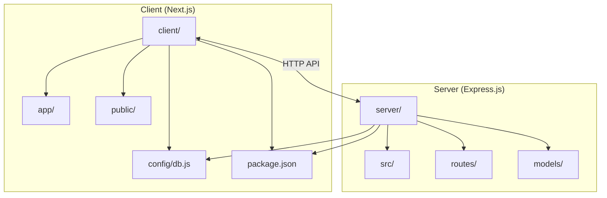
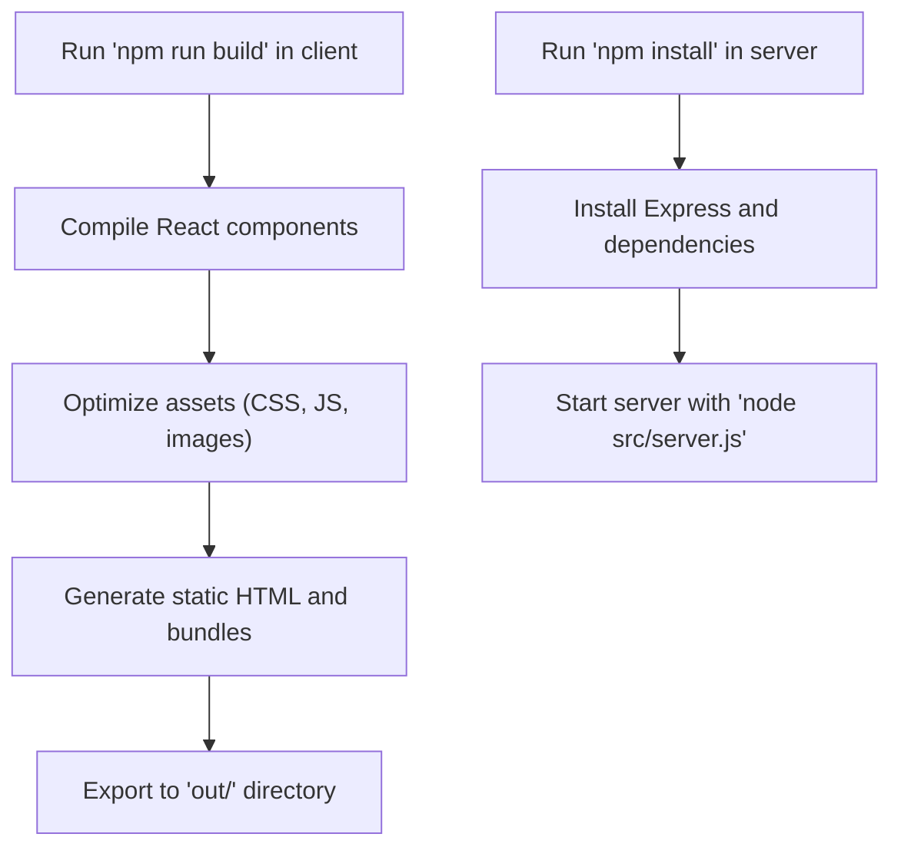
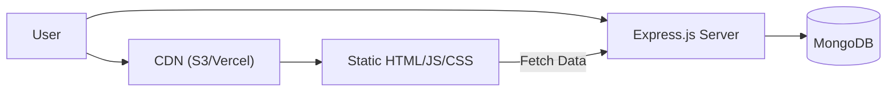
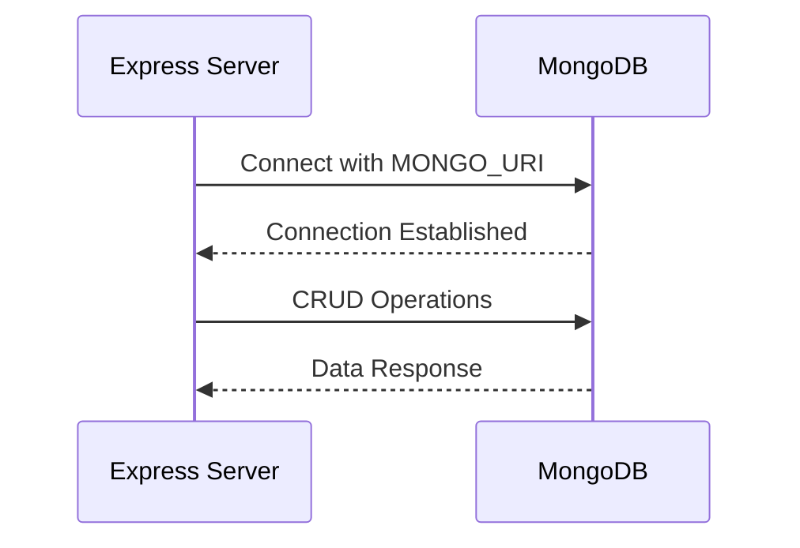

# Deployment Architecture

<cite>
**Referenced Files in This Document**   
- [next.config.mjs](file://client/next.config.mjs)
- [server.js](file://server/src/server.js)
- [db.js](file://server/src/config/db.js)
- [page.js](file://client/app/page.js)
</cite>

## Table of Contents
1. [Introduction](#introduction)
2. [Project Structure](#project-structure)
3. [Frontend and Backend Separation](#frontend-and-backend-separation)
4. [Build Pipeline for Frontend and Backend](#build-pipeline-for-frontend-and-backend)
5. [Asset Optimization Techniques](#asset-optimization-techniques)
6. [Hosting Static Assets and API Endpoints](#hosting-static-assets-and-api-endpoints)
7. [Environment Variable Injection](#environment-variable-injection)
8. [Database Deployment Strategy](#database-deployment-strategy)
9. [Scaling Considerations](#scaling-considerations)
10. [Monitoring, Logging, and Error Tracking](#monitoring-logging-and-error-tracking)
11. [Deployment to Popular Platforms](#deployment-to-popular-platforms)
12. [Conclusion](#conclusion)

## Introduction
The VnV24 application follows a modern full-stack architecture with a decoupled frontend and backend. The frontend is built using Next.js, leveraging its hybrid rendering capabilities, while the backend is implemented with Express.js as a RESTful API server. This document details the deployment topology, covering build processes, hosting strategies, environment management, database connectivity, scaling, monitoring, and platform-specific deployment guidance.

**Section sources**
- [next.config.mjs](file://client/next.config.mjs#L1-L5)
- [server.js](file://server/src/server.js#L1-L33)

## Project Structure
The project is organized into two main directories: `client` for the Next.js frontend and `server` for the Express.js backend. The `client` directory contains React components, page routes, and configuration files for asset optimization and routing. The `server` directory includes controllers, models, routes, middleware, and database configuration. Both applications are independently deployable, communicating via HTTP APIs.

**Diagram sources**
- [client](file://client#L1-L10)
- [server](file://server#L1-L10)

## Frontend and Backend Separation
The frontend and backend are completely separated, enabling independent development and deployment. The Next.js application uses static export for pre-rendered pages and client-side navigation, while dynamic data is fetched from the Express.js backend via API calls. This separation allows the frontend to be hosted on CDN-based platforms and the backend on traditional server environments.

**Section sources**
- [next.config.mjs](file://client/next.config.mjs#L1-L5)
- [server.js](file://server/src/server.js#L1-L33)

## Build Pipeline for Frontend and Backend
The frontend build process is managed by Next.js, which compiles React components, optimizes assets, and generates static HTML and JavaScript bundles. The `next build` command produces optimized output in the `.next` directory, which can be exported as static files using `next export`. The backend uses a standard Node.js build process, where dependencies are installed and the server is started using `node src/server.js`.

**Diagram sources**
- [next.config.mjs](file://client/next.config.mjs#L1-L5)
- [server.js](file://server/src/server.js#L1-L33)

## Asset Optimization Techniques
The Next.js frontend leverages built-in optimization features such as automatic code splitting, image optimization, font optimization, and CSS minification. Tailwind CSS is used for utility-first styling, and PostCSS processes styles during build. JavaScript bundles are split by page, ensuring only necessary code is loaded. Static assets are hashed and cached for performance.

**Section sources**
- [next.config.mjs](file://client/next.config.mjs#L1-L5)
- [tailwind.config.js](file://client/tailwind.config.js#L1-L10)
- [postcss.config.mjs](file://client/postcss.config.mjs#L1-L5)

## Hosting Static Assets and API Endpoints
Static assets generated by `next export` are hosted on CDN platforms like Vercel or AWS S3, enabling fast global delivery. The Express.js backend is deployed as a Node.js service on platforms like AWS EC2, DigitalOcean App Platform, or Heroku. API endpoints are served under `/api/v1/*` and are protected with CORS configuration to allow requests only from the frontend origin.

**Diagram sources**
- [server.js](file://server/src/server.js#L10-L20)
- [next.config.mjs](file://client/next.config.mjs#L1-L5)

## Environment Variable Injection
Environment variables are injected using the `dotenv` package in the backend and Next.js environment configuration in the frontend. Sensitive values like `MONGO_URI`, `FRONTEND_ORIGIN`, and `PORT` are loaded from `.env` files or platform-specific environment settings. This allows secure configuration across development, staging, and production environments.

**Section sources**
- [server.js](file://server/src/server.js#L2-L3)
- [db.js](file://server/src/config/db.js#L3-L14)

## Database Deployment Strategy
The backend connects to MongoDB using Mongoose. The `connectDB` function establishes a connection using the `MONGO_URI` environment variable. In production, MongoDB is deployed as a managed service (e.g., MongoDB Atlas) with secure network policies, TLS encryption, and regular backups. Connection pooling and error handling ensure resilience under load.

**Diagram sources**
- [db.js](file://server/src/config/db.js#L3-L14)
- [server.js](file://server/src/server.js#L6-L7)

## Scaling Considerations
The frontend scales horizontally via CDN caching and static file distribution. The backend can be scaled using load balancers and container orchestration (e.g., Docker, Kubernetes). Database read replicas and connection pooling help manage increased load. Caching strategies (e.g., Redis) can be added for high-frequency queries.

**Section sources**
- [server.js](file://server/src/server.js#L1-L33)
- [db.js](file://server/src/config/db.js#L3-L14)

## Monitoring, Logging, and Error Tracking
Production monitoring includes logging HTTP requests, database operations, and errors using `console.log` and structured logging libraries. Error tracking can be integrated with tools like Sentry or LogRocket. Health checks are available via the Express server, and uptime monitoring can be configured using external services.

**Section sources**
- [server.js](file://server/src/server.js#L30-L33)
- [db.js](file://server/src/config/db.js#L8-L9)

## Deployment to Popular Platforms
### Vercel
The Next.js frontend is seamlessly deployable on Vercel with zero configuration. Environment variables are set in the Vercel dashboard, and automatic CI/CD is triggered on Git pushes.

### AWS
The frontend is hosted on S3 with CloudFront for CDN, while the backend runs on EC2 or ECS. API Gateway can proxy requests to the Express server. RDS or DocumentDB hosts the database.

### DigitalOcean
The frontend is served via App Platform or Spaces + CDN. The backend runs on App Platform or Droplets. Managed MongoDB is available as a DigitalOcean Database Cluster.

**Section sources**
- [next.config.mjs](file://client/next.config.mjs#L1-L5)
- [server.js](file://server/src/server.js#L1-L33)

## Conclusion
The VnV24 application employs a robust deployment architecture with clear separation between frontend and backend. The use of Next.js static export and Express.js enables flexible hosting options, while environment management and database connectivity ensure secure and scalable production deployments. Proper monitoring and platform-specific configurations further enhance reliability and performance.