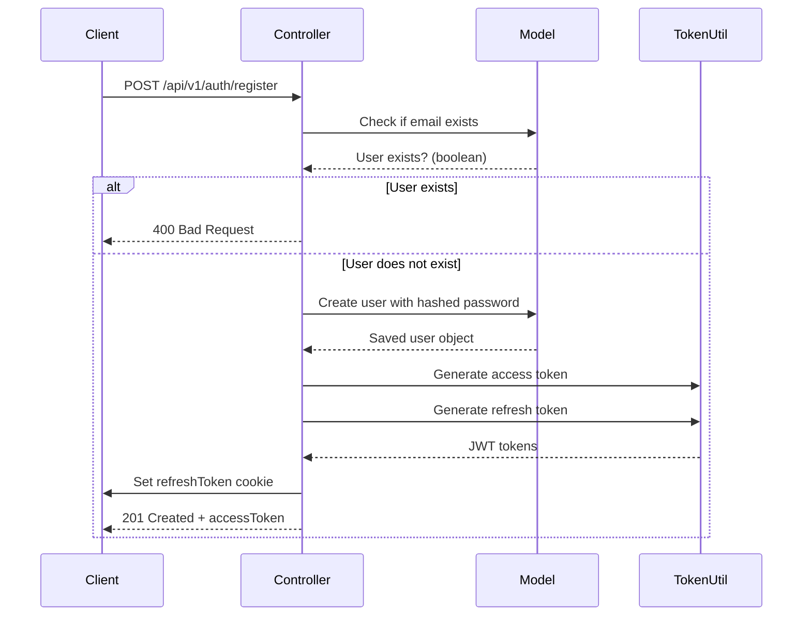
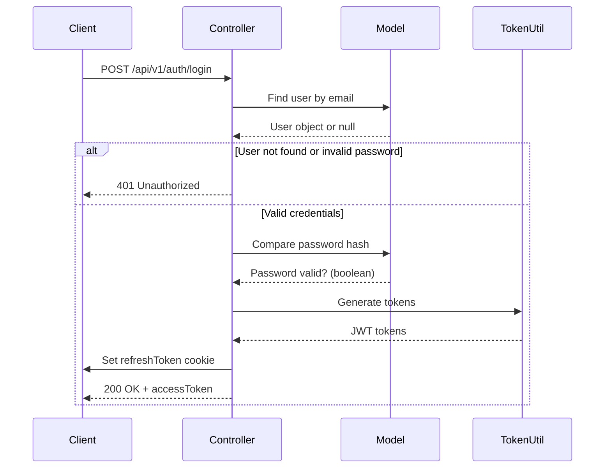
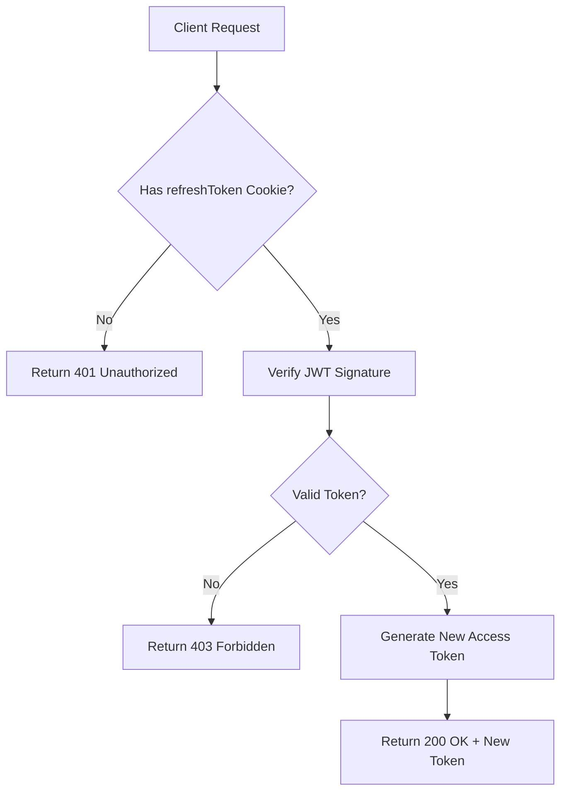
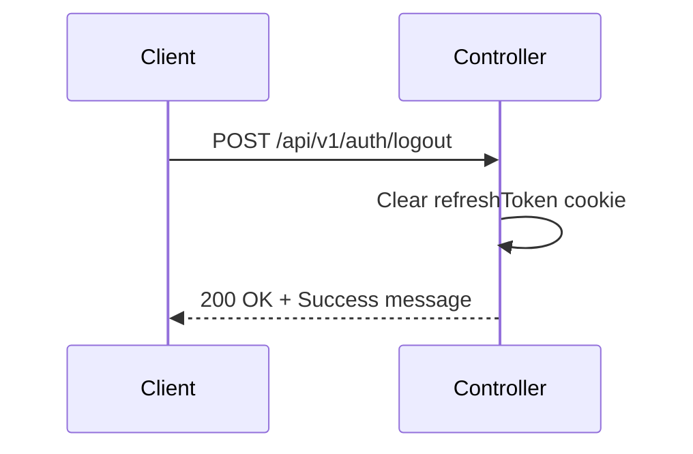
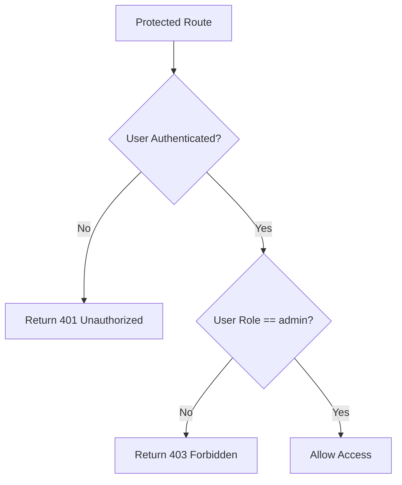
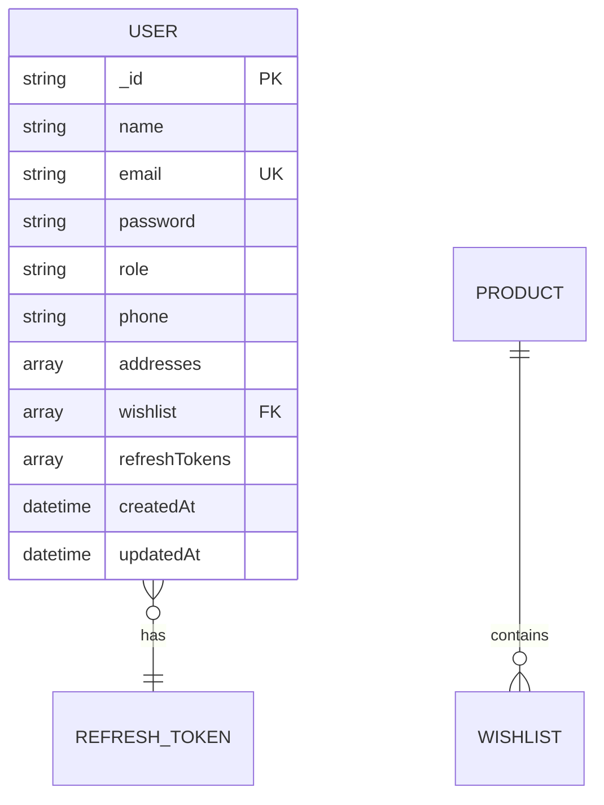

# Authentication Module

<cite>
**Referenced Files in This Document**   
- [Auth.controller.js](file://server/src/controllers/Auth.controller.js)
- [Auth.routes.js](file://server/src/routes/Auth.routes.js)
- [Auth.middleware.js](file://server/src/middleware/Auth.middleware.js)
- [token.js](file://server/src/utils/token.js)
- [User.model.js](file://server/src/models/User.model.js)
</cite>

## Table of Contents
1. [Introduction](#introduction)
2. [Core Components](#core-components)
3. [Authentication Flows](#authentication-flows)
4. [Token Management and Security](#token-management-and-security)
5. [Role-Based Access Control](#role-based-access-control)
6. [User Model Schema](#user-model-schema)
7. [Error Handling and Security Best Practices](#error-handling-and-security-best-practices)
8. [Extensibility and Future Enhancements](#extensibility-and-future-enhancements)

## Introduction
The authentication module in the VnV24 backend provides secure user registration, login, logout, and token refresh functionality. Built using Express.js, JWT, and bcryptjs, it ensures robust identity management with protection against common security threats. This document details the implementation of authentication flows, token handling, middleware enforcement, and extensibility options.

**Section sources**
- [Auth.controller.js](file://server/src/controllers/Auth.controller.js#L1-L66)
- [Auth.routes.js](file://server/src/routes/Auth.routes.js#L1-L20)

## Core Components

The authentication system is composed of five key components:
- **Auth.controller.js**: Handles user registration, login, token refresh, and logout
- **Auth.routes.js**: Maps HTTP requests to controller methods
- **Auth.middleware.js**: Verifies JWT tokens and enforces access control
- **token.js**: Utility for generating access and refresh tokens
- **User.model.js**: Defines user schema with secure password hashing and refresh token storage

These components work together to provide a secure, stateless authentication mechanism with support for role-based permissions.

**Section sources**
- [Auth.controller.js](file://server/src/controllers/Auth.controller.js#L1-L66)
- [Auth.routes.js](file://server/src/routes/Auth.routes.js#L1-L20)
- [Auth.middleware.js](file://server/src/middleware/Auth.middleware.js#L1-L25)
- [token.js](file://server/src/utils/token.js#L1-L9)
- [User.model.js](file://server/src/models/User.model.js#L1-L65)

## Authentication Flows

### User Registration
The registration flow creates a new user with securely hashed password and returns an access token. The process includes:
1. Email uniqueness check
2. Password hashing via bcryptjs
3. User creation in MongoDB
4. JWT access and refresh token generation
5. Secure HTTP-only cookie storage of refresh token



**Diagram sources**
- [Auth.controller.js](file://server/src/controllers/Auth.controller.js#L10-L25)
- [User.model.js](file://server/src/models/User.model.js#L40-L45)

### User Login
The login flow authenticates credentials and establishes a session:
1. Find user by email
2. Compare provided password with stored hash
3. Generate new JWT tokens
4. Store refresh token in secure cookie
5. Return access token and user data



**Diagram sources**
- [Auth.controller.js](file://server/src/controllers/Auth.controller.js#L27-L42)
- [User.model.js](file://server/src/models/User.model.js#L47-L50)

### Token Refresh
The refresh flow allows clients to obtain a new access token without re-authenticating:
1. Extract refresh token from HTTP-only cookie
2. Validate token signature and expiration
3. Generate new access token
4. Return new access token



**Diagram sources**
- [Auth.controller.js](file://server/src/controllers/Auth.controller.js#L44-L55)
- [token.js](file://server/src/utils/token.js#L1-L9)

### Logout
The logout flow terminates the user session:
1. Clear the refresh token cookie
2. Return success response



**Diagram sources**
- [Auth.controller.js](file://server/src/controllers/Auth.controller.js#L57-L66)
- [Auth.routes.js](file://server/src/routes/Auth.routes.js#L18-L20)

## Token Management and Security

### JWT Token Generation
Access and refresh tokens are generated using separate secrets and expiration policies:

```mermaid
classDiagram
class tokenUtil {
+generateAccessToken(userId) : string
+generateRefreshToken(userId) : string
}
note right of tokenUtil
Access Token : 15-minute expiration
Refresh Token : 7-day expiration
Different signing secrets for enhanced security
end note
```

**Diagram sources**
- [token.js](file://server/src/utils/token.js#L1-L9)

### Secure Token Storage
Refresh tokens are stored in HTTP-only, secure cookies to prevent XSS attacks:
- `httpOnly`: Prevents client-side JavaScript access
- `secure`: Only sent over HTTPS in production
- `sameSite: lax`: Mitigates CSRF attacks
- `maxAge`: 7 days for refresh tokens

**Section sources**
- [Auth.controller.js](file://server/src/controllers/Auth.controller.js#L5-L8)
- [token.js](file://server/src/utils/token.js#L1-L9)

## Role-Based Access Control

### Middleware Implementation
The `protect` middleware validates JWT tokens and attaches user data to requests:

```mermaid
flowchart TD
A[Incoming Request] --> B{Has Authorization Header?}
B --> |No| C[Check refreshToken Cookie]
B --> |Yes| D{Bearer Token?}
D --> |Yes| E[Verify JWT Signature]
E --> F{Valid Token?}
F --> |No| G[Return 401 Unauthorized]
F --> |Yes| H[Find User in Database]
H --> I{User Exists?}
I --> |No| J[Return 401 Unauthorized]
I --> |Yes| K[Attach User to Request]
K --> L[Call next() Middleware]
```

**Diagram sources**
- [Auth.middleware.js](file://server/src/middleware/Auth.middleware.js#L3-L18)

### Admin Access Control
The `isAdmin` middleware enforces role-based access:



**Diagram sources**
- [Auth.middleware.js](file://server/src/middleware/Auth.middleware.js#L20-L25)

## User Model Schema

The User model includes essential fields for authentication:



Key authentication-related fields:
- **email**: Unique, required, lowercase
- **password**: Required, automatically hashed before save
- **role**: Enum with "customer" or "admin", default "customer"
- **refreshTokens**: Array of hashed refresh tokens with expiration

Password hashing is handled automatically via pre-save hook using bcryptjs with salt rounds of 10.

**Section sources**
- [User.model.js](file://server/src/models/User.model.js#L10-L65)

## Error Handling and Security Best Practices

### Common Error Scenarios
| Error Type | HTTP Status | Response Payload | Source |
|----------|-----------|------------------|--------|
| User already exists | 400 | `{ message: "User already exists" }` | [Auth.controller.js](file://server/src/controllers/Auth.controller.js#L14) |
| Invalid credentials | 401 | `{ message: "Invalid credentials" }` | [Auth.controller.js](file://server/src/controllers/Auth.controller.js#L31) |
| Not authorized | 401 | `{ message: "Not authorized" }` | [Auth.middleware.js](file://server/src/middleware/Auth.middleware.js#L7) |
| Invalid/expired token | 401 | `{ message: "Invalid or expired token" }` | [Auth.middleware.js](file://server/src/middleware/Auth.middleware.js#L15) |
| Access denied (admin) | 403 | `{ message: "Access denied: Admin only" }` | [Auth.middleware.js](file://server/src/middleware/Auth.middleware.js#L24) |
| Invalid refresh token | 403 | `{ message: "Invalid or expired refresh token" }` | [Auth.controller.js](file://server/src/controllers/Auth.controller.js#L53) |

### Security Measures
- **Password hashing**: bcryptjs with salt generation
- **Token separation**: Different secrets for access and refresh tokens
- **Secure cookies**: HTTP-only, secure flags
- **Input validation**: Email uniqueness, required fields
- **Rate limiting**: Not implemented (potential enhancement)

## Extensibility and Future Enhancements

### Social Login Integration
To add social login (Google, Facebook):
1. Add OAuth2/OIDC providers using Passport.js
2. Extend User model with provider IDs and tokens
3. Create social login endpoints
4. Implement token exchange flow

### Two-Factor Authentication
To implement 2FA:
1. Add `twoFactorEnabled` and `twoFactorSecret` fields to User model
2. Create setup and verification endpoints
3. Modify login flow to require second factor
4. Integrate with TOTP or SMS services

### Additional Security Features
- Implement rate limiting for authentication endpoints
- Add refresh token rotation and revocation
- Support token blacklisting for immediate invalidation
- Implement password strength requirements
- Add account lockout after failed attempts

**Section sources**
- [Auth.controller.js](file://server/src/controllers/Auth.controller.js#L1-L66)
- [Auth.middleware.js](file://server/src/middleware/Auth.middleware.js#L1-L25)
- [User.model.js](file://server/src/models/User.model.js#L1-L65)