# Backend Directory Structure

<cite>
**Referenced Files in This Document**   
- [server.js](file://server/src/server.js)
- [db.js](file://server/src/config/db.js)
- [token.js](file://server/src/utils/token.js)
- [Auth.middleware.js](file://server/src/middleware/Auth.middleware.js)
- [Auth.controller.js](file://server/src/controllers/Auth.controller.js)
- [User.model.js](file://server/src/models/User.model.js)
- [Product.model.js](file://server/src/models/Product.model.js)
- [Order.model.js](file://server/src/models/Order.model.js)
- [Wishlist.model.js](file://server/src/models/Wishlist.model.js)
- [Auth.routes.js](file://server/src/routes/Auth.routes.js)
</cite>

## Table of Contents
1. [Introduction](#introduction)
2. [Project Structure](#project-structure)
3. [MVC Architecture Implementation](#mvc-architecture-implementation)
4. [Database Configuration](#database-configuration)
5. [JWT Token Management](#jwt-token-management)
6. [Express Server Initialization](#express-server-initialization)
7. [Model Definitions and Relationships](#model-definitions-and-relationships)
8. [Authentication and Authorization Middleware](#authentication-and-authorization-middleware)
9. [Authentication Controller Flows](#authentication-controller-flows)
10. [API Extension Guidelines](#api-extension-guidelines)

## Introduction
This document provides a comprehensive analysis of the backend directory structure for the VnV24 repository, focusing on the implementation of MVC architecture within the server application. The documentation details the separation of concerns between routes, controllers, models, and middleware, with specific emphasis on authentication mechanisms, database connectivity, and API design patterns.

## Project Structure

The backend structure follows a clean, modular MVC pattern with clear separation of concerns:

**Diagram sources**
- [server.js](file://server/src/server.js#L1-L34)
- [db.js](file://server/src/config/db.js#L1-L18)
- [token.js](file://server/src/utils/token.js#L1-L10)

**Section sources**
- [server.js](file://server/src/server.js#L1-L34)
- [config/db.js](file://server/src/config/db.js#L1-L18)

## MVC Architecture Implementation

The application implements a clear Model-View-Controller (MVC) architecture with the following components:

- **Models**: Define data structures and business rules (MongoDB schemas via Mongoose)
- **Controllers**: Handle business logic and request processing
- **Routes**: Define API endpoints and HTTP method mappings
- **Middleware**: Provide cross-cutting concerns like authentication and request processing

This separation ensures maintainability, testability, and scalability of the codebase.

**Section sources**
- [Auth.controller.js](file://server/src/controllers/Auth.controller.js#L1-L67)
- [Auth.routes.js](file://server/src/routes/Auth.routes.js#L1-L21)
- [User.model.js](file://server/src/models/User.model.js#L1-L66)

## Database Configuration

### Database Connection Management

The database connection is established through the `db.js` configuration file, which exports a `connectDB` function responsible for initializing the MongoDB connection using Mongoose.

**Diagram sources**
- [server.js](file://server/src/server.js#L1-L34)
- [db.js](file://server/src/config/db.js#L1-L18)

**Section sources**
- [db.js](file://server/src/config/db.js#L1-L18)

## JWT Token Management

### Token Generation and Verification

The `token.js` utility provides functions for generating and verifying JWT tokens used for authentication. The system implements a two-token approach with access and refresh tokens for enhanced security.

**Diagram sources**
- [token.js](file://server/src/utils/token.js#L1-L10)
- [Auth.controller.js](file://server/src/controllers/Auth.controller.js#L1-L67)

**Section sources**
- [token.js](file://server/src/utils/token.js#L1-L10)

## Express Server Initialization

### Server Configuration and Middleware

The `server.js` file serves as the entry point for the application, initializing Express.js and configuring essential middleware for proper application functionality.

**Diagram sources**
- [server.js](file://server/src/server.js#L1-L34)

**Section sources**
- [server.js](file://server/src/server.js#L1-L34)

## Model Definitions and Relationships

### Core Data Models

The application defines four primary models that represent the core entities of the system:

**Diagram sources**
- [User.model.js](file://server/src/models/User.model.js#L1-L66)
- [Product.model.js](file://server/src/models/Product.model.js#L1-L18)
- [Order.model.js](file://server/src/models/Order.model.js#L1-L39)
- [Wishlist.model.js](file://server/src/models/Wishlist.model.js#L1-L12)

**Section sources**
- [User.model.js](file://server/src/models/User.model.js#L1-L66)
- [Product.model.js](file://server/src/models/Product.model.js#L1-L18)
- [Order.model.js](file://server/src/models/Order.model.js#L1-L39)
- [Wishlist.model.js](file://server/src/models/Wishlist.model.js#L1-L12)

## Authentication and Authorization Middleware

### Protected Route Enforcement

The `Auth.middleware.js` file implements middleware functions that protect routes by verifying JWT tokens and enforcing role-based access control.

**Diagram sources**
- [Auth.middleware.js](file://server/src/middleware/Auth.middleware.js#L1-L26)
- [User.model.js](file://server/src/models/User.model.js#L1-L66)

**Section sources**
- [Auth.middleware.js](file://server/src/middleware/Auth.middleware.js#L1-L26)

## Authentication Controller Flows

### User Authentication Workflows

The `Auth.controller.js` implements the core authentication flows including user registration, login, token refresh, and logout.

```mermaid
flowchart TD
subgraph "Registration Flow"
RegStart([Register Request]) --> ValidateEmail["Validate Email Uniqueness"]
ValidateEmail --> CreateUser["Create User with Hashed Password"]
CreateUser --> GenerateTokens["Generate Access & Refresh Tokens"]
GenerateTokens --> SetCookie["Set Refresh Token Cookie"]
SetCookie --> ReturnToken["Return Access Token and User Data"]
end
subgraph "Login Flow"
LoginStart([Login Request]) --> FindUser["Find User by Email"]
FindUser --> VerifyPassword["Verify Password Hash"]
VerifyPassword --> GenerateTokensLogin["Generate Access & Refresh Tokens"]
GenerateTokensLogin --> SetCookieLogin["Set Refresh Token Cookie"]
SetCookieLogin --> ReturnTokenLogin["Return Access Token and User Data"]
end
subgraph "Token Refresh Flow"
RefreshStart([Refresh Request]) --> GetRefreshToken["Get Refresh Token from Cookie"]
GetRefreshToken --> VerifyRefresh["Verify Refresh Token"]
VerifyRefresh --> GenerateNewAccess["Generate New Access Token"]
GenerateNewAccess --> ReturnNewToken["Return New Access Token"]
end
```

**Diagram sources**
- [Auth.controller.js](file://server/src/controllers/Auth.controller.js#L1-L67)
- [Auth.routes.js](file://server/src/routes/Auth.routes.js#L1-L21)
- [token.js](file://server/src/utils/token.js#L1-L10)

**Section sources**
- [Auth.controller.js](file://server/src/controllers/Auth.controller.js#L1-L67)

## API Extension Guidelines

### Adding New Routes and Controllers

To maintain architectural consistency when extending the API, follow these guidelines:

1. **Create a new controller file** in the `controllers/` directory for handling business logic
2. **Define a new routes file** in the `routes/` directory for mapping endpoints to controller methods
3. **Implement model changes** in the `models/` directory if new data structures are required
4. **Mount the new routes** in `server.js` using the appropriate API version prefix
5. **Apply appropriate middleware** for authentication and authorization requirements

The existing structure provides a clear template for implementing new features while maintaining separation of concerns and code organization principles.

**Section sources**
- [server.js](file://server/src/server.js#L1-L34)
- [Auth.routes.js](file://server/src/routes/Auth.routes.js#L1-L21)
- [Auth.controller.js](file://server/src/controllers/Auth.controller.js#L1-L67)