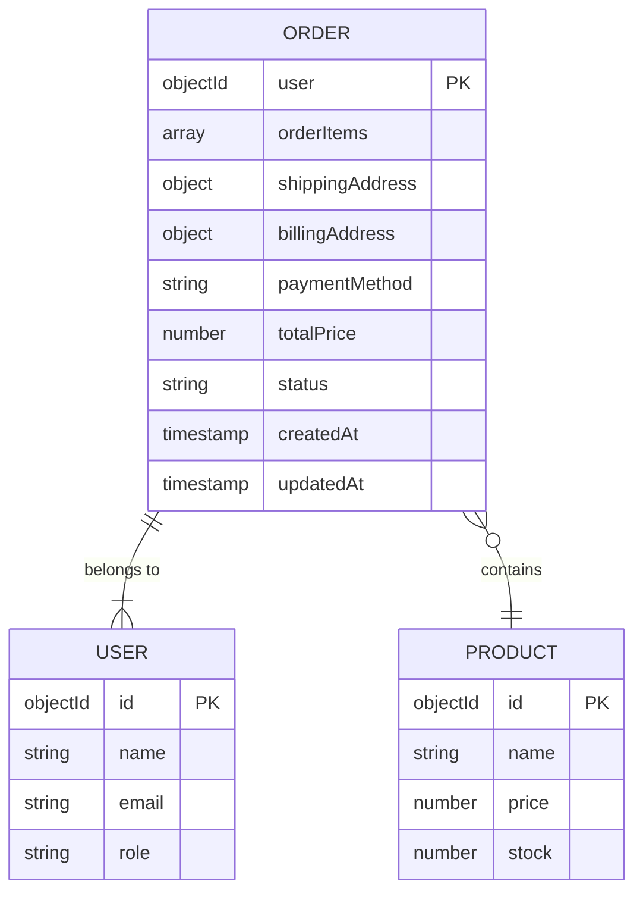
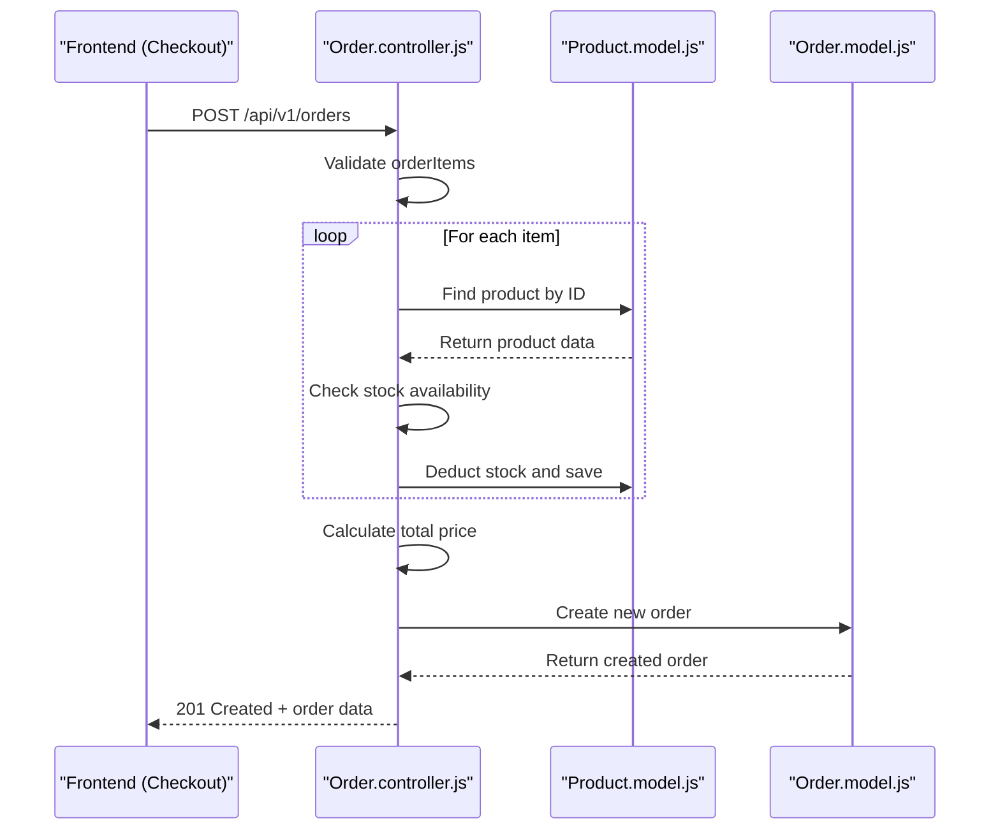
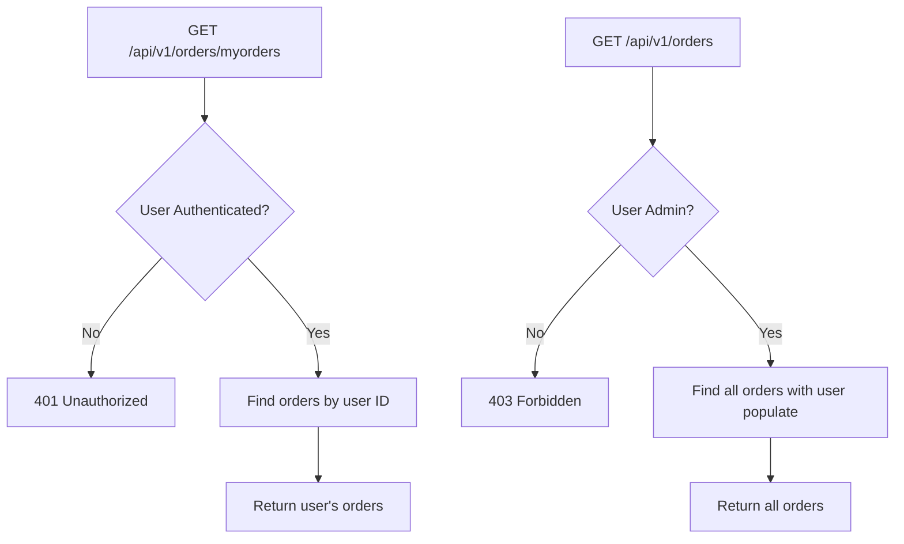
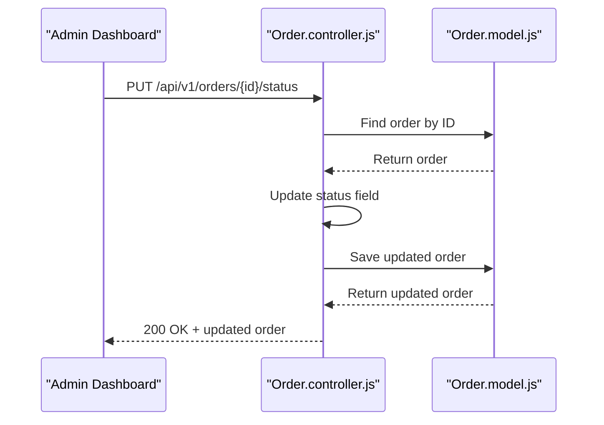

# Order Processing

<cite>
**Referenced Files in This Document**   
- [Order.controller.js](file://server/src/controllers/Order.controller.js)
- [Order.routes.js](file://server/src/routes/Order.routes.js)
- [Order.model.js](file://server/src/models/Order.model.js)
- [Product.model.js](file://server/src/models/Product.model.js)
- [User.model.js](file://server/src/models/User.model.js)
</cite>

## Table of Contents
1. [Introduction](#introduction)
2. [Order Model Schema](#order-model-schema)
3. [Order Creation Flow](#order-creation-flow)
4. [Order Retrieval Endpoints](#order-retrieval-endpoints)
5. [Admin Order Management](#admin-order-management)
6. [Transaction Handling and Inventory Deduction](#transaction-handling-and-inventory-deduction)
7. [Error Scenarios and Handling](#error-scenarios-and-handling)
8. [Integration with Payment Gateways](#integration-with-payment-gateways)
9. [Shipping and Invoice Integration Guidance](#shipping-and-invoice-integration-guidance)
10. [Conclusion](#conclusion)

## Introduction
The order processing module in the VnV24 backend handles the complete lifecycle of customer orders, from creation and retrieval to status updates and inventory management. This document details the implementation of core functionalities including order creation from cart checkout, retrieval of order history, and administrative status updates. The system integrates with payment providers such as Stripe and Razorpay via webhooks and ensures data consistency through transaction-safe inventory deduction. The module is designed with role-based access control, allowing customers to view their orders and administrators to manage all orders.

**Section sources**
- [Order.controller.js](file://server/src/controllers/Order.controller.js#L6-L107)
- [Order.routes.js](file://server/src/routes/Order.routes.js#L1-L22)

## Order Model Schema
The Order model defines the structure of stored orders, capturing essential details such as customer information, purchased items, shipping and billing addresses, payment method, total price, and order status. It references the User and Product models to maintain relational integrity.

**Diagram sources**
- [Order.model.js](file://server/src/models/Order.model.js#L1-L38)
- [User.model.js](file://server/src/models/User.model.js#L1-L65)
- [Product.model.js](file://server/src/models/Product.model.js#L1-L17)

**Section sources**
- [Order.model.js](file://server/src/models/Order.model.js#L1-L38)

## Order Creation Flow
The order creation process begins when a user submits an order request from the checkout page. The `placeOrder` controller function validates the request, checks product availability, deducts inventory, and creates a new order record.

**Diagram sources**
- [Order.controller.js](file://server/src/controllers/Order.controller.js#L6-L46)
- [Product.model.js](file://server/src/models/Product.model.js#L1-L17)

**Section sources**
- [Order.controller.js](file://server/src/controllers/Order.controller.js#L6-L46)

## Order Retrieval Endpoints
Users can retrieve their order history, while administrators have access to all orders in the system. The endpoints enforce role-based access control through middleware.

**Diagram sources**
- [Order.routes.js](file://server/src/routes/Order.routes.js#L1-L22)
- [Order.controller.js](file://server/src/controllers/Order.controller.js#L48-L78)

**Section sources**
- [Order.controller.js](file://server/src/controllers/Order.controller.js#L48-L78)
- [Order.routes.js](file://server/src/routes/Order.routes.js#L1-L22)

## Admin Order Management
Administrators can update the status of any order through a dedicated endpoint. This functionality enables tracking order progression from pending to delivered.

**Diagram sources**
- [Order.controller.js](file://server/src/controllers/Order.controller.js#L94-L107)
- [Order.routes.js](file://server/src/routes/Order.routes.js#L19-L22)

**Section sources**
- [Order.controller.js](file://server/src/controllers/Order.controller.js#L94-L107)

## Transaction Handling and Inventory Deduction
The order creation process includes synchronous inventory deduction to prevent overselling. For each item in the order, the system checks stock levels and reduces the available quantity upon successful validation.

**Key Implementation Details:**
- Inventory deduction occurs item-by-item within the order creation flow
- Stock validation prevents orders for out-of-stock items
- Price at time of purchase is recorded to maintain order integrity
- All operations occur within a single request lifecycle

**Section sources**
- [Order.controller.js](file://server/src/controllers/Order.controller.js#L6-L46)

## Error Scenarios and Handling
The system handles several critical error conditions to ensure data consistency and provide meaningful feedback.

**Error Cases:**
- **No order items**: Returns 400 if orderItems array is missing or empty
- **Product not found**: Returns 404 if any referenced product does not exist
- **Insufficient stock**: Returns 400 if requested quantity exceeds available stock
- **Unauthorized access**: Returns 403 if user tries to access non-owned orders
- **Order not found**: Returns 404 if requested order ID does not exist

**Section sources**
- [Order.controller.js](file://server/src/controllers/Order.controller.js#L6-L107)

## Integration with Payment Gateways
The backend is designed to integrate with payment providers like Stripe and Razorpay. While the current implementation assumes successful payment, webhook endpoints should be added to handle asynchronous payment confirmation.

**Webhook Handling Recommendations:**
- Create dedicated webhook endpoints for Stripe and Razorpay
- Verify webhook signatures for security
- Update order status based on payment confirmation
- Implement idempotency to prevent duplicate processing
- Handle payment failure scenarios by releasing inventory

**Section sources**
- [Order.controller.js](file://server/src/controllers/Order.controller.js#L6-L46)

## Shipping and Invoice Integration Guidance
To extend the system with shipping carrier integration and invoice generation, consider the following approaches:

**Shipping Integration:**
- Add trackingNumber and shippingProvider fields to Order model
- Integrate with carriers like FedEx, UPS, or DHL via their APIs
- Implement status updates triggered by shipping events
- Provide tracking information to customers

**Invoice Generation:**
- Create PDF invoices using libraries like pdfmake or puppeteer
- Store invoice URLs in the order document
- Generate invoices upon order confirmation
- Provide download endpoint for customers and admins

**Section sources**
- [Order.model.js](file://server/src/models/Order.model.js#L1-L38)

## Conclusion
The order processing module in VnV24 provides a robust foundation for managing e-commerce transactions. It handles order creation with inventory control, supports role-based order retrieval, and enables administrative status management. The system is structured to integrate with external payment gateways and can be extended to support shipping carriers and invoice generation. Future enhancements should include proper transaction management, webhook handling for payment confirmation, and improved error recovery mechanisms.