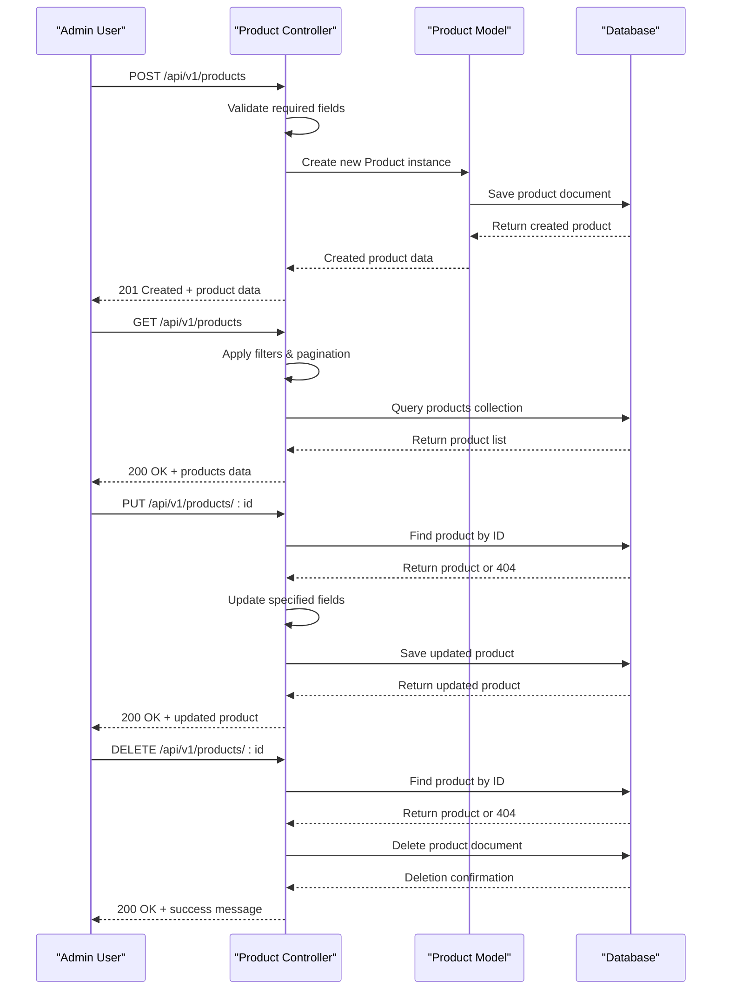
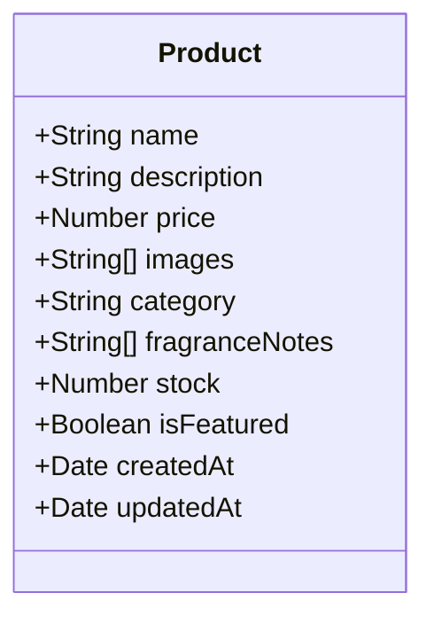
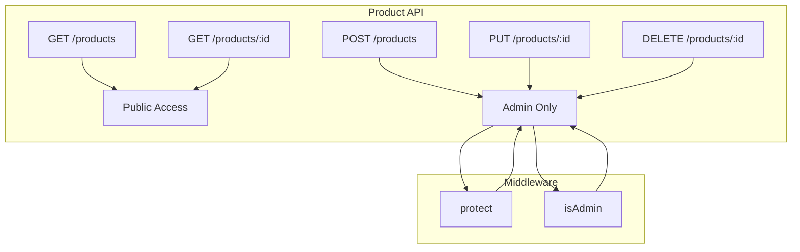
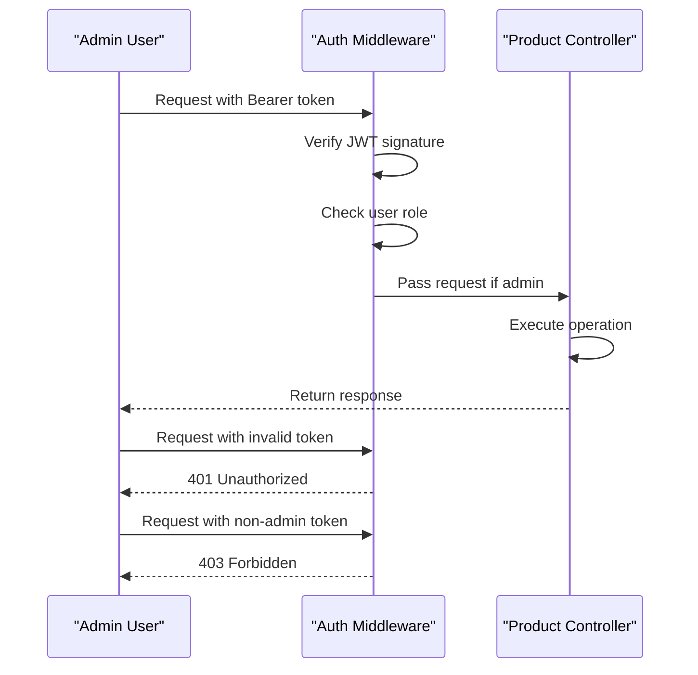

# Product Management

<cite>
**Referenced Files in This Document**   
- [Product.model.js](file://server/src/models/Product.model.js)
- [Product.controller.js](file://server/src/controllers/Product.controller.js)
- [Product.routes.js](file://server/src/routes/Product.routes.js)
- [Auth.middleware.js](file://server/src/middleware/Auth.middleware.js)
</cite>

## Table of Contents
1. [Introduction](#introduction)
2. [Core Components](#core-components)
3. [CRUD Operations](#crud-operations)
4. [Model Schema](#model-schema)
5. [API Endpoints](#api-endpoints)
6. [Business Rules](#business-rules)
7. [Security and Access Control](#security-and-access-control)
8. [Image Handling](#image-handling)
9. [Extension Opportunities](#extension-opportunities)
10. [Conclusion](#conclusion)

## Introduction
The product management system in the VnV24 backend provides a comprehensive solution for managing product inventory through a RESTful API. This system enables administrators to perform full CRUD (Create, Read, Update, Delete) operations on products while providing public access to product information with filtering, sorting, and pagination capabilities. The implementation follows a clean separation of concerns with distinct model, controller, and route components that work together to provide a robust product management solution.

## Core Components
The product management system consists of three primary components that follow the MVC (Model-View-Controller) pattern: the Product model that defines the data structure, the Product controller that contains the business logic, and the Product routes that expose the functionality through HTTP endpoints. These components work together to provide a complete product management solution with proper validation, error handling, and security controls.

**Section sources**
- [Product.model.js](file://server/src/models/Product.model.js)
- [Product.controller.js](file://server/src/controllers/Product.controller.js)
- [Product.routes.js](file://server/src/routes/Product.routes.js)

## CRUD Operations

### Create Operation
The create operation allows administrators to add new products to the inventory. The system validates required fields such as name, price, and category before creating a new product document in the database. The operation returns the created product with a 201 status code to indicate successful creation.

### Read Operations
The system provides two read operations: retrieving all products with filtering and pagination capabilities, and retrieving a single product by ID. The getAll operation supports query parameters for filtering by category and price range, sorting, and pagination to handle large product catalogs efficiently.

### Update Operation
The update operation allows administrators to modify existing product information. The system first verifies the product exists before applying updates to specified fields. All modifiable fields are explicitly listed in the controller to prevent unauthorized property updates.

### Delete Operation
The delete operation removes products from the system. The implementation first checks if the product exists before deletion and returns appropriate status codes for success or failure conditions.

**Diagram sources**
- [Product.controller.js](file://server/src/controllers/Product.controller.js#L54-L73)
- [Product.controller.js](file://server/src/controllers/Product.controller.js#L78-L93)
- [Product.controller.js](file://server/src/controllers/Product.controller.js#L98-L108)

**Section sources**
- [Product.controller.js](file://server/src/controllers/Product.controller.js#L54-L108)

## Model Schema
The Product model defines the structure of product data in the MongoDB database. It includes essential fields for product information with appropriate validation and default values.

### Field Definitions
The schema includes the following fields:

| Field | Type | Required | Default | Description |
|-------|------|----------|---------|-------------|
| name | String | Yes | - | Product name |
| description | String | No | - | Product description |
| price | Number | Yes | - | Product price in INR |
| images | Array of Strings | No | [] | Cloudinary image URLs |
| category | String | Yes | - | Product category |
| fragranceNotes | Array of Strings | No | [] | Scent profile for fragrances |
| stock | Number | No | 0 | Available inventory |
| isFeatured | Boolean | No | false | Featured product status |

### Timestamps
The model includes automatic timestamp fields (createdAt and updatedAt) provided by Mongoose, which track when products are created and last modified.

**Diagram sources**
- [Product.model.js](file://server/src/models/Product.model.js#L3-L16)

**Section sources**
- [Product.model.js](file://server/src/models/Product.model.js#L1-L18)

## API Endpoints
The product routes expose the controller functions through RESTful endpoints under the /api/v1/products base path. The routing configuration implements proper separation between public and protected operations.

### Public Endpoints
- `GET /api/v1/products` - Retrieve all products with filtering and pagination
- `GET /api/v1/products/:id` - Retrieve a specific product by ID

### Protected Endpoints
- `POST /api/v1/products` - Create a new product (admin only)
- `PUT /api/v1/products/:id` - Update an existing product (admin only)
- `DELETE /api/v1/products/:id` - Delete a product (admin only)

### Query Parameters
The GET endpoint supports several query parameters for filtering and sorting:
- `page` - Page number for pagination (default: 1)
- `limit` - Number of products per page (default: 10)
- `category` - Filter by product category
- `price_min` - Minimum price filter
- `price_max` - Maximum price filter
- `sort` - Field to sort by

**Diagram sources**
- [Product.routes.js](file://server/src/routes/Product.routes.js#L1-L23)

**Section sources**
- [Product.routes.js](file://server/src/routes/Product.routes.js#L1-L24)

## Business Rules
The product management system enforces several business rules to maintain data integrity and implement business requirements.

### Category Constraints
Products must be assigned to a valid category, which is a required field in the schema. This ensures all products are properly categorized for filtering and organization.

### Inventory Management
The stock field tracks available inventory with a default value of zero. This allows products to be created as placeholders before inventory is available.

### Product Visibility
The isFeatured boolean field controls whether a product appears in featured collections or promotional areas of the frontend application.

### Data Validation
The system validates required fields (name, price, category) before creating or updating products to ensure data quality.

## Security and Access Control
The system implements role-based access control to protect sensitive operations.

### Authentication
The protect middleware verifies JWT tokens in the Authorization header to authenticate users before allowing access to protected routes.

### Authorization
The isAdmin middleware ensures only users with the "admin" role can perform create, update, and delete operations, preventing unauthorized modifications.

**Diagram sources**
- [Auth.middleware.js](file://server/src/middleware/Auth.middleware.js#L1-L25)
- [Product.routes.js](file://server/src/routes/Product.routes.js#L1-L23)

**Section sources**
- [Auth.middleware.js](file://server/src/middleware/Auth.middleware.js#L1-L26)

## Image Handling
While the codebase includes Cloudinary references in the dependencies, the current implementation does not contain explicit Cloudinary integration code in the product management components. The images field in the Product model is designed to store arrays of image URLs, suggesting that image uploads are handled externally or in components not currently visible in the analyzed files.

The system is structured to support image management through the images array field, which can store multiple image URLs for each product. This design allows for flexible image handling and could be extended to integrate with Cloudinary's upload API for direct image processing and storage.

## Extension Opportunities
The product management system can be extended in several ways to enhance functionality.

### Product Variants
The current model could be extended to support product variants (e.g., different sizes, colors, or scents) by adding a variants array field or creating a separate ProductVariant model with relationships to the main Product.

### Bulk Operations
Implementing bulk import/export functionality would allow administrators to manage large numbers of products efficiently, potentially through CSV file uploads or API batch operations.

### Advanced Search
Integrating Elasticsearch could provide powerful full-text search capabilities, faceted navigation, and improved performance for large product catalogs.

### Order Integration
Enhancing the delete operation to check for existing orders containing the product would prevent deletion of products that are part of completed or pending orders, maintaining data integrity across the system.

## Conclusion
The product management system in the VnV24 backend provides a solid foundation for managing product inventory with comprehensive CRUD operations, proper security controls, and flexible querying capabilities. The clean separation of concerns between model, controller, and route components makes the system maintainable and extensible. While the current implementation lacks explicit Cloudinary integration code in the visible components, the architecture is designed to support image management through external services. Future enhancements could include product variants, bulk operations, and advanced search capabilities to further improve the system's functionality.