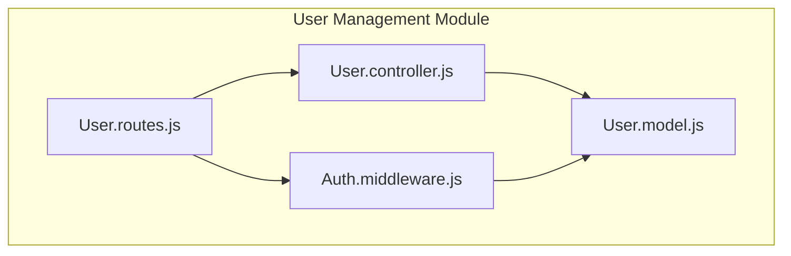
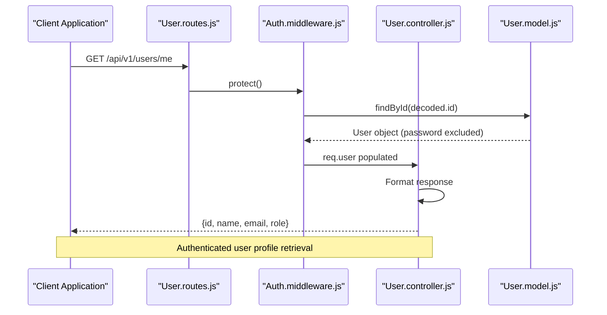
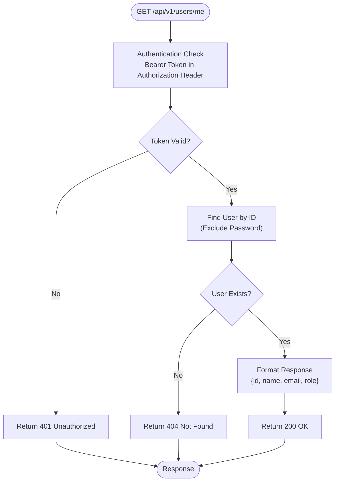
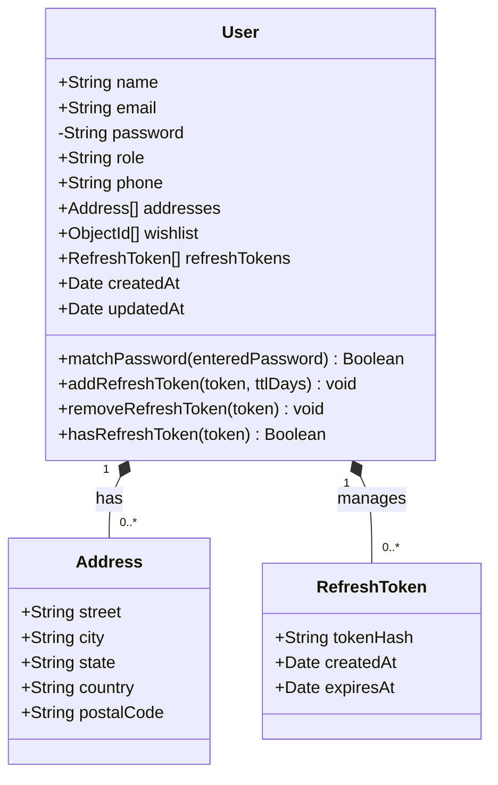
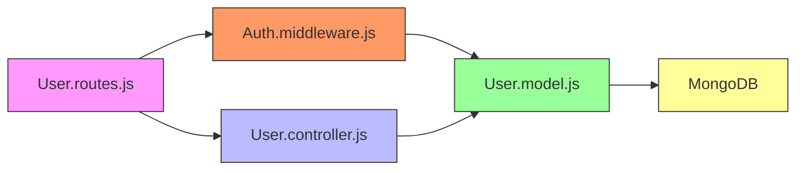

# User Management

<cite>
**Referenced Files in This Document**   
- [User.controller.js](file://server/src/controllers/User.controller.js)
- [User.routes.js](file://server/src/routes/User.routes.js)
- [User.model.js](file://server/src/models/User.model.js)
- [Auth.middleware.js](file://server/src/middleware/Auth.middleware.js)
</cite>

## Table of Contents
1. [Introduction](#introduction)
2. [Project Structure](#project-structure)
3. [Core Components](#core-components)
4. [Architecture Overview](#architecture-overview)
5. [Detailed Component Analysis](#detailed-component-analysis)
6. [Dependency Analysis](#dependency-analysis)
7. [Performance Considerations](#performance-considerations)
8. [Troubleshooting Guide](#troubleshooting-guide)
9. [Conclusion](#conclusion)

## Introduction
The VnV24 backend implements a secure and scalable user management system that enables authenticated users to manage their profiles, addresses, and account settings. This document details the implementation of user profile retrieval, address book operations, and role-based access control through the User model, routes, and associated middleware. The system leverages JWT-based authentication and protects sensitive operations with authorization guards.

## Project Structure
The user management functionality is organized within the server/src directory following a modular MVC-like pattern. The core components are separated into models, controllers, routes, and middleware to ensure separation of concerns and maintainability.

**Diagram sources**
- [User.model.js](file://server/src/models/User.model.js)
- [User.controller.js](file://server/src/controllers/User.controller.js)
- [User.routes.js](file://server/src/routes/User.routes.js)
- [Auth.middleware.js](file://server/src/middleware/Auth.middleware.js)

**Section sources**
- [User.model.js](file://server/src/models/User.model.js)
- [User.routes.js](file://server/src/routes/User.routes.js)

## Core Components
The user management system consists of three primary components: the User model defining data structure, User routes providing API endpoints, and authentication middleware ensuring secure access. These components work together to enable profile management while protecting sensitive operations and preventing privilege escalation.

**Section sources**
- [User.model.js](file://server/src/models/User.model.js#L1-L65)
- [User.routes.js](file://server/src/routes/User.routes.js#L1-L15)
- [Auth.middleware.js](file://server/src/middleware/Auth.middleware.js#L1-L25)

## Architecture Overview
The user management architecture follows a request-response flow where API requests are first authenticated, then routed to appropriate controller methods that interact with the User model. The system uses Express.js routing with middleware chaining to enforce security policies before accessing user data.

**Diagram sources**
- [User.routes.js](file://server/src/routes/User.routes.js#L5-L9)
- [Auth.middleware.js](file://server/src/middleware/Auth.middleware.js#L3-L17)
- [User.model.js](file://server/src/models/User.model.js#L50-L52)

## Detailed Component Analysis

### User Profile Management
The system currently implements secure retrieval of user profile information through the `/me` endpoint. When an authenticated user requests their profile, the system returns essential information while explicitly excluding sensitive fields like passwords.

**Diagram sources**
- [User.routes.js](file://server/src/routes/User.routes.js#L5-L9)
- [Auth.middleware.js](file://server/src/middleware/Auth.middleware.js#L3-L17)

**Section sources**
- [User.routes.js](file://server/src/routes/User.routes.js#L5-L9)
- [Auth.middleware.js](file://server/src/middleware/Auth.middleware.js#L3-L17)

### User Model Schema
The User model defines a comprehensive schema that includes personal information, address management, and security features. The schema enforces data integrity through required fields, uniqueness constraints, and secure password handling.

**Diagram sources**
- [User.model.js](file://server/src/models/User.model.js#L12-L32)

**Section sources**
- [User.model.js](file://server/src/models/User.model.js#L1-L65)

## Dependency Analysis
The user management system has well-defined dependencies between components, with clear separation of concerns. The routes depend on both controllers and middleware, while the middleware depends on the User model for authentication operations.

**Diagram sources**
- [User.routes.js](file://server/src/routes/User.routes.js)
- [User.controller.js](file://server/src/controllers/User.controller.js)
- [Auth.middleware.js](file://server/src/middleware/Auth.middleware.js)
- [User.model.js](file://server/src/models/User.model.js)

**Section sources**
- [User.routes.js](file://server/src/routes/User.routes.js)
- [User.controller.js](file://server/src/controllers/User.controller.js)
- [Auth.middleware.js](file://server/src/middleware/Auth.middleware.js)
- [User.model.js](file://server/src/models/User.model.js)

## Performance Considerations
The current implementation efficiently retrieves user data by selecting only necessary fields and excluding the password field at the database level. The use of indexed fields like email ensures fast lookups during authentication. However, the system could benefit from adding indexes on frequently queried fields and implementing caching for profile data to reduce database load.

## Troubleshooting Guide
Common issues in the user management system typically involve authentication failures or data retrieval problems. Ensure that requests include the proper Bearer token in the Authorization header and that the JWT_SECRET environment variable is correctly configured. For user data issues, verify that the MongoDB connection is stable and that the User model schema matches the database structure.

**Section sources**
- [Auth.middleware.js](file://server/src/middleware/Auth.middleware.js#L3-L17)
- [User.model.js](file://server/src/models/User.model.js#L50-L52)

## Conclusion
The VnV24 user management system provides a secure foundation for handling user profiles and authentication. While currently focused on profile retrieval, the architecture supports extension to full CRUD operations for user data, address management, and preferences. Future enhancements should include implementing update endpoints with proper validation, adding address management operations, and extending the profile schema with additional metadata fields while maintaining the principle of least privilege in data exposure.