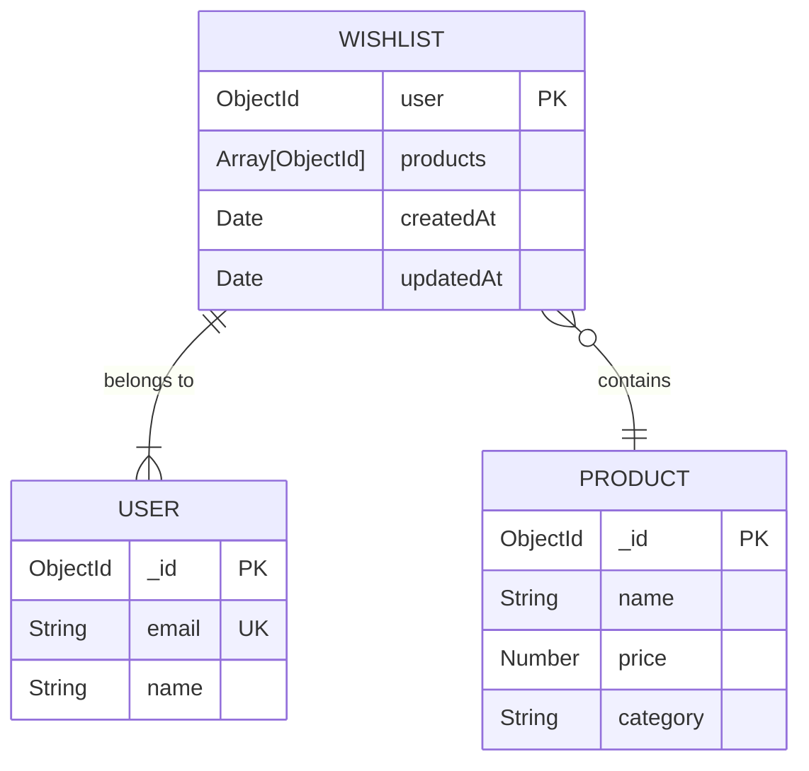
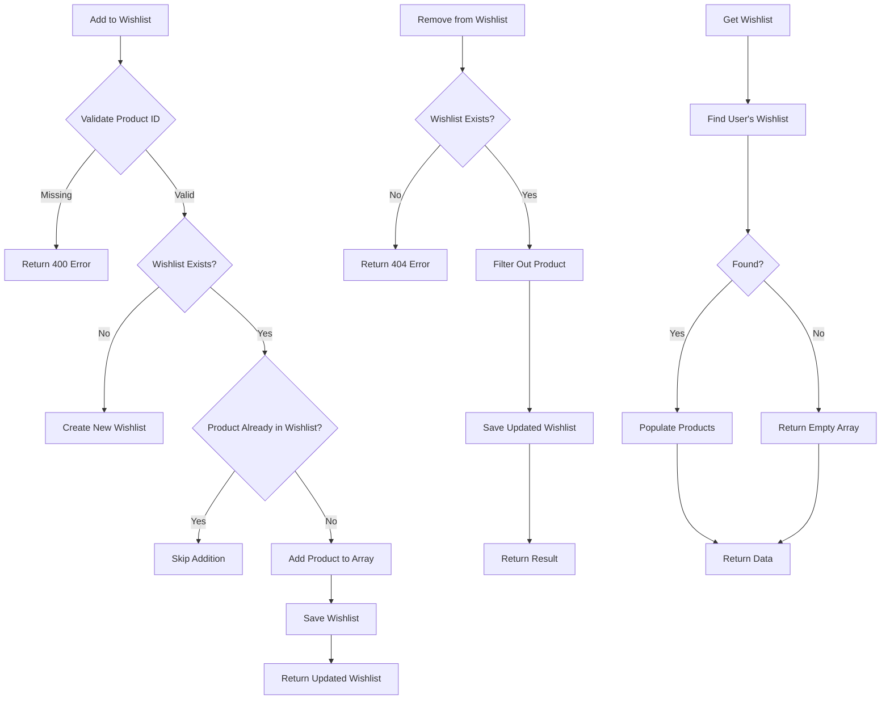

# Wishlist Features

<cite>
**Referenced Files in This Document**   
- [Wishlist.controller.js](file://server/src/controllers/Wishlist.controller.js)
- [Wishlist.routes.js](file://server/src/routes/Wishlist.routes.js)
- [Wishlist.model.js](file://server/src/models/Wishlist.model.js)
- [User.model.js](file://server/src/models/User.model.js)
- [Product.model.js](file://server/src/models/Product.model.js)
</cite>

## Table of Contents
1. [Introduction](#introduction)
2. [Wishlist Model Schema](#wishlist-model-schema)
3. [Controller Implementation](#controller-implementation)
4. [Routing Configuration](#routing-configuration)
5. [API Usage Examples](#api-usage-examples)
6. [Performance and Synchronization](#performance-and-synchronization)
7. [Extension Opportunities](#extension-opportunities)

## Introduction
The wishlist functionality in the VnV24 backend provides users with the ability to save products for future consideration, creating a personalized shopping experience. This document details the implementation of the wishlist system, covering the data model, controller logic, routing configuration, and potential extensions. The system is designed to be efficient, secure, and scalable, with built-in mechanisms for duplicate prevention and product availability awareness.

## Wishlist Model Schema

The Wishlist model defines the structure for storing user wishlists in the database, establishing relationships between users and their saved products.



**Diagram sources**
- [Wishlist.model.js](file://server/src/models/Wishlist.model.js#L2-L8)
- [User.model.js](file://server/src/models/User.model.js#L15-L65)
- [Product.model.js](file://server/src/models/Product.model.js#L2-L17)

The schema consists of:
- **user**: A required ObjectId reference to the User model, establishing the one-to-one relationship between a user and their wishlist
- **products**: An array of ObjectId references to the Product model, storing the collection of saved products
- **timestamps**: Automatic createdAt and updatedAt fields provided by Mongoose for tracking when the wishlist was created and last modified

This design ensures data integrity through proper referencing and enables efficient queries for retrieving a user's wishlist with populated product details.

**Section sources**
- [Wishlist.model.js](file://server/src/models/Wishlist.model.js#L2-L10)

## Controller Implementation

The Wishlist controller implements the core business logic for managing user wishlists, including adding, removing, and retrieving items with proper error handling and duplicate prevention.



**Diagram sources**
- [Wishlist.controller.js](file://server/src/controllers/Wishlist.controller.js#L7-L56)

### Get Wishlist
The `getWishlist` function retrieves the authenticated user's wishlist from the database, populating the product references with actual product data. If no wishlist exists, it returns an empty products array to ensure consistent response structure.

**Section sources**
- [Wishlist.controller.js](file://server/src/controllers/Wishlist.controller.js#L7-L14)

### Add to Wishlist
The `addToWishlist` function handles adding products to a user's wishlist with duplicate prevention. It first validates that a productId is provided, then checks if the user already has a wishlist. If not, it creates a new one with the product. If a wishlist exists, it only adds the product if it's not already present in the products array.

**Section sources**
- [Wishlist.controller.js](file://server/src/controllers/Wishlist.controller.js#L19-L36)

### Remove from Wishlist
The `removeFromWishlist` function removes a specified product from the user's wishlist. It first verifies that the wishlist exists, then filters out the product with the matching productId from the products array before saving the updated document.

**Section sources**
- [Wishlist.controller.js](file://server/src/controllers/Wishlist.controller.js#L41-L56)

## Routing Configuration

The wishlist routes define the API endpoints that expose the wishlist functionality to clients, with proper authentication protection.

```mermaid
graph TD
A[Client Request] --> B{HTTP Method}
B --> |GET| C[/api/v1/wishlist]
B --> |POST| D[/api/v1/wishlist]
B --> |DELETE| E[/api/v1/wishlist/:productId]
C --> F[getWishlist]
D --> G[addToWishlist]
E --> H[removeFromWishlist]
F --> I[Authentication]
G --> I
H --> I
I --> J[Controller Execution]
```

**Diagram sources**
- [Wishlist.routes.js](file://server/src/routes/Wishlist.routes.js#L1-L15)
- [Auth.middleware.js](file://server/src/middleware/Auth.middleware.js#L1-L25)

The routing configuration establishes three endpoints under the `/api/v1/wishlist` base path:
- **GET /**: Retrieves the current user's wishlist
- **POST /**: Adds a product to the user's wishlist
- **DELETE /:productId**: Removes a specific product from the user's wishlist

All routes are protected by the `protect` middleware, ensuring that only authenticated users can access wishlist functionality. The middleware verifies the JWT token and attaches the user object to the request before passing control to the controller functions.

**Section sources**
- [Wishlist.routes.js](file://server/src/routes/Wishlist.routes.js#L1-L15)

## API Usage Examples

### Retrieving Wishlist
```http
GET /api/v1/wishlist
Authorization: Bearer <token>
```

Response:
```json
{
  "success": true,
  "data": {
    "products": [
      {
        "_id": "60d0fe4f5311236168a109ca",
        "name": "Luxury Perfume",
        "price": 89.99,
        "category": "fragrance"
      }
    ],
    "createdAt": "2024-01-15T10:30:00.000Z",
    "updatedAt": "2024-01-15T10:30:00.000Z"
  }
}
```

### Adding to Wishlist
```http
POST /api/v1/wishlist
Authorization: Bearer <token>
Content-Type: application/json
```

Request body:
```json
{
  "productId": "60d0fe4f5311236168a109cb"
}
```

### Cross-Device Synchronization
The wishlist system automatically synchronizes across devices through the centralized database storage. When a user adds an item on one device, subsequent GET requests from any other device will retrieve the updated wishlist.

### Handling Concurrent Modifications
The current implementation uses a simple save strategy that may overwrite concurrent modifications. For high-traffic scenarios, consider implementing versioning or optimistic locking to handle simultaneous updates from multiple devices.

**Section sources**
- [Wishlist.controller.js](file://server/src/controllers/Wishlist.controller.js#L7-L56)
- [Wishlist.routes.js](file://server/src/routes/Wishlist.routes.js#L1-L15)

## Performance and Synchronization

### Large Wishlist Performance
For users with extensive wishlists, consider implementing pagination or lazy loading for the product list. The current implementation retrieves all products at once, which may impact performance for wishlists containing hundreds of items.

### Caching Strategy
Implement Redis or a similar in-memory store to cache frequently accessed wishlists, reducing database load and improving response times. Cache invalidation should occur whenever a wishlist is modified.

### Shopping Cart Synchronization
The system could be extended to allow easy transfer of items between wishlist and shopping cart. Consider adding endpoints to move products from wishlist to cart, or to add all wishlist items to the cart at once.

**Section sources**
- [Wishlist.controller.js](file://server/src/controllers/Wishlist.controller.js#L7-L56)
- [Wishlist.model.js](file://server/src/models/Wishlist.model.js#L2-L8)

## Extension Opportunities

### Wishlist Sharing
Extend the functionality to allow users to share their wishlists with others by:
- Adding a visibility field (private, shared, public) to the Wishlist model
- Implementing shareable URLs with unique tokens
- Creating endpoints to retrieve shared wishlists by token

### Price Drop Notifications
Integrate with a notification system to alert users when products in their wishlist experience price reductions:
- Store original price when product is added to wishlist
- Implement a background job that periodically checks product prices
- Send notifications via email or push when price thresholds are met

### Recommendation Integration
Leverage wishlist data to enhance the recommendation engine:
- Analyze wishlist categories and products to suggest similar items
- Implement "frequently bought together" suggestions based on wishlist patterns
- Create personalized marketing campaigns based on wishlist content

**Section sources**
- [Wishlist.model.js](file://server/src/models/Wishlist.model.js#L2-L8)
- [Wishlist.controller.js](file://server/src/controllers/Wishlist.controller.js#L7-L56)