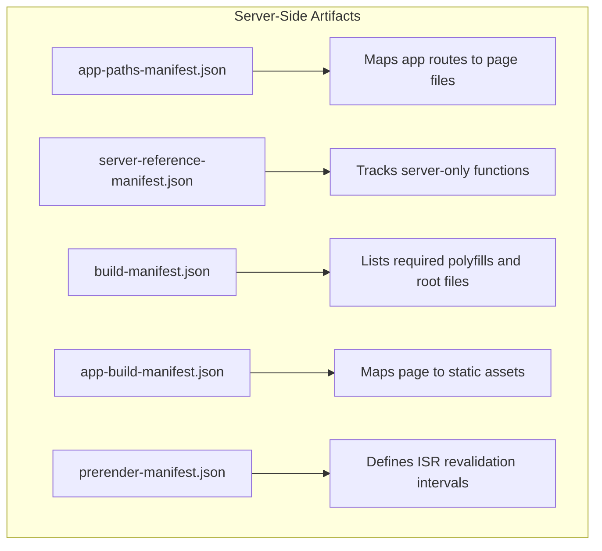
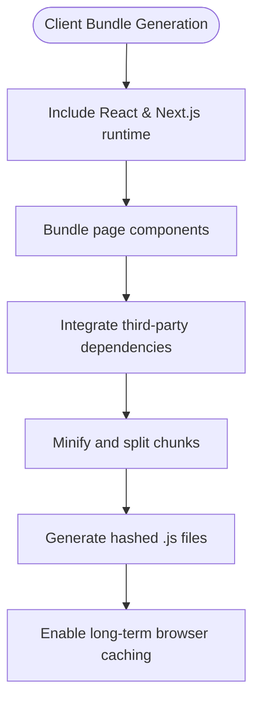
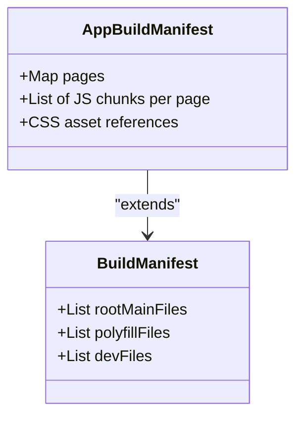
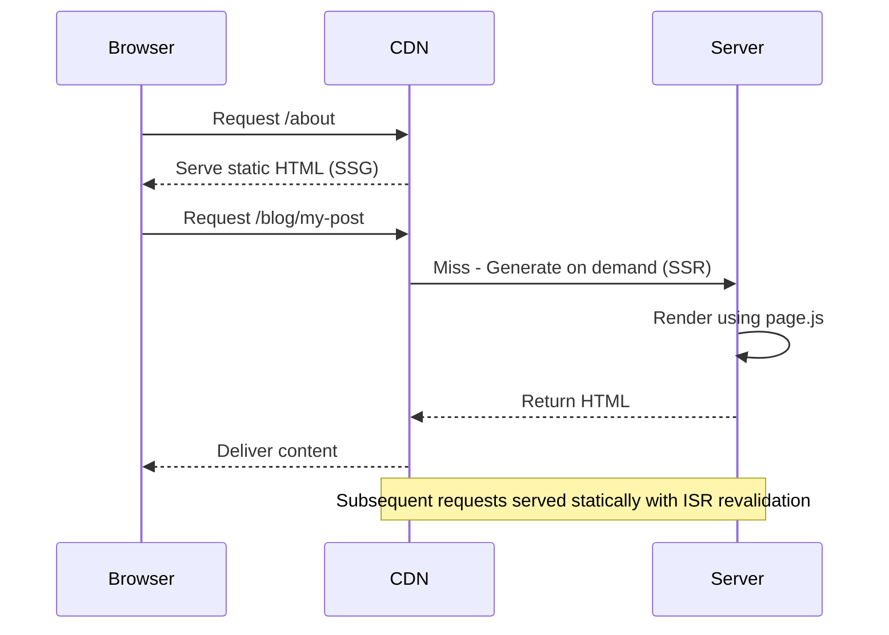

# Build Artifacts and Output Structure

<cite>
**Referenced Files in This Document**   
- [client/.next/server/app-paths-manifest.json](file://client/.next/server/app-paths-manifest.json)
- [client/.next/server/app/page/app-paths-manifest.json](file://client/.next/server/app/page/app-paths-manifest.json)
- [client/.next/server/app/page/app-build-manifest.json](file://client/.next/server/app/page/app-build-manifest.json)
- [client/.next/server/app/page/build-manifest.json](file://client/.next/server/app/page/build-manifest.json)
- [client/.next/server/app/page/server-reference-manifest.json](file://client/.next/server/app/page/server-reference-manifest.json)
- [client/.next/server/server-reference-manifest.json](file://client/.next/server/server-reference-manifest.json)
- [client/.next/routes-manifest.json](file://client/.next/routes-manifest.json)
- [client/.next/server/chunks/ssr/Desktop_Internships_VnV24_client_app_page_7e431d46._.js](file://client/.next/server/chunks/ssr/Desktop_Internships_VnV24_client_app_page_7e431d46._.js)
- [client/.next/static/chunks/app_page_77556fd7.js](file://client/.next/static/chunks/app_page_77556fd7.js)
- [client/.next/server/pages/_app.js](file://client/.next/server/pages/_app.js)
</cite>

## Table of Contents
1. [Introduction](#introduction)
2. [Server-Side Output in /client/.next/server](#server-side-output-in-clientnextserver)
3. [Client-Side Static Chunks in /client/.next/static/chunks](#client-side-static-chunks-in-clientnextstaticchunks)
4. [Route Manifest and Routing Configuration](#route-manifest-and-routing-configuration)
5. [Build Manifests and Asset Mapping](#build-manifests-and-asset-mapping)
6. [Server Reference Tracking](#server-reference-tracking)
7. [Application of SSR, SSG, and ISR](#application-of-ssr-ssg-and-isr)
8. [Bundle Analysis and Performance Optimization](#bundle-analysis-and-performance-optimization)
9. [Development vs Production Builds](#development-vs-production-builds)
10. [Conclusion](#conclusion)

## Introduction
The `.next` directory in a Next.js application contains all compiled build artifacts generated during the build process. These artifacts are essential for enabling advanced rendering strategies such as Server-Side Rendering (SSR), Static Site Generation (SSG), and Incremental Static Regeneration (ISR). This document provides a comprehensive analysis of the output structure, focusing on server-side manifests, client-side JavaScript bundles, route definitions, and optimization metadata. Understanding these artifacts enables developers to optimize performance, debug deployment issues, and fine-tune application behavior.

## Server-Side Output in /client/.next/server
The `/client/.next/server` directory contains server-executable code and metadata required for rendering pages on the server. It includes route manifests, server reference tracking files, and prerendered page assets that support dynamic and static rendering modes.



**Diagram sources**
- [client/.next/server/app-paths-manifest.json](file://client/.next/server/app-paths-manifest.json)
- [client/.next/server/server-reference-manifest.json](file://client/.next/server/server-reference-manifest.json)
- [client/.next/server/app/page/build-manifest.json](file://client/.next/server/app/page/build-manifest.json)

**Section sources**
- [client/.next/server/app-paths-manifest.json](file://client/.next/server/app-paths-manifest.json)
- [client/.next/server/server-reference-manifest.json](file://client/.next/server/server-reference-manifest.json)

## Client-Side Static Chunks in /client/.next/static/chunks
The `/client/.next/static/chunks` directory contains optimized JavaScript bundles for client-side execution. These chunks include framework runtime, component logic, third-party libraries, and CSS assets, all processed and minified for production delivery.



**Diagram sources**
- [client/.next/static/chunks/app_page_77556fd7.js](file://client/.next/static/chunks/app_page_77556fd7.js)
- [client/.next/server/chunks/ssr/Desktop_Internships_VnV24_client_app_page_7e431d46._.js](file://client/.next/server/chunks/ssr/Desktop_Internships_VnV24_client_app_page_7e431d46._.js)

**Section sources**
- [client/.next/static/chunks/app_page_77556fd7.js](file://client/.next/static/chunks/app_page_77556fd7.js)
- [client/.next/server/chunks/ssr/Desktop_Internships_VnV24_client_app_page_7e431d46._.js](file://client/.next/server/chunks/ssr/Desktop_Internships_VnV24_client_app_page_7e431d46._.js)

## Route Manifest and Routing Configuration
The `routes-manifest.json` file defines the routing behavior of the application, including redirects, rewrites, and base path configuration. It enables proper URL handling during both development and production.

```json
{
  "version": 3,
  "caseSensitive": false,
  "basePath": "",
  "rewrites": {
    "beforeFiles": [],
    "afterFiles": [],
    "fallback": []
  },
  "redirects": [
    {
      "source": "/:path+/",
      "destination": "/:path+",
      "permanent": true,
      "internal": true
    }
  ],
  "headers": []
}
```

This configuration enforces trailing slash removal, ensuring consistent URL patterns across the application. The manifest supports dynamic routing through parameterized paths like `/blog/[slug]` and `/shop/[productId]`, which are resolved at request time or during static generation.

**Section sources**
- [client/.next/routes-manifest.json](file://client/.next/routes-manifest.json)

## Build Manifests and Asset Mapping
Build manifests such as `app-build-manifest.json` and `build-manifest.json` map page components to their corresponding static assets. These files are critical for determining which JavaScript and CSS resources need to be loaded for each page.



The `app-build-manifest.json` specifies the exact chunks required for each page, enabling efficient code splitting. The `build-manifest.json` includes global assets like polyfills and framework runtimes that are shared across pages.

**Diagram sources**
- [client/.next/server/app/page/app-build-manifest.json](file://client/.next/server/app/page/app-build-manifest.json)
- [client/.next/server/app/page/build-manifest.json](file://client/.next/server/app/page/build-manifest.json)

**Section sources**
- [client/.next/server/app/page/app-build-manifest.json](file://client/.next/server/app/page/app-build-manifest.json)
- [client/.next/server/app/page/build-manifest.json](file://client/.next/server/app/page/build-manifest.json)

## Server Reference Tracking
The `server-reference-manifest.json` tracks server-only functions and components that should not be exposed to the client. This enables secure execution of server-side logic while preventing accidental leakage of sensitive operations.

```json
{
  "node": {},
  "edge": {},
  "encryptionKey": "H38Z/UUcpWHxj9+UjbtADj2DuYqWY8nKjUiGVqALjM="
}
```

This manifest ensures that server actions, API routes, and database operations remain isolated from client bundles. The encryption key is used to securely serialize server references when needed for hybrid rendering.

**Section sources**
- [client/.next/server/server-reference-manifest.json](file://client/.next/server/server-reference-manifest.json)
- [client/.next/server/app/page/server-reference-manifest.json](file://client/.next/server/app/page/server-reference-manifest.json)

## Application of SSR, SSG, and ISR
The generated artifacts enable Next.js rendering strategies:
- **SSR**: Server-rendered HTML is generated using `.js` files in `/server/app/`
- **SSG**: Static HTML files are prebuilt using manifest data
- **ISR**: Revalidation rules in `prerender-manifest.json` allow background regeneration

Pages like `/about`, `/contact`, and `/shop` are statically generated at build time, while dynamic routes like `/blog/[slug]` use ISR with fallback capabilities. The `app-paths-manifest.json` maps each route to its corresponding page component, enabling efficient server-side resolution.



**Diagram sources**
- [client/.next/server/app-paths-manifest.json](file://client/.next/server/app-paths-manifest.json)
- [client/.next/server/app/page/page.js](file://client/.next/server/app/page/page.js)

**Section sources**
- [client/.next/server/app-paths-manifest.json](file://client/.next/server/app-paths-manifest.json)

## Bundle Analysis and Performance Optimization
Developers can analyze bundle composition by inspecting:
- `app-build-manifest.json`: Page-specific chunk dependencies
- Static chunk filenames: Indicate content (e.g., `app_about_page_*.js`)
- CSS extraction: Styles are split into `.css` files for parallel loading

Performance optimizations include:
- Code splitting based on route boundaries
- Shared chunk extraction for common dependencies
- Long-term caching via content hashing
- Tree-shaking of unused framework modules

Tools like `@next/bundle-analyzer` can visualize these relationships, but direct inspection of the `.next` directory provides granular control over optimization decisions.

**Section sources**
- [client/.next/server/app/page/app-build-manifest.json](file://client/.next/server/app/page/app-build-manifest.json)
- [client/.next/static/chunks/app_page_77556fd7.js](file://client/.next/static/chunks/app_page_77556fd7.js)

## Development vs Production Builds
Key differences between development and production builds:
- **Development**: No static optimization, hot module replacement (HMR) enabled
- **Production**: Full code splitting, minification, and static generation

The `/static/chunks/development` directory contains `_buildManifest.js` and `_ssgManifest.js` for dev-time features. Production builds generate optimized, hashed filenames for cache efficiency, while development uses readable names for debugging.

Server manifests in `/server` remain consistent across environments but contain environment-specific logic paths.

**Section sources**
- [client/.next/static/chunks/development/_buildManifest.js](file://client/.next/static/chunks/development/_buildManifest.js)

## Conclusion
The `.next` directory structure represents a sophisticated compilation output that enables modern web application patterns. By understanding the role of server manifests, client bundles, and routing configurations, developers can effectively optimize performance, debug rendering issues, and leverage Next.js's full capabilities. These artifacts form the backbone of SSR, SSG, and ISR implementations, making them essential knowledge for production-grade Next.js applications.