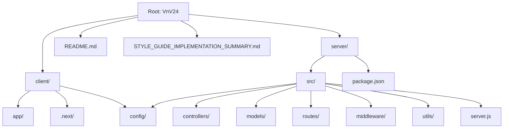
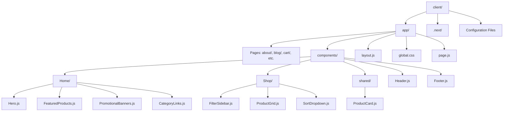
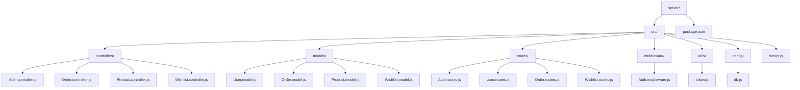
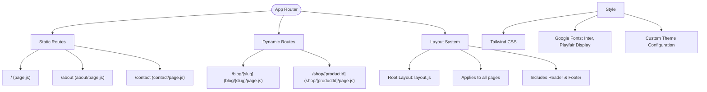
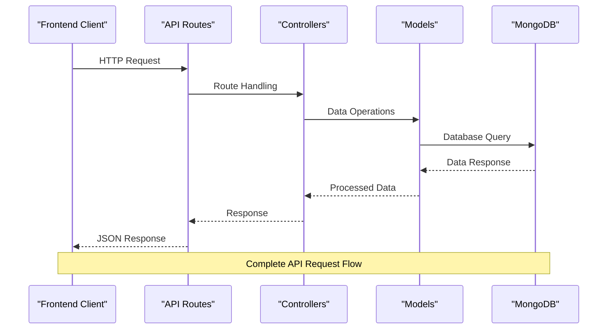
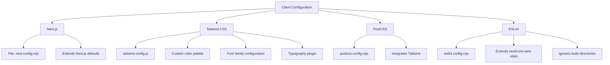
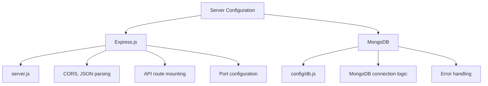
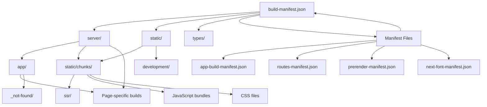

# Directory Structure

<cite>
**Referenced Files in This Document**   
- [client/app/page.js](file://client/app/page.js)
- [client/app/layout.js](file://client/app/layout.js)
- [client/next.config.mjs](file://client/next.config.mjs)
- [client/tailwind.config.js](file://client/tailwind.config.js)
- [client/postcss.config.mjs](file://client/postcss.config.mjs)
- [client/eslint.config.mjs](file://client/eslint.config.mjs)
- [server/src/server.js](file://server/src/server.js)
- [server/src/config/db.js](file://server/src/config/db.js)
</cite>

## Table of Contents
1. [Introduction](#introduction)
2. [Project Structure Overview](#project-structure-overview)
3. [Client Application Structure](#client-application-structure)
4. [Server Application Structure](#server-application-structure)
5. [Frontend Routing and Layout System](#frontend-routing-and-layout-system)
6. [Backend MVC Architecture](#backend-mvc-architecture)
7. [Configuration Files](#configuration-files)
8. [Build Artifacts and Production Deployment](#build-artifacts-and-production-deployment)
9. [Developer Navigation Guide](#developer-navigation-guide)

## Introduction
This document provides a comprehensive overview of the VnV24 repository's directory structure, detailing the separation between client and server applications. The frontend is built with Next.js and located in the `/client` directory, while the backend is implemented with Express.js in the `/server` directory. This documentation explains the organization, routing mechanisms, architectural patterns, and configuration systems used in both applications.

## Project Structure Overview
The VnV24 repository follows a monorepo structure with clear separation between frontend and backend applications. The root directory contains configuration files and documentation, while the main applications reside in dedicated directories.

**Diagram sources**
- [client/app](file://client/app)
- [server/src](file://server/src)

## Client Application Structure
The client application is built with Next.js and follows the App Router pattern. The main application code resides in the `/client/app` directory, which serves as the entry point for all routes and layouts.

**Diagram sources**
- [client/app](file://client/app)
- [client/app/components](file://client/app/components)

**Section sources**
- [client/app/page.js](file://client/app/page.js)
- [client/app/layout.js](file://client/app/layout.js)

## Server Application Structure
The server application implements the MVC (Model-View-Controller) pattern using Express.js. The architecture separates concerns into distinct directories for controllers, models, routes, middleware, and utilities.

**Diagram sources**
- [server/src](file://server/src)
- [server/src/controllers](file://server/src/controllers)
- [server/src/models](file://server/src/models)
- [server/src/routes](file://server/src/routes)

## Frontend Routing and Layout System
The Next.js App Router in `/client/app` implements a file-based routing system where directory names correspond to URL paths. The structure supports static routes, dynamic routes, and nested layouts.

### Routing Patterns

**Diagram sources**
- [client/app](file://client/app)
- [client/app/layout.js](file://client/app/layout.js)
- [client/tailwind.config.js](file://client/tailwind.config.js)

**Section sources**
- [client/app/page.js](file://client/app/page.js)
- [client/app/layout.js](file://client/app/layout.js)

## Backend MVC Architecture
The Express.js backend follows the MVC pattern with clear separation of responsibilities between components. Controllers handle business logic, models manage data, and routes define API endpoints.

**Diagram sources**
- [server/src/server.js](file://server/src/server.js)
- [server/src/routes/Auth.routes.js](file://server/src/routes/Auth.routes.js)
- [server/src/controllers/Auth.controller.js](file://server/src/controllers/Auth.controller.js)
- [server/src/models/User.model.js](file://server/src/models/User.model.js)

## Configuration Files
Both applications contain configuration files that define build settings, styling, linting, and development environment parameters.

### Client Configuration

### Server Configuration

**Diagram sources**
- [client/next.config.mjs](file://client/next.config.mjs)
- [client/tailwind.config.js](file://client/tailwind.config.js)
- [client/postcss.config.mjs](file://client/postcss.config.mjs)
- [client/eslint.config.mjs](file://client/eslint.config.mjs)
- [server/src/server.js](file://server/src/server.js)
- [server/src/config/db.js](file://server/src/config/db.js)

## Build Artifacts and Production Deployment
The `.next` directory contains all build artifacts generated during the Next.js compilation process. These files are essential for production deployment and optimized runtime performance.

**Diagram sources**
- [.next](file://client/.next)
- [client/.next/server](file://client/.next/server)
- [client/.next/static](file://client/.next/static)

## Developer Navigation Guide
This guide helps developers quickly locate key functionality within the VnV24 repository.

### Frontend Navigation
- **Homepage Components**: `client/app/components/Home/`
- **Shared UI Components**: `client/app/components/shared/`
- **Layout System**: `client/app/layout.js`
- **Global Styles**: `client/app/globals.css`
- **Page Routes**: `client/app/[page-name]/page.js`
- **Dynamic Routes**: `client/app/[resource]/[id]/page.js`

### Backend Navigation
- **API Endpoints**: `server/src/routes/`
- **Business Logic**: `server/src/controllers/`
- **Data Models**: `server/src/models/`
- **Authentication**: `server/src/controllers/Auth.controller.js`
- **Database Connection**: `server/src/config/db.js`
- **Request Validation**: `server/src/middleware/`

### Configuration Navigation
- **Next.js Settings**: `client/next.config.mjs`
- **Styling Configuration**: `client/tailwind.config.js`
- **Code Linting**: `client/eslint.config.mjs`
- **Server Environment**: `server/src/server.js`
- **Database Settings**: `server/src/config/db.js`

**Section sources**
- [client/next.config.mjs](file://client/next.config.mjs)
- [client/tailwind.config.js](file://client/tailwind.config.js)
- [server/src/server.js](file://server/src/server.js)