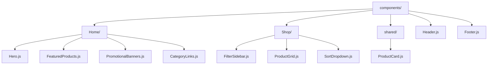
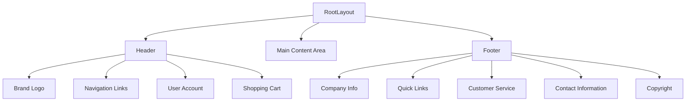
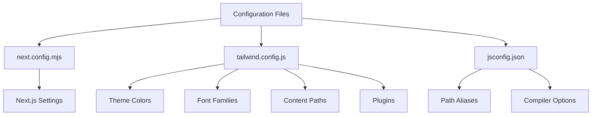

# Frontend Directory Structure

<cite>
**Referenced Files in This Document**   
- [client/app/page.js](file://client/app/page.js)
- [client/app/layout.js](file://client/app/layout.js)
- [client/app/components/Header.js](file://client/app/components/Header.js)
- [client/app/components/Footer.js](file://client/app/components/Footer.js)
- [client/app/components/Home/Hero.js](file://client/app/components/Home/Hero.js)
- [client/next.config.mjs](file://client/next.config.mjs)
- [client/tailwind.config.js](file://client/tailwind.config.js)
- [client/jsconfig.json](file://client/jsconfig.json)
- [client/.next](file://client/.next)
</cite>

## Table of Contents
1. [Introduction](#introduction)
2. [Next.js App Router Structure](#nextjs-app-router-structure)
3. [Components Organization](#components-organization)
4. [Layout and Shared UI](#layout-and-shared-ui)
5. [Configuration Files](#configuration-files)
6. [Build Output Directory](#build-output-directory)
7. [Navigation and Routing Guide](#navigation-and-routing-guide)
8. [Styling and Animation System](#styling-and-animation-system)
9. [Conclusion](#conclusion)

## Introduction
This document provides a comprehensive overview of the frontend directory structure for the VnV24 e-commerce application. It details the organization of the Next.js App Router, component architecture, configuration files, and build system. The documentation is designed to help developers understand the project structure, locate key functionality, and maintain consistency across the codebase.

## Next.js App Router Structure

The application follows the Next.js App Router convention, where the `client/app` directory serves as the root for all routing and page rendering. Each subdirectory within `app` corresponds to a route in the application, with `page.js` files defining the content for each route.

Static pages such as About, Contact, and Privacy Policy are implemented as dedicated directories containing `page.js` files. These pages are automatically mapped to their respective routes (`/about`, `/contact`, `/privacy-policy`) by Next.js routing conventions.

Dynamic routes are implemented using bracket notation for route parameters. The `[slug]` directory within `blog` handles dynamic blog post URLs, while the `[productId]` directory within `shop` manages product detail pages. These dynamic segments allow the application to render content based on URL parameters without requiring separate files for each possible value.

The root `page.js` file serves as the homepage component, while `layout.js` provides the root layout that wraps all pages with consistent UI elements.

```mermaid
graph TD
A[app/] --> B[page.js]
A --> C[layout.js]
A --> D[about/]
A --> E[contact/]
A --> F[privacy-policy/]
A --> G[terms-and-conditions/]
A --> H[blog/]
A --> I[shop/]
A --> J[cart/]
A --> K[checkout/]
H --> L[page.js]
H --> M[[slug]/]
M --> N[page.js]
I --> O[page.js]
I --> P[[productId]/]
P --> Q[page.js]
```

**Diagram sources**
- [client/app/page.js](file://client/app/page.js)
- [client/app/layout.js](file://client/app/layout.js)

**Section sources**
- [client/app/page.js](file://client/app/page.js#L1-L17)
- [client/app/about/page.js](file://client/app/about/page.js)
- [client/app/blog/page.js](file://client/app/blog/page.js)
- [client/app/blog/[slug]/page.js](file://client/app/blog/[slug]/page.js)
- [client/app/shop/page.js](file://client/app/shop/page.js)
- [client/app/shop/[productId]/page.js](file://client/app/shop/[productId]/page.js)

## Components Organization

The components directory is organized by feature, with dedicated folders for Home, Shop, and shared UI elements. This structure promotes maintainability and logical grouping of related functionality.

The Home feature directory contains components specific to the homepage, including Hero, FeaturedProducts, PromotionalBanners, and CategoryLinks. These components work together to create the main landing experience for visitors.

The Shop directory includes components related to product browsing functionality, such as FilterSidebar, ProductGrid, and SortDropdown. These elements provide the interactive shopping experience for users exploring the product catalog.

Shared components are placed in the shared directory for reuse across multiple pages. The ProductCard component serves as a standardized representation of products throughout the application, ensuring visual consistency.

Reusable UI elements like Header and Footer are maintained at the top level of the components directory, as they are used across all pages in the application.



**Diagram sources**
- [client/app/components/Header.js](file://client/app/components/Header.js)
- [client/app/components/Footer.js](file://client/app/components/Footer.js)
- [client/app/components/Home/Hero.js](file://client/app/components/Home/Hero.js)
- [client/app/components/shared/ProductCard.js](file://client/app/components/shared/ProductCard.js)

**Section sources**
- [client/app/components/Header.js](file://client/app/components/Header.js#L1-L30)
- [client/app/components/Footer.js](file://client/app/components/Footer.js#L1-L45)
- [client/app/components/Home/Hero.js](file://client/app/components/Home/Hero.js#L1-L32)
- [client/app/components/shared/ProductCard.js](file://client/app/components/shared/ProductCard.js)

## Layout and Shared UI

The root layout is defined in `layout.js`, which wraps all pages with consistent UI elements including the Header and Footer components. This approach ensures a cohesive user experience across the application while avoiding code duplication.

The RootLayout component imports Google Fonts (Inter and Playfair Display) and applies them as CSS variables to the HTML element. This enables consistent typography throughout the application using Tailwind's font utilities.

The layout establishes the primary color scheme using the custom Tailwind theme, with `bg-primary` (off-white/cream) as the background and `text-text-dark` (dark gray) as the default text color. The main content area is contained within a centered container with responsive padding.

The Header component provides navigation to key sections of the site (Shop, Blog, About, Contact) and access to user account and cart functionality. It uses a sticky positioning with backdrop blur for a modern, elevated appearance.

The Footer component offers comprehensive site navigation, customer service links, and contact information. It features a dark theme with forest green background and gold accent colors, providing visual contrast to the main content.



**Diagram sources**
- [client/app/layout.js](file://client/app/layout.js#L23-L36)
- [client/app/components/Header.js](file://client/app/components/Header.js#L3-L29)
- [client/app/components/Footer.js](file://client/app/components/Footer.js#L0-L44)

**Section sources**
- [client/app/layout.js](file://client/app/layout.js#L1-L37)
- [client/app/components/Header.js](file://client/app/components/Header.js#L1-L30)
- [client/app/components/Footer.js](file://client/app/components/Footer.js#L1-L45)

## Configuration Files

The project utilizes several configuration files to manage build settings, styling, and development environment.

`next.config.mjs` contains the Next.js configuration, currently using default settings. This file can be extended to customize webpack, environment variables, image optimization, and other build options.

`tailwind.config.js` defines the project's design system with custom colors, fonts, and plugins. The color palette includes primary (off-white/cream), secondary (warm taupe), forest green, and gold/copper accent colors. Typography uses Inter for sans-serif text and Playfair Display for serif headings. The Typography plugin enhances content rendering for rich text.

`jsconfig.json` establishes path aliases, allowing imports using the `@/` prefix to reference files relative to the project root. This improves import readability and reduces long relative paths in component files.



**Diagram sources**
- [client/next.config.mjs](file://client/next.config.mjs)
- [client/tailwind.config.js](file://client/tailwind.config.js)
- [client/jsconfig.json](file://client/jsconfig.json)

**Section sources**
- [client/next.config.mjs](file://client/next.config.mjs#L1-L5)
- [client/tailwind.config.js](file://client/tailwind.config.js#L1-L39)
- [client/jsconfig.json](file://client/jsconfig.json#L1-L8)

## Build Output Directory

The `.next` directory is automatically generated during the build process and contains all compiled assets, server-side rendered chunks, and runtime modules. This directory should not be committed to version control as it can be regenerated.

The server directory contains application manifests, build information, and server-side rendered JavaScript files. These include app-build-manifest.json, app-paths-manifest.json, and server-reference-manifest.json, which map routes to their corresponding code chunks.

The static directory holds client-side assets including JavaScript chunks, CSS files, and development manifests. The chunks are optimized for code splitting, allowing lazy loading of page-specific functionality.

The types directory contains generated TypeScript definitions for routes, enabling type safety in routing operations.

The root of the `.next` directory includes various manifest files that describe the application structure, routes, and build configuration for both development and production environments.

**Section sources**
- [client/.next](file://client/.next)

## Navigation and Routing Guide

Developers can locate routing logic by examining the directory structure within `client/app`. Each directory corresponds to a route, and `page.js` files define the content for those routes. Dynamic parameters are indicated by square brackets (`[slug]`, `[productId]`).

UI components are organized in the `client/app/components` directory, grouped by feature (Home, Shop) or purpose (shared, layout components). Reusable elements like Header and Footer are located at the top level of the components directory.

Global styles are defined in `globals.css` and imported in `layout.js`. The Tailwind configuration in `tailwind.config.js` establishes the color palette, typography, and design tokens used throughout the application.

To add a new page, create a directory under `app` with the desired route name and add a `page.js` file. For dynamic routes, use bracket notation for parameters. To modify shared UI, edit the corresponding component in the components directory.

## Styling and Animation System

The application uses Tailwind CSS with a utility-first approach, leveraging the custom theme defined in `tailwind.config.js`. The color system includes semantic names like `primary`, `secondary`, `forest-green`, and `gold` that map to specific design values.

Typography is managed through CSS variables set in `layout.js`, with Inter for body text and Playfair Display for headings. These fonts are applied globally through the HTML class attribute.

Interactive elements use transition classes for smooth hover effects, particularly for navigation links and buttons that change to gold color on hover. The Header uses backdrop blur and transparency for a modern, layered effect.

While not explicitly shown in the provided files, the presence of Framer Motion is indicated in the documentation objective, suggesting its use for page transitions, component animations, and interactive effects throughout the application.

**Section sources**
- [client/tailwind.config.js](file://client/tailwind.config.js#L1-L39)
- [client/app/layout.js](file://client/app/layout.js#L1-L37)
- [client/app/components/Header.js](file://client/app/components/Header.js#L1-L30)

## Conclusion

The VnV24 frontend structure follows Next.js best practices with a clear organization of routes, components, and configuration. The App Router enables intuitive routing through file-based conventions, while the component architecture promotes reusability and maintainability. The styling system combines Tailwind's utility classes with a custom design token system to ensure visual consistency across the e-commerce platform. Developers can efficiently navigate the codebase by understanding the relationship between directory structure, routing, and component organization.