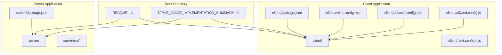
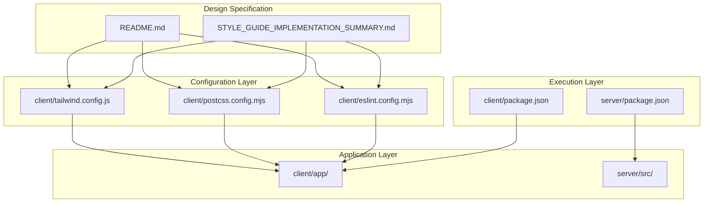
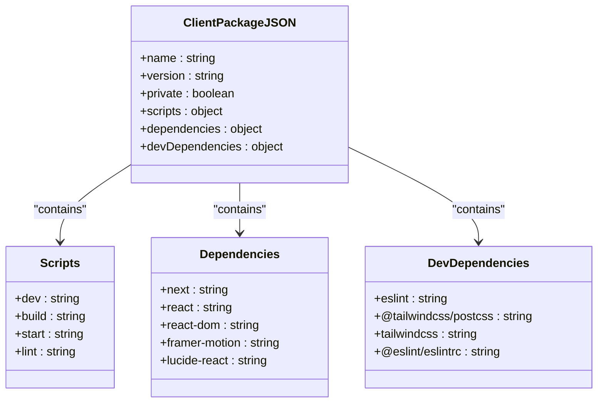
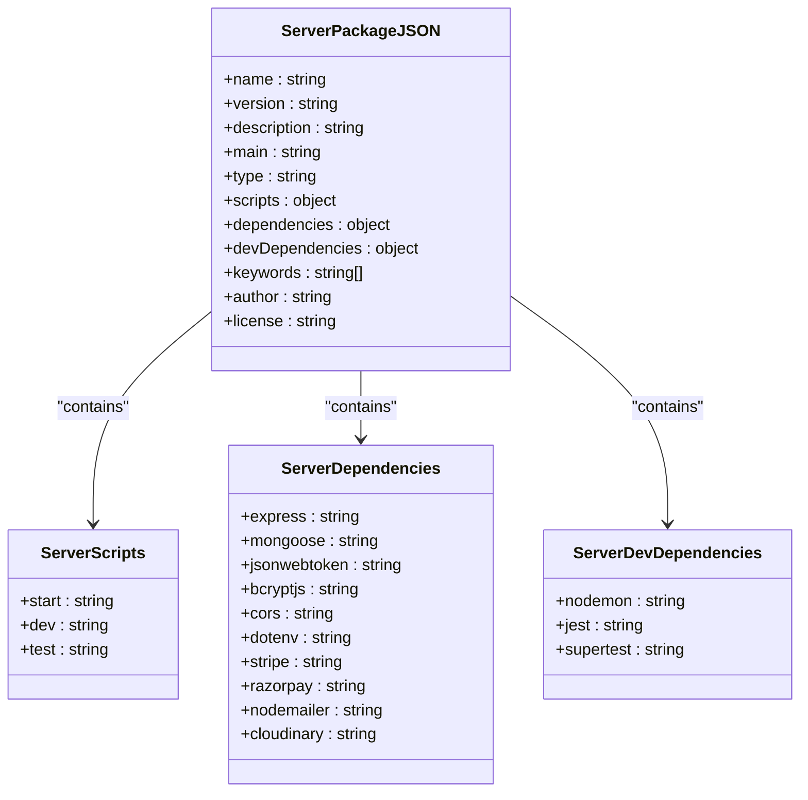
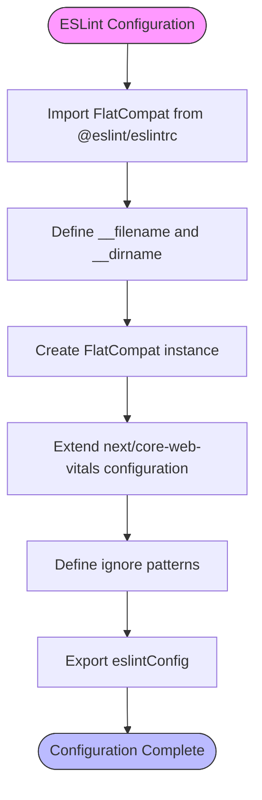
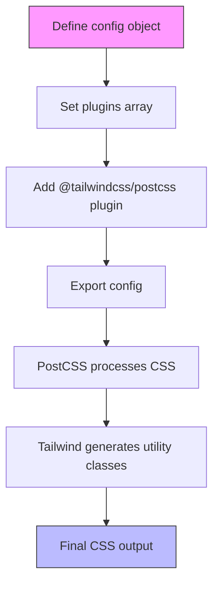
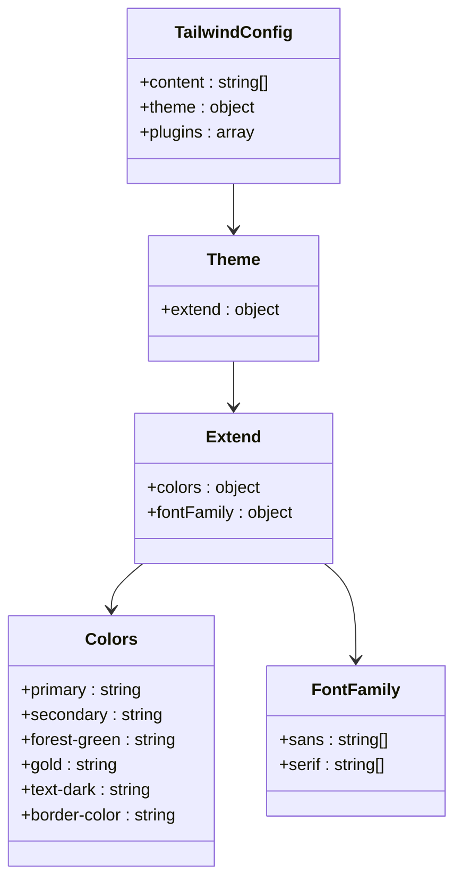
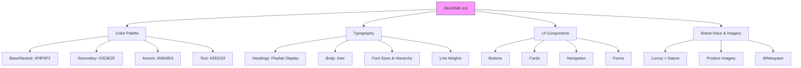
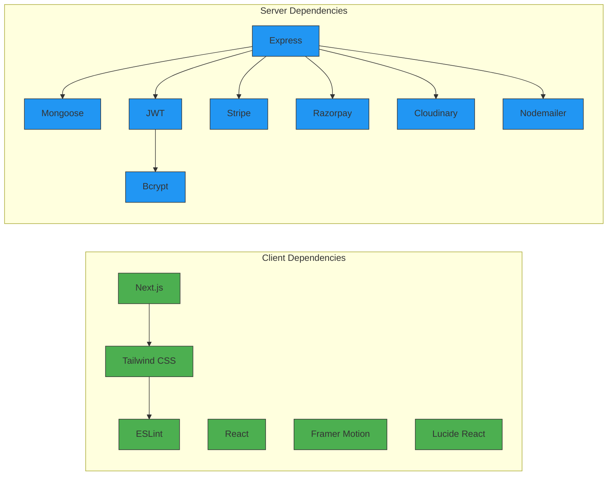

# Root-Level Configuration Files

<cite>
**Referenced Files in This Document**   
- [client/package.json](file://client/package.json)
- [server/package.json](file://server/package.json)
- [client/eslint.config.mjs](file://client/eslint.config.mjs)
- [client/postcss.config.mjs](file://client/postcss.config.mjs)
- [client/tailwind.config.js](file://client/tailwind.config.js)
- [STYLE_GUIDE_IMPLEMENTATION_SUMMARY.md](file://STYLE_GUIDE_IMPLEMENTATION_SUMMARY.md)
- [README.md](file://README.md)
</cite>

## Table of Contents
1. [Introduction](#introduction)
2. [Project Structure](#project-structure)
3. [Core Components](#core-components)
4. [Architecture Overview](#architecture-overview)
5. [Detailed Component Analysis](#detailed-component-analysis)
6. [Dependency Analysis](#dependency-analysis)
7. [Performance Considerations](#performance-considerations)
8. [Troubleshooting Guide](#troubleshooting-guide)
9. [Conclusion](#conclusion)
10. [Appendices](#appendices)

## Introduction
This document provides a comprehensive analysis of the root-level configuration files in the VnV24 repository, which govern the frontend and backend applications. These configuration files establish the foundation for dependency management, code quality enforcement, styling systems, and development workflows. The repository follows a monorepo structure with separate `client` and `server` directories, each containing their own `package.json` files to manage project-specific dependencies and scripts. Additional configuration files like `eslint.config.mjs`, `postcss.config.mjs`, and `tailwind.config.js` work together to enforce consistent code quality and implement a sophisticated styling system based on Tailwind CSS. The `STYLE_GUIDE_IMPLEMENTATION_SUMMARY.md` and `README.md` files provide essential documentation for design system adherence and project onboarding.

## Project Structure
The VnV24 repository follows a clear monorepo architecture with distinct frontend and backend applications. The `client` directory contains a Next.js application with React components, pages, and styling configurations, while the `server` directory houses a Node.js/Express backend with controllers, models, and routes. This separation allows for independent development and deployment of frontend and backend services while maintaining a unified codebase. The root directory contains shared documentation and configuration files that coordinate between the two applications.

**Diagram sources**
- [client/package.json](file://client/package.json)
- [server/package.json](file://server/package.json)
- [client/eslint.config.mjs](file://client/eslint.config.mjs)
- [client/postcss.config.mjs](file://client/postcss.config.mjs)
- [client/tailwind.config.js](file://client/tailwind.config.js)

**Section sources**
- [client/package.json](file://client/package.json)
- [server/package.json](file://server/package.json)
- [README.md](file://README.md)

## Core Components
The core configuration components in the VnV24 repository establish the development environment, styling system, and code quality standards. The `package.json` files in both client and server directories define project metadata, dependencies, and npm scripts that streamline development workflows. The frontend configuration leverages ESLint, PostCSS, and Tailwind CSS to create a robust styling pipeline that implements the brand's design system. The `STYLE_GUIDE_IMPLEMENTATION_SUMMARY.md` serves as a bridge between design specifications and code implementation, documenting how visual guidelines have been translated into technical configurations.

**Section sources**
- [client/package.json](file://client/package.json)
- [server/package.json](file://server/package.json)
- [client/eslint.config.mjs](file://client/eslint.config.mjs)
- [client/postcss.config.mjs](file://client/postcss.config.mjs)
- [STYLE_GUIDE_IMPLEMENTATION_SUMMARY.md](file://STYLE_GUIDE_IMPLEMENTATION_SUMMARY.md)

## Architecture Overview
The configuration architecture of VnV24 follows a layered approach where different tools work together to transform design specifications into a functional application. At the foundation are the `package.json` files that manage dependencies and provide entry points for development scripts. Above this layer, the frontend styling system is built on a pipeline that begins with Tailwind CSS utility classes, processed through PostCSS, and validated by ESLint. The `tailwind.config.js` file extends the default configuration with the brand's specific color palette and typography, while `postcss.config.mjs` orchestrates the CSS transformation process. This architecture ensures that the visual design system documented in `README.md` is consistently implemented across all components.

**Diagram sources**
- [client/package.json](file://client/package.json)
- [server/package.json](file://server/package.json)
- [client/eslint.config.mjs](file://client/eslint.config.mjs)
- [client/postcss.config.mjs](file://client/postcss.config.mjs)
- [client/tailwind.config.js](file://client/tailwind.config.js)
- [STYLE_GUIDE_IMPLEMENTATION_SUMMARY.md](file://STYLE_GUIDE_IMPLEMENTATION_SUMMARY.md)
- [README.md](file://README.md)

## Detailed Component Analysis

### package.json Configuration
The `package.json` files serve as the central configuration hub for both frontend and backend applications, managing dependencies, scripts, and project metadata. The client-side `package.json` is configured for a Next.js application with Turbopack, while the server-side `package.json` sets up a Node.js/Express backend with MongoDB integration.

#### Client package.json Analysis
The client package.json defines a modern Next.js application with optimized development workflows. It specifies dependencies for React, Next.js, and UI libraries like Framer Motion and Lucide React, while devDependencies include tools for linting and styling. The scripts enable streamlined development with Turbopack for faster builds.

**Diagram sources**
- [client/package.json](file://client/package.json)

**Section sources**
- [client/package.json](file://client/package.json)

#### Server package.json Analysis
The server package.json configures a robust Node.js backend with comprehensive dependencies for authentication, database operations, security, and payment processing. It includes essential packages for Express middleware, MongoDB integration with Mongoose, JWT authentication, and third-party services like Stripe and Razorpay.

**Diagram sources**
- [server/package.json](file://server/package.json)

**Section sources**
- [server/package.json](file://server/package.json)

### ESLint Configuration
The `eslint.config.mjs` file establishes code quality standards for the frontend application, ensuring consistency and best practices across the codebase. It extends the Next.js core web vitals configuration and defines ignore patterns for build artifacts.

**Diagram sources**
- [client/eslint.config.mjs](file://client/eslint.config.mjs)

**Section sources**
- [client/eslint.config.mjs](file://client/eslint.config.mjs)

### PostCSS Configuration
The `postcss.config.mjs` file orchestrates the CSS transformation pipeline, specifically enabling Tailwind CSS processing. It serves as a lightweight configuration that connects the PostCSS processor with the Tailwind plugin.

**Diagram sources**
- [client/postcss.config.mjs](file://client/postcss.config.mjs)

**Section sources**
- [client/postcss.config.mjs](file://client/postcss.config.mjs)

### Tailwind Configuration
The `tailwind.config.js` file extends the default Tailwind configuration with the brand's specific design system, implementing the color palette and typography guidelines from the style guide. It defines custom colors for the luxury fragrance brand and sets up font families for consistent typography.

**Diagram sources**
- [client/tailwind.config.js](file://client/tailwind.config.js)

**Section sources**
- [client/tailwind.config.js](file://client/tailwind.config.js)

### Style Guide Implementation
The `STYLE_GUIDE_IMPLEMENTATION_SUMMARY.md` document provides a comprehensive overview of how the design specifications have been implemented across the application. It details the translation of color palettes, typography, and UI components from design guidelines to code.

```mermaid
flowchart TD
A["Style Guide Implementation"] --> B["Color Palette Updates"]
B --> B1["Primary: #F8F6F2"]
B --> B2["Secondary: #FAF9F7"]
B --> B3["Deep Forest Green: #2E3E2F"]
B --> B4["Gold: #D6A953"]
A --> C["Typography Implementation"]
C --> C1["Playfair Display for headings"]
C --> C2["Inter for body text"]
C --> C3["Proper font hierarchy"]
A --> D["Component Updates"]
D --> D1["Header styling"]
D --> D2["Footer styling"]
D --> D3["Product Cards"]
D --> D4["Buttons"]
D --> D5["Form Elements"]
A --> E["Page Updates"]
E --> E1["Home Page"]
E --> E2["About Page"]
E --> E3["Shop Page"]
E --> E4["Cart Page"]
E --> E5["Checkout Page"]
A --> F["UI/UX Improvements"]
F --> F1["Hover states"]
F --> F2["Consistent spacing"]
F --> F3["Accessibility"]
style A fill:#f9f,stroke:#333
```

**Diagram sources**
- [STYLE_GUIDE_IMPLEMENTATION_SUMMARY.md](file://STYLE_GUIDE_IMPLEMENTATION_SUMMARY.md)

**Section sources**
- [STYLE_GUIDE_IMPLEMENTATION_SUMMARY.md](file://STYLE_GUIDE_IMPLEMENTATION_SUMMARY.md)

### README Documentation
The `README.md` file serves as the primary entry point for developers, containing comprehensive style guide specifications for the VnV24 brand. It details the color palette, typography, UI components, and brand voice that inform the technical implementation.

**Diagram sources**
- [README.md](file://README.md)

**Section sources**
- [README.md](file://README.md)

## Dependency Analysis
The dependency structure of VnV24 reveals a clear separation of concerns between frontend and backend applications. The client application focuses on UI rendering with Next.js, React, and styling libraries, while the server application emphasizes backend functionality with Express, MongoDB, authentication, and payment processing libraries. Both applications maintain independent dependency trees, preventing version conflicts and allowing for targeted updates. The configuration files work together to create a cohesive development environment where code quality tools (ESLint) and styling systems (Tailwind CSS via PostCSS) ensure consistency across the frontend codebase.

**Diagram sources**
- [client/package.json](file://client/package.json)
- [server/package.json](file://server/package.json)

**Section sources**
- [client/package.json](file://client/package.json)
- [server/package.json](file://server/package.json)

## Performance Considerations
The configuration choices in VnV24 reflect performance optimization considerations, particularly in the frontend application. The use of Turbopack in the development scripts (`"dev": "next dev --turbopack"`) indicates a focus on faster build times and improved developer experience. The styling system leverages Tailwind CSS's utility-first approach, which generates highly optimized CSS with minimal file size. The separation of dependencies between client and server allows for independent optimization of each application's bundle size. The ESLint configuration includes ignore patterns for build directories, preventing unnecessary linting of generated files and improving tool performance.

## Troubleshooting Guide
When encountering issues with the VnV24 configuration, consider the following common scenarios and solutions:

1. **Development server fails to start**: Verify that the correct Node.js version is installed and that all dependencies have been installed with `npm install` in both client and server directories.

2. **Styling not applied correctly**: Check that `tailwind.config.js` colors match the design specifications and that PostCSS is properly processing the CSS files through `postcss.config.mjs`.

3. **ESLint errors during development**: Ensure that the `eslint.config.mjs` file is correctly extending the Next.js configuration and that ignore patterns are properly defined for build directories.

4. **Environment variable issues**: Confirm that `.env` files are properly configured in both client and server directories with the required environment variables for services like Stripe, Razorpay, and Cloudinary.

5. **Dependency conflicts**: Since client and server have separate package.json files, ensure that shared dependencies (if any) are compatible across both applications.

**Section sources**
- [client/package.json](file://client/package.json)
- [server/package.json](file://server/package.json)
- [client/eslint.config.mjs](file://client/eslint.config.mjs)
- [client/postcss.config.mjs](file://client/postcss.config.mjs)
- [client/tailwind.config.js](file://client/tailwind.config.js)

## Conclusion
The root-level configuration files in the VnV24 repository establish a robust foundation for a modern e-commerce application with a clear separation between frontend and backend concerns. The dual `package.json` structure allows for independent management of client and server dependencies while maintaining a unified codebase. The frontend configuration leverages modern tools like Next.js with Turbopack, ESLint, PostCSS, and Tailwind CSS to create an efficient development workflow and implement a sophisticated design system. The `STYLE_GUIDE_IMPLEMENTATION_SUMMARY.md` and `README.md` files provide essential documentation that bridges design specifications with technical implementation, ensuring consistency across the application. This configuration architecture supports the brand's luxury fragrance positioning with a focus on performance, code quality, and visual consistency.

## Appendices

### npm Scripts Reference
The following npm scripts are available for development:

**Client Scripts:**
- `npm run dev`: Start the Next.js development server with Turbopack
- `npm run build`: Build the Next.js application for production
- `npm start`: Start the production server
- `npm run lint`: Run ESLint to check code quality

**Server Scripts:**
- `npm run dev`: Start the server with nodemon for development
- `npm start`: Start the production server
- `npm run test`: Run Jest tests

### Environment Variable Management
The application requires environment variables for various services. These should be defined in `.env` files in both client and server directories:

**Server .env variables:**
- `MONGODB_URI`: MongoDB connection string
- `JWT_SECRET`: Secret for JWT token generation
- `STRIPE_SECRET_KEY`: Stripe API secret key
- `RAZORPAY_KEY_ID`: Razorpay API key ID
- `RAZORPAY_SECRET`: Razorpay API secret
- `CLOUDINARY_CLOUD_NAME`: Cloudinary cloud name
- `CLOUDINARY_API_KEY`: Cloudinary API key
- `CLOUDINARY_API_SECRET`: Cloudinary API secret
- `EMAIL_USER`: Email service username
- `EMAIL_PASS`: Email service password

**Client .env variables:**
- `NEXT_PUBLIC_STRIPE_PUBLISHABLE_KEY`: Stripe publishable key
- `NEXT_PUBLIC_RAZORPAY_KEY_ID`: Razorpay key ID for client-side
- `NEXT_PUBLIC_API_URL`: Base URL for API requests