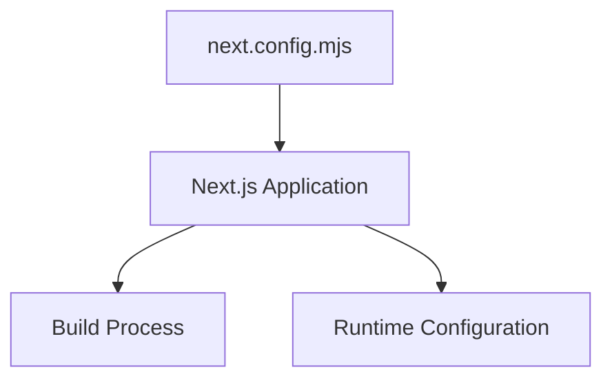
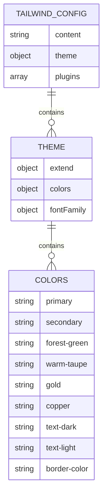
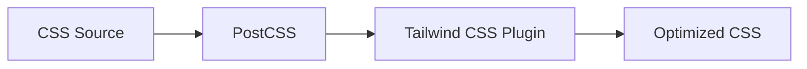
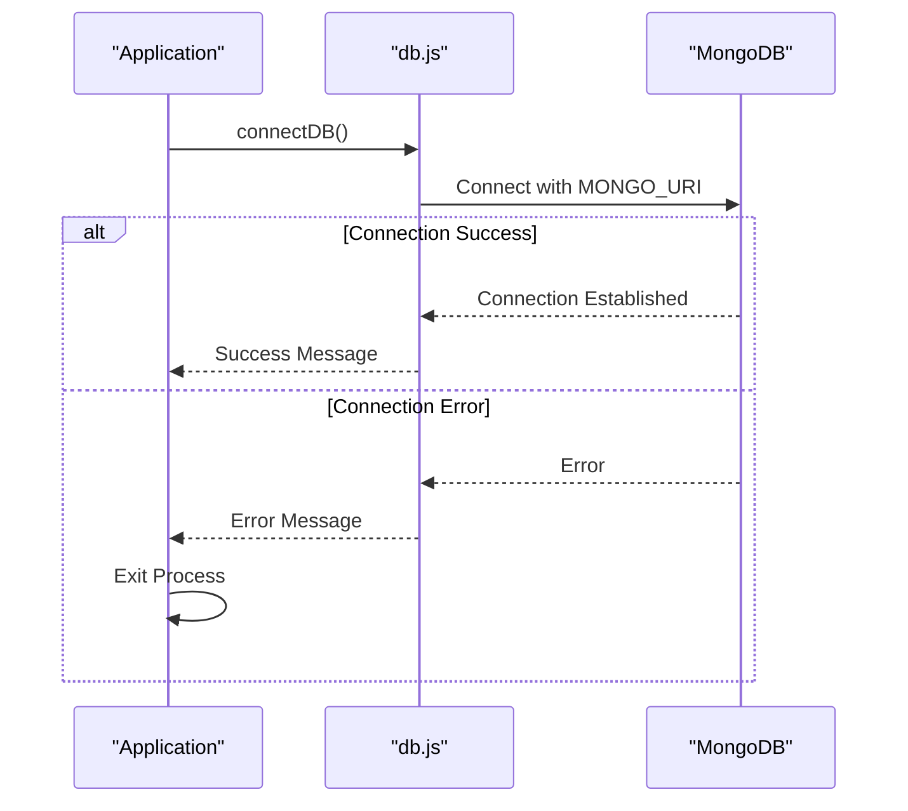

# Environment Configuration

<cite>
**Referenced Files in This Document**   
- [next.config.mjs](file://client/next.config.mjs)
- [tailwind.config.js](file://client/tailwind.config.js)
- [postcss.config.mjs](file://client/postcss.config.mjs)
- [db.js](file://server/src/config/db.js)
</cite>

## Table of Contents
1. [Introduction](#introduction)
2. [Environment Variables](#environment-variables)
3. [Frontend Configuration](#frontend-configuration)
4. [Backend Configuration](#backend-configuration)
5. [Build Process Configuration](#build-process-configuration)
6. [Development Environment Setup](#development-environment-setup)
7. [Security Considerations](#security-considerations)
8. [Troubleshooting Guide](#troubleshooting-guide)

## Introduction
This document provides comprehensive guidance on environment configuration for the VnV24 application. It covers all required environment variables for both frontend and backend operations, configuration file structures for Next.js, Tailwind CSS, and PostCSS, build process configuration, and environment-specific settings for development, staging, and production environments. The document also includes setup instructions for new development environments, security considerations for managing sensitive data, and troubleshooting guidance for common configuration issues.

## Environment Variables
The VnV24 application utilizes environment variables to manage configuration across different deployment environments. These variables are essential for database connections, authentication, payment processing, and cloud storage services. The application follows the standard practice of using a `.env` file for local development, with environment-specific files for different deployment stages.

**Section sources**
- [db.js](file://server/src/config/db.js#L4-L17)

## Frontend Configuration
The frontend configuration for the VnV24 application is managed through three primary configuration files: `next.config.mjs`, `tailwind.config.js`, and `postcss.config.mjs`. These files work together to define the build process, styling system, and post-processing pipeline for the Next.js application.

### Next.js Configuration
The `next.config.mjs` file provides the base configuration for the Next.js application. Currently, it contains minimal configuration, serving as the foundation for the application's build and runtime behavior.

**Diagram sources**
- [next.config.mjs](file://client/next.config.mjs#L1-L5)

### Tailwind CSS Configuration
The `tailwind.config.js` file defines the styling system for the application, including custom color palette, typography, and plugins. The configuration includes a comprehensive color scheme with primary, secondary, accent colors, and text colors.

**Diagram sources**
- [tailwind.config.js](file://client/tailwind.config.js#L1-L39)

### PostCSS Configuration
The `postcss.config.mjs` file configures the PostCSS processing pipeline, which integrates with Tailwind CSS to transform CSS at build time. This configuration ensures that Tailwind's utility classes are properly processed and optimized.

**Diagram sources**
- [postcss.config.mjs](file://client/postcss.config.mjs#L1-L6)

**Section sources**
- [next.config.mjs](file://client/next.config.mjs#L1-L5)
- [tailwind.config.js](file://client/tailwind.config.js#L1-L39)
- [postcss.config.mjs](file://client/postcss.config.mjs#L1-L6)

## Backend Configuration
The backend configuration for the VnV24 application focuses on database connectivity and environment-specific settings. The primary configuration file is located in the server's config directory and manages the MongoDB connection.

### Database Configuration
The database configuration is implemented in `db.js`, which establishes a connection to MongoDB using the MONGO_URI environment variable. The configuration includes error handling and connection status logging.

**Diagram sources**
- [db.js](file://server/src/config/db.js#L4-L17)

**Section sources**
- [db.js](file://server/src/config/db.js#L4-L17)

## Build Process Configuration
The build process for the VnV24 application is configured to support multiple environments: development, staging, and production. The configuration leverages environment variables to determine the build target and optimize accordingly.

### Environment-Specific Settings
The application uses a hierarchical approach to environment configuration, with the following priority order:
1. `.env.local` - Local overrides (gitignored)
2. `.env.production.local` - Production-specific local settings
3. `.env.production` - Production defaults
4. `.env` - Default values

This structure allows for secure management of sensitive credentials while maintaining consistent configuration across environments.

**Section sources**
- [next.config.mjs](file://client/next.config.mjs#L1-L5)
- [postcss.config.mjs](file://client/postcss.config.mjs#L1-L6)

## Development Environment Setup
Setting up a new development environment for the VnV24 application requires several steps to ensure all dependencies are properly configured.

### Required Dependencies
1. Node.js (version 18 or higher)
2. MongoDB (local instance or connection to remote database)
3. Package dependencies (installed via npm)

### Setup Process
1. Clone the repository
2. Install dependencies: `npm install` in both client and server directories
3. Create a `.env` file with required environment variables
4. Start the development servers for both frontend and backend

The configuration files are designed to work seamlessly with the development environment, providing hot reloading and debugging capabilities.

**Section sources**
- [package.json](file://client/package.json)
- [package.json](file://server/package.json)

## Security Considerations
Managing sensitive configuration data requires careful attention to security practices.

### Sensitive Data Management
- Never commit `.env` files to version control
- Use environment-specific configuration files
- Store sensitive credentials (database URIs, API keys) in secure environment variables
- Implement proper access controls for production environments

The current configuration follows security best practices by externalizing sensitive data and using environment variables for configuration.

**Section sources**
- [db.js](file://server/src/config/db.js#L4-L17)
- [next.config.mjs](file://client/next.config.mjs#L1-L5)

## Troubleshooting Guide
This section provides guidance for resolving common configuration issues and connection failures.

### Database Connection Issues
- Verify that the MONGO_URI environment variable is correctly set
- Check that the MongoDB service is running
- Ensure network connectivity to the database server
- Validate authentication credentials

### Build and Configuration Errors
- Ensure all required environment variables are defined
- Verify that configuration files are properly formatted
- Check for syntax errors in configuration files
- Validate that all dependencies are installed

When encountering configuration issues, review the relevant configuration files and ensure that all environment variables are properly set for the current environment.

**Section sources**
- [db.js](file://server/src/config/db.js#L4-L17)
- [next.config.mjs](file://client/next.config.mjs#L1-L5)
- [tailwind.config.js](file://client/tailwind.config.js#L1-L39)
- [postcss.config.mjs](file://client/postcss.config.mjs#L1-L6)