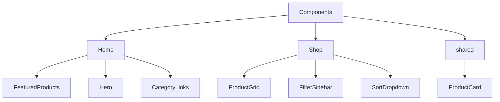
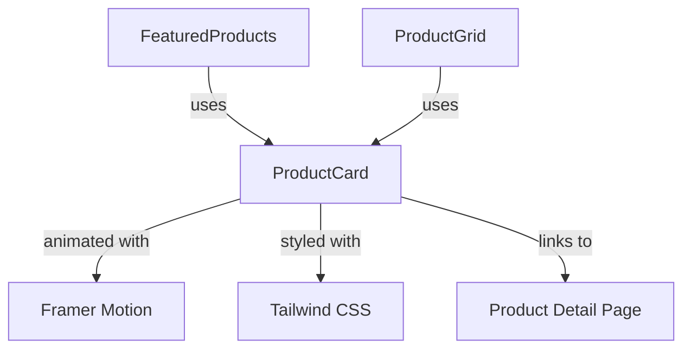
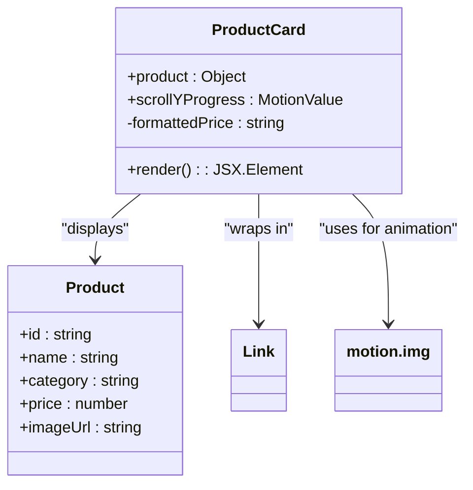
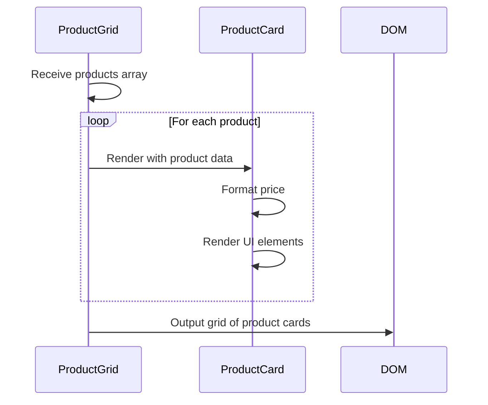
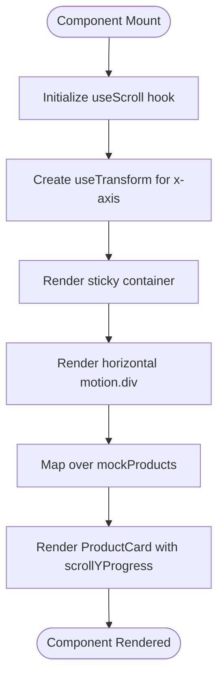
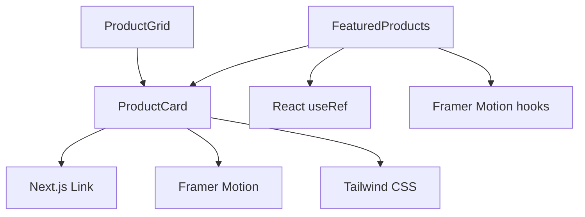

# Component Architecture

<cite>
**Referenced Files in This Document**   
- [ProductCard.js](file://client/app/components/shared/ProductCard.js)
- [ProductGrid.js](file://client/app/components/Shop/ProductGrid.js)
- [FeaturedProducts.js](file://client/app/components/Home/FeaturedProducts.js)
</cite>

## Table of Contents
1. [Introduction](#introduction)
2. [Project Structure](#project-structure)
3. [Core Components](#core-components)
4. [Architecture Overview](#architecture-overview)
5. [Detailed Component Analysis](#detailed-component-analysis)
6. [Dependency Analysis](#dependency-analysis)
7. [Performance Considerations](#performance-considerations)
8. [Troubleshooting Guide](#troubleshooting-guide)
9. [Conclusion](#conclusion)

## Introduction
This document provides a comprehensive analysis of the frontend component architecture for an e-commerce application. The system follows a feature-based organization with components grouped into Home, Shop, and shared directories. The ProductCard component serves as a central reusable UI element that is consumed by both the ProductGrid in the Shop module and the FeaturedProducts in the Home module. The architecture leverages modern React patterns with Next.js, incorporating Framer Motion for animations and Lucide React for icons to create an engaging user experience.

## Project Structure
The frontend component architecture is organized into a clear feature-based structure with components grouped by their functional context. The main organizational units are the Home, Shop, and shared directories within the components folder. This structure promotes reusability while maintaining clear separation of concerns between different application features.

**Diagram sources**
- [client/app/components](file://client/app/components)

**Section sources**
- [client/app/components](file://client/app/components)

## Core Components
The core components of this architecture revolve around the ProductCard, which serves as the primary product representation throughout the application. This component is designed for maximum reusability and is consumed by both the ProductGrid in the Shop module and the FeaturedProducts in the Home module. The component architecture follows a shared component pattern where common UI elements are extracted into a shared directory for reuse across different features.

**Section sources**
- [ProductCard.js](file://client/app/components/shared/ProductCard.js)
- [ProductGrid.js](file://client/app/components/Shop/ProductGrid.js)
- [FeaturedProducts.js](file://client/app/components/Home/FeaturedProducts.js)

## Architecture Overview
The component architecture follows a hierarchical pattern where specialized components in feature directories (Home and Shop) consume generic, reusable components from the shared directory. This approach ensures consistency in UI elements while allowing feature-specific customization. The ProductCard component acts as the atomic building block that is composed into larger structures like ProductGrid and FeaturedProducts.

**Diagram sources**
- [ProductCard.js](file://client/app/components/shared/ProductCard.js)
- [ProductGrid.js](file://client/app/components/Shop/ProductGrid.js)
- [FeaturedProducts.js](file://client/app/components/Home/FeaturedProducts.js)

## Detailed Component Analysis

### ProductCard Component Analysis
The ProductCard component is a reusable UI element that displays product information in a consistent format throughout the application. It accepts a product object as a prop and renders the product image, category, name, price, and an "Add to Cart" button. The component is designed to be flexible, supporting different rendering contexts through optional props like scrollYProgress for animation effects.

**Diagram sources**
- [ProductCard.js](file://client/app/components/shared/ProductCard.js#L5-L40)

**Section sources**
- [ProductCard.js](file://client/app/components/shared/ProductCard.js#L5-L40)

### ProductGrid Component Analysis
The ProductGrid component serves as a container for multiple ProductCard components in the Shop module. It receives an array of product objects and maps over them to create a responsive grid layout. The component uses Tailwind CSS grid classes to create a responsive layout that adapts to different screen sizes, with one column on mobile, two on small screens, and three on extra-large screens.

**Diagram sources**
- [ProductGrid.js](file://client/app/components/Shop/ProductGrid.js#L3-L15)

**Section sources**
- [ProductGrid.js](file://client/app/components/Shop/ProductGrid.js#L3-L15)

### FeaturedProducts Component Analysis
The FeaturedProducts component implements a horizontal scrolling carousel for showcasing best-selling products on the homepage. It uses Framer Motion's useScroll and useTransform hooks to create a parallax effect where product cards move at a different speed than the scroll position. This creates an engaging visual effect that draws attention to featured products.

**Diagram sources**
- [FeaturedProducts.js](file://client/app/components/Home/FeaturedProducts.js#L25-L41)

**Section sources**
- [FeaturedProducts.js](file://client/app/components/Home/FeaturedProducts.js#L25-L41)

## Dependency Analysis
The component dependency structure follows a clear hierarchy with shared components at the base and feature-specific components building upon them. The ProductCard component has dependencies on Next.js Link for navigation and Framer Motion for animations, while the consuming components (ProductGrid and FeaturedProducts) depend on the ProductCard for product representation.

**Diagram sources**
- [ProductCard.js](file://client/app/components/shared/ProductCard.js)
- [ProductGrid.js](file://client/app/components/Shop/ProductGrid.js)
- [FeaturedProducts.js](file://client/app/components/Home/FeaturedProducts.js)

**Section sources**
- [ProductCard.js](file://client/app/components/shared/ProductCard.js)
- [ProductGrid.js](file://client/app/components/Shop/ProductGrid.js)
- [FeaturedProducts.js](file://client/app/components/Home/FeaturedProducts.js)

## Performance Considerations
The component architecture incorporates several performance optimizations. The ProductCard component implements image optimization through the use of responsive image loading and CSS object-fit properties. The animation system uses Framer Motion's optimized animation engine which leverages CSS transforms for smooth 60fps animations. The component structure promotes reusability, reducing code duplication and bundle size. For large product lists, virtualization could be implemented to improve rendering performance.

## Troubleshooting Guide
When troubleshooting issues with the component architecture, focus on the data flow from parent to child components. Ensure that product objects passed to ProductCard have the required properties (id, name, category, price, imageUrl). For animation issues in FeaturedProducts, verify that the scrollYProgress value is being properly passed from the parent component. Accessibility issues can be addressed by ensuring proper ARIA labels and keyboard navigation support, though these are not explicitly implemented in the current codebase.

**Section sources**
- [ProductCard.js](file://client/app/components/shared/ProductCard.js)
- [ProductGrid.js](file://client/app/components/Shop/ProductGrid.js)
- [FeaturedProducts.js](file://client/app/components/Home/FeaturedProducts.js)

## Conclusion
The component architecture demonstrates a well-structured approach to building a reusable and maintainable frontend. By organizing components into feature-based directories and extracting common elements to a shared folder, the architecture promotes consistency while allowing for feature-specific customization. The integration of Framer Motion for animations and the use of Next.js components for routing create a modern, engaging user experience. The ProductCard component serves as an excellent example of a reusable UI element that can be consumed in multiple contexts with minimal modifications.