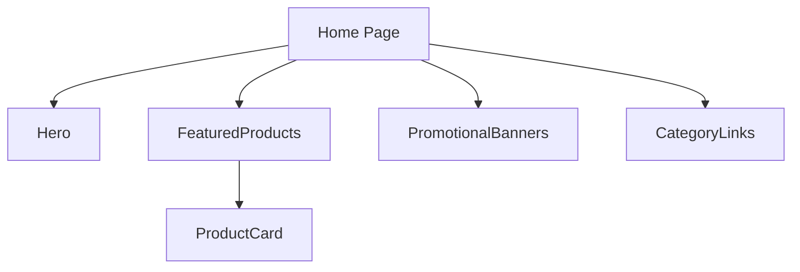
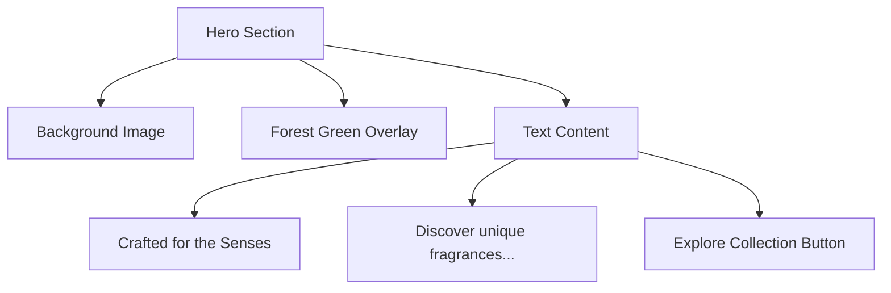
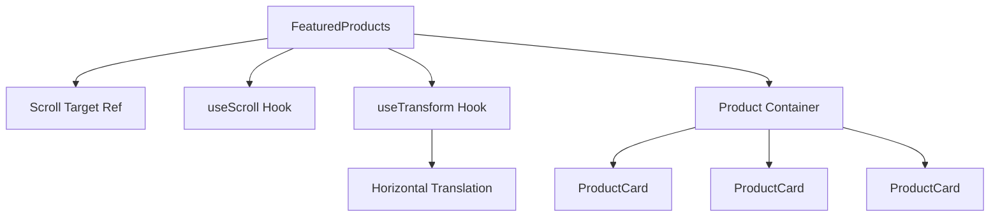
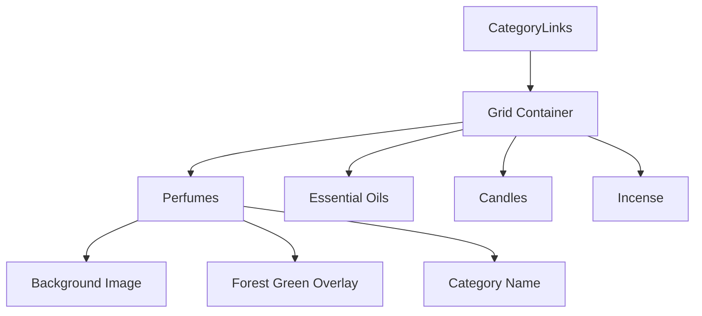
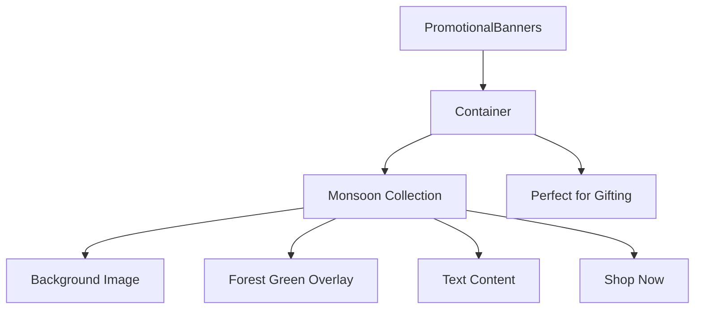
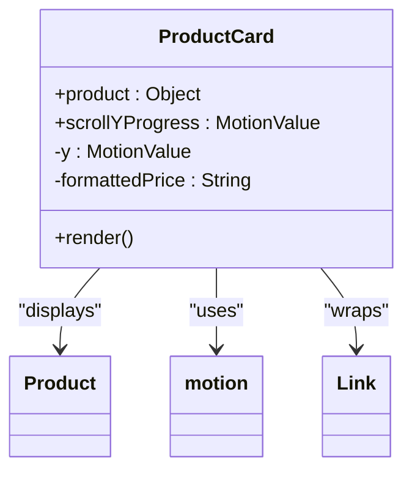
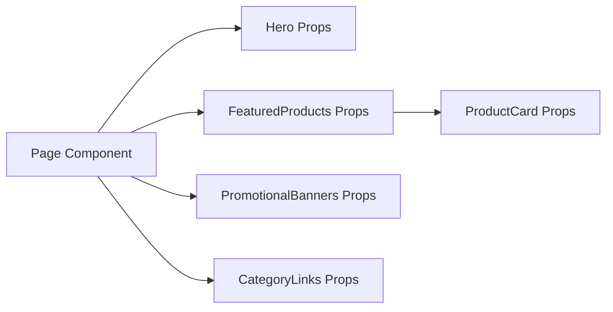
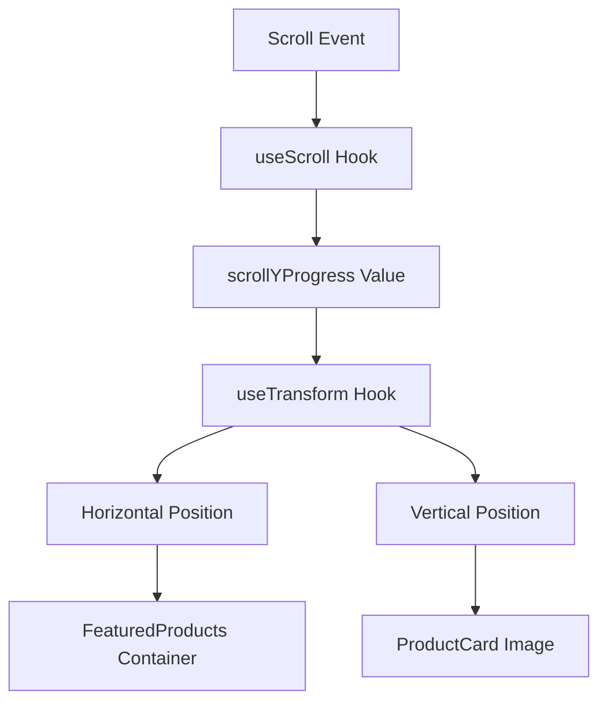

# Home Components

<cite>
**Referenced Files in This Document**   
- [Hero.js](file://client/app/components/Home/Hero.js)
- [FeaturedProducts.js](file://client/app/components/Home/FeaturedProducts.js)
- [CategoryLinks.js](file://client/app/components/Home/CategoryLinks.js)
- [PromotionalBanners.js](file://client/app/components/Home/PromotionalBanners.js)
- [ProductCard.js](file://client/app/components/shared/ProductCard.js)
- [page.js](file://client/app/page.js)
- [tailwind.config.js](file://client/tailwind.config.js)
- [globals.css](file://client/app/globals.css)
</cite>

## Table of Contents
1. [Introduction](#introduction)
2. [Component Integration Overview](#component-integration-overview)
3. [Hero Component](#hero-component)
4. [FeaturedProducts Component](#featuredproducts-component)
5. [CategoryLinks Component](#categorylinks-component)
6. [PromotionalBanners Component](#promotionalbanners-component)
7. [ProductCard Integration](#productcard-integration)
8. [Data Flow and Responsive Design](#data-flow-and-responsive-design)
9. [Visual Hierarchy and Animations](#visual-hierarchy-and-animations)
10. [Accessibility and Performance](#accessibility-and-performance)

## Introduction
The Home module components work together to create an engaging landing experience for the fragrance e-commerce platform. These components—Hero, FeaturedProducts, CategoryLinks, and PromotionalBanners—form a cohesive visual and interactive journey that guides users through the brand's offerings. Built with React and Next.js, they leverage Framer Motion for scroll-triggered animations and Tailwind CSS for responsive layouts, creating a premium user experience that highlights the brand's aesthetic and product range.

## Component Integration Overview
The Home components are orchestrated through the main page component, which imports and sequences them to create a flowing narrative. The components are arranged in a specific order to guide users from brand introduction to product discovery and category exploration.

**Diagram sources**
- [page.js](file://client/app/page.js#L1-L16)
- [Hero.js](file://client/app/components/Home/Hero.js#L4-L31)
- [FeaturedProducts.js](file://client/app/components/Home/FeaturedProducts.js#L16-L41)

**Section sources**
- [page.js](file://client/app/page.js#L1-L16)

## Hero Component
The Hero component serves as the primary brand introduction, featuring a full-screen background image with overlay text and a call-to-action button. It establishes the brand's premium positioning with elegant typography and a carefully curated visual aesthetic.

The component uses a relative positioning system with absolute positioning for the background image, ensuring proper layering. The text content is centered with responsive typography that scales from 5xl on mobile to 7xl on desktop. The gold-colored text and button create a luxurious visual accent against the forest green overlay.

**Diagram sources**
- [Hero.js](file://client/app/components/Home/Hero.js#L4-L31)

**Section sources**
- [Hero.js](file://client/app/components/Home/Hero.js#L4-L31)

## FeaturedProducts Component
The FeaturedProducts component displays the brand's best-selling items in a horizontally scrolling carousel that responds to vertical page scrolling. This parallax effect creates an engaging visual experience that draws attention to the featured products.

The component implements advanced animation techniques using Framer Motion's useScroll and useTransform hooks. It creates a sticky section that spans 300vh, with product cards that move horizontally as the user scrolls down the page. This creates a cinematic effect where products appear to glide across the screen.

**Diagram sources**
- [FeaturedProducts.js](file://client/app/components/Home/FeaturedProducts.js#L16-L41)
- [ProductCard.js](file://client/app/components/shared/ProductCard.js#L5-L40)

**Section sources**
- [FeaturedProducts.js](file://client/app/components/Home/FeaturedProducts.js#L16-L41)

## CategoryLinks Component
The CategoryLinks component provides a grid-based navigation system that allows users to explore products by category. It features four categories displayed in a responsive grid that adjusts from two columns on mobile to four columns on desktop.

Each category is presented as a clickable card with a background image, hover effects, and an overlay with the category name. The component uses Tailwind's grid system for layout and implements smooth hover transitions that scale the image and maintain visual consistency with the brand's aesthetic.

**Diagram sources**
- [CategoryLinks.js](file://client/app/components/Home/CategoryLinks.js#L9-L31)

**Section sources**
- [CategoryLinks.js](file://client/app/components/Home/CategoryLinks.js#L9-L31)

## PromotionalBanners Component
The PromotionalBanners component displays two promotional offers in a responsive two-column layout on desktop and a single-column layout on mobile. Each banner features a background image with text overlay and a call-to-action link.

The banners use relative positioning with absolute overlays to create a layered effect. The forest green overlay with 50% opacity ensures text readability while maintaining the visual impact of the background images. The component highlights seasonal collections and gifting opportunities, serving as a marketing tool to drive specific product sales.

**Diagram sources**
- [PromotionalBanners.js](file://client/app/components/Home/PromotionalBanners.js#L3-L32)

**Section sources**
- [PromotionalBanners.js](file://client/app/components/Home/PromotionalBanners.js#L3-L32)

## ProductCard Integration
The ProductCard component is a shared UI element consumed by the FeaturedProducts component to display individual product information. It receives product data as props and implements scroll-linked animations when used in the FeaturedProducts context.

The component displays product information including category, name, price, and an "Add to Cart" button. It uses responsive design principles with aspect-square to maintain consistent card dimensions. The image implements a hover effect that scales the image slightly, providing visual feedback to user interactions.

**Diagram sources**
- [ProductCard.js](file://client/app/components/shared/ProductCard.js#L5-L40)
- [FeaturedProducts.js](file://client/app/components/Home/FeaturedProducts.js#L16-L41)

**Section sources**
- [ProductCard.js](file://client/app/components/shared/ProductCard.js#L5-L40)

## Data Flow and Responsive Design
The Home components implement a structured data flow from the page level down to individual components. Static data is defined within each component file, with mockProducts in FeaturedProducts and categories in CategoryLinks.

Responsive design is achieved through Tailwind CSS utility classes that adapt layouts based on screen size. The components use viewport-relative units (vw) for widths in the FeaturedProducts carousel and responsive typography classes (text-5xl md:text-7xl) to ensure optimal display across devices.

**Diagram sources**
- [page.js](file://client/app/page.js#L1-L16)
- [FeaturedProducts.js](file://client/app/components/Home/FeaturedProducts.js#L16-L41)
- [ProductCard.js](file://client/app/components/shared/ProductCard.js#L5-L40)

**Section sources**
- [page.js](file://client/app/page.js#L1-L16)
- [tailwind.config.js](file://client/tailwind.config.js#L1-L38)

## Visual Hierarchy and Animations
The Home components establish a clear visual hierarchy through typography, color, and layout. The Hero component uses the largest text size (7xl on desktop) to establish primary messaging, while subsequent sections use progressively smaller typography to guide user attention.

Animations are implemented using Framer Motion to create engaging scroll-triggered effects. The FeaturedProducts component uses horizontal translation that responds to vertical scroll position, creating a parallax effect. The ProductCard component implements vertical movement of product images based on scroll position, adding depth to the visual experience.

**Diagram sources**
- [FeaturedProducts.js](file://client/app/components/Home/FeaturedProducts.js#L16-L41)
- [ProductCard.js](file://client/app/components/shared/ProductCard.js#L5-L40)

**Section sources**
- [FeaturedProducts.js](file://client/app/components/Home/FeaturedProducts.js#L16-L41)
- [ProductCard.js](file://client/app/components/shared/ProductCard.js#L5-L40)

## Accessibility and Performance
The Home components implement several accessibility features, including semantic HTML structure, proper heading hierarchy, and keyboard navigable elements. All interactive elements are focusable and have appropriate contrast ratios as defined in the Tailwind configuration.

Performance optimizations include efficient animation implementation using Framer Motion's optimized rendering, responsive image loading with appropriate dimensions, and component structure that minimizes re-renders. The use of viewport units and relative sizing reduces layout shifts and improves perceived performance.

The components follow the project's style guide with consistent color usage (forest-green, gold, primary background) and typography (serif for headings, sans-serif for body text). The design system ensures visual consistency across all Home components while allowing each to serve its specific purpose in the user journey.

**Section sources**
- [tailwind.config.js](file://client/tailwind.config.js#L1-L38)
- [globals.css](file://client/app/globals.css#L1-L4)
- [STYLE_GUIDE_IMPLEMENTATION_SUMMARY.md](file://STYLE_GUIDE_IMPLEMENTATION_SUMMARY.md#L33-L39)