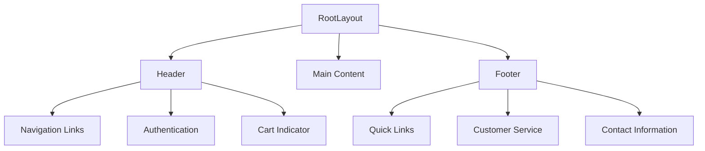
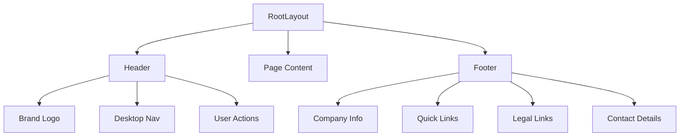
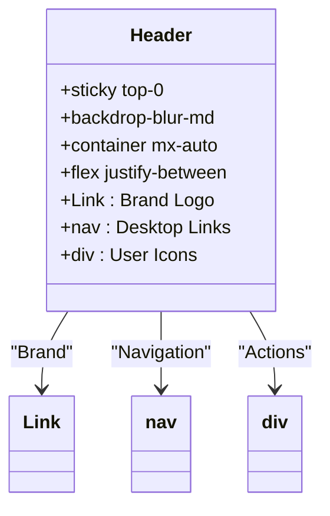
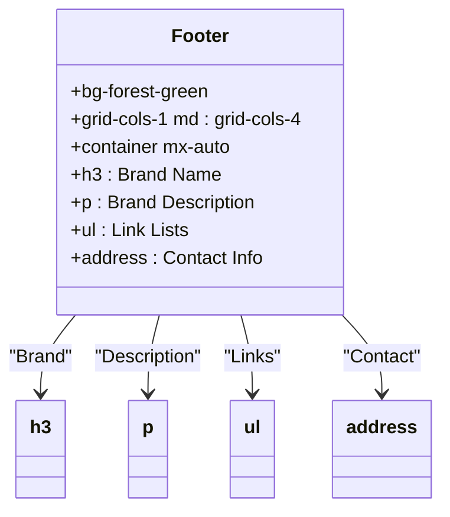
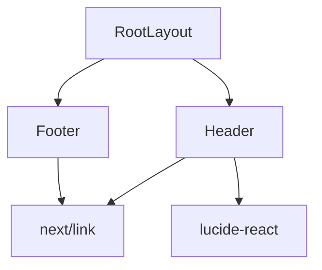

# Layout Components

<cite>
**Referenced Files in This Document**   
- [Header.js](file://client/app/components/Header.js)
- [Footer.js](file://client/app/components/Footer.js)
- [layout.js](file://client/app/layout.js)
</cite>

## Table of Contents
1. [Introduction](#introduction)
2. [Project Structure](#project-structure)
3. [Core Components](#core-components)
4. [Architecture Overview](#architecture-overview)
5. [Detailed Component Analysis](#detailed-component-analysis)
6. [Dependency Analysis](#dependency-analysis)
7. [Performance Considerations](#performance-considerations)
8. [Troubleshooting Guide](#troubleshooting-guide)
9. [Conclusion](#conclusion)

## Introduction
This document provides a comprehensive analysis of the global layout components—Header and Footer—within the VnV24 e-commerce application. These components are essential for maintaining consistent site navigation, branding, and user experience across all pages. The Header facilitates primary navigation, user authentication, and cart access, while the Footer offers supplementary links, contact information, and legal policy references. Built using Next.js App Router, these components are integrated into the RootLayout to ensure universal rendering. Special attention is given to responsive design, accessibility, and performance optimization through code splitting and hydration strategies.

## Project Structure
The client-side application follows a Next.js App Router structure, with layout components centralized in the `client/app/components` directory. The `layout.js` file serves as the root layout, wrapping all pages with the Header and Footer. The project uses Tailwind CSS for styling and Next.js Link for client-side routing, ensuring fast navigation and SEO-friendly markup.

**Diagram sources**
- [layout.js](file://client/app/layout.js#L1-L36)
- [Header.js](file://client/app/components/Header.js#L1-L29)
- [Footer.js](file://client/app/components/Footer.js#L1-L44)

**Section sources**
- [layout.js](file://client/app/layout.js#L1-L36)

## Core Components
The Header and Footer components are stateless functional React components that render consistently across all routes. They are imported into the RootLayout and positioned above and below the page-specific content. The Header includes responsive navigation that hides on mobile, while the Footer uses a responsive grid layout that stacks on smaller screens. Both components use semantic HTML and ARIA-compatible attributes to support accessibility.

**Section sources**
- [Header.js](file://client/app/components/Header.js#L1-L29)
- [Footer.js](file://client/app/components/Footer.js#L1-L44)

## Architecture Overview
The layout architecture follows the Next.js App Router pattern, where a single RootLayout wraps all pages. This ensures that the Header and Footer are statically rendered on the server and reused across client transitions, minimizing re-renders and improving performance. The components are composed using React’s JSX syntax and styled with Tailwind CSS utility classes for responsive behavior.

**Diagram sources**
- [layout.js](file://client/app/layout.js#L1-L36)
- [Header.js](file://client/app/components/Header.js#L1-L29)
- [Footer.js](file://client/app/components/Footer.js#L1-L44)

## Detailed Component Analysis

### Header Analysis
The Header component provides primary navigation and user interaction points. It features a sticky positioning for persistent access, a responsive layout that hides navigation on mobile, and interactive hover effects. The component uses Next.js `Link` for client-side routing, ensuring fast page transitions without full reloads.

#### Component Structure

**Diagram sources**
- [Header.js](file://client/app/components/Header.js#L1-L29)

**Section sources**
- [Header.js](file://client/app/components/Header.js#L1-L29)

### Footer Analysis
The Footer component organizes information into four responsive columns: brand information, quick links, customer service policies, and contact details. It uses semantic HTML elements like `<address>` for contact data and ensures all links are accessible. The copyright notice dynamically updates the year.

#### Component Structure

**Diagram sources**
- [Footer.js](file://client/app/components/Footer.js#L1-L44)

**Section sources**
- [Footer.js](file://client/app/components/Footer.js#L1-L44)

## Dependency Analysis
The Header and Footer components depend on Next.js routing (`next/link`) and Lucide React icons for visual elements. They are imported into the RootLayout, which serves as the integration point. No external state management is used, keeping the components lightweight and predictable.

**Diagram sources**
- [Header.js](file://client/app/components/Header.js#L1-L29)
- [Footer.js](file://client/app/components/Footer.js#L1-L44)
- [layout.js](file://client/app/layout.js#L1-L36)

**Section sources**
- [Header.js](file://client/app/components/Header.js#L1-L29)
- [Footer.js](file://client/app/components/Footer.js#L1-L44)
- [layout.js](file://client/app/layout.js#L1-L36)

## Performance Considerations
The layout components are statically rendered on the server, reducing client-side JavaScript execution. Since they are part of the RootLayout, they are not re-fetched during client navigation, improving perceived performance. Code splitting is handled automatically by Next.js, and hydration is minimal as these components contain no client-side state. The use of `backdrop-blur-md` and `sticky` positioning is GPU-accelerated for smooth scrolling.

**Section sources**
- [layout.js](file://client/app/layout.js#L1-L36)
- [Header.js](file://client/app/components/Header.js#L1-L29)

## Troubleshooting Guide
Common issues include layout shifts on mobile, missing icons, or broken links. Ensure that Lucide icons are properly imported and that all `Link` components use valid href values. For responsive issues, verify Tailwind’s `md:` breakpoints are correctly applied. Accessibility can be tested using screen readers to confirm navigation and ARIA labels are functional.

**Section sources**
- [Header.js](file://client/app/components/Header.js#L1-L29)
- [Footer.js](file://client/app/components/Footer.js#L1-L44)

## Conclusion
The Header and Footer components are foundational to the VnV24 application’s user experience, providing consistent navigation, branding, and information architecture. Their implementation leverages Next.js best practices for routing, performance, and accessibility. By centralizing these components in the RootLayout, the application ensures a cohesive and efficient user interface across all pages.