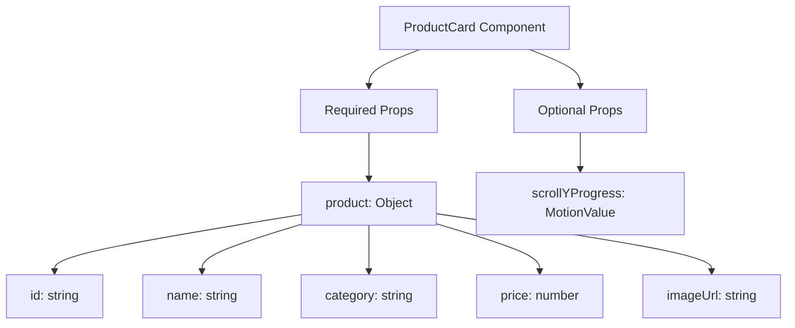
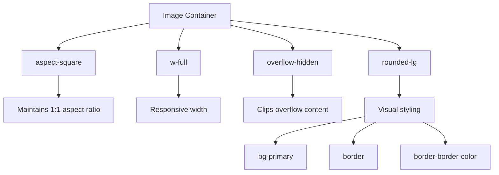
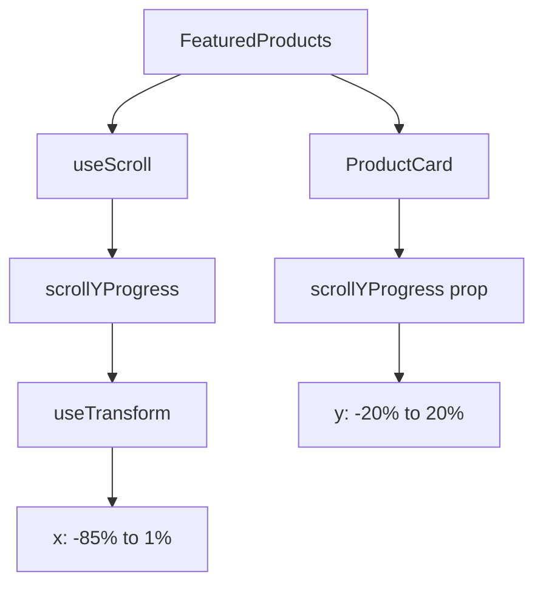
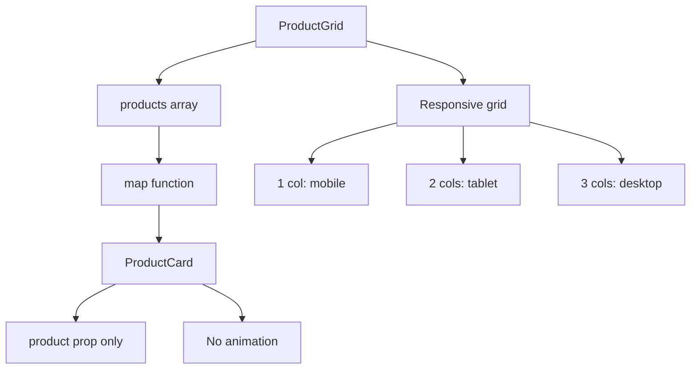

# Shared Components

<cite>
**Referenced Files in This Document**   
- [ProductCard.js](file://client/app/components/shared/ProductCard.js)
- [ProductGrid.js](file://client/app/components/Shop/ProductGrid.js)
- [FeaturedProducts.js](file://client/app/components/Home/FeaturedProducts.js)
</cite>

## Table of Contents
1. [Introduction](#introduction)
2. [Core Components](#core-components)
3. [Props Interface](#props-interface)
4. [Visual States and Animation](#visual-states-and-animation)
5. [Responsive Image Handling](#responsive-image-handling)
6. [Price Formatting](#price-formatting)
7. [Accessibility Attributes](#accessibility-attributes)
8. [Usage Examples](#usage-examples)
9. [Customization and Theming](#customization-and-theming)
10. [Integration with Cart/Wishlist](#integration-with-cartwishlist)
11. [Performance Considerations](#performance-considerations)

## Introduction
The ProductCard component serves as the primary shared UI element for displaying products across the application. Designed as a reusable component, it provides a consistent product representation in various contexts including the Home page's featured products section and the Shop page's product grid. The component leverages Framer Motion for scroll-based animations, implements responsive design principles, and follows accessibility best practices to ensure an optimal user experience across different devices and user needs.

**Section sources**
- [ProductCard.js](file://client/app/components/shared/ProductCard.js#L5-L40)

## Core Components
The ProductCard component is the central shared UI element that displays product information in a visually appealing format. It is designed to be flexible and reusable across different sections of the application. The component renders product details including image, category, name, price, and includes an "Add to Cart" action button. It supports two primary usage patterns: with scroll-based animations on the Home page and as a static grid item on the Shop page.

The component is imported and utilized by other key components such as ProductGrid for the shop listings and FeaturedProducts for the home page showcase. This modular design promotes code reusability and ensures visual consistency across the application.

**Section sources**
- [ProductCard.js](file://client/app/components/shared/ProductCard.js#L5-L40)
- [ProductGrid.js](file://client/app/components/Shop/ProductGrid.js#L1-L15)
- [FeaturedProducts.js](file://client/app/components/Home/FeaturedProducts.js#L1-L41)

## Props Interface
The ProductCard component accepts two primary props that enable its flexible usage across different contexts:

- **product**: An object containing product information with properties including id, name, category, price, and imageUrl. This data structure allows the component to display comprehensive product details.
- **scrollYProgress**: An optional Framer Motion scroll progress value that enables the y-transform animation effect during scroll interactions. When provided, the component uses this motion value to create dynamic visual effects.

The component conditionally applies the motion-based image transformation only when scrollYProgress is provided, allowing it to function both as an animated element in scroll-driven sections and as a standard static card in grid layouts.



**Diagram sources**
- [ProductCard.js](file://client/app/components/shared/ProductCard.js#L5-L40)

**Section sources**
- [ProductCard.js](file://client/app/components/shared/ProductCard.js#L5-L40)

## Visual States and Animation
The ProductCard component implements sophisticated visual states and animations to enhance user experience. The primary visual interaction is the hover state, triggered when users mouse over the card. During hover, the component applies multiple visual effects:

- Shadow elevation from shadow-sm to hover:shadow-lg for a lifting effect
- Image scale transformation from scale-100 to group-hover:scale-105
- Smooth transitions with duration-300 for all visual changes

For scroll-based animations on the Home page, the component leverages Framer Motion's useTransform hook to create a parallax-like y-transform effect. The animation maps the scrollYProgress value (ranging from 0 to 1) to a y-position transformation from -20% to 20%, creating a subtle floating effect as users scroll through the featured products section.

```mermaid
stateDiagram-v2
[*] --> Default
Default --> Hover : Mouse over
Hover --> Default : Mouse out
Default --> Active : Click
Active --> Default : Click outside
Default --> Animated : scrollYProgress provided
Animated --> Default : scrollYProgress null
```

**Diagram sources**
- [ProductCard.js](file://client/app/components/shared/ProductCard.js#L5-L40)
- [FeaturedProducts.js](file://client/app/components/Home/FeaturedProducts.js#L18-L33)

**Section sources**
- [ProductCard.js](file://client/app/components/shared/ProductCard.js#L5-L40)
- [FeaturedProducts.js](file://client/app/components/Home/FeaturedProducts.js#L18-L33)

## Responsive Image Handling
The ProductCard component implements responsive image handling through several techniques. The image container uses aspect-square to maintain a consistent 1:1 aspect ratio across different screen sizes, ensuring visual consistency in grid layouts. The image itself uses object-cover to ensure the entire frame is filled while preserving the image's aspect ratio, preventing distortion.

The component uses w-full to make the image container responsive to its parent's width, allowing it to adapt to different grid configurations on various screen sizes. On the Home page, the card width is set to 40vw on smaller screens and 25vw on medium screens, creating a horizontal scrolling effect. On the Shop page, the ProductGrid component uses Tailwind's responsive grid system (grid-cols-1 sm:grid-cols-2 xl:grid-cols-3) to adjust the number of columns based on screen width.



**Diagram sources**
- [ProductCard.js](file://client/app/components/shared/ProductCard.js#L17-L28)

**Section sources**
- [ProductCard.js](file://client/app/components/shared/ProductCard.js#L17-L28)
- [ProductGrid.js](file://client/app/components/Shop/ProductGrid.js#L4-L6)

## Price Formatting
The ProductCard component implements internationalized price formatting using the Intl.NumberFormat API. Prices are formatted according to Indian numbering conventions with the following specifications:

- Currency displayed in Indian Rupees (INR)
- Currency symbol (₹) positioned before the amount
- No decimal places shown (minimumFractionDigits: 0)
- Thousands separated by commas according to Indian numbering system

This formatting ensures that prices are displayed in a culturally appropriate manner for the target market. The component creates a formattedPrice variable by passing the raw product price through the Intl.NumberFormat constructor with 'en-IN' locale and currency configuration, resulting in properly formatted prices like "₹7,999" instead of raw numeric values.

**Section sources**
- [ProductCard.js](file://client/app/components/shared/ProductCard.js#L7-L12)

## Accessibility Attributes
The ProductCard component incorporates several accessibility features to ensure usability for all users:

- Semantic HTML structure with appropriate heading levels (h3 for category)
- Descriptive alt attributes on images that include the product name
- Sufficient color contrast between text and background colors
- Keyboard navigable elements through the Link wrapper
- ARIA-compliant button for the "Add to Cart" action
- Proper focus states for interactive elements

The component is wrapped in a Next.js Link component, making it keyboard navigable and providing proper semantic meaning as a navigation element. Text colors are carefully chosen to meet WCAG contrast requirements, with primary text in forest-green and secondary text in text-secondary for optimal readability.

**Section sources**
- [ProductCard.js](file://client/app/components/shared/ProductCard.js#L5-L40)

## Usage Examples
The ProductCard component is utilized in two primary contexts within the application, demonstrating its versatility and reusability.

### Home Page Usage
On the Home page, the component is used within the FeaturedProducts section with scroll-based animations. The parent component creates a scrollYProgress motion value using Framer Motion's useScroll hook and passes it as a prop to enable the y-transform animation. The cards are arranged in a horizontal scrolling layout with parallax effects.



**Diagram sources**
- [FeaturedProducts.js](file://client/app/components/Home/FeaturedProducts.js#L18-L33)

### Shop Page Usage
On the Shop page, the component is used within the ProductGrid component as static grid items without scroll animations. The ProductGrid maps over an array of products and renders each as a ProductCard without the scrollYProgress prop, resulting in standard card behavior.



**Diagram sources**
- [ProductGrid.js](file://client/app/components/Shop/ProductGrid.js#L1-L15)

**Section sources**
- [ProductGrid.js](file://client/app/components/Shop/ProductGrid.js#L1-L15)
- [FeaturedProducts.js](file://client/app/components/Home/FeaturedProducts.js#L18-L33)

## Customization and Theming
The ProductCard component is styled using Tailwind CSS utility classes, allowing for easy customization and theming. The component leverages custom color variables defined in the application's design system:

- Background color: bg-primary
- Border color: border-border-color
- Text colors: text-text-secondary, text-forest-green, text-text-dark
- Button colors: bg-gold, hover:bg-amber-600

These semantic class names enable consistent theming across the application and make it easy to modify the visual design by updating the Tailwind configuration. The component's styling is responsive, with appropriate spacing (mt-4, mt-3) and typography (text-sm, text-lg) that adapt to different screen sizes.

**Section sources**
- [ProductCard.js](file://client/app/components/shared/ProductCard.js#L5-L40)

## Integration with Cart/Wishlist
While the current implementation shows an "Add to Cart" button, the component is designed to integrate with the application's cart and wishlist functionality. The server-side code reveals endpoints for wishlist management (GET, POST, DELETE /api/v1/wishlist), indicating that users can add and remove products from their wishlist.

The ProductCard component could be extended to include wishlist functionality by adding a heart icon button that toggles the product's presence in the user's wishlist. This would require state management to track the wishlist status and API calls to the wishlist endpoints. The cart integration is partially implemented with the "Add to Cart" button, though the actual cart functionality would need to be connected to complete the purchase flow.

**Section sources**
- [ProductCard.js](file://client/app/components/shared/ProductCard.js#L38-L40)
- [Wishlist.controller.js](file://server/src/controllers/Wishlist.controller.js#L1-L56)
- [Wishlist.routes.js](file://server/src/routes/Wishlist.routes.js#L1-L14)

## Performance Considerations
The ProductCard component has several performance implications that should be considered:

### Motion Values Performance
The use of Framer Motion's scrollYProgress and useTransform creates continuous animations during scroll events. While these create engaging user experiences, they can impact performance on lower-end devices. The animations are optimized by:
- Using hardware-accelerated CSS transforms (y-position)
- Limiting the animation to opacity and transform properties
- Implementing 300ms transition durations for smooth but efficient animations

### Image Optimization
The component currently uses direct image URLs without Next.js Image optimization. For improved performance, consider:
- Implementing Next.js Image component for automatic optimization
- Adding blur-up placeholders for perceived performance
- Using appropriate image formats (WebP) and sizes
- Implementing lazy loading for images below the fold

The motion-based rendering conditionally uses motion.img only when scrollYProgress is provided, minimizing the overhead of the Framer Motion library when not needed.

**Section sources**
- [ProductCard.js](file://client/app/components/shared/ProductCard.js#L6-L7)
- [FeaturedProducts.js](file://client/app/components/Home/FeaturedProducts.js#L18-L19)