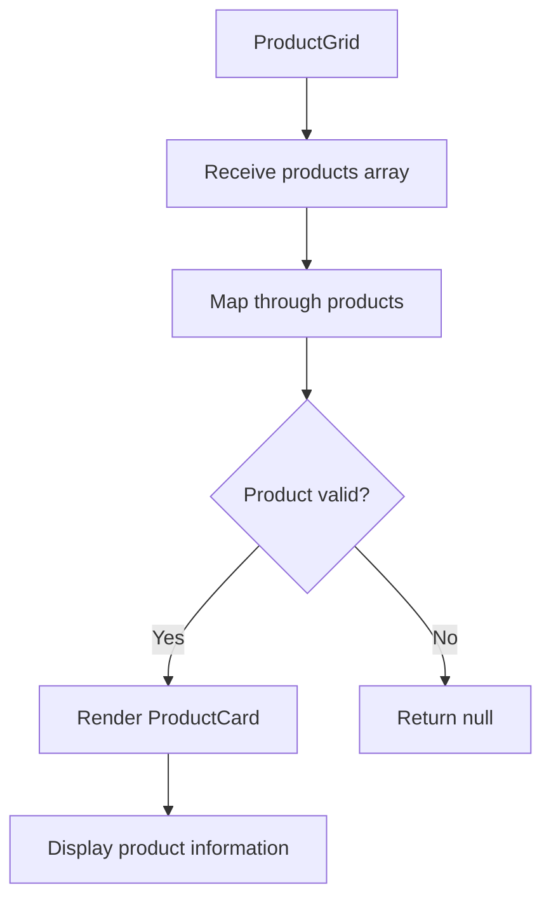
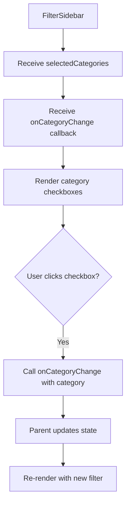
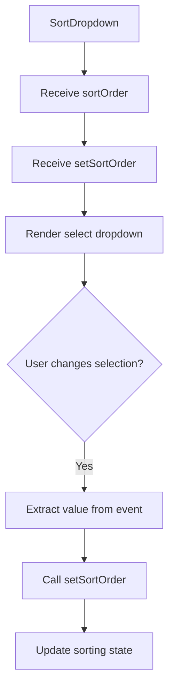
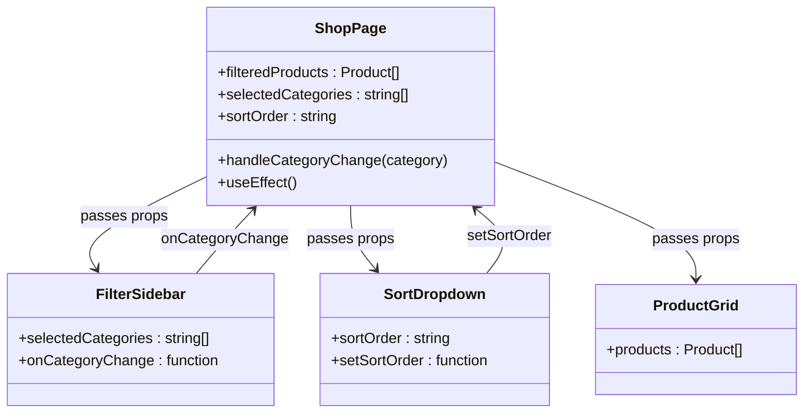

# Shop Components

<cite>
**Referenced Files in This Document**   
- [ProductGrid.js](file://client/app/components/Shop/ProductGrid.js)
- [FilterSidebar.js](file://client/app/components/Shop/FilterSidebar.js)
- [SortDropdown.js](file://client/app/components/Shop/SortDropdown.js)
- [ProductCard.js](file://client/app/components/shared/ProductCard.js)
- [page.js](file://client/app/shop/page.js)
</cite>

## Table of Contents
1. [Introduction](#introduction)
2. [Core Components Overview](#core-components-overview)
3. [ProductGrid Component](#productgrid-component)
4. [FilterSidebar Component](#filtersidebar-component)
5. [SortDropdown Component](#sortdropdown-component)
6. [Component Composition and State Management](#component-composition-and-state-management)
7. [Responsive Design and Accessibility](#responsive-design-and-accessibility)
8. [Performance Considerations](#performance-considerations)
9. [Integration with Backend APIs](#integration-with-backend-apis)
10. [Conclusion](#conclusion)

## Introduction
The Shop module is responsible for rendering the product catalog with dynamic filtering, sorting, and responsive layout capabilities. This document details the implementation of key components including ProductGrid, FilterSidebar, and SortDropdown, focusing on their composition, state synchronization, and user experience considerations.

## Core Components Overview
The Shop module consists of three primary UI components that work together to provide a seamless product browsing experience:
- **ProductGrid**: Renders product listings using ProductCard components
- **FilterSidebar**: Manages category-based filtering state
- **SortDropdown**: Controls product sorting behavior

These components are orchestrated within the main shop page, which manages shared state and coordinates interactions.

**Section sources**
- [ProductGrid.js](file://client/app/components/Shop/ProductGrid.js#L1-L15)
- [FilterSidebar.js](file://client/app/components/Shop/FilterSidebar.js#L1-L20)
- [SortDropdown.js](file://client/app/components/Shop/SortDropdown.js#L1-L17)

## ProductGrid Component
The ProductGrid component serves as the central display for product listings, implementing a responsive grid layout that adapts to different screen sizes. It receives a products array as a prop and renders each product using the ProductCard component.

The grid utilizes Tailwind CSS's responsive grid system with:
- 1 column on mobile devices
- 2 columns on small screens
- 3 columns on extra-large screens

Each product is rendered with a unique key (using product ID or index) and passed to ProductCard for display. The component handles null product values gracefully by returning null for invalid entries.

**Diagram sources**
- [ProductGrid.js](file://client/app/components/Shop/ProductGrid.js#L2-L15)

**Section sources**
- [ProductGrid.js](file://client/app/components/Shop/ProductGrid.js#L1-L15)

## FilterSidebar Component
The FilterSidebar component provides category-based filtering functionality with controlled checkbox inputs. It receives two props:
- `selectedCategories`: Array of currently selected category names
- `onCategoryChange`: Callback function to handle category selection changes

The component renders a list of predefined categories ("Perfumes", "Oils", "Candles", "Incense") as checkboxes. The checked state of each checkbox is determined by whether its category exists in the selectedCategories array. When a user interacts with a checkbox, the onCategoryChange callback is invoked with the category name, enabling parent components to update the filtering state.

**Diagram sources**
- [FilterSidebar.js](file://client/app/components/Shop/FilterSidebar.js#L1-L20)

**Section sources**
- [FilterSidebar.js](file://client/app/components/Shop/FilterSidebar.js#L1-L20)

## SortDropdown Component
The SortDropdown component implements a custom-styled select dropdown for product sorting options. It receives two props:
- `sortOrder`: Current sorting value ('default', 'price-asc', 'price-desc')
- `setSortOrder`: State setter function to update sorting preference

The component renders a select element with three options:
- Default Sorting
- Price: Low to High
- Price: High to Low

When the user changes the selection, the onChange handler extracts the new value from the event target and calls setSortOrder. The component includes a custom SVG arrow icon to enhance the visual appearance of the dropdown.

**Diagram sources**
- [SortDropdown.js](file://client/app/components/Shop/SortDropdown.js#L1-L17)

**Section sources**
- [SortDropdown.js](file://client/app/components/Shop/SortDropdown.js#L1-L17)

## Component Composition and State Management
The components are composed within the main shop page, which manages the shared state and coordinates interactions between filtering, sorting, and product display.

The parent component maintains three state variables:
- `filteredProducts`: The current list of products to display
- `selectedCategories`: Array of selected category filters
- `sortOrder`: Current sorting preference

**Diagram sources**
- [page.js](file://client/app/shop/page.js#L23-L71)

**Section sources**
- [page.js](file://client/app/shop/page.js#L23-L71)

## Responsive Design and Accessibility
The Shop components implement responsive design principles using Tailwind CSS's mobile-first approach. The ProductGrid adapts its column count based on screen size, ensuring optimal viewing across devices.

Accessibility features include:
- Semantic HTML elements (aside, label, select)
- Proper form labeling with associated labels and inputs
- Keyboard navigable controls
- Sufficient color contrast
- ARIA attributes through proper HTML semantics

The FilterSidebar uses proper label elements associated with checkboxes, ensuring screen reader compatibility. The SortDropdown includes appropriate form controls with clear visual indicators.

**Section sources**
- [ProductGrid.js](file://client/app/components/Shop/ProductGrid.js#L1-L15)
- [FilterSidebar.js](file://client/app/components/Shop/FilterSidebar.js#L1-L20)
- [SortDropdown.js](file://client/app/components/Shop/SortDropdown.js#L1-L17)

## Performance Considerations
The current implementation uses client-side filtering and sorting of a static product list. For larger product catalogs, performance optimizations would be necessary:

- **Virtualization**: Implement windowing to render only visible products
- **Debounced filtering**: Add delay to filtering operations to prevent excessive re-renders
- **Memoization**: Use useMemo to cache filtered and sorted results
- **Pagination**: Implement infinite scroll or traditional pagination

Currently, the useEffect hook in the shop page efficiently handles both filtering and sorting operations, re-running only when selectedCategories or sortOrder changes. The filtering logic creates a mutable copy of allProducts and applies category filtering followed by price sorting when applicable.

**Section sources**
- [page.js](file://client/app/shop/page.js#L23-L71)

## Integration with Backend APIs
While the current implementation uses a static product list, the architecture supports integration with backend APIs. The filtering and sorting logic would be moved to the server side for large catalogs, with the following considerations:

- **API endpoints**: The server would provide endpoints for product retrieval with filtering and sorting parameters
- **Query parameters**: Category filters and sort order would be passed as query parameters
- **Pagination**: API responses would include pagination metadata
- **Loading states**: The UI would need to handle loading and error states during API calls

The component structure is designed to accommodate this transition by keeping filtering and sorting logic in the parent component, which could be adapted to make API calls instead of client-side operations.

**Section sources**
- [page.js](file://client/app/shop/page.js#L23-L71)

## Conclusion
The Shop module components provide a robust foundation for product catalog display with filtering and sorting capabilities. The modular component design allows for easy maintenance and extension. The current implementation effectively demonstrates component composition, state management, and responsive design principles. For production use with large product catalogs, additional performance optimizations and backend integration would be recommended.