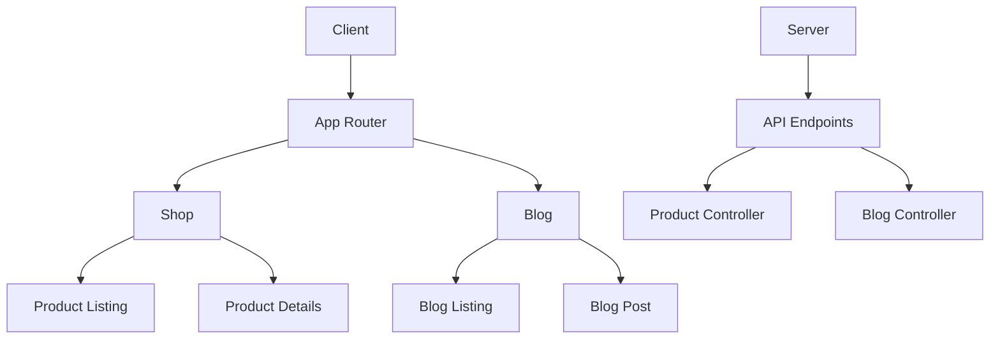
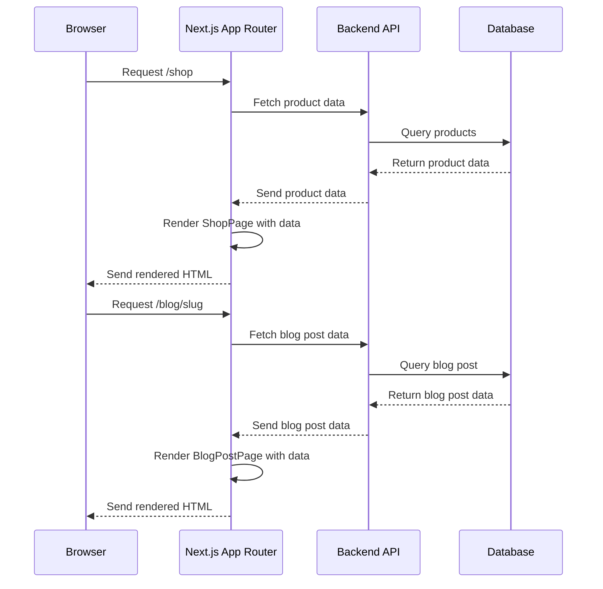
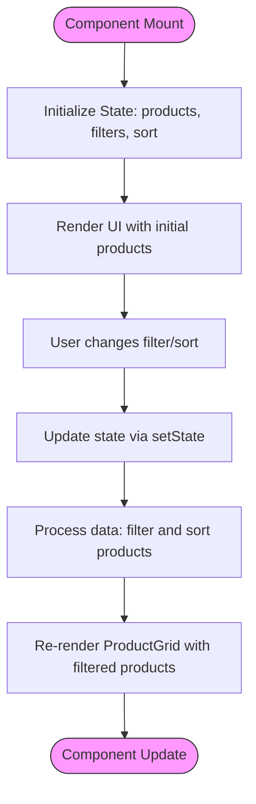
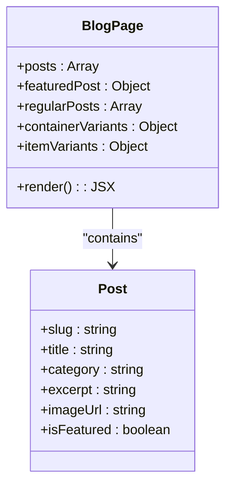
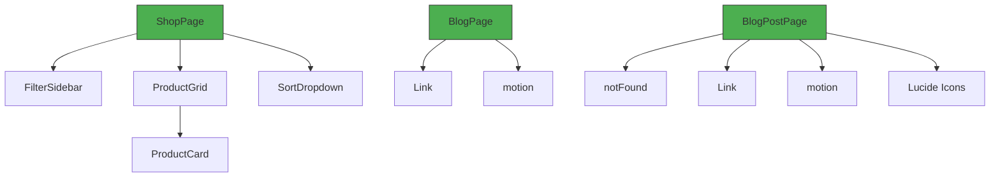

# Data Fetching Strategies

<cite>
**Referenced Files in This Document**   
- [shop/page.js](file://client/app/shop/page.js)
- [shop/[productId]/page.js](file://client/app/shop/[productId]/page.js)
- [blog/page.js](file://client/app/blog/page.js)
- [blog/[slug]/page.js](file://client/app/blog/[slug]/page.js)
- [components/Shop/ProductGrid.js](file://client/app/components/Shop/ProductGrid.js)
- [components/shared/ProductCard.js](file://client/app/components/shared/ProductCard.js)
</cite>

## Table of Contents
1. [Introduction](#introduction)
2. [Project Structure](#project-structure)
3. [Core Components](#core-components)
4. [Architecture Overview](#architecture-overview)
5. [Detailed Component Analysis](#detailed-component-analysis)
6. [Dependency Analysis](#dependency-analysis)
7. [Performance Considerations](#performance-considerations)
8. [Troubleshooting Guide](#troubleshooting-guide)
9. [Conclusion](#conclusion)

## Introduction
This document provides a comprehensive analysis of data fetching patterns within the Next.js App Router for an e-commerce application. The focus is on server-side rendering implementation for product and blog data retrieval, examining how data flows from API responses to component props and UI rendering. The analysis covers key pages including product listings, product details, blog listings, and blog post details, with attention to error handling, loading states, and caching strategies.

## Project Structure
The application follows a standard Next.js App Router structure with client and server directories. The client directory contains the React components and pages, while the server directory hosts the backend API implementation. The shop and blog sections are organized as nested routes with dynamic parameters for product details and blog posts.



**Diagram sources**
- [client/app/shop/page.js](file://client/app/shop/page.js)
- [client/app/blog/page.js](file://client/app/blog/page.js)
- [server/src/controllers/Product.controller.js](file://server/src/controllers/Product.controller.js)
- [server/src/controllers/Blog.controller.js](file://server/src/controllers/Blog.controller.js)

**Section sources**
- [client/app/shop/page.js](file://client/app/shop/page.js)
- [client/app/blog/page.js](file://client/app/blog/page.js)

## Core Components
The core components for data fetching include the shop page for product listings, product details page for individual products, blog page for article listings, and blog post page for individual articles. These components demonstrate different approaches to data management and rendering within the Next.js App Router framework.

**Section sources**
- [client/app/shop/page.js](file://client/app/shop/page.js)
- [client/app/shop/[productId]/page.js](file://client/app/shop/[productId]/page.js)
- [client/app/blog/page.js](file://client/app/blog/page.js)
- [client/app/blog/[slug]/page.js](file://client/app/blog/[slug]/page.js)

## Architecture Overview
The application architecture follows a client-server model with the Next.js App Router handling server-side rendering of pages. Data fetching occurs on the server side before rendering, with components receiving pre-fetched data as props. The architecture separates concerns between data fetching, component rendering, and UI presentation.



**Diagram sources**
- [client/app/shop/page.js](file://client/app/shop/page.js)
- [client/app/blog/[slug]/page.js](file://client/app/blog/[slug]/page.js)
- [server/src/controllers/Product.controller.js](file://server/src/controllers/Product.controller.js)
- [server/src/controllers/Blog.controller.js](file://server/src/controllers/Blog.controller.js)

## Detailed Component Analysis

### Shop Page Analysis
The shop page component implements client-side data management for product listings, using useState and useEffect hooks to handle filtering and sorting functionality. The component contains static product data within the component file, which suggests a development or demonstration implementation rather than a production data fetching pattern.



**Diagram sources**
- [client/app/shop/page.js](file://client/app/shop/page.js)
- [client/app/components/Shop/ProductGrid.js](file://client/app/components/Shop/ProductGrid.js)

**Section sources**
- [client/app/shop/page.js](file://client/app/shop/page.js)
- [client/app/components/Shop/ProductGrid.js](file://client/app/components/Shop/ProductGrid.js)

### Product Details Page Analysis
The product details page demonstrates the use of dynamic routing in Next.js with the [productId] parameter. The component receives route parameters through the params prop and displays the product ID in the UI. This implementation shows the routing capability but does not include actual data fetching from an API endpoint.

```mermaid
flowchart TD
A[URL: /shop/product-id] --> B[Route matches [productId]/page.js]
B --> C[Extract productId from params]
C --> D[Render component with productId]
D --> E[Display product details UI]
style A fill:#e6f3ff,stroke:#333
style E fill:#e6f3ff,stroke:#333
```

**Diagram sources**
- [client/app/shop/[productId]/page.js](file://client/app/shop/[productId]/page.js)

**Section sources**
- [client/app/shop/[productId]/page.js](file://client/app/shop/[productId]/page.js)

### Blog Page Analysis
The blog page component implements client-side rendering with static data embedded within the component. It uses framer-motion for animations and displays a featured post along with a grid of regular posts. The data structure includes blog post objects with properties like title, category, excerpt, and image URL.



**Diagram sources**
- [client/app/blog/page.js](file://client/app/blog/page.js)
- [client/app/blog/[slug]/page.js](file://client/app/blog/[slug]/page.js)

**Section sources**
- [client/app/blog/page.js](file://client/app/blog/page.js)

### Blog Post Page Analysis
The blog post page implements dynamic routing with the [slug] parameter and includes client-side data fetching simulation. The component uses a getPost function to retrieve post data based on the slug parameter and implements error handling with Next.js's notFound function when a post is not found.

```mermaid
flowchart TD
A[URL: /blog/post-slug] --> B[Route matches [slug]/page.js]
B --> C[Extract slug from params]
C --> D[Call getPost(slug)]
D --> E{Post found?}
E --> |Yes| F[Render blog post UI]
E --> |No| G[Call notFound()]
G --> H[Render 404 page]
F --> I[Display post content]
style A fill:#e6f3ff,stroke:#333
style H fill:#ffe6e6,stroke:#333
style I fill:#e6f3ff,stroke:#333
```

**Diagram sources**
- [client/app/blog/[slug]/page.js](file://client/app/blog/[slug]/page.js)

**Section sources**
- [client/app/blog/[slug]/page.js](file://client/app/blog/[slug]/page.js)

## Dependency Analysis
The component dependencies reveal a pattern of client-side data management rather than server-side data fetching. Components import and use UI elements from the components directory, but there are no explicit imports for data fetching libraries or API service modules.



**Diagram sources**
- [client/app/shop/page.js](file://client/app/shop/page.js)
- [client/app/blog/page.js](file://client/app/blog/page.js)
- [client/app/blog/[slug]/page.js](file://client/app/blog/[slug]/page.js)

**Section sources**
- [client/app/shop/page.js](file://client/app/shop/page.js)
- [client/app/blog/page.js](file://client/app/blog/page.js)
- [client/app/blog/[slug]/page.js](file://client/app/blog/[slug]/page.js)

## Performance Considerations
The current implementation uses client-side data management with static data embedded in components, which has implications for performance and scalability. For production applications, server-side data fetching would be preferred to reduce initial page load size and improve SEO. The use of client-side filtering and sorting is appropriate for smaller datasets but may need optimization for larger product catalogs.

## Troubleshooting Guide
When implementing data fetching in Next.js App Router, common issues include:
- Ensure API endpoints are properly configured and accessible
- Verify that environment variables for API URLs are correctly set
- Check that data fetching functions are properly awaited in server components
- Validate that error boundaries are implemented for failed data requests
- Confirm that loading states are properly displayed during data fetching

**Section sources**
- [client/app/shop/page.js](file://client/app/shop/page.js)
- [client/app/blog/[slug]/page.js](file://client/app/blog/[slug]/page.js)

## Conclusion
The analysis reveals that the current implementation primarily uses client-side data management with static data rather than server-side data fetching from API endpoints. While this approach works for demonstration purposes, a production application would benefit from implementing server-side rendering with async/await patterns to fetch data from backend APIs before rendering. Future improvements should include proper data fetching implementation, error handling for failed requests, and caching strategies for dynamic content.