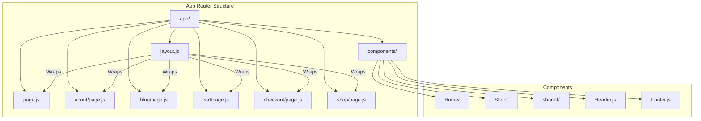
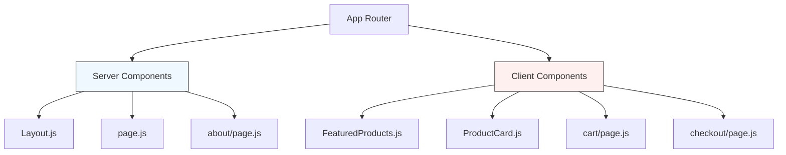
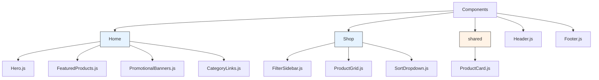
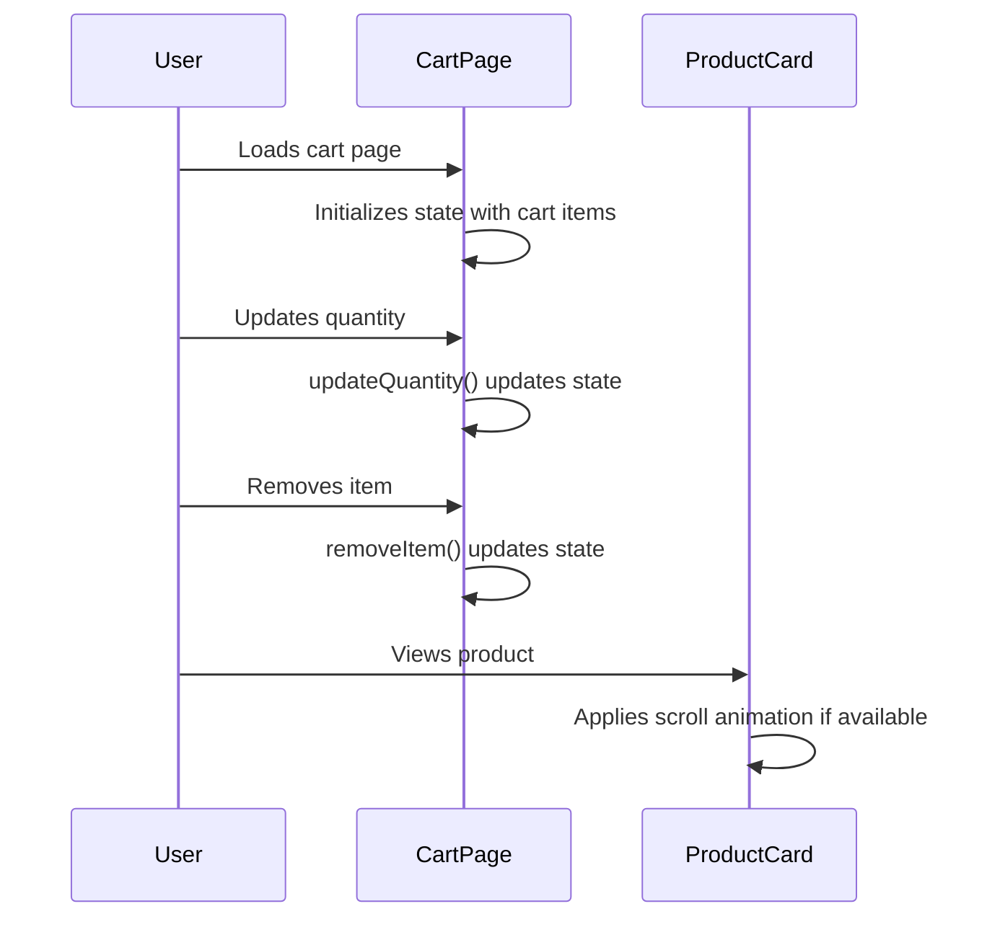

# Frontend Architecture

<cite>
**Referenced Files in This Document**   
- [layout.js](file://client/app/layout.js)
- [page.js](file://client/app/page.js)
- [Header.js](file://client/app/components/Header.js)
- [Footer.js](file://client/app/components/Footer.js)
- [Hero.js](file://client/app/components/Home/Hero.js)
- [FeaturedProducts.js](file://client/app/components/Home/FeaturedProducts.js)
- [ProductCard.js](file://client/app/components/shared/ProductCard.js)
- [ProductGrid.js](file://client/app/components/Shop/ProductGrid.js)
- [cart/page.js](file://client/app/cart/page.js)
- [checkout/page.js](file://client/app/checkout/page.js)
</cite>

## Table of Contents
1. [Introduction](#introduction)
2. [Project Structure](#project-structure)
3. [App Router Architecture](#app-router-architecture)
4. [Layout System](#layout-system)
5. [Component-Based Architecture](#component-based-architecture)
6. [State Management Patterns](#state-management-patterns)
7. [Data Fetching Strategies](#data-fetching-strategies)
8. [UI and Backend Integration](#ui-and-backend-integration)
9. [Performance Optimization Techniques](#performance-optimization-techniques)
10. [Accessibility and Responsive Design](#accessibility-and-responsive-design)

## Introduction
This document provides comprehensive architectural documentation for the Next.js frontend application of VnV24, an e-commerce platform specializing in premium fragrances and essential oils. The application leverages the App Router architecture introduced in Next.js 13, utilizing server components, client components, and advanced rendering patterns to deliver a high-performance, accessible, and maintainable user experience. The architecture is designed with a feature-based organization, focusing on key areas such as the home page, shop functionality, cart management, and checkout process.

## Project Structure
The frontend application follows a standard Next.js App Router structure with a clear feature-based organization. The core application resides in the `client/app` directory, which contains route definitions, layout components, and shared UI elements. The structure is organized around key user journeys including home, shop, cart, checkout, and informational pages like about, contact, and policies.



**Diagram sources**
- [layout.js](file://client/app/layout.js)
- [page.js](file://client/app/page.js)

**Section sources**
- [layout.js](file://client/app/layout.js)
- [page.js](file://client/app/page.js)

## App Router Architecture
The application utilizes the Next.js App Router architecture, which enables a file-based routing system with support for both server and client components. Route segments are defined by directories, with `page.js` files representing individual pages. The router automatically generates routes based on the directory structure, supporting dynamic routes through bracket notation (e.g., `[productId]` for product details and `[slug]` for blog posts).

Server components are used by default for all pages and components unless explicitly marked with the `'use client'` directive. This allows for efficient server-side rendering of content while minimizing client-side JavaScript bundle size. Client components are strategically used for interactive elements that require React hooks, event handlers, or browser APIs.



**Diagram sources**
- [layout.js](file://client/app/layout.js)
- [FeaturedProducts.js](file://client/app/components/Home/FeaturedProducts.js)
- [ProductCard.js](file://client/app/components/shared/ProductCard.js)
- [cart/page.js](file://client/app/cart/page.js)
- [checkout/page.js](file://client/app/checkout/page.js)

**Section sources**
- [layout.js](file://client/app/layout.js)
- [cart/page.js](file://client/app/cart/page.js)
- [checkout/page.js](file://client/app/checkout/page.js)

## Layout System
The application implements a hierarchical layout system centered around a root layout defined in `layout.js`. This root layout provides consistent UI elements across all pages, including the header, footer, and main content area. The layout component wraps all pages in the application, ensuring a uniform structure and shared functionality.

The layout system leverages Next.js font optimization with `next/font/google` to load Inter and Playfair Display fonts efficiently. These fonts are configured as CSS variables and applied to the HTML element, allowing for consistent typography across the application. The layout also defines global styling for background and text colors, establishing the visual foundation for all pages.

```mermaid
classDiagram
class RootLayout {
+metadata : object
+inter : Font
+playfair_display : Font
+RootLayout({children})
}
class Header {
+Header()
}
class Footer {
+Footer()
}
RootLayout --> Header : "includes"
RootLayout --> Footer : "includes"
RootLayout --> "main" : "contains"
```

**Diagram sources**
- [layout.js](file://client/app/layout.js)
- [Header.js](file://client/app/components/Header.js)
- [Footer.js](file://client/app/components/Footer.js)

**Section sources**
- [layout.js](file://client/app/layout.js)
- [Header.js](file://client/app/components/Header.js)
- [Footer.js](file://client/app/components/Footer.js)

## Component-Based Architecture
The application follows a feature-based component organization with clear separation of concerns. Components are grouped into logical directories based on their functionality: Home, Shop, and shared components. This structure promotes reusability and maintainability by colocating related components and making their purpose immediately clear.

The Home directory contains components specific to the homepage, including Hero, FeaturedProducts, PromotionalBanners, and CategoryLinks. The Shop directory includes components for product browsing such as FilterSidebar, ProductGrid, and SortDropdown. Shared components, particularly ProductCard, are used across multiple pages to ensure consistency in product presentation.



**Diagram sources**
- [Hero.js](file://client/app/components/Home/Hero.js)
- [FeaturedProducts.js](file://client/app/components/Home/FeaturedProducts.js)
- [ProductGrid.js](file://client/app/components/Shop/ProductGrid.js)
- [ProductCard.js](file://client/app/components/shared/ProductCard.js)

**Section sources**
- [Hero.js](file://client/app/components/Home/Hero.js)
- [FeaturedProducts.js](file://client/app/components/Home/FeaturedProducts.js)
- [ProductGrid.js](file://client/app/components/Shop/ProductGrid.js)
- [ProductCard.js](file://client/app/components/shared/ProductCard.js)

## State Management Patterns
The application implements client-side state management for interactive features such as the shopping cart and product interactions. For the cart functionality, React's useState hook is used within the client component to manage cart items, quantities, and totals. This local state approach is appropriate for the cart page where the state is contained within a single component and doesn't need to be shared across distant parts of the application.

The ProductCard component demonstrates a more sophisticated state pattern by accepting a scrollYProgress prop for animation effects. This allows the card to implement parallax scrolling effects when used in contexts like the FeaturedProducts section, where scroll-based animations enhance the user experience. The component conditionally applies motion effects based on the presence of the scroll progress prop.



**Diagram sources**
- [cart/page.js](file://client/app/cart/page.js)
- [ProductCard.js](file://client/app/components/shared/ProductCard.js)

**Section sources**
- [cart/page.js](file://client/app/cart/page.js)
- [ProductCard.js](file://client/app/components/shared/ProductCard.js)

## Data Fetching Strategies
The application leverages server-side rendering for initial page loads to improve performance and SEO. While the current implementation uses mock data for demonstration purposes, the architecture is designed to support data fetching from backend APIs. The server components can fetch data directly from the server, eliminating the need for client-side API calls for initial content.

For client components that require dynamic data, such as the FeaturedProducts section with its scroll-based animations, data would typically be passed as props from parent server components that have fetched the data. This pattern ensures that critical content is rendered on the server while interactive elements receive the necessary data to function.

The checkout process demonstrates form handling with client-side state management, where form data is collected and processed locally before submission. In a production environment, this would be connected to backend services for order processing and payment handling.

**Section sources**
- [page.js](file://client/app/page.js)
- [FeaturedProducts.js](file://client/app/components/Home/FeaturedProducts.js)
- [checkout/page.js](file://client/app/checkout/page.js)

## UI and Backend Integration
The frontend application is designed to integrate with backend services through API endpoints. While the current implementation focuses on the UI layer, the structure supports integration with the server-side API routes defined in the companion server application. The cart and checkout functionality would connect to endpoints for managing cart state, processing orders, and handling payments.

The ProductCard component is designed to display product information that would be retrieved from a product API, with fields for name, category, price, and image URL. The shop pages would fetch product listings from the backend, and the product detail pages would retrieve specific product information based on the dynamic route parameter.

The header and footer components include navigation links that correspond to the application's route structure, ensuring seamless navigation between frontend pages. Authentication state would be managed through integration with the backend's auth system, with protected routes and user-specific content.

**Section sources**
- [ProductCard.js](file://client/app/components/shared/ProductCard.js)
- [shop/[productId]/page.js](file://client/app/shop/[productId]/page.js)
- [Header.js](file://client/app/components/Header.js)

## Performance Optimization Techniques
The application implements several performance optimization techniques to ensure fast loading times and smooth interactions. The App Router architecture enables automatic code splitting, where JavaScript bundles are split by route and only loaded when needed. This reduces the initial bundle size and improves time-to-interactive.

Image optimization is implemented through the use of external image URLs with appropriate dimensions. While the application doesn't currently use Next.js Image component, the structure supports this optimization for improved loading performance and responsive image handling.

The component architecture promotes reusability, with shared components like ProductCard used across multiple pages. This reduces code duplication and bundle size. The selective use of client components ensures that only interactive elements contain client-side JavaScript, minimizing the overall JavaScript payload.

The layout system enables efficient rendering by allowing nested layouts to be cached and reused across pages that share the same layout structure. This reduces re-renders and improves navigation performance between related pages.

**Section sources**
- [layout.js](file://client/app/layout.js)
- [ProductCard.js](file://client/app/components/shared/ProductCard.js)
- [Hero.js](file://client/app/components/Home/Hero.js)

## Accessibility and Responsive Design
The application implements responsive design principles to ensure usability across device sizes. The layout uses Tailwind CSS classes to create responsive grids and flexbox layouts that adapt to different screen sizes. The header navigation switches from a horizontal layout on desktop to a hidden mobile menu (implied by the hidden md:flex classes) on smaller screens.

Accessibility is addressed through semantic HTML structure, proper heading hierarchy, and focus management. Interactive elements include appropriate hover states and transitions to provide visual feedback. Form elements in the checkout process include labels and validation attributes to assist screen readers and ensure proper input handling.

The color scheme is designed with sufficient contrast between text and background colors to meet accessibility standards. The application uses a consistent typographic hierarchy with serif fonts for headings and sans-serif for body text, enhancing readability. Focus indicators are maintained through CSS transitions to ensure keyboard navigation is visible.

**Section sources**
- [Header.js](file://client/app/components/Header.js)
- [Footer.js](file://client/app/components/Footer.js)
- [checkout/page.js](file://client/app/checkout/page.js)
- [layout.js](file://client/app/layout.js)