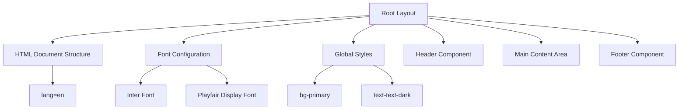
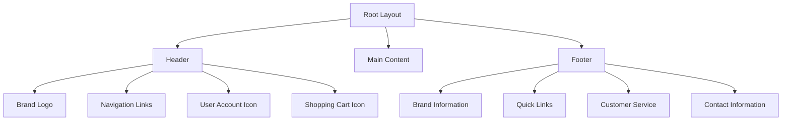
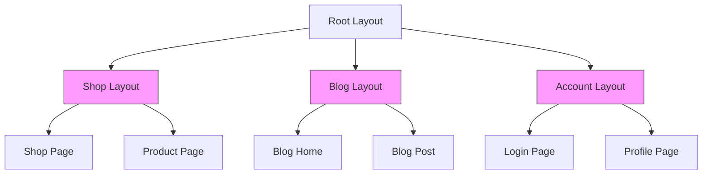
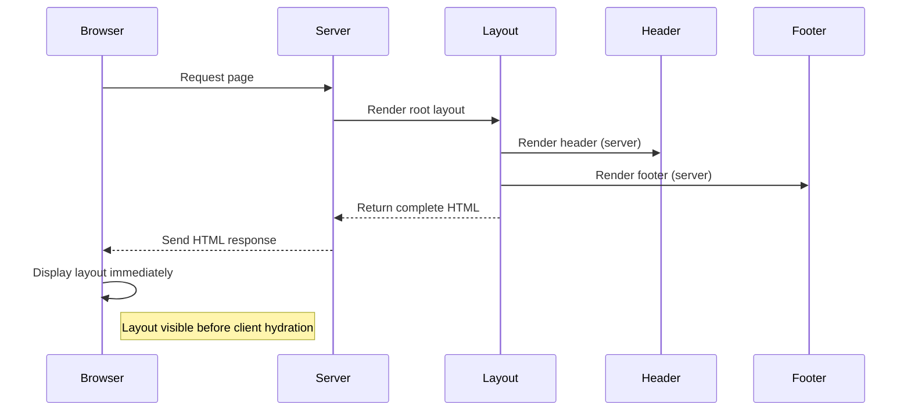
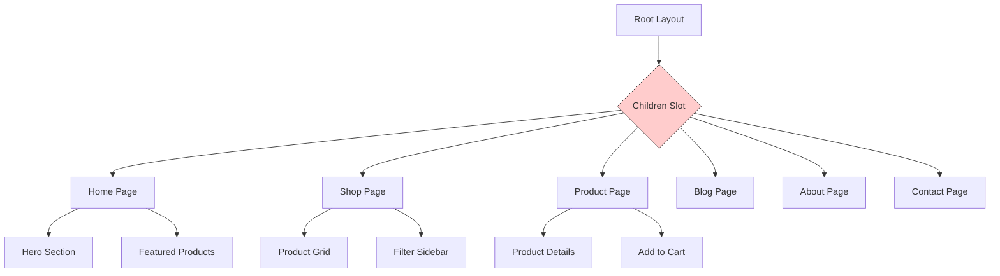
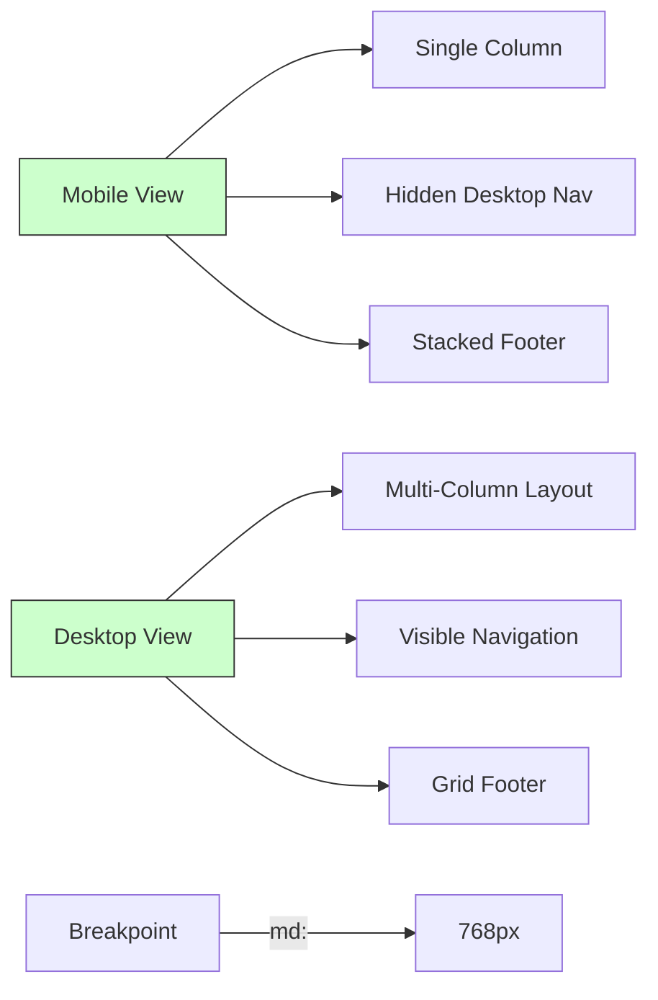
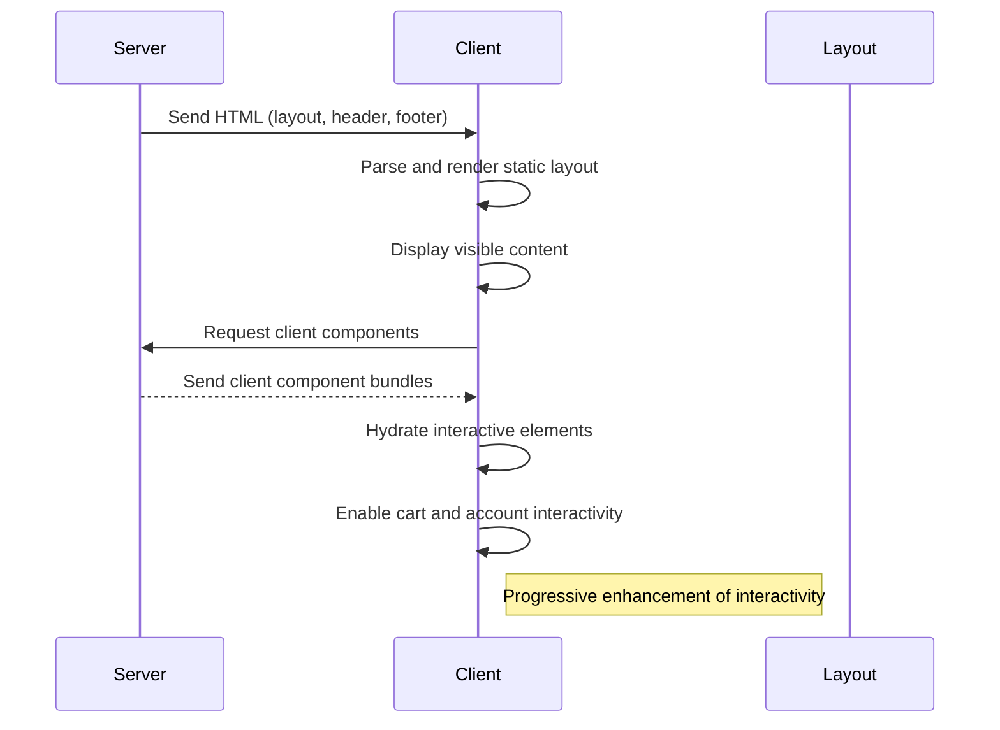

# Layout System

<cite>
**Referenced Files in This Document**   
- [client/app/layout.js](file://client/app/layout.js)
- [client/app/components/Header.js](file://client/app/components/Header.js)
- [client/app/components/Footer.js](file://client/app/components/Footer.js)
- [client/app/page.js](file://client/app/page.js)
</cite>

## Table of Contents
1. [Introduction](#introduction)
2. [Root Layout Implementation](#root-layout-implementation)
3. [Header and Footer Integration](#header-and-footer-integration)
4. [Nested Layouts Strategy](#nested-layouts-strategy)
5. [React Server Components in Layout](#react-server-components-in-layout)
6. [Page Composition and Slot Pattern](#page-composition-and-slot-pattern)
7. [Responsive Design Considerations](#responsive-design-considerations)
8. [Client-Side Interactivity and Hydration](#client-side-interactivity-and-hydration)

## Introduction
The VnV24 application implements a modern Next.js layout system using the App Router architecture. This documentation details the implementation of the shared UI structure across all pages, focusing on the root layout, component integration, and performance optimization strategies. The layout system provides a consistent user experience while leveraging React Server Components for improved performance and SEO.

## Root Layout Implementation

The root layout is implemented in `layout.js` at the application root level, serving as the foundational UI structure for all pages in the VnV24 application. This layout component wraps all pages with consistent structural elements including HTML document structure, global fonts, and shared UI components.

The implementation uses Next.js font optimization with Inter and Playfair Display fonts, which are configured as CSS variables and applied to the HTML element. This approach enables efficient font loading and reduces layout shifts. The layout establishes the base styling with a primary background color and dark text, creating a consistent visual foundation.

**Diagram sources**
- [client/app/layout.js](file://client/app/layout.js#L1-L36)

**Section sources**
- [client/app/layout.js](file://client/app/layout.js#L1-L36)

## Header and Footer Integration

The Header and Footer components are integrated within the root layout to provide consistent navigation and site information across all pages. These components are imported directly into the layout and rendered as static elements that wrap the dynamic page content.

The Header component implements a sticky navigation bar with responsive design, featuring the brand logo, primary navigation links, and user interaction elements including account and cart indicators. It uses a semi-transparent background with backdrop blur for visual depth and maintains a high z-index to ensure visibility during scrolling.

The Footer component provides comprehensive site information including brand description, navigation links, customer service information, and contact details. It features a dark green background with light text, creating a clear visual separation from the main content while maintaining brand consistency.

**Diagram sources**
- [client/app/layout.js](file://client/app/layout.js#L23-L36)
- [client/app/components/Header.js](file://client/app/components/Header.js#L1-L30)
- [client/app/components/Footer.js](file://client/app/components/Footer.js#L1-L45)

**Section sources**
- [client/app/components/Header.js](file://client/app/components/Header.js#L1-L30)
- [client/app/components/Footer.js](file://client/app/components/Footer.js#L1-L45)

## Nested Layouts Strategy

While the current implementation features a single root layout, the Next.js App Router supports nested layouts for feature-specific UI consistency. Nested layouts can be implemented by creating additional `layout.js` files within specific route segments.

For example, a dedicated shop layout could be created at `app/shop/layout.js` to provide shop-specific UI elements such as product filters, sorting options, and category navigation that persist across all shop-related pages. Similarly, a blog layout at `app/blog/layout.js` could include blog-specific elements like category filters, recent posts, and social sharing options.

The nested layout system follows a hierarchical structure where layouts are automatically composed from the root down to the specific page, allowing for progressive enhancement of the UI structure based on the current route. This enables feature-specific consistency while maintaining overall site coherence.

**Section sources**
- [client/app/layout.js](file://client/app/layout.js#L23-L36)

## React Server Components in Layout

The layout system leverages React Server Components by default, as no "use client" directive is present in the root layout. This server-side rendering approach provides significant performance and SEO benefits by generating the layout structure on the server before sending it to the client.

Server Components in the layout enable efficient data fetching, reduced bundle size, and improved time-to-first-byte (TTFB). The header and footer components are also rendered on the server, allowing for pre-rendered navigation and site information that enhances perceived performance.

The server-rendered layout establishes the critical rendering path, ensuring that essential UI elements are available immediately upon page load. This approach minimizes client-side JavaScript execution for layout components, reserving client hydration for interactive elements only.

**Diagram sources**
- [client/app/layout.js](file://client/app/layout.js#L1-L36)
- [client/app/components/Header.js](file://client/app/components/Header.js#L1-L30)
- [client/app/components/Footer.js](file://client/app/components/Footer.js#L1-L45)

## Page Composition and Slot Pattern

The layout implements the default slot pattern through the `children` prop, which serves as the content placeholder for individual pages. This pattern enables flexible page composition while maintaining consistent structural elements.

Each page in the application is rendered within the main content area of the layout, which is defined by the container class with responsive padding. The slot pattern allows pages to focus on their unique content while inheriting the shared UI structure from the layout.

For example, the home page at `app/page.js` renders within the layout's main section, with the Header and Footer providing consistent navigation and site information across all views. This composition pattern ensures visual consistency while allowing for page-specific content and functionality.

**Diagram sources**
- [client/app/layout.js](file://client/app/layout.js#L23-L36)
- [client/app/page.js](file://client/app/page.js)

**Section sources**
- [client/app/layout.js](file://client/app/layout.js#L23-L36)

## Responsive Design Considerations

The layout system incorporates responsive design principles to ensure optimal user experience across device sizes. The Header component implements a mobile-first approach with a simplified navigation on smaller screens and expanded navigation on medium and larger screens.

CSS utility classes from the styling system enable responsive behavior, such as the `hidden md:flex` class on the navigation menu that hides the horizontal navigation on mobile and displays it on medium screens and above. The container class with `mx-auto` ensures proper content centering and maximum width constraints on larger screens.

The Footer uses a responsive grid system that displays content in a single column on mobile devices and transitions to a four-column layout on medium screens and above. This adaptive design ensures readability and usability across all device sizes while maintaining visual hierarchy.

**Section sources**
- [client/app/components/Header.js](file://client/app/components/Header.js#L1-L30)
- [client/app/components/Footer.js](file://client/app/components/Footer.js#L1-L45)

## Client-Side Interactivity and Hydration

While the layout components are server-rendered, client-side interactivity is managed through strategically placed Client Components. The grep search revealed multiple "use client" directives in page components and interactive elements like ProductCard, indicating a selective hydration strategy.

Interactive elements in the Header, such as the cart and user account indicators, are likely implemented as Client Components to enable dynamic behavior like cart quantity updates and authentication status changes. These components are hydrated on the client after the initial server-rendered layout is displayed, providing interactivity without sacrificing initial load performance.

The hydration pattern follows Next.js best practices by minimizing client-side JavaScript for non-interactive layout elements while enabling rich interactivity for user-facing components. This approach optimizes the critical rendering path and improves overall application performance.

**Section sources**
- [client/app/components/Header.js](file://client/app/components/Header.js#L1-L30)
- [client/app/components/shared/ProductCard.js](file://client/app/components/shared/ProductCard.js)
- [client/app/page.js](file://client/app/page.js)