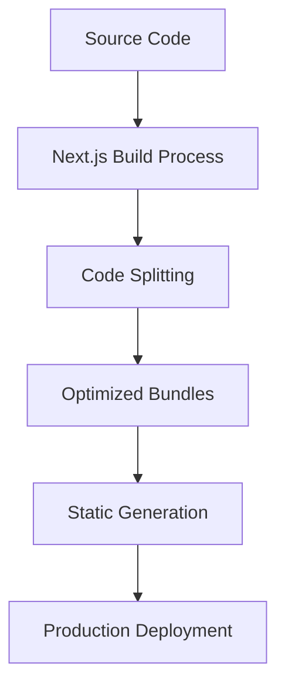
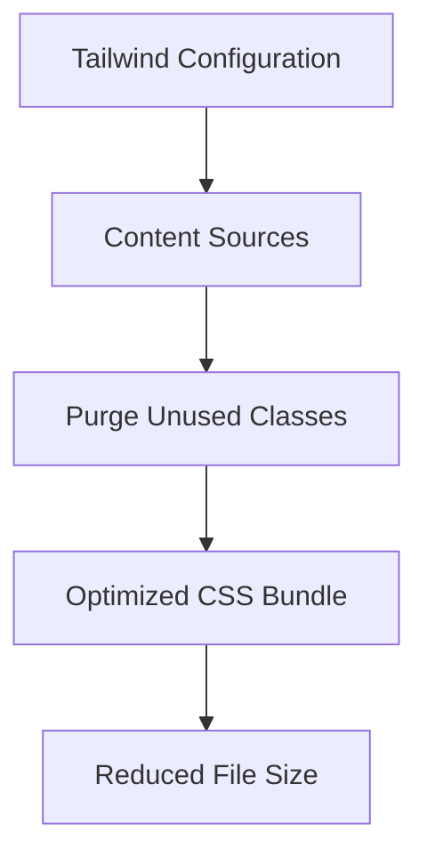
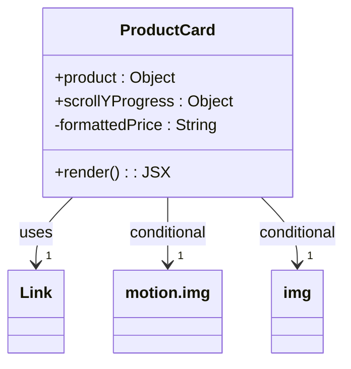
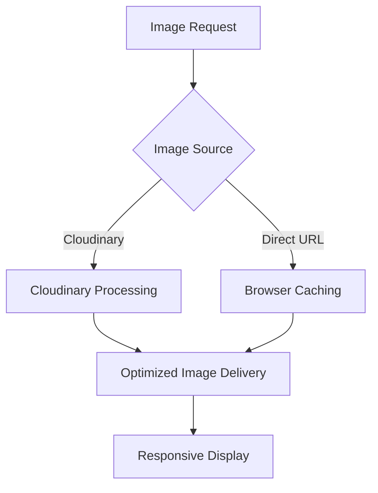
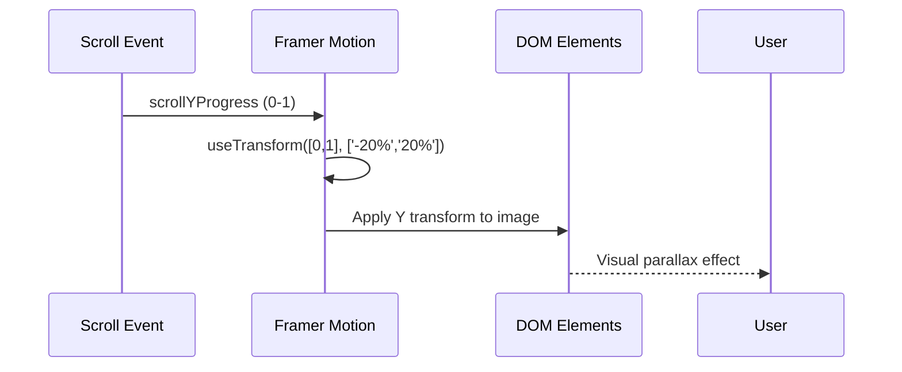
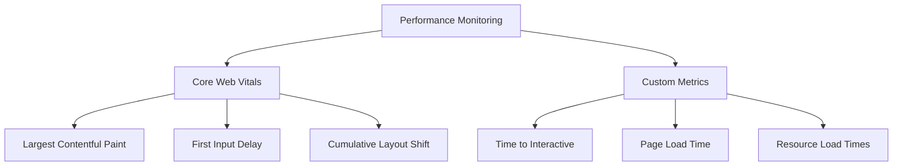

# Performance Optimization

<cite>
**Referenced Files in This Document**   
- [next.config.mjs](file://client/next.config.mjs)
- [tailwind.config.js](file://client/tailwind.config.js)
- [ProductCard.js](file://client/app/components/shared/ProductCard.js)
</cite>

## Table of Contents
1. [Introduction](#introduction)
2. [Build Configuration and Optimization](#build-configuration-and-optimization)
3. [Tailwind CSS Configuration for Performance](#tailwind-css-configuration-for-performance)
4. [Component-Level Optimizations](#component-level-optimizations)
5. [Image Optimization Strategies](#image-optimization-strategies)
6. [Animation Performance with Framer Motion](#animation-performance-with-framer-motion)
7. [Performance Monitoring and Measurement](#performance-monitoring-and-measurement)
8. [Conclusion](#conclusion)

## Introduction
This document provides a comprehensive analysis of frontend performance optimization techniques implemented in the VnV24 application. The focus is on key areas including build configuration, CSS optimization, component rendering efficiency, image handling, and animation performance. The application leverages Next.js for server-side rendering and static generation, with Tailwind CSS for styling and Framer Motion for animations. Understanding these optimization strategies is essential for maintaining high performance standards and delivering an excellent user experience across various devices and network conditions.

## Build Configuration and Optimization
The VnV24 application utilizes Next.js for its frontend framework, which provides several built-in optimization features. However, the current configuration in `next.config.mjs` is minimal and does not explicitly enable advanced optimization features.

**Diagram sources**
- [next.config.mjs](file://client/next.config.mjs#L1-L5)

**Section sources**
- [next.config.mjs](file://client/next.config.mjs#L1-L5)

The current configuration does not specify custom image optimization settings, code splitting strategies, or bundle analysis tools. By default, Next.js enables code splitting automatically, where JavaScript bundles are split by page, ensuring that each page only loads the JavaScript necessary for that page. This significantly improves initial load performance by reducing the amount of code that needs to be downloaded and parsed.

For future optimization, the configuration could be enhanced with specific settings for image optimization, font optimization, and webpack configuration for bundle analysis. The absence of explicit configuration means the application relies on Next.js defaults, which are generally well-optimized but may not be tailored to the specific needs of this application.

## Tailwind CSS Configuration for Performance
The Tailwind CSS configuration in the VnV24 application is designed to optimize bundle size through tree-shaking and efficient class generation. The configuration specifies content sources to enable purging of unused CSS classes during the build process.

**Diagram sources**
- [tailwind.config.js](file://client/tailwind.config.js#L1-L39)

**Section sources**
- [tailwind.config.js](file://client/tailwind.config.js#L1-L39)

The configuration includes a comprehensive color palette that aligns with the application's design system, including primary, secondary, and accent colors. The content array specifies the file patterns to scan for Tailwind class usage, enabling the purge process to remove unused classes from the final CSS bundle. This tree-shaking approach significantly reduces the CSS file size by eliminating unused utility classes.

The configuration also includes custom font families and typography plugins, which are loaded efficiently through CSS variables. This approach minimizes the number of HTTP requests and allows for font optimization through the `next/font` system, though this specific implementation detail would need to be verified in the actual codebase.

## Component-Level Optimizations
The VnV24 application implements component-level optimizations to prevent unnecessary re-renders and improve rendering performance, particularly in product grid displays.

### ProductCard Component Optimization
The `ProductCard` component is a critical component in the product grid display, and its optimization is essential for maintaining smooth scrolling and interaction performance.

**Diagram sources**
- [ProductCard.js](file://client/app/components/shared/ProductCard.js#L5-L40)

**Section sources**
- [ProductCard.js](file://client/app/components/shared/ProductCard.js#L5-L40)

The component receives product data and an optional `scrollYProgress` prop, which is used to create parallax scrolling effects. When `scrollYProgress` is provided, the component uses Framer Motion's `motion.img` with a transformed Y position. Otherwise, it falls back to a standard `img` element. This conditional rendering approach optimizes performance by only using the more resource-intensive animated image when necessary.

The component also implements efficient price formatting using the `Intl.NumberFormat` API, which is memoized through the component's render cycle. While the current implementation does not explicitly use React.memo or other memoization techniques, the functional component structure with props-based rendering naturally benefits from React's reconciliation process.

For further optimization, implementing `React.memo` on the `ProductCard` component could prevent unnecessary re-renders when product data hasn't changed, particularly important in large product grids where scrolling performance is critical.

## Image Optimization Strategies
The VnV24 application employs several image optimization strategies to ensure fast loading times and optimal visual quality across different devices.

### Responsive Images and Lazy Loading
The application uses responsive image loading with appropriate sizing for different screen resolutions. The current implementation in the `ProductCard` component shows that images are loaded directly from URLs without using Next.js's built-in Image component, which suggests that image optimization is handled at the server level or through a third-party service.

**Diagram sources**
- [ProductCard.js](file://client/app/components/shared/ProductCard.js#L5-L40)

The images are displayed with consistent aspect ratios using Tailwind's `aspect-square` class, ensuring uniform layout in product grids. The `object-cover` and `object-center` classes ensure that images are properly cropped and centered within their containers, maintaining visual consistency across different image dimensions.

Lazy loading is implicitly handled through the browser's native lazy loading capabilities and React's rendering lifecycle. The application could further optimize image loading by implementing Intersection Observer API for more granular control over when images are loaded during scrolling.

### Cloudinary Integration
Based on the package dependencies, the application includes Cloudinary as an image management solution. Cloudinary provides advanced image optimization features including automatic format selection, compression, and responsive image generation.

The integration allows for dynamic image transformations through URL parameters, enabling the delivery of appropriately sized images based on device characteristics. This reduces bandwidth usage and improves loading performance, particularly on mobile devices with limited network capacity.

The application could leverage Cloudinary's features more extensively by implementing responsive image breakpoints, automatic WebP format delivery for supporting browsers, and lazy loading with placeholder images to improve perceived performance.

## Animation Performance with Framer Motion
The VnV24 application uses Framer Motion to create engaging animations, particularly in the product card component where parallax scrolling effects enhance the user experience.

### Parallax Scrolling Implementation
The `ProductCard` component implements a parallax effect using Framer Motion's `useTransform` hook, which creates a smooth vertical movement of product images as the user scrolls.

**Diagram sources**
- [ProductCard.js](file://client/app/components/shared/ProductCard.js#L5-L40)

The implementation maps the scroll progress (0 to 1) to a Y transform value from -20% to 20%, creating a subtle floating effect on product images. This animation is hardware-accelerated through CSS transforms, ensuring smooth 60fps performance on most devices.

The component conditionally applies the animated image only when `scrollYProgress` is provided, which is an important optimization technique. This prevents unnecessary animation processing on pages where the parallax effect is not needed, conserving CPU and GPU resources.

### Performance Considerations
While Framer Motion provides powerful animation capabilities, it's important to monitor its impact on performance, particularly on lower-end devices. The current implementation is relatively lightweight, using only transform animations which are generally well-optimized by browsers.

For future optimization, the application could implement animation quality settings that adapt based on device capabilities, using the `prefers-reduced-motion` media query to disable animations for users who have indicated a preference for reduced motion. Additionally, implementing animation throttling or debouncing could prevent excessive re-renders during rapid scrolling.

## Performance Monitoring and Measurement
To ensure ongoing performance optimization, the VnV24 application should implement comprehensive performance monitoring and measurement strategies.

### Key Performance Metrics
The application should track several key frontend performance metrics:

These metrics provide insights into user experience quality and help identify performance bottlenecks. Largest Contentful Paint (LCP) measures loading performance, First Input Delay (FID) measures interactivity, and Cumulative Layout Shift (CLS) measures visual stability.

### Optimization Guidance
To maintain optimal performance, the following practices are recommended:

1. **Bundle Analysis**: Regularly analyze JavaScript bundle sizes using tools like Webpack Bundle Analyzer to identify opportunities for code splitting and tree-shaking.

2. **Image Optimization**: Implement Next.js Image component or enhance Cloudinary integration to ensure automatic image optimization, including lazy loading, responsive sizing, and modern format delivery.

3. **Component Memoization**: Apply React.memo to frequently rendered components like ProductCard to prevent unnecessary re-renders in product grids.

4. **Code Splitting**: Ensure dynamic imports are used for non-critical components and libraries to reduce initial bundle size.

5. **Font Optimization**: Implement proper font loading strategies to eliminate render-blocking resources and improve First Contentful Paint.

6. **Caching Strategy**: Implement appropriate caching headers and service workers to improve repeat visit performance.

## Conclusion
The VnV24 application implements several effective frontend performance optimization techniques, particularly in component design and animation implementation. The use of Tailwind CSS with proper configuration enables efficient CSS delivery through tree-shaking, while the component architecture supports reusable and maintainable code.

Key areas for improvement include enhancing the Next.js configuration to leverage built-in optimization features, implementing more aggressive image optimization through Cloudinary or Next.js Image component, and adding explicit memoization to prevent unnecessary re-renders in product grids.

By continuing to monitor performance metrics and iteratively optimizing the frontend, the VnV24 application can maintain excellent user experience across various devices and network conditions. The foundation is well-established, and with targeted improvements, the application can achieve even higher performance standards.