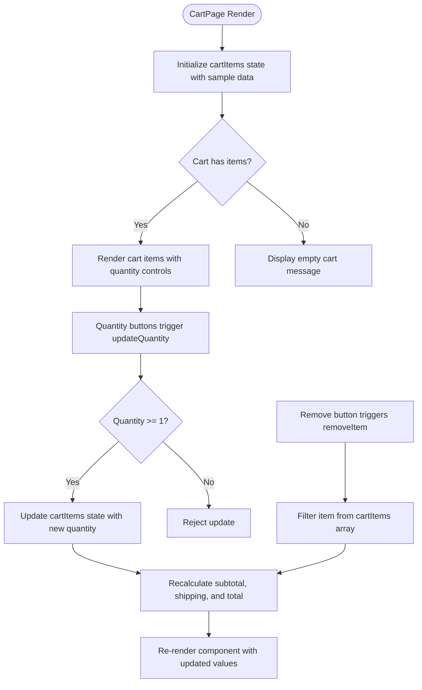
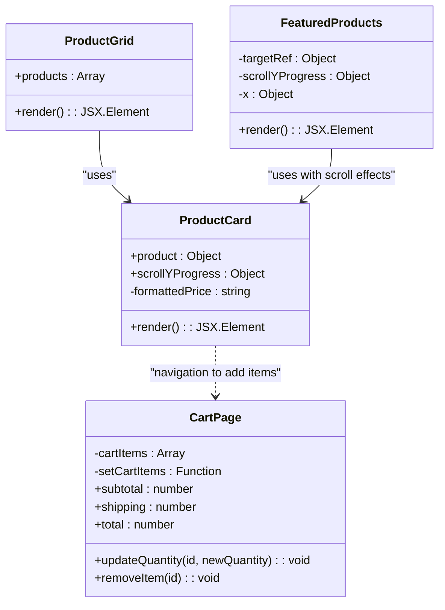
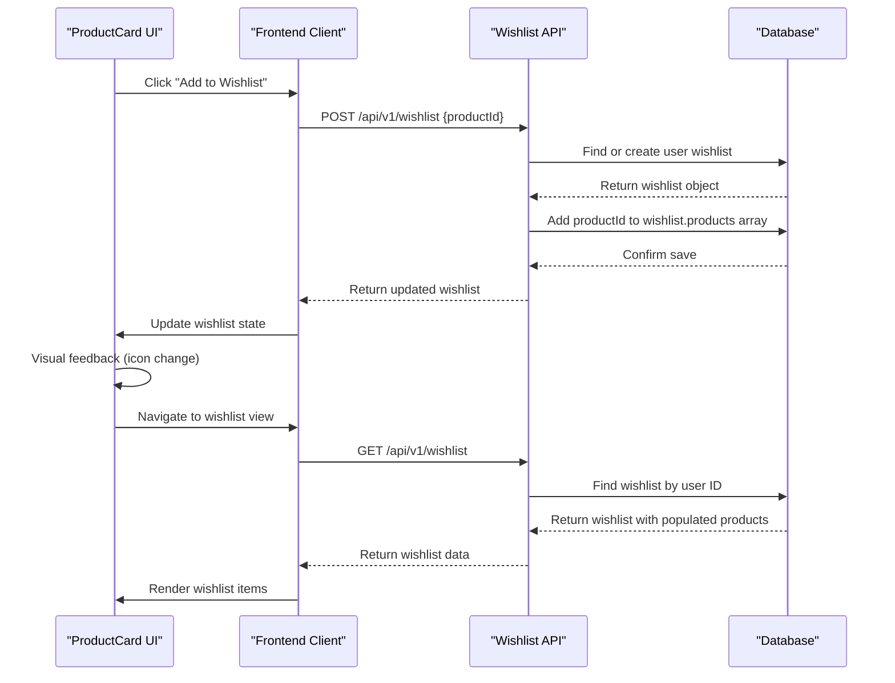

# State Management

<cite>
**Referenced Files in This Document**   
- [cart/page.js](file://client/app/cart/page.js)
- [components/shared/ProductCard.js](file://client/app/components/shared/ProductCard.js)
- [components/Shop/ProductGrid.js](file://client/app/components/Shop/ProductGrid.js)
- [components/Home/FeaturedProducts.js](file://client/app/components/Home/FeaturedProducts.js)
- [shop/page.js](file://client/app/shop/page.js)
- [shop/[productId]/page.js](file://client/app/shop/[productId]/page.js)
- [server/src/controllers/Wishlist.controller.js](file://server/src/controllers/Wishlist.controller.js)
- [server/src/models/Wishlist.model.js](file://server/src/models/Wishlist.model.js)
- [server/src/routes/Wishlist.routes.js](file://server/src/routes/Wishlist.routes.js)
</cite>

## Table of Contents
1. [Introduction](#introduction)
2. [Cart State Management](#cart-state-management)
3. [ProductCard Interaction with Global State](#productcard-interaction-with-global-state)
4. [Wishlist State Management](#wishlist-state-management)
5. [API Integration for State Syncing](#api-integration-for-state-syncing)
6. [State Behavior During Navigation](#state-behavior-during-navigation)
7. [State Persistence and Refresh Handling](#state-persistence-and-refresh-handling)
8. [Performance Considerations](#performance-considerations)

## Introduction
This document provides a comprehensive overview of client-side state management in the VnV24 frontend application, focusing on cart and wishlist functionality. The system leverages React's useState hook for local state management within specific components, particularly for cart operations. The architecture demonstrates a component-based approach where state changes in ProductCard components affect global cart state, with considerations for UI updates, persistence, and backend synchronization. The document also covers navigation behavior, state persistence strategies, and performance implications across product grids.

## Cart State Management

The cart functionality in VnV24 is managed through React's useState hook within the CartPage component. The cart state is represented as an array of cart items, each containing product details such as ID, name, price, quantity, image URL, and category. The component maintains this state and provides functions to update item quantities and remove items from the cart.

Quantity adjustments are handled through the updateQuantity function, which validates that the new quantity is at least 1 before updating the state. The function uses the setCartItems state updater with a mapping operation that creates a new array with the updated quantity for the specified item ID. Item removal is implemented through the removeItem function, which filters out the specified item from the cart array.

The component also calculates derived state values including subtotal, shipping cost (a flat rate of ₹499 when the cart is not empty), and total cost. These calculations are performed directly from the cartItems state on each render, ensuring they remain synchronized with the current cart contents.

**Diagram sources**
- [cart/page.js](file://client/app/cart/page.js#L4-L138)

**Section sources**
- [cart/page.js](file://client/app/cart/page.js#L4-L138)

## ProductCard Interaction with Global State

The ProductCard component serves as the primary interface for adding products to the cart across various product displays in the application. It is used in multiple contexts including the shop page, product grid, and featured products section. The component receives product data as props and renders a consistent product representation with an "Add to Cart" button.

Currently, the ProductCard implementation displays product information and includes an "Add to Cart" button, but the actual cart state management functionality is isolated within the CartPage component. This creates a disconnect between the product display components and the cart state management, suggesting that cart operations may be handled through navigation to the cart page rather than direct state updates from the ProductCard.

The component supports visual enhancements through framer-motion for scroll-based animations when a scrollYProgress prop is provided, as seen in the FeaturedProducts component. This allows for dynamic visual effects while maintaining the core product display functionality.

**Diagram sources**
- [components/shared/ProductCard.js](file://client/app/components/shared/ProductCard.js#L5-L40)
- [cart/page.js](file://client/app/cart/page.js#L4-L138)
- [components/Shop/ProductGrid.js](file://client/app/components/Shop/ProductGrid.js#L1-L15)
- [components/Home/FeaturedProducts.js](file://client/app/components/Home/FeaturedProducts.js#L5-L41)

**Section sources**
- [components/shared/ProductCard.js](file://client/app/components/shared/ProductCard.js#L5-L40)
- [components/Shop/ProductGrid.js](file://client/app/components/Shop/ProductGrid.js#L1-L15)
- [components/Home/FeaturedProducts.js](file://client/app/components/Home/FeaturedProducts.js#L5-L41)

## Wishlist State Management

The wishlist functionality in VnV24 is implemented as a server-side feature with corresponding API endpoints rather than a client-side state management system. The backend provides a complete REST API for wishlist operations, including retrieving the user's wishlist, adding products to the wishlist, and removing products from the wishlist.

The Wishlist model defines the data structure with a user reference and an array of product references. The controller implements three main functions: getWishlist retrieves the current user's wishlist with populated product data, addToWishlist adds a product to the user's wishlist (creating a new wishlist if one doesn't exist), and removeFromWishlist removes a specified product from the wishlist.

On the client side, while the specific implementation details are not available in the provided code, the architecture suggests that wishlist operations would involve API calls to these endpoints. The state management for wishlist items would likely involve fetching the wishlist data from the server and maintaining it in component state or through a state management library, with mutations triggered by user interactions and synchronized with the backend.

**Diagram sources**
- [server/src/controllers/Wishlist.controller.js](file://server/src/controllers/Wishlist.controller.js#L1-L56)
- [server/src/models/Wishlist.model.js](file://server/src/models/Wishlist.model.js#L1-L10)
- [server/src/routes/Wishlist.routes.js](file://server/src/routes/Wishlist.routes.js#L1-L14)

**Section sources**
- [server/src/controllers/Wishlist.controller.js](file://server/src/controllers/Wishlist.controller.js#L1-L56)
- [server/src/models/Wishlist.model.js](file://server/src/models/Wishlist.model.js#L1-L10)
- [server/src/routes/Wishlist.routes.js](file://server/src/routes/Wishlist.routes.js#L1-L14)

## API Integration for State Syncing

The VnV24 application integrates client-side state with backend services through API calls for wishlist functionality, while the cart implementation appears to be client-side only in the provided code. The wishlist system demonstrates a complete CRUD (Create, Read, Update, Delete) pattern for state synchronization between client and server.

When a user adds a product to their wishlist, the frontend makes a POST request to /api/v1/wishlist with the productId in the request body. The backend handles this by either creating a new wishlist for the user or adding the product to an existing wishlist. Similarly, removing a product from the wishlist is accomplished through a DELETE request to /api/v1/wishlist/:productId, which updates the database accordingly.

The getWishlist endpoint (GET /api/v1/wishlist) allows the client to retrieve the current state of the user's wishlist from the server, enabling state restoration across sessions and devices. This API-first approach ensures data consistency and persistence beyond the client session.

For the cart functionality, while the current implementation uses local component state, a production implementation would likely require similar API integration to synchronize cart data with the server, especially for features like saving carts across sessions, sharing carts between devices, or implementing server-side cart validation and pricing.

## State Behavior During Navigation

The state management in VnV24 exhibits specific behaviors during navigation between key pages: shop, product detail, and cart. When navigating from the shop page to a product detail page, the application uses dynamic routing with the [productId] parameter to display product-specific information. The ProductCard components on the shop page link directly to these product detail pages, facilitating easy navigation.

From the ProductCard, users can navigate to the product detail page to view more information, and from there, they can proceed to add items to their cart. The cart page itself contains navigation options to continue shopping (linking back to the shop page) or proceed to checkout. The header component provides consistent navigation across all pages with links to shop, blog, about, contact, account, and cart pages.

Currently, the cart state is maintained only within the CartPage component using useState, which means that navigating away from the cart page would result in loss of cart state unless persistence mechanisms are implemented. The ProductCard components do not appear to directly modify cart state but rather serve as entry points to product details, suggesting that cart additions may occur on the product detail page or require navigation to the cart page.

## State Persistence and Refresh Handling

The current implementation of cart state in VnV24 uses React's useState hook within the CartPage component, which means the state is ephemeral and will be lost when the page is refreshed or when the user navigates away from the cart page. This creates a potential usability issue where users could lose their cart contents unexpectedly.

To address state loss during refresh, the application should implement localStorage persistence for the cart data. This would involve saving the cartItems array to localStorage whenever it changes and retrieving it when the CartPage component mounts. A useEffect hook could be used to check localStorage for existing cart data and initialize the state accordingly.

The implementation would follow this pattern:
1. On cart state update, save the cartItems array to localStorage using JSON.stringify
2. On component mount, check localStorage for existing cart data
3. If data exists, parse it and use it to initialize the useState hook
4. Provide a mechanism to clear the persisted cart data when appropriate (e.g., after successful checkout)

This approach would ensure that users don't lose their cart contents when refreshing the page or temporarily navigating away. For users who are logged in, the cart state could also be synchronized with the server, allowing cart persistence across devices and browsers.

## Performance Considerations

The state management implementation in VnV24 has several performance implications, particularly when dealing with large product grids. The ProductGrid component renders products using a simple map operation over the products array, which is efficient for moderate numbers of items but could impact performance with very large datasets.

The use of useState for cart management in the CartPage component is appropriate for the current implementation, as cart sizes are typically small (fewer than 20 items). However, each state update triggers a re-render of the entire cart component, including all cart items. For large carts, this could lead to noticeable performance degradation.

The ProductCard component includes optimization considerations through the optional use of framer-motion for scroll-based animations. When scrollYProgress is provided (as in the FeaturedProducts component), the component uses motion.img with transform animations, which are handled by the browser's compositor and generally perform well. When scrollYProgress is not provided, it falls back to a standard img tag, avoiding unnecessary animation overhead.

For large product grids, additional performance optimizations could include:
- Implementing virtualization to only render visible products
- Using React.memo for ProductCard to prevent unnecessary re-renders
- Implementing pagination or infinite scrolling for large product collections
- Optimizing image loading with lazy loading techniques

The current architecture, with state management colocated with the components that use it, follows React best practices and minimizes unnecessary re-renders across the application.