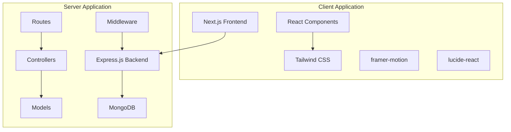
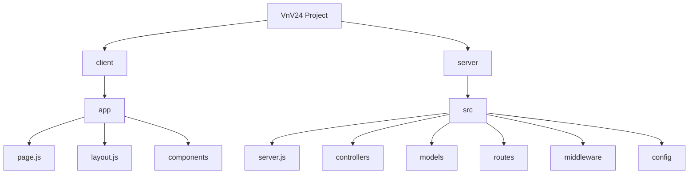

# Getting Started

<cite>
**Referenced Files in This Document**   
- [README.md](file://README.md)
- [client/README.md](file://client/README.md)
- [client/package.json](file://client/package.json)
- [server/package.json](file://server/package.json)
- [client/next.config.mjs](file://client/next.config.mjs)
- [client/app/page.js](file://client/app/page.js)
- [client/app/layout.js](file://client/app/layout.js)
- [client/app/components/Header.js](file://client/app/components/Header.js)
- [client/app/components/shared/ProductCard.js](file://client/app/components/shared/ProductCard.js)
- [client/app/shop/page.js](file://client/app/shop/page.js)
- [client/app/shop/[productId]/page.js](file://client/app/shop/[productId]/page.js)
- [server/src/server.js](file://server/src/server.js)
- [server/src/config/db.js](file://server/src/config/db.js)
- [server/src/models/Product.model.js](file://server/src/models/Product.model.js)
- [server/src/controllers/Product.controller.js](file://server/src/controllers/Product.controller.js)
</cite>

## Table of Contents
1. [Introduction](#introduction)
2. [Project Structure](#project-structure)
3. [Cloning the Repository](#cloning-the-repository)
4. [Setting Up the Development Environment](#setting-up-the-development-environment)
5. [Configuring Environment Variables](#configuring-environment-variables)
6. [Setting Up MongoDB Database](#setting-up-mongodb-database)
7. [Starting Development Servers](#starting-development-servers)
8. [Accessing the Application](#accessing-the-application)
9. [Testing API Endpoints](#testing-api-endpoints)
10. [Project Structure Orientation](#project-structure-orientation)
11. [Troubleshooting Common Issues](#troubleshooting-common-issues)
12. [Basic Usage Examples](#basic-usage-examples)

## Introduction
This guide provides comprehensive instructions for developers new to the VnV24 project. The VnV24 application is an e-commerce platform specializing in fragrances, essential oils, and related products. The system follows a modern full-stack architecture with a Next.js frontend and Express.js backend, connected to a MongoDB database. This document covers the complete setup process, from repository cloning to running both development servers with hot reloading, along with guidance on testing and basic usage.

## Project Structure
The VnV24 project follows a clean, modular structure with separate directories for client and server applications. The client is built with Next.js 15 using React 19 and Tailwind CSS for styling, while the server is an Express.js application with MongoDB as the database. The architecture promotes separation of concerns with distinct layers for routes, controllers, models, and middleware.



**Diagram sources**
- [client/package.json](file://client/package.json)
- [server/package.json](file://server/package.json)

**Section sources**
- [client/package.json](file://client/package.json)
- [server/package.json](file://server/package.json)

## Cloning the Repository
To begin working with the VnV24 project, first clone the repository from its source control system. Open your terminal and execute the following command:

```bash
git clone https://github.com/VnV24/VnV24.git
cd VnV24
```

This will create a local copy of the repository with the complete project structure, including both the client and server directories. The repository contains all necessary files to set up the development environment, including package.json files for both frontend and backend applications, configuration files, and source code.

**Section sources**
- [README.md](file://README.md)

## Setting Up the Development Environment
After cloning the repository, set up the development environment by installing dependencies for both the client and server applications. Navigate to each directory and install the required packages using npm.

First, install dependencies for the client application:
```bash
cd client
npm install
```

Then, install dependencies for the server application:
```bash
cd ../server
npm install
```

The client application uses modern frontend technologies including Next.js 15.5.3, React 19.1.0, framer-motion for animations, and lucide-react for icons. The server application relies on Express.js for the web framework, Mongoose for MongoDB object modeling, JSON Web Tokens for authentication, and several security packages including helmet, cors, and express-rate-limit.

**Section sources**
- [client/package.json](file://client/package.json)
- [server/package.json](file://server/package.json)

## Configuring Environment Variables
Both the client and server applications require environment variables for proper configuration. Create .env files in both the client and server directories with the necessary configuration values.

For the server application, create a `.env` file in the server root directory with the following variables:
```
PORT=5000
MONGO_URI=mongodb://localhost:27017/vnv24
FRONTEND_ORIGIN=http://localhost:3000
JWT_SECRET=your_jwt_secret_key_here
```

The MONGO_URI should point to your MongoDB instance, and JWT_SECRET should be a strong, randomly generated string for securing JSON Web Tokens. The FRONTEND_ORIGIN variable configures CORS to allow requests from the specified origin.

**Section sources**
- [server/src/server.js](file://server/src/server.js)
- [server/src/config/db.js](file://server/src/config/db.js)

## Setting Up MongoDB Database
The VnV24 application uses MongoDB as its primary database. To set up the database, ensure you have MongoDB installed and running on your system. You can use MongoDB Community Edition, MongoDB Atlas (cloud), or any other MongoDB service.

If running locally, start the MongoDB service:
```bash
# On macOS with Homebrew
brew services start mongodb-community

# On Ubuntu
sudo systemctl start mongod
```

Once MongoDB is running, the application will automatically connect to the database specified in the MONGO_URI environment variable. The server application uses Mongoose to define schemas for products, users, orders, and wishlists. No manual database creation is required as Mongoose will create the necessary collections when the application starts.

**Section sources**
- [server/src/config/db.js](file://server/src/config/db.js)
- [server/src/models/Product.model.js](file://server/src/models/Product.model.js)

## Starting Development Servers
The VnV24 project provides scripts to start development servers for both the client and server applications with hot reloading enabled. Start both servers to begin development.

First, start the server application:
```bash
cd server
npm run dev
```

This will start the Express.js server on port 5000 (or the port specified in the PORT environment variable) with nodemon for automatic restarts when server files change.

In a separate terminal window, start the client application:
```bash
cd client
npm run dev
```

This will start the Next.js development server on port 3000 with hot reloading enabled, allowing you to see changes to the frontend code immediately in the browser.

**Section sources**
- [client/package.json](file://client/package.json)
- [server/package.json](file://server/package.json)
- [server/src/server.js](file://server/src/server.js)

## Accessing the Application
Once both development servers are running, you can access the VnV24 application in your web browser. The frontend application is served on http://localhost:3000, while the backend API is available on http://localhost:5000.

Navigate to http://localhost:3000 to view the main application interface. The homepage features a hero section, featured products, promotional banners, and category links. The application uses client-side routing for navigation between pages such as Shop, Blog, About, and Contact. The header includes links to the account/login page and the shopping cart.

The server API endpoints follow a RESTful pattern with versioning (v1) and are prefixed with /api. For example, product data can be accessed at http://localhost:5000/api/v1/products.

**Section sources**
- [client/app/page.js](file://client/app/page.js)
- [client/app/layout.js](file://client/app/layout.js)
- [client/app/components/Header.js](file://client/app/components/Header.js)
- [server/src/server.js](file://server/src/server.js)

## Testing API Endpoints
The VnV24 backend provides a comprehensive REST API for managing products, users, orders, and wishlists. You can test these endpoints using tools like curl, Postman, or directly from the frontend application.

To retrieve all products:
```bash
curl http://localhost:5000/api/v1/products
```

To get a specific product by ID:
```bash
curl http://localhost:5000/api/v1/products/product-id-here
```

The Product controller supports filtering by category and price range, sorting, and pagination. For example, to get perfumes priced between 5000 and 8000 INR, sorted by price in ascending order:
```bash
curl "http://localhost:5000/api/v1/products?category=Perfumes&price_min=5000&price_max=8000&sort=price"
```

The API follows a consistent response format with success status, pagination information (when applicable), and data payload.

**Section sources**
- [server/src/controllers/Product.controller.js](file://server/src/controllers/Product.controller.js)
- [server/src/routes/Product.routes.js](file://server/src/routes/Product.routes.js)

## Project Structure Orientation
Understanding the project structure is essential for effective development. The VnV24 project is organized into two main directories: client and server.

The client directory contains a Next.js application with the following key subdirectories:
- `app/`: Contains all page components and layout using the App Router
- `components/`: Reusable UI components organized by feature
- `public/`: Static assets like images and fonts

The server directory contains an Express.js application with a modular structure:
- `src/controllers/`: Business logic for handling requests
- `src/models/`: Mongoose schemas defining data structures
- `src/routes/`: API route definitions
- `src/middleware/`: Request processing functions
- `src/config/`: Configuration files

Key files to understand first include `client/app/page.js` for the homepage structure, `client/app/layout.js` for the overall layout, and `server/src/server.js` for the server entry point and middleware configuration.



**Diagram sources**
- [client/app/page.js](file://client/app/page.js)
- [client/app/layout.js](file://client/app/layout.js)
- [server/src/server.js](file://server/src/server.js)

**Section sources**
- [client/app/page.js](file://client/app/page.js)
- [client/app/layout.js](file://client/app/layout.js)
- [server/src/server.js](file://server/src/server.js)

## Troubleshooting Common Issues
During setup, you may encounter common issues that can be resolved with the following solutions.

**Port conflicts**: If port 3000 or 5000 is already in use, modify the PORT environment variable in the server's .env file or use a different port for the client by setting the PORT environment variable when starting the development server:
```bash
PORT=3001 npm run dev
```

**Missing dependencies**: If you encounter module not found errors, ensure you've run npm install in both the client and server directories. If issues persist, try deleting node_modules and package-lock.json, then reinstall:
```bash
rm -rf node_modules package-lock.json
npm install
```

**Database connection problems**: If the server cannot connect to MongoDB, verify that the MongoDB service is running and that the MONGO_URI in the .env file is correct. Check the connection string format and ensure the database server is accessible.

**CORS errors**: If you see CORS-related errors in the browser console, verify that the FRONTEND_ORIGIN in the server's .env file matches the client's origin (usually http://localhost:3000).

**Section sources**
- [server/src/config/db.js](file://server/src/config/db.js)
- [server/src/server.js](file://server/src/server.js)

## Basic Usage Examples
Once the application is running, you can explore its core functionality through basic usage examples.

**Browsing products**: Navigate to the Shop page at http://localhost:3000/shop to view all available products. Use the filter sidebar to narrow products by category (Oils, Perfumes, Candles, Incense) and the sort dropdown to order by price or default arrangement.

**Adding items to cart**: On the Shop page or product detail page, click the "Add to Cart" button on any product card. The shopping bag icon in the header will update to reflect the number of items in your cart.

**Navigating the application**: Use the navigation links in the header to move between main sections: Shop, Blog, About, and Contact. The footer contains additional navigation links and information.

The application demonstrates a complete e-commerce flow from product browsing to cart management, with a clean, responsive design optimized for both desktop and mobile devices.

**Section sources**
- [client/app/shop/page.js](file://client/app/shop/page.js)
- [client/app/components/shared/ProductCard.js](file://client/app/components/shared/ProductCard.js)
- [client/app/components/Header.js](file://client/app/components/Header.js)
- [client/app/shop/[productId]/page.js](file://client/app/shop/[productId]/page.js)