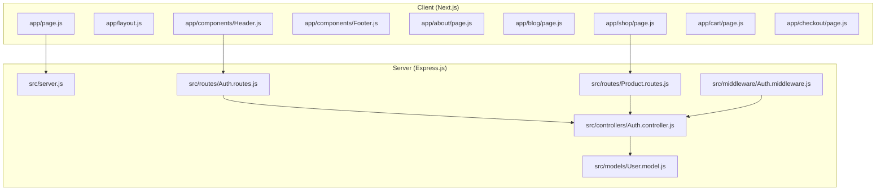
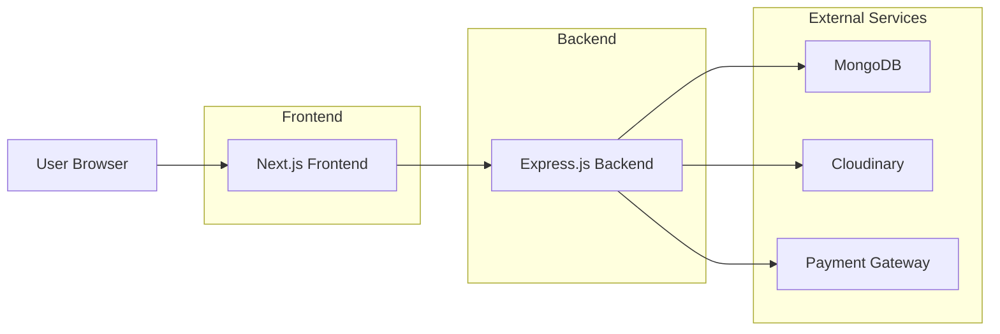
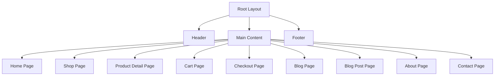
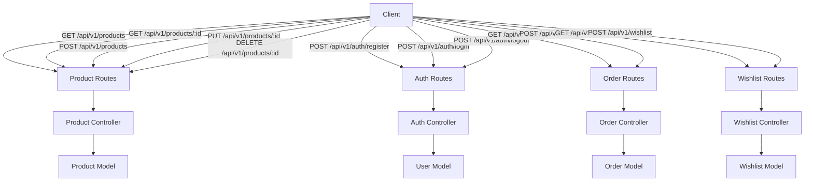
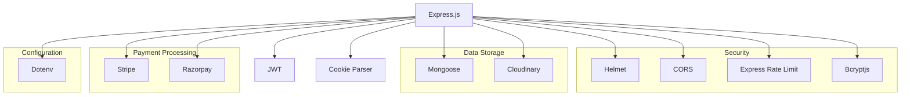

# System Overview

<cite>
**Referenced Files in This Document**   
- [client/app/page.js](file://client/app/page.js)
- [client/app/layout.js](file://client/app/layout.js)
- [client/app/components/Header.js](file://client/app/components/Header.js)
- [client/app/components/Footer.js](file://client/app/components/Footer.js)
- [server/src/server.js](file://server/src/server.js)
- [server/src/routes/Auth.routes.js](file://server/src/routes/Auth.routes.js)
- [server/src/routes/Product.routes.js](file://server/src/routes/Product.routes.js)
- [server/src/middleware/Auth.middleware.js](file://server/src/middleware/Auth.middleware.js)
- [server/package.json](file://server/package.json)
- [client/next.config.mjs](file://client/next.config.mjs)
- [README.md](file://README.md)
</cite>

## Table of Contents
1. [Introduction](#introduction)
2. [Project Structure](#project-structure)
3. [Core Components](#core-components)
4. [Architecture Overview](#architecture-overview)
5. [Detailed Component Analysis](#detailed-component-analysis)
6. [Dependency Analysis](#dependency-analysis)
7. [Performance Considerations](#performance-considerations)
8. [Troubleshooting Guide](#troubleshooting-guide)
9. [Conclusion](#conclusion)

## Introduction
The VnV24 e-commerce platform is a full-stack marketplace specializing in fragrances and essential oils. It offers a comprehensive suite of features including user authentication, product catalog management, shopping cart, wishlist, order processing, and a content blog. The system is architecturally divided into a Next.js frontend and an Express.js backend, enabling a modern, scalable, and maintainable solution. This document provides a high-level overview of the system's structure, technology stack, user flows, and security model.

**Section sources**
- [README.md](file://README.md)

## Project Structure

The VnV24 project follows a clear separation of concerns with two main directories: `client` for the frontend and `server` for the backend. The frontend is built using Next.js with the App Router, while the backend is a Node.js application using Express.js.

**Diagram sources**
- [client/app/page.js](file://client/app/page.js)
- [client/app/layout.js](file://client/app/layout.js)
- [client/app/components/Header.js](file://client/app/components/Header.js)
- [server/src/server.js](file://server/src/server.js)
- [server/src/routes/Auth.routes.js](file://server/src/routes/Auth.routes.js)
- [server/src/routes/Product.routes.js](file://server/src/routes/Product.routes.js)

**Section sources**
- [client/app/page.js](file://client/app/page.js)
- [server/src/server.js](file://server/src/server.js)

## Core Components

The VnV24 platform is composed of several core components that enable its functionality. The frontend leverages Next.js App Router for server-side rendering and routing, while the backend provides RESTful APIs for data management. Key features include user authentication, product catalog, shopping cart, wishlist, order management, and blog content delivery. The system uses role-based access control to differentiate between customer and admin experiences.

**Section sources**
- [client/app/page.js](file://client/app/page.js)
- [server/src/server.js](file://server/src/server.js)
- [server/src/routes/Auth.routes.js](file://server/src/routes/Auth.routes.js)
- [server/src/routes/Product.routes.js](file://server/src/routes/Product.routes.js)

## Architecture Overview

The VnV24 platform follows a client-server architecture with a clear separation between the frontend and backend. The Next.js frontend communicates with the Express.js backend via RESTful APIs. The backend is responsible for business logic, data persistence, and authentication, while the frontend handles user interface and user experience.

**Diagram sources**
- [server/src/server.js](file://server/src/server.js)
- [client/app/page.js](file://client/app/page.js)

## Detailed Component Analysis

### Frontend Architecture
The frontend of VnV24 is built using Next.js with the App Router structure. This enables server-side rendering, improved SEO, and efficient data fetching. The application uses React components for UI construction, with a clear hierarchy of layout, page, and shared components.

#### App Router Structure

**Diagram sources**
- [client/app/layout.js](file://client/app/layout.js)
- [client/app/page.js](file://client/app/page.js)
- [client/app/components/Header.js](file://client/app/components/Header.js)
- [client/app/components/Footer.js](file://client/app/components/Footer.js)

### Backend Architecture
The backend of VnV24 is built using Express.js and follows a RESTful API design pattern. It uses MongoDB as the primary data store, with Mongoose as the ODM. The system implements middleware for authentication and authorization, ensuring secure access to resources.

#### RESTful API Design

**Diagram sources**
- [server/src/server.js](file://server/src/server.js)
- [server/src/routes/Product.routes.js](file://server/src/routes/Product.routes.js)
- [server/src/routes/Auth.routes.js](file://server/src/routes/Auth.routes.js)
- [server/src/controllers/Product.controller.js](file://server/src/controllers/Product.controller.js)
- [server/src/controllers/Auth.controller.js](file://server/src/controllers/Auth.controller.js)
- [server/src/models/Product.model.js](file://server/src/models/Product.model.js)
- [server/src/models/User.model.js](file://server/src/models/User.model.js)

**Section sources**
- [server/src/server.js](file://server/src/server.js)
- [server/src/routes/Product.routes.js](file://server/src/routes/Product.routes.js)
- [server/src/routes/Auth.routes.js](file://server/src/routes/Auth.routes.js)

## Dependency Analysis

The VnV24 platform relies on several key dependencies that enable its functionality and ensure production readiness. The backend uses Express.js for the web server, Mongoose for MongoDB object modeling, and JWT for authentication. Security is enhanced with packages like helmet, cors, and express-rate-limit.

**Diagram sources**
- [server/package.json](file://server/package.json)

**Section sources**
- [server/package.json](file://server/package.json)

## Performance Considerations

The VnV24 platform incorporates several performance and production readiness features. The backend uses compression middleware to reduce response sizes, and the frontend leverages Next.js's built-in optimization features like image optimization and code splitting. The use of environment variables and configuration files allows for easy deployment across different environments.

**Section sources**
- [server/src/server.js](file://server/src/server.js)
- [client/next.config.mjs](file://client/next.config.mjs)

## Troubleshooting Guide

Common issues in the VnV24 platform typically relate to authentication, API connectivity, or database configuration. Ensure that environment variables are properly set, particularly for JWT_SECRET, database connection strings, and payment gateway credentials. The use of middleware like morgan for logging can help diagnose request-related issues.

**Section sources**
- [server/src/server.js](file://server/src/server.js)
- [server/src/middleware/Auth.middleware.js](file://server/src/middleware/Auth.middleware.js)

## Conclusion

The VnV24 e-commerce platform is a well-structured, full-stack application that effectively combines modern frontend and backend technologies. The separation of concerns between the Next.js frontend and Express.js backend enables independent development and deployment. The use of RESTful APIs, JWT-based authentication, and role-based access control provides a secure and scalable foundation for a fragrance and essential oils marketplace. The platform's architecture supports key e-commerce functionalities while maintaining developer experience and production readiness.