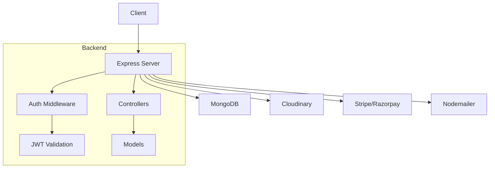

# Technology Stack

<cite>
**Referenced Files in This Document**   
- [package.json](file://client/package.json)
- [package.json](file://server/package.json)
- [next.config.mjs](file://client/next.config.mjs)
- [tailwind.config.js](file://client/tailwind.config.js)
- [postcss.config.mjs](file://client/postcss.config.mjs)
- [eslint.config.mjs](file://client/eslint.config.mjs)
- [db.js](file://server/src/config/db.js)
- [server.js](file://server/src/server.js)
- [token.js](file://server/src/utils/token.js)
</cite>

## Table of Contents
1. [Frontend Architecture](#frontend-architecture)
2. [Backend Architecture](#backend-architecture)
3. [Styling and Design System](#styling-and-design-system)
4. [Third-Party Integrations](#third-party-integrations)
5. [Development Tools and Configuration](#development-tools-and-configuration)
6. [Technology Rationale and Version Compatibility](#technology-rationale-and-version-compatibility)

## Frontend Architecture

The VnV24 frontend is built on Next.js 15 with React 19, leveraging the modern App Router architecture that enables server-centric rendering and simplified routing. This architecture organizes pages and layouts through file-based routing within the `app` directory, supporting both static and dynamic routes such as `[slug]` for blog posts and `[productId]` for product details.

React Server Components (RSC) are utilized by default in the App Router, allowing components to render on the server and significantly reducing client-side JavaScript bundle size. This improves performance by minimizing hydration overhead and enabling faster Time to Interactive (TTI). The framework seamlessly integrates Server Components with Client Components, where interactivity is required, using the `"use client"` directive.

The application structure includes shared components in the `components` directory, organized by feature (Home, Shop, shared), and global layout definitions in `layout.js`. Each route corresponds to a folder with a `page.js` file, enabling intuitive navigation and code splitting.

**Section sources**
- [package.json](file://client/package.json#L10-L15)
- [next.config.mjs](file://client/next.config.mjs#L1-L5)

## Backend Architecture

The backend is implemented using Express.js, a minimalist Node.js web framework that provides robust routing and middleware capabilities. The server is initialized in `server.js`, where essential middleware such as `express.json()`, `cookie-parser`, and CORS are configured to handle JSON payloads, authentication cookies, and cross-origin requests from the frontend.

MongoDB serves as the primary database, connected via Mongoose ODM (Object Data Modeling) which provides schema-based modeling for application data. The `connectDB` function in `db.js` establishes the connection using environment variables and handles error logging for failed connections.

Authentication is implemented using JWT (JSON Web Tokens), with access and refresh tokens generated through the `token.js` utility. Access tokens have a short lifespan (15 minutes), while refresh tokens last for 7 days, enhancing security through token rotation. Protected routes use middleware such as `Auth.middleware.js` to validate incoming requests.

The backend follows a modular structure with separate directories for models, controllers, and routes:
- **Models**: Define MongoDB schemas for User, Product, Order, and Wishlist
- **Controllers**: Contain business logic for handling HTTP requests
- **Routes**: Map HTTP methods to controller functions

API endpoints are versioned under `/api/v1` and include authentication (`/auth`), user management (`/users`), orders (`/orders`), and wishlist (`/wishlist`) routes.

**Diagram sources**
- [server.js](file://server/src/server.js#L1-L34)
- [db.js](file://server/src/config/db.js#L1-L18)
- [token.js](file://server/src/utils/token.js#L1-L10)

**Section sources**
- [server.js](file://server/src/server.js#L1-L34)
- [db.js](file://server/src/config/db.js#L1-L18)
- [token.js](file://server/src/utils/token.js#L1-L10)

## Styling and Design System

The styling solution is built on Tailwind CSS, a utility-first CSS framework that enables rapid UI development through atomic classes. The design system is configured in `tailwind.config.js`, where custom colors, fonts, and plugins are defined.

The color palette emphasizes natural, earthy tones aligned with the brand identity:
- **Primary**: Off-white/cream (`#F8F6F2`)
- **Secondary**: Deep forest green (`#2E3E2F`) and warm taupe (`#8B7D6B`)
- **Accents**: Gold (`#D6A953`) and copper (`#B67C55`)
- **Text and borders**: High-contrast dark grays and light text for readability

Typography uses Google Fonts via CSS variables, with Inter for sans-serif and Playfair Display for serif text, configured in the Tailwind theme extension.

PostCSS is integrated through `postcss.config.mjs` to process Tailwind directives and enable advanced CSS features. The `@tailwindcss/typography` plugin enhances content rendering for blog posts and rich text, ensuring consistent typographic hierarchy.

All styles are scoped to the application through the `content` array in the Tailwind configuration, which scans the `app`, `components`, and `pages` directories for class usage during JIT compilation.

**Section sources**
- [tailwind.config.js](file://client/tailwind.config.js#L1-L39)
- [postcss.config.mjs](file://client/postcss.config.mjs#L1-L6)
- [globals.css](file://client/globals.css)

## Third-Party Integrations

VnV24 integrates several third-party services to enhance functionality:

### Payment Processing
- **Stripe**: Used for credit card payments, supporting global transactions with strong fraud protection
- **Razorpay**: Provides payment processing for Indian customers, supporting UPI, net banking, and local cards

Both services are integrated server-side to securely handle payment intents and webhooks, preventing exposure of sensitive keys to the client.

### Media Storage
- **Cloudinary**: Manages image uploads, transformations, and CDN delivery. Product images are stored and served through Cloudinary with optimized formats and responsive breakpoints.

### Email Services
- **Nodemailer**: Handles transactional emails such as order confirmations, password resets, and customer notifications. Configured with SMTP transport for reliable delivery.

These integrations are abstracted within backend controllers and protected by environment variables to ensure credential security.

**Section sources**
- [package.json](file://server/package.json#L15-L20)
- [Auth.controller.js](file://server/src/controllers/Auth.controller.js)
- [Order.controller.js](file://server/src/controllers/Order.controller.js)

## Development Tools and Configuration

The development environment is optimized for performance and code quality:

### Build Tool
- **Turbopack**: Used as the Next.js compiler in development (`--turbopack` flag in dev script), providing incremental compilation and faster hot reloading compared to Webpack.

### Linting and Formatting
- **ESLint**: Configured via `eslint.config.mjs` using `@eslint/eslintrc` and extending `next/core-web-vitals` for best practices in performance, accessibility, and SEO.
- Ignores build directories (`.next`, `out`) and generated files to focus on application code.

### Configuration Files
- **next.config.mjs**: Minimal configuration, relying on Next.js defaults while enabling Turbopack
- **tailwind.config.js**: Extends default theme with brand colors and typography
- **postcss.config.mjs**: Enables Tailwind processing in the PostCSS pipeline
- **jsconfig.json**: Provides IntelliSense and path resolution in the IDE

These tools ensure consistent code quality, fast development feedback, and optimal production builds.

**Section sources**
- [next.config.mjs](file://client/next.config.mjs#L1-L5)
- [tailwind.config.js](file://client/tailwind.config.js#L1-L39)
- [postcss.config.mjs](file://client/postcss.config.mjs#L1-L6)
- [eslint.config.mjs](file://client/eslint.config.mjs#L1-L26)
- [package.json](file://client/package.json#L6-L9)

## Technology Rationale and Version Compatibility

The technology choices reflect a balance between innovation, stability, and ecosystem maturity:

- **Next.js 15 with React 19**: Leverages the latest React features (e.g., Actions, server components) while maintaining backward compatibility. React 19 introduces improvements in server rendering and resource management.
- **Express.js**: Chosen for its simplicity, middleware ecosystem, and widespread adoption in Node.js applications.
- **MongoDB with Mongoose**: Provides flexible schema design for evolving product catalogs and user data, with Mongoose offering type safety and validation.
- **JWT Authentication**: Stateless authentication suitable for distributed systems, with refresh token rotation for enhanced security.
- **Tailwind CSS**: Enables rapid UI iteration with utility classes while maintaining design consistency through the configured theme.
- **Framer Motion**: Provides smooth animations and gestures for enhanced user experience, particularly in product interactions and page transitions.
- **Lucide React**: Offers a consistent, lightweight icon set that integrates seamlessly with React components.

All dependencies are kept up-to-date as shown in the `package.json` files, with major versions aligned to ensure compatibility. The use of `^` in version numbers allows for safe minor and patch updates, while lock files (`package-lock.json`) guarantee reproducible builds.

**Section sources**
- [package.json](file://client/package.json)
- [package.json](file://server/package.json)