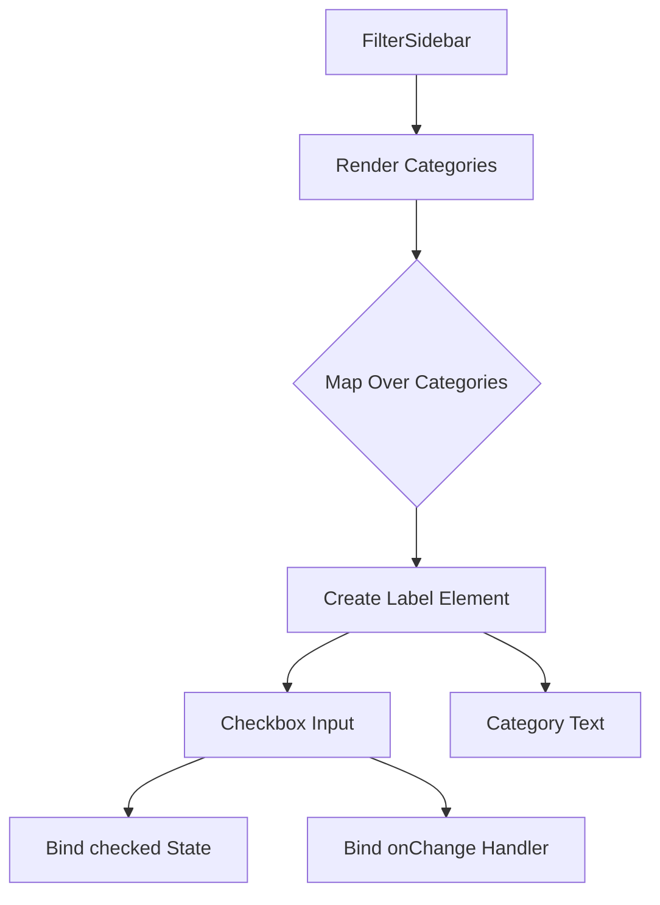
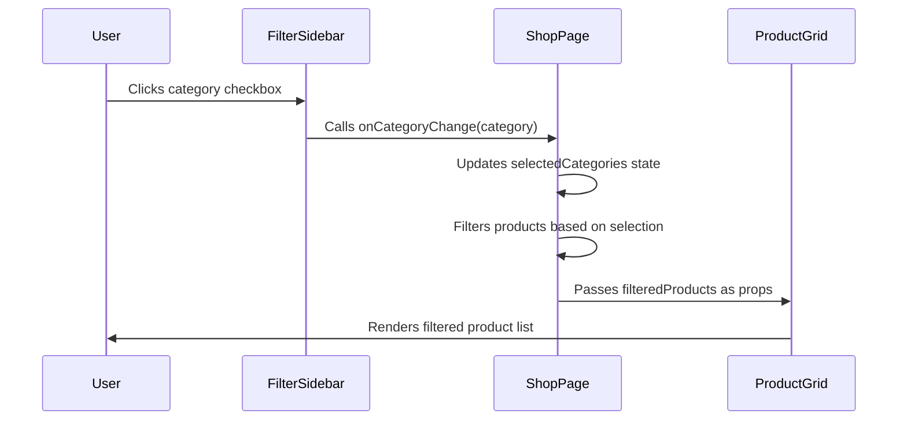
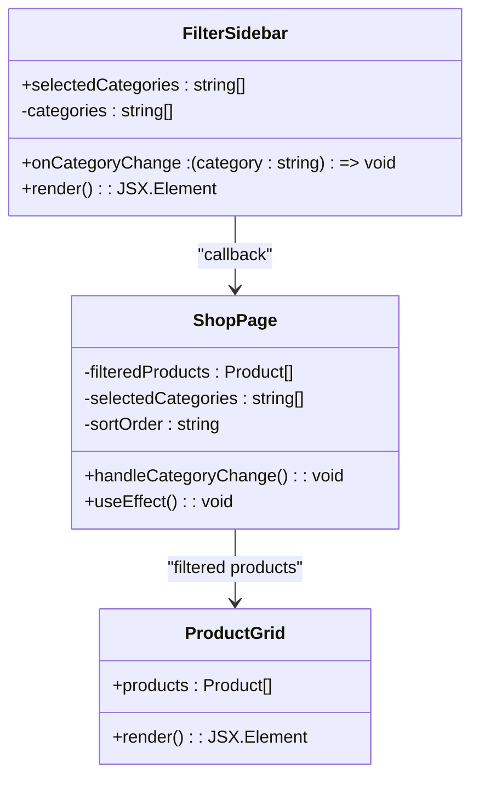

# FilterSidebar Component

<cite>
**Referenced Files in This Document**   
- [FilterSidebar.js](file://client/app/components/Shop/FilterSidebar.js)
- [shop/page.js](file://client/app/shop/page.js)
- [ProductGrid.js](file://client/app/components/Shop/ProductGrid.js)
</cite>

## Table of Contents
1. [Introduction](#introduction)
2. [Core Components](#core-components)
3. [State Management and Synchronization](#state-management-and-synchronization)
4. [Filter Types and UI Representations](#filter-types-and-ui-representations)
5. [Accessibility Features](#accessibility-features)
6. [Performance Considerations](#performance-considerations)
7. [Conclusion](#conclusion)

## Introduction
The FilterSidebar component provides a filtering interface for the shop page, allowing users to refine product listings by category. It is implemented as a responsive sidebar on desktop and adapts to a mobile drawer layout on smaller screens. The component integrates with Framer Motion for animated transitions and supports real-time filtering through React state synchronization with the ProductGrid component.

**Section sources**
- [FilterSidebar.js](file://client/app/components/Shop/FilterSidebar.js#L1-L20)

## Core Components

The FilterSidebar component renders a list of product categories as checkboxes, enabling users to filter products by category. It receives two props: `selectedCategories`, an array of currently selected category strings, and `onCategoryChange`, a callback function invoked when a category selection changes.

The component is structured as an `<aside>` element with Tailwind CSS classes for responsive layout, styling, and visual hierarchy. Each category is rendered as a clickable label containing a checkbox input and a text span. The checkbox state is controlled via the `checked` prop, which checks if the category exists in the `selectedCategories` array.

**Diagram sources**
- [FilterSidebar.js](file://client/app/components/Shop/FilterSidebar.js#L1-L20)

**Section sources**
- [FilterSidebar.js](file://client/app/components/Shop/FilterSidebar.js#L1-L20)

## State Management and Synchronization

The FilterSidebar component does not manage its own state but relies on state passed from the parent ShopPage component. The `selectedCategories` state is maintained in ShopPage using React's `useState` hook and updated via the `handleCategoryChange` function.

When a user toggles a category checkbox, the `onCategoryChange` callback is triggered, which updates the `selectedCategories` state. This change triggers a re-render of the `useEffect` hook in ShopPage, which filters the product list based on the selected categories and updates the `filteredProducts` state. The filtered products are then passed to the ProductGrid component for display.

**Diagram sources**
- [shop/page.js](file://client/app/shop/page.js#L18-L71)
- [FilterSidebar.js](file://client/app/components/Shop/FilterSidebar.js#L1-L20)

**Section sources**
- [shop/page.js](file://client/app/shop/page.js#L18-L71)

## Filter Types and UI Representations

Currently, the FilterSidebar implements category-based filtering with checkbox inputs. The available categories are hardcoded as: Perfumes, Oils, Candles, and Incense. Each category is rendered as a labeled checkbox with consistent styling for visual clarity and user interaction.

While the current implementation only supports category filtering, the architecture allows for extension to other filter types such as price range, scent profile, and brand. These could be implemented as additional filter sections with appropriate input types (e.g., range sliders for price, multi-select for scent profiles, checkboxes for brands).

**Diagram sources**
- [FilterSidebar.js](file://client/app/components/Shop/FilterSidebar.js#L1-L20)
- [shop/page.js](file://client/app/shop/page.js#L18-L71)
- [ProductGrid.js](file://client/app/components/Shop/ProductGrid.js#L2-L15)

**Section sources**
- [FilterSidebar.js](file://client/app/components/Shop/FilterSidebar.js#L1-L20)

## Accessibility Features

The FilterSidebar component implements several accessibility features to ensure usability for all users. Each checkbox is wrapped in a `<label>` element, which provides an accessible click target and improves touch interaction on mobile devices. The `key` prop on the mapped categories ensures stable DOM elements for screen readers.

The component uses semantic HTML with appropriate ARIA attributes implicitly provided by standard form controls. The checkbox inputs have visible focus states (indicated by the `focus:ring-gold` Tailwind class), enabling keyboard navigation. The text elements use sufficient color contrast against the background to meet accessibility standards.

Although the current implementation does not include explicit ARIA-live regions for announcing filter changes, this could be enhanced by adding dynamic screen reader announcements when the product count changes due to filtering.

**Section sources**
- [FilterSidebar.js](file://client/app/components/Shop/FilterSidebar.js#L1-L20)

## Performance Considerations

The filtering implementation uses React's `useEffect` hook to recompute the filtered product list whenever `selectedCategories` or `sortOrder` changes. This approach ensures that filtering occurs only when necessary, minimizing unnecessary re-renders.

The current implementation does not include debounce strategies for input fields, as the only interactive elements are checkboxes that trigger discrete state changes. However, if additional input types like search fields or range sliders were added, implementing debounce or throttle functions would be recommended to prevent excessive state updates during rapid user interactions.

The product filtering is performed in-memory on the client side, which is efficient for small to medium datasets. For larger product catalogs, consider implementing server-side filtering with API calls to avoid loading all products into memory at once.

**Section sources**
- [shop/page.js](file://client/app/shop/page.js#L18-L71)

## Conclusion
The FilterSidebar component provides a functional and accessible interface for filtering products in the shop. It demonstrates effective state management through parent-child component communication and supports potential enhancements for additional filter types, animated transitions, and performance optimizations. The current implementation focuses on category filtering but is architected to support expansion to more complex filtering capabilities.