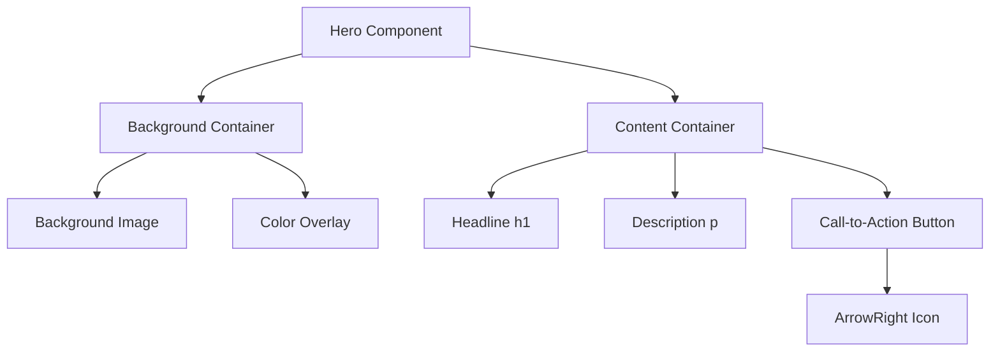
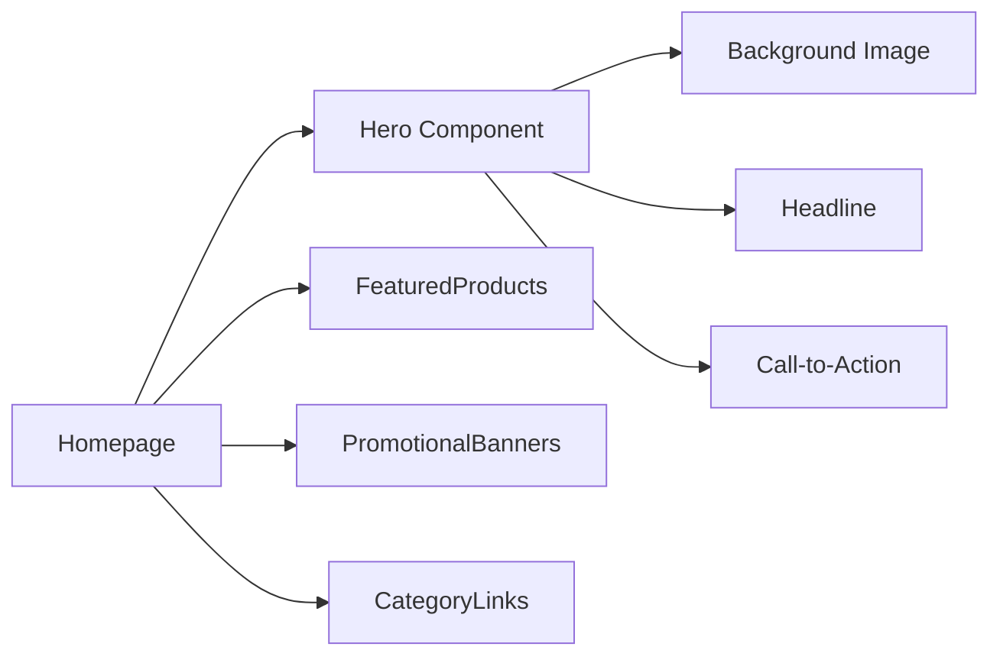

# Hero Component

<cite>
**Referenced Files in This Document**   
- [Hero.js](file://client/app/components/Home/Hero.js)
- [tailwind.config.js](file://client/tailwind.config.js)
- [page.js](file://client/app/page.js)
</cite>

## Table of Contents
1. [Introduction](#introduction)
2. [Component Structure](#component-structure)
3. [Responsive Layout with Tailwind CSS](#responsive-layout-with-tailwind-css)
4. [Visual Design and Styling](#visual-design-and-styling)
5. [Accessibility Implementation](#accessibility-implementation)
6. [Performance Considerations](#performance-considerations)
7. [Integration and Usage](#integration-and-usage)

## Introduction
The Hero component serves as the primary landing banner on the VnV24 homepage, designed to capture user attention with a visually striking presentation of the brand's essence. It features a full-height banner with a background image overlay, centered text content, and a call-to-action button that navigates users to the shop. The component is built using React with Next.js and styled using Tailwind CSS, following the brand's color scheme and typography guidelines.

**Section sources**
- [Hero.js](file://client/app/components/Home/Hero.js#L4-L31)

## Component Structure
The Hero component is structured as a relative-positioned section with a fixed height of 600px, ensuring consistent visual impact across different devices. It employs a layered approach with three main elements:
1. A background div with absolute positioning that displays the hero image using Tailwind's bg-cover and bg-center classes
2. An overlay div that applies a forest green color with 60% opacity to enhance text readability
3. A content container with relative positioning that holds the headline, description, and call-to-action button

The component uses semantic HTML elements including a section container, h1 heading, paragraph text, and a Next.js Link component for navigation. The layout centers all content both vertically and horizontally using Flexbox utilities.

**Diagram sources**
- [Hero.js](file://client/app/components/Home/Hero.js#L4-L31)

**Section sources**
- [Hero.js](file://client/app/components/Home/Hero.js#L4-L31)

## Responsive Layout with Tailwind CSS
The Hero component implements responsive behavior through Tailwind CSS utility classes that adapt the layout across different screen sizes. The component maintains its full-height design on all devices while adjusting typography and spacing appropriately.

Key responsive features include:
- Text scaling: The headline uses `text-5xl` on mobile and `md:text-7xl` on medium screens and up, ensuring optimal readability
- Font sizing: The description text uses `text-lg` on mobile and `md:text-xl` on larger screens
- Container padding: The content container uses `px-4` for mobile spacing and automatically adjusts on larger screens
- Flexible height: The fixed `h-[600px]` ensures consistent visual impact while allowing for scrolling on all devices

The responsive design follows a mobile-first approach, with breakpoints defined in the Tailwind configuration to ensure consistency across the application.

**Section sources**
- [Hero.js](file://client/app/components/Home/Hero.js#L4-L31)
- [tailwind.config.js](file://client/tailwind.config.js#L1-L38)

## Visual Design and Styling
The Hero component implements the brand's visual identity through carefully selected colors, typography, and layout. The design follows a layered approach with a background image overlaid with a semi-transparent color to ensure text readability.

The component uses the following brand-specific styling:
- Background: A high-quality lifestyle image from Unsplash with a natural, organic feel that aligns with the fragrance theme
- Overlay: A `bg-forest-green` color with 60% opacity to create visual depth and improve text contrast
- Typography: Serif font (`font-serif`) for headings to convey elegance and sophistication, with bold weight for emphasis
- Color scheme: Gold (`text-gold`) for text elements to convey luxury and warmth, contrasted against light text color (`text-text-light`) for optimal readability
- Button styling: A gold background with dark text (`text-text-dark`) and hover effects that transition to amber

The visual design creates a premium feel that aligns with the brand's positioning in the luxury fragrance market.

**Section sources**
- [Hero.js](file://client/app/components/Home/Hero.js#L4-L31)
- [tailwind.config.js](file://client/tailwind.config.js#L1-L38)

## Accessibility Implementation
The Hero component incorporates several accessibility features to ensure usability for all users:

- Semantic HTML: Uses appropriate HTML5 elements including section, h1, and p to provide proper document structure
- Color contrast: The text color (`text-gold`) on the overlay background maintains sufficient contrast ratio for readability
- Keyboard navigation: The call-to-action button is fully accessible via keyboard navigation through the Next.js Link component
- Focus states: The button includes visual feedback on focus through the hover:bg-amber-600 class
- ARIA considerations: While not explicitly using ARIA roles, the semantic structure provides adequate context for screen readers
- Text scaling: Responsive font sizes ensure readability across different device sizes and user preferences

The component could be further enhanced with explicit ARIA labels for the background image and additional focus management, but currently provides a solid foundation for accessibility.

**Section sources**
- [Hero.js](file://client/app/components/Home/Hero.js#L4-L31)

## Performance Considerations
The Hero component addresses performance through several implementation choices:

- Image optimization: The background image is loaded from a CDN (Unsplash) with appropriate sizing parameters (w=1600) to balance quality and load time
- Efficient rendering: The component uses React's functional component pattern with minimal state, ensuring fast rendering
- CSS optimization: Tailwind's utility-first approach generates highly optimized CSS without bloat
- Icon implementation: Uses the lightweight Lucide React library for the arrow icon, which supports tree-shaking to minimize bundle size
- Layout stability: The fixed height prevents layout shifts during loading

Potential improvements could include implementing lazy loading for the background image, using next/image for automatic optimization, or adding a placeholder while the image loads.

**Section sources**
- [Hero.js](file://client/app/components/Home/Hero.js#L4-L31)

## Integration and Usage
The Hero component is integrated into the homepage as the primary content section. It is imported and used in the main page component, where it appears as the first element in the content hierarchy.

The component is designed to be self-contained with no external configuration requirements, making it easy to implement and maintain. It can be easily modified to support dynamic content by replacing the hardcoded text and link values with props.

The component follows the application's overall architecture pattern, where UI components are organized in the components directory with clear naming and file structure. It works in conjunction with other homepage components like FeaturedProducts and PromotionalBanners to create a cohesive user experience.

**Diagram sources**
- [page.js](file://client/app/page.js#L6-L15)
- [Hero.js](file://client/app/components/Home/Hero.js#L4-L31)

**Section sources**
- [page.js](file://client/app/page.js#L6-L15)
- [Hero.js](file://client/app/components/Home/Hero.js#L4-L31)