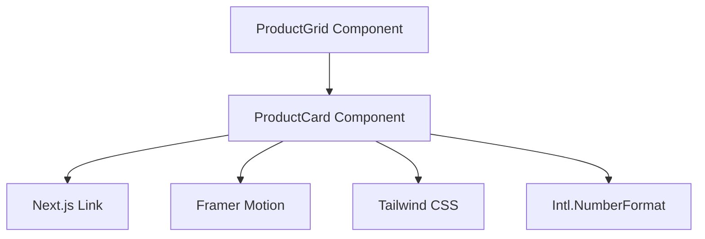
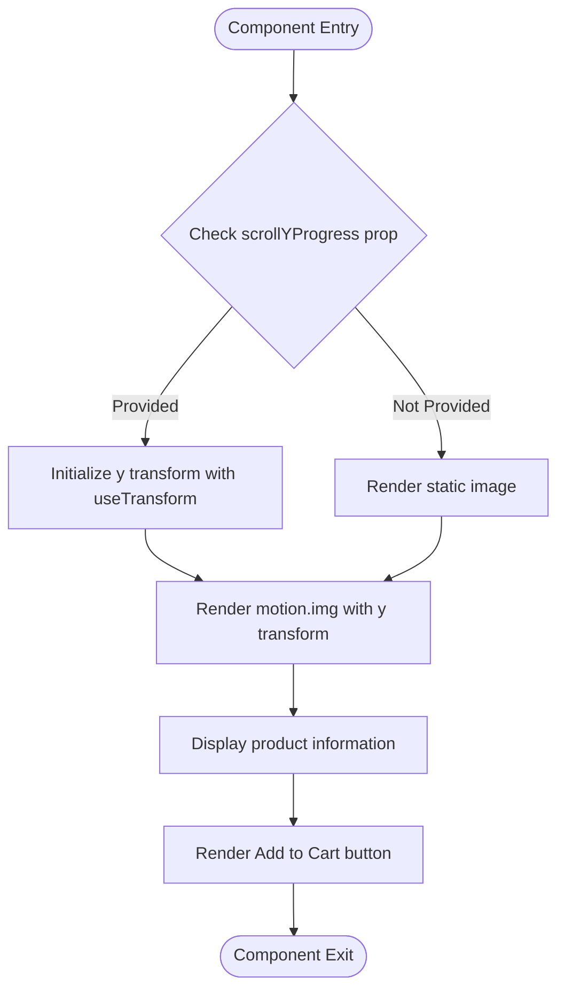
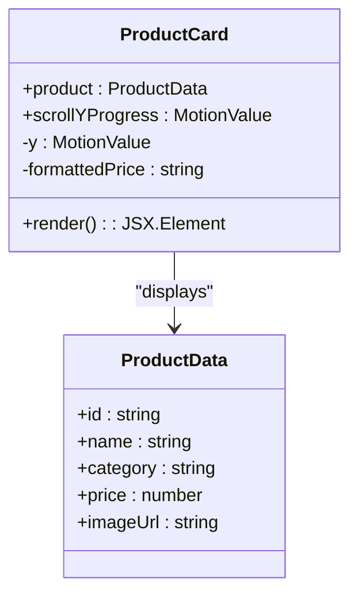
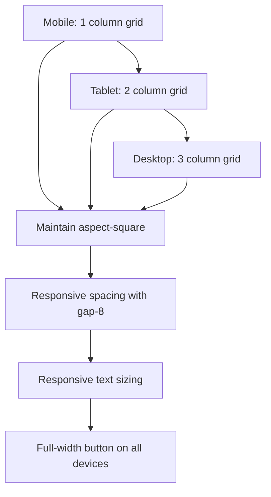
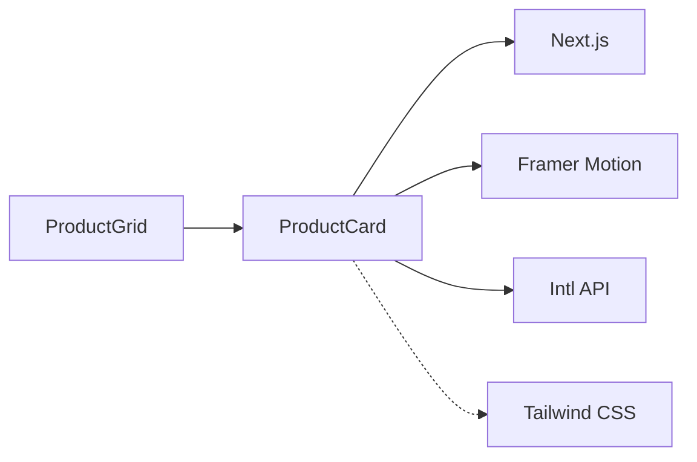

# ProductCard Component

<cite>
**Referenced Files in This Document**   
- [ProductCard.js](file://client/app/components/shared/ProductCard.js)
- [ProductGrid.js](file://client/app/components/Shop/ProductGrid.js)
- [tailwind.config.js](file://client/tailwind.config.js)
- [STYLE_GUIDE_IMPLEMENTATION_SUMMARY.md](file://STYLE_GUIDE_IMPLEMENTATION_SUMMARY.md)
</cite>

## Table of Contents
1. [Introduction](#introduction)
2. [Core Components](#core-components)
3. [Architecture Overview](#architecture-overview)
4. [Detailed Component Analysis](#detailed-component-analysis)
5. [Dependency Analysis](#dependency-analysis)
6. [Performance Considerations](#performance-considerations)
7. [Troubleshooting Guide](#troubleshooting-guide)
8. [Conclusion](#conclusion)

## Introduction
The ProductCard component is a fundamental UI element in the VnV24 e-commerce platform, designed to display product information in a visually appealing and interactive manner. This component is used throughout the platform in product listings, category pages, and search results to provide a consistent user experience. The component leverages modern web technologies including Framer Motion for animations and Tailwind CSS for responsive styling.

**Section sources**
- [ProductCard.js](file://client/app/components/shared/ProductCard.js#L1-L40)

## Core Components
The ProductCard component is a React functional component that accepts product data and optional scroll progress as props. It renders a product card with an image, category, name, price, and an "Add to Cart" button. The component uses Next.js Link for navigation to the product detail page and implements hover effects through Tailwind CSS classes.

The component's core functionality includes price formatting using the Intl.NumberFormat API for Indian Rupees (INR) with no fractional digits. It conditionally renders a Framer Motion animated image when scrollYProgress is provided, creating a parallax effect as the user scrolls. The component is designed to be reusable and is integrated into product grids through the ProductGrid component.

**Section sources**
- [ProductCard.js](file://client/app/components/shared/ProductCard.js#L5-L40)

## Architecture Overview
The ProductCard component follows a component-based architecture pattern, being a self-contained UI element that can be composed into larger structures. It is primarily used within the ProductGrid component, which manages the layout of multiple product cards in a responsive grid.

**Diagram sources **
- [ProductCard.js](file://client/app/components/shared/ProductCard.js#L5-L40)
- [ProductGrid.js](file://client/app/components/Shop/ProductGrid.js#L1-L15)

## Detailed Component Analysis

### ProductCard Implementation
The ProductCard component is implemented as a functional React component that receives product data and optional scroll progress as props. It uses destructuring to extract the product object and scrollYProgress from props, with scrollYProgress being optional for the parallax animation effect.

The component implements price formatting using the Intl.NumberFormat API configured for Indian Rupees (INR) with no minimum fractional digits, ensuring consistent price display across the platform. The formatted price is displayed using appropriate font styling and color for emphasis.

**Diagram sources **
- [ProductCard.js](file://client/app/components/shared/ProductCard.js#L5-L40)

**Section sources**
- [ProductCard.js](file://client/app/components/shared/ProductCard.js#L5-L40)

### Image Handling and Animation
The ProductCard component implements sophisticated image handling with conditional rendering based on the presence of scrollYProgress. When scrollYProgress is provided, the component uses Framer Motion's motion.img component with a y-transform animation that creates a parallax effect as the user scrolls.

The animation is configured with a transformation from -20% to 20% of the y-position as the scroll progresses from 0 to 1, creating a subtle floating effect. The image maintains responsive behavior with aspect-square to ensure consistent dimensions and uses object-cover to properly display product images regardless of their original aspect ratio.

The component also implements hover effects through Tailwind CSS classes, including a scale transformation on hover (group-hover:scale-105) and enhanced shadow effects (hover:shadow-lg) to provide visual feedback when users interact with the card.

**Diagram sources **
- [ProductCard.js](file://client/app/components/shared/ProductCard.js#L5-L40)

### Responsive Design Behavior
The ProductCard component is designed to be responsive across mobile, tablet, and desktop breakpoints using Tailwind CSS utility classes. The component itself maintains a consistent aspect ratio with aspect-square, ensuring that product images display properly on all screen sizes.

When integrated into the ProductGrid component, the responsive behavior is further enhanced through grid layout classes that adapt to different screen sizes: single column on mobile (grid-cols-1), two columns on small screens (sm:grid-cols-2), and three columns on extra-large screens (xl:grid-cols-3). This responsive grid system ensures optimal use of screen space across devices.

The text elements within the component also respond to screen size changes, with appropriate font sizes and spacing adjustments to maintain readability. The "Add to Cart" button expands to full width on all devices (w-full) to maximize touch target size on mobile devices.

**Diagram sources **
- [ProductGrid.js](file://client/app/components/Shop/ProductGrid.js#L1-L15)
- [tailwind.config.js](file://client/tailwind.config.js)

### Accessibility Features
The ProductCard component implements several accessibility features to ensure usability for all users. The component uses semantic HTML elements appropriately, with the product name displayed in a paragraph element and category in a heading element (h3) to provide proper document structure.

The component includes appropriate ARIA attributes through the use of standard HTML attributes: alt text for product images (alt={product.name}) provides context for screen readers, and the Link component ensures keyboard navigability. The color contrast between text and background meets accessibility standards, with specific text colors (text-text-secondary, text-forest-green, text-text-dark) defined in the theme.

Focus management is handled by the Next.js Link component, which provides visible focus states for keyboard navigation. The "Add to Cart" button has sufficient size and contrast for users with motor impairments or low vision.

**Section sources**
- [ProductCard.js](file://client/app/components/shared/ProductCard.js#L5-L40)
- [STYLE_GUIDE_IMPLEMENTATION_SUMMARY.md](file://STYLE_GUIDE_IMPLEMENTATION_SUMMARY.md#L33-L39)

### Customization Options
The ProductCard component offers limited customization options through its props interface. The primary customization comes from the product data structure, which can include various product attributes that may be displayed in extended versions of the component.

The component's styling is primarily controlled through Tailwind CSS classes, allowing for theme compatibility by modifying the theme configuration in tailwind.config.js. The color scheme uses semantic class names (bg-primary, text-forest-green, bg-gold) that can be redefined in the theme to match different brand identities.

While the current implementation does not expose direct styling props, the component can be extended to accept additional props for behavioral customization, such as different action buttons or display options. The component's design allows for easy extension to support features like wishlist toggles or quick view options.

**Section sources**
- [ProductCard.js](file://client/app/components/shared/ProductCard.js#L5-L40)
- [tailwind.config.js](file://client/tailwind.config.js)

## Dependency Analysis
The ProductCard component has several key dependencies that enable its functionality. It imports Link from Next.js for client-side navigation, motion and useTransform from Framer Motion for animations, and relies on the Intl API for price formatting.

The component is consumed by the ProductGrid component, which maps over product data and renders multiple ProductCard instances. This creates a parent-child relationship where ProductGrid manages the layout and ProductCard handles individual product presentation.

**Diagram sources **
- [ProductCard.js](file://client/app/components/shared/ProductCard.js#L1-L40)
- [ProductGrid.js](file://client/app/components/Shop/ProductGrid.js#L1-L15)

## Performance Considerations
The ProductCard component implements several performance optimizations to ensure efficient rendering in product grids. The component uses React's functional component pattern with minimal state, reducing re-render overhead.

Image optimization is achieved through the use of responsive image sizing with aspect-square and object-cover, ensuring that images are displayed efficiently without unnecessary scaling. The parallax animation is implemented using CSS transforms rather than layout-affecting properties, allowing the browser to optimize the animation using the GPU.

For rendering efficiency in product grids, the component should ideally be combined with React.memo or similar optimization techniques to prevent unnecessary re-renders when product data hasn't changed. While the current implementation doesn't include explicit memoization, the component's simplicity minimizes performance impact.

Lazy loading could be implemented by integrating with Next.js Image component or Intersection Observer API to defer loading of images that are not in the viewport, particularly important for product grids with many items.

**Section sources**
- [ProductCard.js](file://client/app/components/shared/ProductCard.js#L5-L40)

## Troubleshooting Guide
Common issues with the ProductCard component typically relate to missing product data or incorrect prop types. Ensure that the product object contains all required properties (id, name, category, price, imageUrl) to prevent rendering errors.

If the parallax animation is not working, verify that scrollYProgress is being passed correctly from the parent component and that Framer Motion is properly installed and imported. The animation will gracefully degrade to a static image if scrollYProgress is not provided.

For responsive design issues, check that the parent container (typically ProductGrid) is using the appropriate Tailwind CSS grid classes for the desired layout. Ensure that the tailwind.config.js file contains the correct theme configuration for colors and spacing.

Accessibility issues may arise if product names or categories contain special characters that aren't properly handled. Always ensure that product data is properly sanitized before being passed to the component.

**Section sources**
- [ProductCard.js](file://client/app/components/shared/ProductCard.js#L5-L40)
- [ProductGrid.js](file://client/app/components/Shop/ProductGrid.js#L1-L15)

## Conclusion
The ProductCard component is a well-designed, reusable UI element that effectively displays product information in the VnV24 e-commerce platform. Its implementation leverages modern web technologies to provide an engaging user experience with smooth animations and responsive design.

The component demonstrates good separation of concerns, with clear responsibilities for data display, navigation, and visual effects. Its integration with the ProductGrid component enables efficient rendering of product collections across the platform.

While the current implementation is functional and performant, opportunities for enhancement include adding explicit memoization for better rendering performance in large grids, implementing lazy loading for images, and expanding the component's API to support additional customization options and interactive features like wishlist functionality.