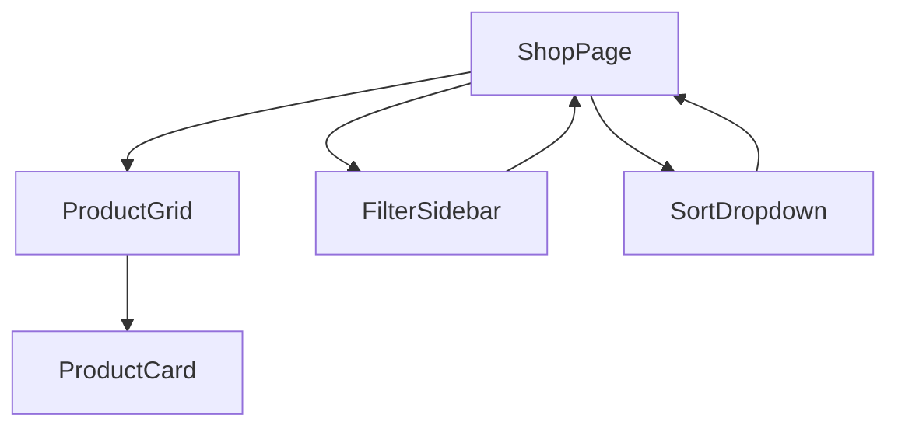
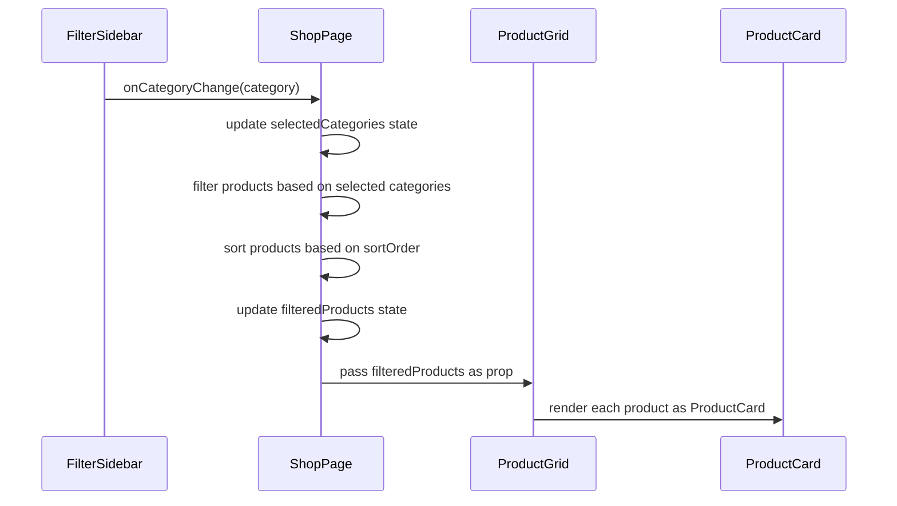
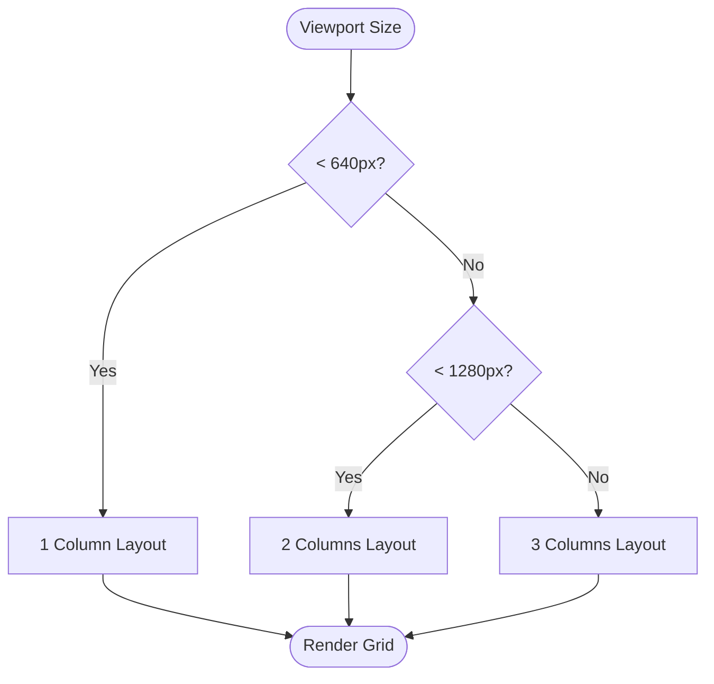
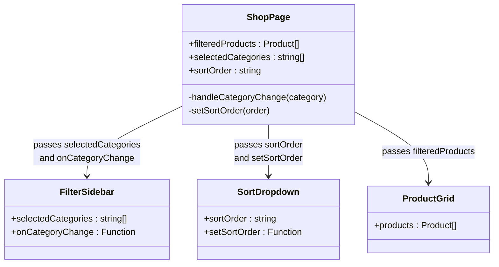
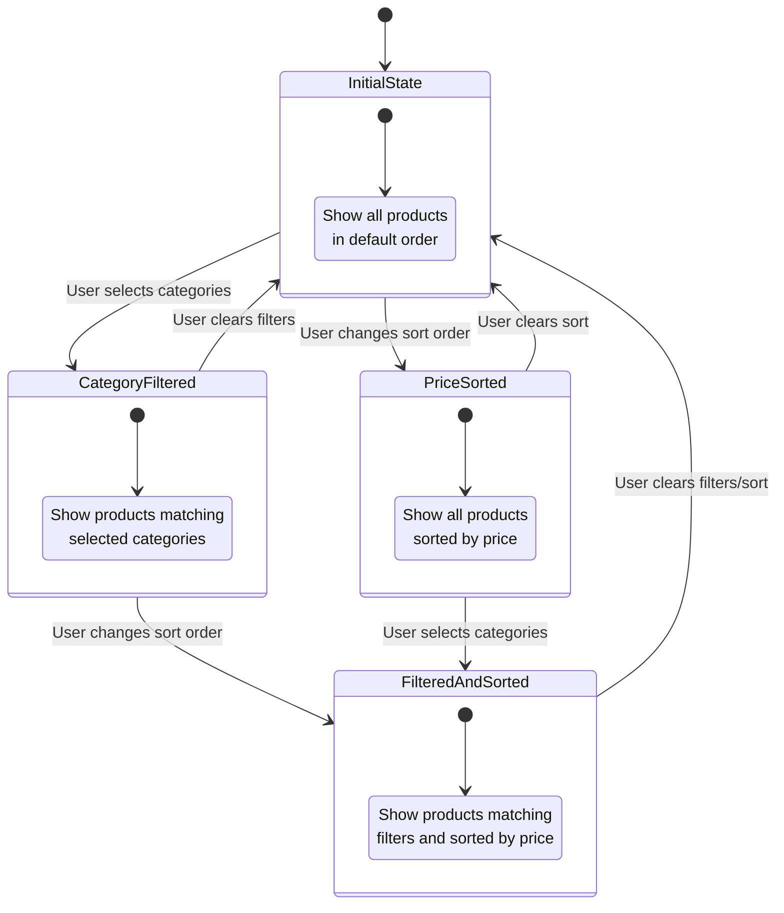

# ProductGrid Component

<cite>
**Referenced Files in This Document**   
- [ProductGrid.js](file://client/app/components/Shop/ProductGrid.js)
- [ProductCard.js](file://client/app/components/shared/ProductCard.js)
- [shop/page.js](file://client/app/shop/page.js)
- [FilterSidebar.js](file://client/app/components/Shop/FilterSidebar.js)
- [SortDropdown.js](file://client/app/components/Shop/SortDropdown.js)
</cite>

## Table of Contents
1. [Introduction](#introduction)
2. [Core Components](#core-components)
3. [Props and State Management](#props-and-state-management)
4. [Responsive Grid Layout Implementation](#responsive-grid-layout-implementation)
5. [Integration with FilterSidebar and SortDropdown](#integration-with-filtersidebar-and-sortdropdown)
6. [Performance Optimizations](#performance-optimizations)
7. [Accessibility Features](#accessibility-features)
8. [Usage Examples](#usage-examples)

## Introduction
The ProductGrid component is responsible for rendering product listings across the shop and category pages in the e-commerce application. It serves as a central display component that receives filtered and sorted product data and renders them in a responsive grid layout using Tailwind CSS. The component works in conjunction with FilterSidebar and SortDropdown components to provide a cohesive user experience for browsing products.

**Section sources**
- [ProductGrid.js](file://client/app/components/Shop/ProductGrid.js#L1-L15)

## Core Components

The ProductGrid component relies on several key components to deliver its functionality:

- **ProductGrid**: Main grid container that renders product cards
- **ProductCard**: Individual product representation with image, name, price, and add-to-cart functionality
- **FilterSidebar**: Sidebar component for category-based filtering
- **SortDropdown**: Dropdown menu for sorting products by price
- **ShopPage**: Parent component that orchestrates filtering, sorting, and rendering

The ProductGrid component imports and uses the ProductCard component to render each product in the grid. It receives a products array as a prop and maps over it to create ProductCard instances.

**Diagram sources**
- [ProductGrid.js](file://client/app/components/Shop/ProductGrid.js#L1-L15)
- [ProductCard.js](file://client/app/components/shared/ProductCard.js#L1-L40)
- [shop/page.js](file://client/app/shop/page.js#L1-L71)

**Section sources**
- [ProductGrid.js](file://client/app/components/Shop/ProductGrid.js#L1-L15)
- [ProductCard.js](file://client/app/components/shared/ProductCard.js#L1-L40)

## Props and State Management

The ProductGrid component accepts a single prop:
- **products**: Array of product objects to be displayed in the grid

Each product object contains properties such as id, name, category, price, and imageUrl. The component handles potential null values in the products array by returning null for any undefined product, ensuring robust rendering.

The parent ShopPage component manages the state for filtering and sorting:
- **filteredProducts**: The current list of products after applying filters and sorting
- **selectedCategories**: Array of currently selected categories for filtering
- **sortOrder**: Current sorting preference (default, price-asc, price-desc)

When categories are selected or deselected in the FilterSidebar, the handleCategoryChange function updates the selectedCategories state, triggering a re-filtering of products. Similarly, when the sort order changes in the SortDropdown, the setSortOrder function updates the sortOrder state, triggering a re-sorting of products.

**Diagram sources**
- [shop/page.js](file://client/app/shop/page.js#L18-L71)
- [FilterSidebar.js](file://client/app/components/Shop/FilterSidebar.js#L1-L20)
- [SortDropdown.js](file://client/app/components/Shop/SortDropdown.js#L1-L17)

**Section sources**
- [shop/page.js](file://client/app/shop/page.js#L18-L71)

## Responsive Grid Layout Implementation

The ProductGrid component implements a responsive grid layout using Tailwind CSS's responsive design utilities. The grid adapts to different screen sizes with varying column counts:

- **Mobile (default)**: 1 column
- **Small screens (sm)**: 2 columns
- **Extra large screens (xl)**: 3 columns

This is achieved through the Tailwind CSS classes: `grid grid-cols-1 sm:grid-cols-2 xl:grid-cols-3 gap-8`. The gap-8 class provides consistent spacing between grid items.

The responsive breakpoints are defined as:
- **sm**: 640px and above
- **xl**: 1280px and above

This responsive design ensures optimal viewing experience across different devices, from mobile phones to large desktop monitors. The grid layout automatically adjusts the number of columns based on the available screen width, providing an optimal number of products per row for each device type.

**Diagram sources**
- [ProductGrid.js](file://client/app/components/Shop/ProductGrid.js#L4-L4)

**Section sources**
- [ProductGrid.js](file://client/app/components/Shop/ProductGrid.js#L4-L4)

## Integration with FilterSidebar and SortDropdown

The ProductGrid component is integrated with FilterSidebar and SortDropdown components through coordinated state management in the parent ShopPage component. This creates a cohesive filtering and sorting experience for users.

The FilterSidebar component displays checkboxes for different product categories (Perfumes, Oils, Candles, Incense). When a user selects or deselects a category, the onCategoryChange callback is triggered, which updates the selectedCategories state in ShopPage. This state change triggers a re-filtering of the product list.

The SortDropdown component provides sorting options: Default Sorting, Price: Low to High, and Price: High to Low. When a user selects a sorting option, the setSortOrder function updates the sortOrder state in ShopPage, triggering a re-sorting of the product list.

Both state changes cause the filteredProducts array to be recalculated and passed to the ProductGrid component, resulting in an updated display of products that reflects the current filtering and sorting criteria.

**Diagram sources**
- [shop/page.js](file://client/app/shop/page.js#L18-L71)
- [FilterSidebar.js](file://client/app/components/Shop/FilterSidebar.js#L1-L20)
- [SortDropdown.js](file://client/app/components/Shop/SortDropdown.js#L1-L17)

**Section sources**
- [shop/page.js](file://client/app/shop/page.js#L18-L71)
- [FilterSidebar.js](file://client/app/components/Shop/FilterSidebar.js#L1-L20)
- [SortDropdown.js](file://client/app/components/Shop/SortDropdown.js#L1-L17)

## Performance Optimizations

The ProductGrid component implements several performance optimizations:

1. **Conditional Rendering**: The component checks if a product is null before rendering, preventing errors and ensuring smooth rendering even with incomplete data.

2. **Key Prop Optimization**: Each ProductCard is assigned a unique key using product.id as the primary identifier, with the array index as a fallback. This helps React efficiently update the DOM by tracking which items have changed.

3. **Client-side Filtering and Sorting**: The filtering and sorting operations are performed client-side using JavaScript's filter() and sort() methods, reducing server load and providing immediate feedback to users.

4. **Memoization Potential**: While not explicitly implemented, the component structure is conducive to memoization techniques that could prevent unnecessary re-renders when the products array hasn't changed.

The ProductCard component also includes performance considerations:
- **Image Optimization**: Images are loaded with appropriate dimensions and use the object-cover property to maintain aspect ratio.
- **Hover Effects**: CSS transitions are used for hover effects (scale and shadow) rather than JavaScript, leveraging GPU acceleration for smoother animations.

**Section sources**
- [ProductGrid.js](file://client/app/components/Shop/ProductGrid.js#L6-L13)
- [ProductCard.js](file://client/app/components/shared/ProductCard.js#L1-L40)

## Accessibility Features

The ProductGrid and related components incorporate several accessibility features:

1. **Semantic HTML**: The components use appropriate HTML elements and ARIA attributes to ensure proper semantic structure.

2. **Keyboard Navigation**: The product grid is navigable using keyboard controls, with focus states visible on interactive elements.

3. **Screen Reader Support**: Product information is structured to be easily interpreted by screen readers, with proper alt text for images and descriptive labels.

4. **Focus Management**: Interactive elements like the "Add to Cart" button have visible focus states, aiding keyboard navigation.

5. **Color Contrast**: The color scheme maintains sufficient contrast between text and background colors, meeting accessibility standards.

6. **Responsive Design**: The responsive grid layout ensures content is accessible and usable across different device sizes and orientations.

The ProductCard component uses a Link element from Next.js, which provides built-in accessibility features for navigation. The checkbox inputs in the FilterSidebar have associated labels, ensuring they are properly labeled for assistive technologies.

**Section sources**
- [ProductCard.js](file://client/app/components/shared/ProductCard.js#L1-L40)
- [FilterSidebar.js](file://client/app/components/Shop/FilterSidebar.js#L1-L20)

## Usage Examples

The ProductGrid component is used in the ShopPage to display products with various filtering and sorting states:

1. **Default State**: All products are displayed in default order
2. **Category Filtered**: Products filtered by one or more categories (e.g., only Perfumes and Candles)
3. **Price Sorted**: Products sorted by price (low to high or high to low)
4. **Filtered and Sorted**: Products filtered by category and sorted by price

When no products match the current filters, the component displays a user-friendly message: "No products found for the selected filters."

The component is designed to handle empty product arrays gracefully, ensuring a consistent user experience regardless of the filtering state.

**Diagram sources**
- [shop/page.js](file://client/app/shop/page.js#L18-L71)

**Section sources**
- [shop/page.js](file://client/app/shop/page.js#L18-L71)