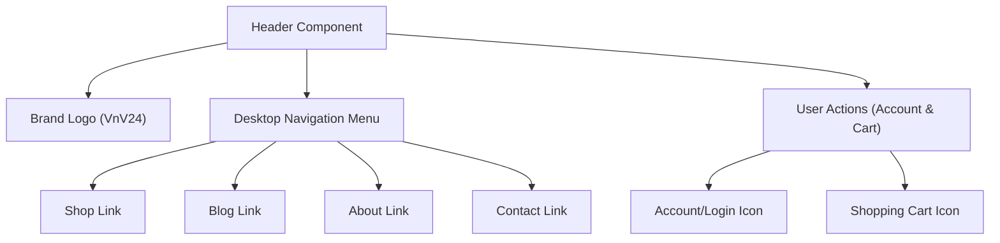
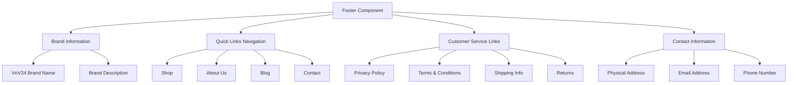
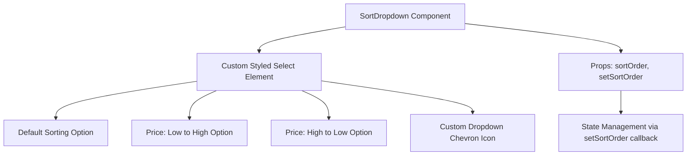
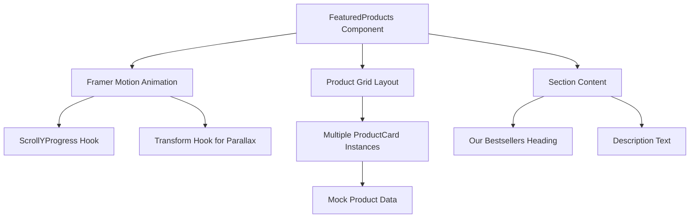
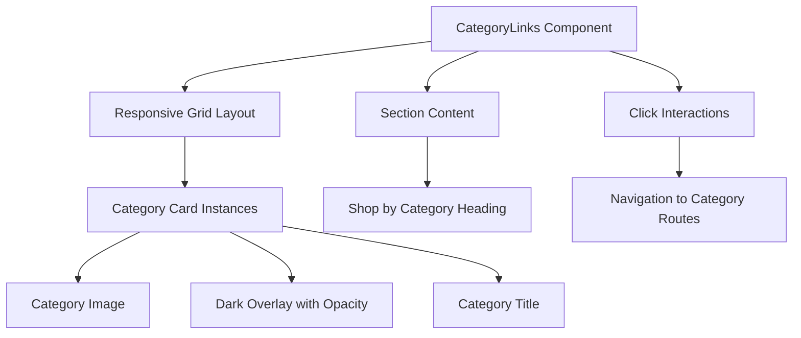
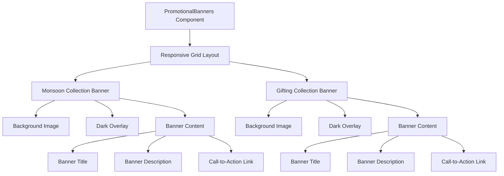
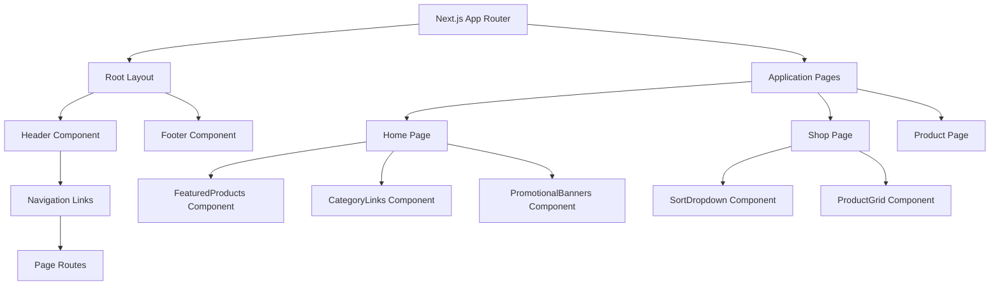
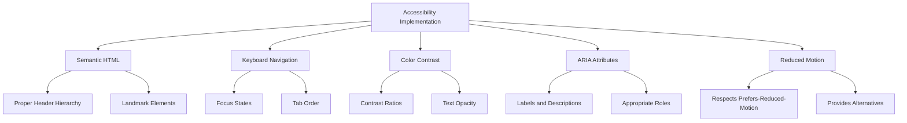

# Shared UI Components

<cite>
**Referenced Files in This Document**   
- [Header.js](file://client/app/components/Header.js)
- [Footer.js](file://client/app/components/Footer.js)
- [SortDropdown.js](file://client/app/components/Shop/SortDropdown.js)
- [FeaturedProducts.js](file://client/app/components/Home/FeaturedProducts.js)
- [CategoryLinks.js](file://client/app/components/Home/CategoryLinks.js)
- [PromotionalBanners.js](file://client/app/components/Home/PromotionalBanners.js)
- [ProductCard.js](file://client/app/components/shared/ProductCard.js)
</cite>

## Table of Contents
1. [Introduction](#introduction)
2. [Header Component](#header-component)
3. [Footer Component](#footer-component)
4. [SortDropdown Component](#sortdropdown-component)
5. [FeaturedProducts Component](#featuredproducts-component)
6. [CategoryLinks Component](#categorylinks-component)
7. [PromotionalBanners Component](#promotionalbanners-component)
8. [Cross-Component Design Consistency](#cross-component-design-consistency)
9. [Integration with Next.js App Router](#integration-with-nextjs-app-router)
10. [Accessibility Implementation](#accessibility-implementation)

## Introduction
This document provides comprehensive documentation for the shared UI components in the VnV24 application. It covers the Header and Footer components that establish site-wide navigation, the SortDropdown component for product listing interactions, and the homepage content curation components including FeaturedProducts, CategoryLinks, and PromotionalBanners. Each component is documented with details on props, events, styling customization through Tailwind CSS, and accessibility implementation. The document also explains integration patterns with the Next.js App Router and data fetching mechanisms, while addressing cross-component consistency in design language and interaction patterns.

## Header Component

The Header component provides the primary navigation interface for the VnV24 application, featuring a responsive design with desktop navigation and mobile-friendly structure. It includes the brand logo, main navigation links, and user account and cart access points.

**Diagram sources**
- [Header.js](file://client/app/components/Header.js#L3-L29)

**Section sources**
- [Header.js](file://client/app/components/Header.js#L1-L29)

### Props
The Header component does not accept any props as it is a self-contained navigation component.

### Events and Interactions
- Navigation links trigger page transitions via Next.js Link component
- Hover states on navigation items and icons provide visual feedback with gold color transition
- The header is sticky and remains visible during scrolling

### Styling and Tailwind CSS
The component uses Tailwind CSS for responsive styling:
- `sticky top-0` for fixed positioning
- `bg-primary/90 backdrop-blur-md` for semi-transparent background with blur effect
- Responsive layout with `md:flex` for desktop navigation display
- Gold color text on hover with `hover:text-gold transition-colors duration-300`
- Container-based layout with `container mx-auto` for consistent width

### Accessibility
- Semantic HTML with header element
- Proper contrast ratios between text and background
- Keyboard navigable through tab order
- Icons accompanied by text alternatives through context

## Footer Component

The Footer component provides site-wide information, quick links, customer service resources, and contact details in a structured four-column layout on desktop and single-column on mobile.

**Diagram sources**
- [Footer.js](file://client/app/components/Footer.js#L1-L44)

**Section sources**
- [Footer.js](file://client/app/components/Footer.js#L1-L44)

### Props
The Footer component does not accept any props as it is a self-contained informational component.

### Events and Interactions
- All links are interactive and navigate to corresponding pages
- Hover states on links provide visual feedback with gold color transition
- The footer contains both relative paths (using a tags) and would support Next.js Link components for client-side navigation

### Styling and Tailwind CSS
The component uses Tailwind CSS for responsive grid layout and styling:
- `bg-forest-green` background with light text for high contrast
- Four-column grid layout with `md:grid-cols-4` that collapses to single column on mobile
- Responsive spacing with `gap-8` on desktop and appropriate padding
- Text styling with `font-serif` for headings and appropriate opacity levels for secondary text
- Container-based layout with `container mx-auto`

### Accessibility
- Semantic HTML with footer element
- Proper heading hierarchy with h3 and h4 elements
- Sufficient color contrast between text and background
- Address element used appropriately for contact information
- Keyboard navigable through tab order

## SortDropdown Component

The SortDropdown component provides sorting functionality for product listing pages, allowing users to sort products by price or use default sorting.

**Diagram sources**
- [SortDropdown.js](file://client/app/components/Shop/SortDropdown.js#L1-L17)

**Section sources**
- [SortDropdown.js](file://client/app/components/Shop/SortDropdown.js#L1-L17)

### Props
- `sortOrder` (string): Current sorting value (e.g., "default", "price-asc", "price-desc")
- `setSortOrder` (function): Callback function to update the sorting state in the parent component

### Events and Interactions
- onChange event on the select element triggers the setSortOrder callback with the selected value
- The component implements a controlled input pattern where the value is managed by the parent component
- Custom dropdown indicator provides visual cue for the interactive element

### Styling and Tailwind CSS
The component uses Tailwind CSS for custom styling while maintaining native select functionality:
- `appearance-none` to remove default browser styling
- `bg-primary` background with border styling
- `rounded-lg` for pill-shaped corners
- Padding and spacing for touch-friendly targets
- Focus states with `focus:ring-2 focus:ring-gold` for accessibility
- Custom chevron icon positioned absolutely within the relative container

### Accessibility
- Native select element ensures proper screen reader support
- Proper labeling through option text
- Keyboard navigable with standard select controls
- Focus states clearly visible for keyboard users

## FeaturedProducts Component

The FeaturedProducts component displays a horizontal scrolling carousel of best-selling products with parallax effects as the user scrolls down the page.

**Diagram sources**
- [FeaturedProducts.js](file://client/app/components/Home/FeaturedProducts.js#L16-L41)
- [ProductCard.js](file://client/app/components/shared/ProductCard.js#L1-L10)

**Section sources**
- [FeaturedProducts.js](file://client/app/components/Home/FeaturedProducts.js#L1-L41)
- [ProductCard.js](file://client/app/components/shared/ProductCard.js#L1-L10)

### Props
The FeaturedProducts component does not accept any props as it manages its own mock data.

### Events and Interactions
- Uses Framer Motion's useScroll and useTransform hooks to create parallax scrolling effect
- Horizontal scrolling of products as the user scrolls down the page
- Each product card can be clicked to navigate to the product detail page

### Styling and Tailwind CSS
The component uses Tailwind CSS for layout and styling:
- `h-[300vh]` for extended height to enable scrolling effect
- `sticky top-0` for fixed positioning during scroll
- Flex layout with `flex-grow` and `overflow-hidden` for the scrolling container
- Responsive width classes with `w-[40vw] md:w-[25vw]` for different screen sizes
- Spacing with `gap-8 px-8` for product separation
- Background colors with `bg-secondary` and text styling with `font-serif`

### Accessibility
- Semantic HTML with section element
- Proper heading hierarchy with h2 element
- Text alternatives for all visual content
- The scrolling effect should be supplemented with traditional navigation for users who prefer reduced motion

## CategoryLinks Component

The CategoryLinks component displays a grid of category cards that allow users to navigate to specific product categories.

**Diagram sources**
- [CategoryLinks.js](file://client/app/components/Home/CategoryLinks.js#L9-L31)

**Section sources**
- [CategoryLinks.js](file://client/app/components/Home/CategoryLinks.js#L1-L31)

### Props
The CategoryLinks component does not accept any props as it manages its own category data.

### Events and Interactions
- Clicking on any category card navigates to the corresponding category page
- Hover effect on cards with `group-hover:scale-110` for visual feedback
- Responsive grid that changes from 2 columns on mobile to 4 columns on desktop

### Styling and Tailwind CSS
The component uses Tailwind CSS for responsive grid layout and visual effects:
- `grid grid-cols-2 md:grid-cols-4` for responsive grid layout
- `aspect-square` for consistent card proportions
- `overflow-hidden` and `rounded-lg` for card styling
- Image styling with `object-cover` and `transition-transform duration-300`
- Hover effects with `group-hover:scale-110`
- Overlay effects with `absolute` positioning and `opacity-40`
- Text styling with `font-serif` and gold color for category names

### Accessibility
- Semantic HTML with section element
- Proper heading hierarchy with h2 element
- Alt text for all images through the alt attribute
- Sufficient color contrast between text and background
- Keyboard navigable through tab order

## PromotionalBanners Component

The PromotionalBanners component displays two promotional banners in a responsive grid layout, highlighting special collections and gift options.

**Diagram sources**
- [PromotionalBanners.js](file://client/app/components/Home/PromotionalBanners.js#L3-L32)

**Section sources**
- [PromotionalBanners.js](file://client/app/components/Home/PromotionalBanners.js#L1-L32)

### Props
The PromotionalBanners component does not accept any props as it is self-contained.

### Events and Interactions
- Clicking on the CTA links navigates to the corresponding collection pages
- Hover effects on CTA links with color change and arrow animation
- Responsive layout that displays banners side by side on desktop and stacked on mobile

### Styling and Tailwind CSS
The component uses Tailwind CSS for layout and visual effects:
- `grid grid-cols-1 md:grid-cols-2` for responsive two-column layout
- `h-80` fixed height for consistent banner sizing
- `rounded-lg` and `overflow-hidden` for card styling
- Background images with `bg-cover bg-center` and inline style
- Absolute positioning for overlays and content
- Text styling with `font-serif` and gold color for titles
- CTA links with `inline-flex` layout and arrow icon
- Hover effects with `group-hover:translate-x-1` for arrow animation

### Accessibility
- Semantic HTML with section element
- Proper heading hierarchy with h3 elements
- Sufficient color contrast between text and background
- Keyboard navigable through tab order
- Text alternatives for visual content through descriptive text

## Cross-Component Design Consistency

The shared UI components in the VnV24 application maintain a consistent design language and interaction patterns across the application.

```mermaid
flowchart TD
DesignSystem["VnV24 Design System"] --> Color["Color Palette"]
Color --> Primary["Primary: bg-primary"]
Color --> Secondary["Secondary: bg-secondary"]
Color --> ForestGreen["Forest Green: text-forest-green"]
Color --> Gold["Gold: text-gold"]
Color --> TextDark["Text Dark: text-text-dark"]
Color --> TextLight["Text Light: text-text-light"]
DesignSystem --> Typography["Typography"]
Typography --> Serif["Font Serif for Headings"]
Typography --> Sans["Default Sans for Body"]
Typography --> Sizes["Consistent Heading Sizes"]
DesignSystem --> Spacing["Spacing System"]
Spacing --> Container["Container mx-auto"]
Spacing --> Padding["Consistent Padding"]
Spacing --> Gap["Consistent Gap Utilities"]
DesignSystem --> Interactions["Interaction Patterns"]
Interactions --> Hover["Hover Effects"]
Interactions --> Transitions["Transition Durations"]
Interactions --> Focus["Focus States"]
```

**Diagram sources**
- [Header.js](file://client/app/components/Header.js#L3-L29)
- [Footer.js](file://client/app/components/Footer.js#L1-L44)
- [CategoryLinks.js](file://client/app/components/Home/CategoryLinks.js#L9-L31)
- [PromotionalBanners.js](file://client/app/components/Home/PromotionalBanners.js#L3-L32)

**Section sources**
- [Header.js](file://client/app/components/Header.js#L1-L29)
- [Footer.js](file://client/app/components/Footer.js#L1-L44)
- [CategoryLinks.js](file://client/app/components/Home/CategoryLinks.js#L1-L31)
- [PromotionalBanners.js](file://client/app/components/Home/PromotionalBanners.js#L1-L32)

### Color Palette
All components use a consistent color palette defined in the application's CSS variables:
- Primary background color (`bg-primary`)
- Secondary background color (`bg-secondary`)
- Forest green for headings and accents (`text-forest-green`)
- Gold for highlights and interactive elements (`text-gold`)
- Consistent text colors for dark and light backgrounds

### Typography
- Font-serif class used consistently for headings across components
- Hierarchical heading sizes (h2, h3, h4) with appropriate visual weight
- Consistent text colors and opacity levels for secondary text

### Spacing and Layout
- Container pattern with `container mx-auto` used across all components
- Consistent padding and margin values
- Responsive grid and flex layouts with consistent breakpoints
- Aspect ratios maintained for images and cards

### Interaction Patterns
- Consistent hover effects with gold color transition and `transition-colors duration-300`
- Focus states with ring effects for keyboard navigation
- Smooth transitions and animations
- Interactive elements provide visual feedback

## Integration with Next.js App Router

The shared UI components are designed to integrate seamlessly with the Next.js App Router architecture.

**Diagram sources**
- [Header.js](file://client/app/components/Header.js#L3-L29)
- [Footer.js](file://client/app/components/Footer.js#L1-L44)
- [layout.js](file://client/app/layout.js#L1-L20)
- [page.js](file://client/app/page.js#L1-L10)
- [shop/page.js](file://client/app/shop/page.js#L1-L15)

**Section sources**
- [Header.js](file://client/app/components/Header.js#L1-L29)
- [Footer.js](file://client/app/components/Footer.js#L1-L44)
- [layout.js](file://client/app/layout.js#L1-L20)

### Layout Integration
- The Header and Footer components are typically included in the root layout file
- The layout component wraps all pages and ensures consistent header and footer rendering
- Components are imported and rendered within the appropriate page or layout files

### Data Fetching
- While the current implementation uses mock data, these components are designed to work with data fetched from API routes
- The SortDropdown component is designed to work with state management in parent components that handle data fetching
- Future implementations could use server components for initial data loading

### Client-Side Interactivity
- Components requiring client-side interactivity use the 'use client' directive
- Event handlers are implemented for user interactions
- State management is handled through props and callbacks

## Accessibility Implementation

The shared UI components implement comprehensive accessibility features to ensure usability for all users.

**Diagram sources**
- [Header.js](file://client/app/components/Header.js#L3-L29)
- [Footer.js](file://client/app/components/Footer.js#L1-L44)
- [SortDropdown.js](file://client/app/components/Shop/SortDropdown.js#L1-L17)
- [FeaturedProducts.js](file://client/app/components/Home/FeaturedProducts.js#L16-L41)

**Section sources**
- [Header.js](file://client/app/components/Header.js#L1-L29)
- [Footer.js](file://client/app/components/Footer.js#L1-L44)
- [SortDropdown.js](file://client/app/components/Shop/SortDropdown.js#L1-L17)
- [FeaturedProducts.js](file://client/app/components/Home/FeaturedProducts.js#L1-L41)

### Semantic HTML
- Appropriate use of header, footer, section, nav, and address elements
- Proper heading hierarchy (h2, h3, h4) for content structure
- List elements for navigation and link collections

### Keyboard Navigation
- All interactive elements are keyboard accessible
- Visible focus states with `focus:outline-none focus:ring-2 focus:ring-gold`
- Logical tab order following the visual layout
- Skip links could be added to improve navigation efficiency

### Color and Contrast
- High contrast between text and background colors
- Text opacity levels that maintain readability
- Gold color used for interactive elements with sufficient contrast
- Background overlays ensure text readability on images

### Screen Reader Support
- Native HTML elements provide built-in accessibility
- Alt attributes for images
- Descriptive link text
- ARIA attributes where needed for complex interactions

### Reduced Motion
- Animation effects should respect the `prefers-reduced-motion` media query
- Critical functionality should not rely solely on animation
- Alternative navigation methods provided for animated components